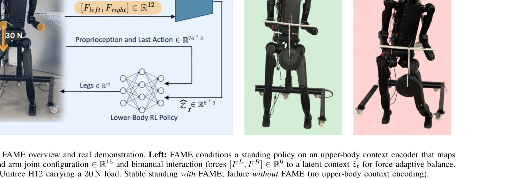

# FAME: Force-Adaptive RL for Expanding the Manipulation Envelope of a Full-Scale Humanoid

> **저자**: Niraj Pudasaini, Yutong Zhang, Jensen Lavering, Alessandro Roncone, Nikolaus Correll | **날짜**: 2026-03-09 | **URL**: [https://arxiv.org/abs/2603.08961](https://arxiv.org/abs/2603.08961)

---

## Essence

*Fig. 2: Overview of the proposed standing framework. During training (top), an upper-body dynamics encoder processes*

FAME는 양팔 조작 시 외부 손 힘으로 인한 균형 교란을 해결하기 위해, 상체 관절 구성과 양팔 상호작용 힘을 인코딩하는 latent context에 조건화된 RL 정책을 학습한다.

## Motivation

- **Known**: Deep RL은 로봇 균형 제어에서 유망하나, 기존 방법들은 주로 외부 손 힘이 없는 상황에서의 서기와 보행에 집중했다. RMA와 같은 latent context adaptation은 환경 변화에 대한 적응을 가능하게 하였다.
- **Gap**: 양팔 조작 중 상체 자세 변화와 손목 힘의 결합 효과로 인한 하체 균형 교란을 명시적으로 다루는 latent representation 학습 방법이 부족하다. 또한 손목 력/토크 센서 없이 힘을 추정하면서 적응하는 방법이 필요하다.
- **Why**: 휴머노이드 로봇이 인간 중심 환경에서 양팔 도구 조작과 안정적 서기를 동시에 수행해야 하므로, 조작으로 인한 힘 교란 하에서 균형을 유지하는 능력이 실제 응용에 필수적이다.
- **Approach**: 상체 dynamics encoder가 상체 관절 상태와 손 힘을 처리하여 latent context를 생성하고, 이것이 기본 서기 정책을 조건화한다. 훈련 중 spherically sampled 3D 힘과 상체 자세 curriculum을 적용하며, 배포 시 로봇 역학과 Jacobian으로 손목 힘을 추정한다.

## Achievement

*Fig. 1: FAME overview and real demonstration. Left: FAME conditions a standing policy on an upper-body context encoder t*

- **확장된 조작 범위**: 시뮬레이션에서 FAME이 73.84% 평균 성공률을 달성하여 기준선(51.40%)과 기본 정책(29.44%)보다 크게 개선
- **센서 불필요 배포**: 손목 force/torque 센서 없이 joint torque와 상태에서 rigid-body dynamics를 통해 손목 상호작용 힘을 추정
- **force-configuration 결합 학습**: 상체 자세 변화와 양팔 힘의 결합 효과를 latent context로 명시적으로 인코딩
- **실세계 검증**: Unitree H12 전체 규모 휴머노이드에서 비대칭 편측 당김(RE1)과 대칭 양팔 하중(RE2) 시나리오에서 강건성 입증

## How

*Fig. 2: Overview of the proposed standing framework. During training (top), an upper-body dynamics encoder processes*

- 상체 context encoder: 상체 joint configuration(∈ℝ15)과 양팔 상호작용 힘([F_L, F_R] ∈ ℝ6)을 입력으로 받아 latent context ẑ_t 생성
- 기본 정책: 하체 균형 제어를 위해 latent context에 조건화된 standing policy 학습
- 상체 자세 curriculum: 훈련 중 점진적으로 상체 자세 범위 확대하여 다양한 arm configuration 노출
- 3D 힘 교란: 각 손에 spherically sampled diverse 3D forces 적용하여 manipulation-induced perturbations 주입
- 힘 추정: 배포 시 measured joint torques와 states, Jacobian을 사용한 rigid-body dynamics 계산으로 wrist forces 추정
- 온라인 적응: 추정된 힘을 같은 encoder에 입력하여 latent context를 실시간 갱신하고 정책 적응

## Originality

- 기존 RMA 및 latent context adaptation 방법을 manipulation-specific, structured disturbance(상체-힘 결합)에 처음 적용
- 상체 자세 curriculum과 force-based context encoding을 결합한 새로운 훈련 전략
- 손목 센서 없이 로봇 동역학 기반 힘 추정과 온라인 적응을 통합한 배포 방식
- 양팔 조작 중 balance 유지를 위한 manipulation envelope 개념 정의 및 실증

## Limitation & Further Study

- 시뮬레이션-현실 간 격차: 시뮬레이션 성공률 73.84%와 실제 로봇 성능 간의 정량적 비교 부족
- 추정된 힘의 정확도: 관절 토크 측정 오차가 힘 추정에 미치는 영향에 대한 상세 분석 필요
- 일반화 범위: 5개 고정 arm configuration에서만 평가하여, 더 광범위한 자세와 힘 조합에 대한 외삽 성능 미확인
- 후속 연구: (1) 실시간 힘 추정 정확도 검증 및 개선, (2) 더 다양한 과제(예: 동적 조작, 이동 중 조작)로 확장, (3) 상체 encoder 구조의 최적화

## Evaluation

- Novelty: 4/5
- Technical Soundness: 3/5
- Significance: 4/5
- Clarity: 4/5
- Overall: 4/5

**총평**: FAME는 latent context adaptation을 양팔 조작 중 balance 문제에 창의적으로 적용하며, 센서 불필요 배포와 실세계 검증으로 실용적 기여를 한다. 다만 sim-to-real 격차와 힘 추정 정확도 분석이 보강되면 더욱 강력해질 것이다.
