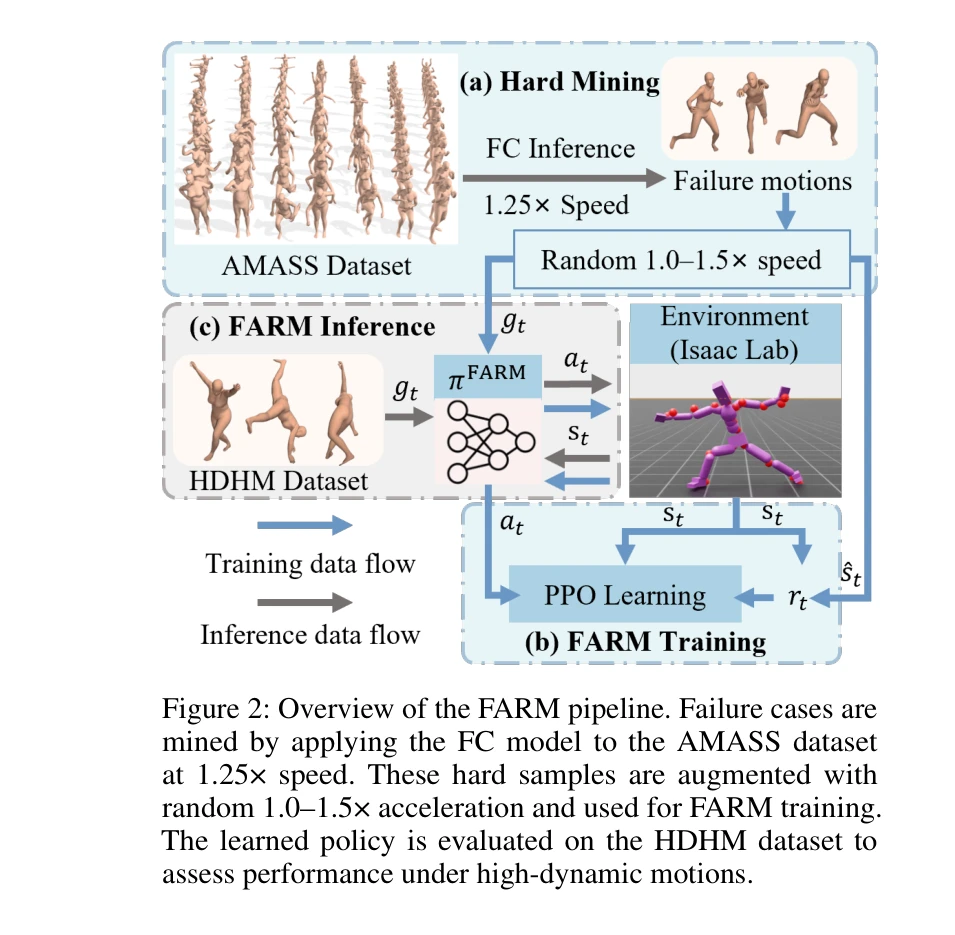
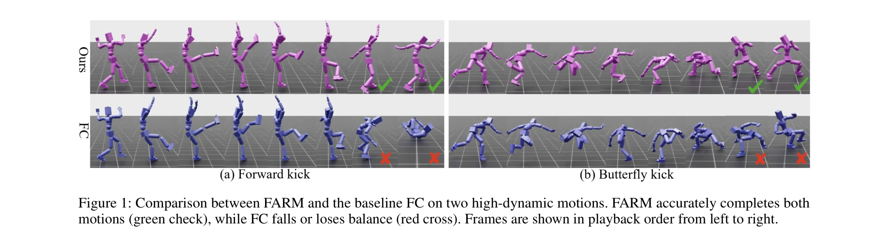
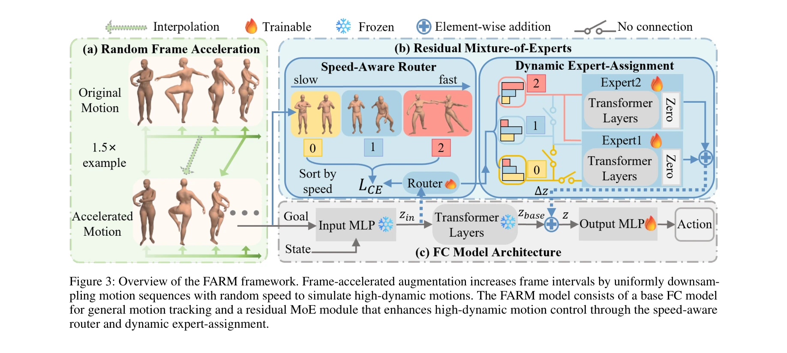

# FARM: Frame-Accelerated Augmentation and Residual Mixture-of-Experts for Physics-Based High-Dynamic Humanoid Control

> **저자**: Tan Jing, Shiting Chen, Yangfan Li, Weisheng Xu, Renjing Xu | **날짜**: 2025-08-27 | **URL**: [https://arxiv.org/abs/2508.19926](https://arxiv.org/abs/2508.19926)

---

## Essence

*Figure 2: Overview of the FARM pipeline. Failure cases are*

FARM은 frame-accelerated augmentation과 residual mixture-of-experts를 결합하여 저역학(low-dynamic) 동작에서의 높은 정확도를 유지하면서 고역학(high-dynamic) 인간형 동작 제어 성능을 크게 향상시키는 프레임워크이다.

## Motivation

- **Known**: UHC, PHC, PHC+, MaskedMimic 등의 선행 연구들은 AMASS 데이터셋에서 97-100% 추적 성공률을 달성했으나, 이들 데이터셋은 주로 저역학의 일상적 동작으로 구성되어 있다.
- **Gap**: 기존 범용 인간형 제어기들은 저역학 동작에는 뛰어나지만 폭발적(explosive) 고역학 동작의 강건한 제어가 미흡하며, 고역학 동작을 위한 공개 벤치마크가 존재하지 않는다.
- **Why**: 물리 기반 인간형 제어는 로봇공학과 캐릭터 애니메이션에서 핵심이며, 고역학 동작 제어 능력은 현실 배포에서 필수적이다.
- **Approach**: Frame-accelerated augmentation으로 프레임 간격을 넓혀 고속 자세 변화에 노출시키고, base controller와 residual MoE를 결합하여 동역학 강도에 따라 네트워크 용량을 동적으로 할당한다.

## Achievement

*Figure 1: Comparison between FARM and the baseline FC on two high-dynamic motions. FARM accurately completes both*

- **HDHM 데이터셋**: 3593개의 물리적으로 타당한 고역학 인간형 동작 클립으로 구성된 첫번째 공개 벤치마크 제시
- **성능 향상**: 추적 실패율 42.8% 감소, 평균 관절 위치 오차 14.6% 감소 (저역학 동작에서의 성능은 유지)
- **방법론 기여**: Speed-aware router (SAR)와 dynamic expert-assignment (DEA)를 통한 적응형 용량 할당 메커니즘 제안

## How

*Figure 3: Overview of the FARM framework. Frame-accelerated augmentation increases frame intervals by uniformly downsam-*

- AMASS 데이터셋에서 1.25× 속도 가속화를 적용하여 FC 모델로 실패 케이스 채굴
- 채굴된 하드 샘플(hard sample)에 1.0-1.5× 프레임 가속화 증강(frame-accelerated augmentation) 적용
- Base controller (FC)로 저역학 동작 추적 담당
- Speed-aware router (SAR)로 동작의 역학 강도에 따라 motions를 stratify하고 전담 experts에 할당
- Dynamic expert-assignment (DEA)로 필요한 experts만 활성화하여 계산 효율성 최적화
- PPO를 사용한 goal-conditioned reinforcement learning 프레임워크로 π_FARM 정책 최적화
- 평탄한 지형과 불규칙한 지형 모두에서 훈련하여 robustness 향상

## Originality

- Frame-accelerated augmentation의 개념적 단순성과 실질적 효과의 대비가 흥미로우며, 직관적인 실패 원인 분석(저역학 성능 저하)을 통한 설계 개선은 창의적
- Human motor attention의 비유를 통한 residual MoE 설계는 생물학적 직관을 공학적 설계에 성공적으로 적용
- Speed-aware router와 dynamic expert-assignment의 조합으로 기존 MoE 접근법과 차별화되는 적응형 용량 할당 전략 제시
- 고역학 동작 제어라는 명확한 갭을 타겟으로 한 focused dataset과 method 제안이 새로움

## Limitation & Further Study

- HDHM 데이터셋은 3593개 클립으로 AMASS (10k+)에 비해 규모가 작으며, 수동 필터링으로 인한 잠재적 선택 편향(selection bias) 가능성
- 평탄한 지형 기반 평가로 실제 로봇 환경의 불규칙한 지형에서의 성능 검증 부족
- Frame-accelerated augmentation의 최적 범위(1.0-1.5×)에 대한 체계적 ablation이 제한적
- Speed-aware router의 동작 강도 stratification 기준과 expert 할당 논리에 대한 상세 분석 부족
- 후속연구: (1) 더 큰 규모의 고역학 동작 데이터셋 확보, (2) 실제 로봇 플랫폼에서의 sim-to-real 성능 검증, (3) 다양한 expert 수와 할당 전략의 최적화 연구

## Evaluation

- Novelty: 4/5
- Technical Soundness: 3/5
- Significance: 4/5
- Clarity: 4/5
- Overall: 4/5

**총평**: FARM은 간단하면서도 효과적인 frame-accelerated augmentation과 동적 용량 할당 메커니즘으로 범용 인간형 제어의 실질적 한계를 해결하며, 첫번째 공개 고역학 벤치마크 제시와 함께 물리 기반 인간형 제어 분야에 중요한 기여를 한다.

## Related Papers

- 🏛 기반 연구: [[papers/1918_ExBody2_Advanced_Expressive_Humanoid_Whole-Body_Control/review]] — ExBody2의 teacher-student 프레임워크가 FARM의 residual mixture-of-experts 구조의 기반이 된다.
- 🔄 다른 접근: [[papers/2105_MoRE_Mixture_of_Residual_Experts_for_Humanoid_Lifelike_Gaits/review]] — 둘 다 다양한 동작 유형 처리를 위해 mixture-of-experts를 사용하지만 적용 영역이 다르다.
- 🔄 다른 접근: [[papers/1934_From_Experts_to_a_Generalist_Toward_General_Whole-Body_Contr/review]] — 둘 다 전문가-일반가 학습을 다루지만 FARM은 frame acceleration과 MoE를, BumbleBee는 motion clustering을 사용한다.
- 🔗 후속 연구: [[papers/2153_Towards_Adaptive_Humanoid_Control_via_Multi-Behavior_Distill/review]] — FARM의 residual MoE 구조를 multi-behavior distillation과 결합하면 더 적응적인 휴머노이드 제어가 가능하다.
- 🏛 기반 연구: [[papers/1881_Distillation-PPO_A_Novel_Two-Stage_Reinforcement_Learning_Fr/review]] — FARM의 frame-accelerated augmentation이 Distillation-PPO의 two-stage 강화학습 프레임워크에 데이터 증강 기법을 제공한다.
- 🏛 기반 연구: [[papers/1798_AME-2_Agile_and_Generalized_Legged_Locomotion_via_Attention-/review]] — AME-2의 attention mechanism 기반 다목적 강화학습 기술이 FARM의 residual mixture-of-experts 아키텍처 설계를 위한 방법론적 기반을 제공한다.
- 🔄 다른 접근: [[papers/1976_HiFAR_Multi-Stage_Curriculum_Learning_for_High-Dynamics_Huma/review]] — HiFAR의 multi-stage curriculum learning이 frame acceleration이 아닌 다른 방식으로 고역학 휴머노이드 제어 성능 향상을 달성하는 접근을 제시한다.
- 🧪 응용 사례: [[papers/1926_FastTD3_Simple_Fast_and_Capable_Reinforcement_Learning_for_H/review]] — FastTD3의 단순하고 빠른 강화학습 연구가 FARM의 저역학과 고역학 동작 모두를 다루는 프레임워크를 실제 구현에 적용하는 효율적인 방법을 제공한다.
- 🔄 다른 접근: [[papers/1639_Residual_Off-Policy_RL_for_Finetuning_Behavior_Cloning_Polic/review]] — Residual Off-Policy RL은 BC 기반 잔차 학습을, FARM은 frame-accelerated augmentation을 통해 정책 개선을 다르게 접근함
- 🔗 후속 연구: [[papers/1653_RobotDancing_Residual-Action_Reinforcement_Learning_Enables/review]] — FARM의 residual mixture-of-experts 접근법이 RobotDancing의 잔차 동작 강화학습을 더욱 정교하게 확장할 수 있음
- 🔄 다른 접근: [[papers/1934_From_Experts_to_a_Generalist_Toward_General_Whole-Body_Contr/review]] — 둘 다 전문가 정책을 일반화하지만 BumbleBee는 motion clustering을, FARM은 frame acceleration과 MoE를 사용한다.
- 🔗 후속 연구: [[papers/1918_ExBody2_Advanced_Expressive_Humanoid_Whole-Body_Control/review]] — FARM의 고역학 동작 제어 기법이 ExBody2의 표현력 있는 전신 동작 생성을 보완할 수 있다.
- 🔗 후속 연구: [[papers/2032_JAEGER_Dual-Level_Humanoid_Whole-Body_Controller/review]] — JAEGER의 dual-level 제어가 FARM의 frame-accelerated 증강과 결합되어 더 효율적인 상하체 협응 학습 가능
- 🔄 다른 접근: [[papers/2038_KungfuBot2_Learning_Versatile_Motion_Skills_for_Humanoid_Who/review]] — 다양한 동작 수행에서 OMoE 아키텍처 대신 residual mixture-of-experts를 활용한 다른 전문가 혼합 방법을 제시한다.
- 🔗 후속 연구: [[papers/2059_Learning_Motion_Skills_with_Adaptive_Assistive_Curriculum_Fo/review]] — A2CF 프레임워크를 residual mixture-of-experts와 결합하여 더 다양하고 복잡한 동작 기술을 효율적으로 학습할 수 있다.
- 🏛 기반 연구: [[papers/2105_MoRE_Mixture_of_Residual_Experts_for_Humanoid_Lifelike_Gaits/review]] — FARM의 residual mixture-of-experts 구조가 MoRE의 잔차 전문가 혼합을 통한 인간다운 보행 학습의 기술적 기반을 제공한다.
- 🏛 기반 연구: [[papers/2147_TeleGate_Whole-Body_Humanoid_Teleoperation_via_Gated_Expert/review]] — FARM의 residual mixture-of-experts가 TeleGate의 multiple expert policies 동적 선택에서 전문가 네트워크 구조의 기술적 토대를 제공합니다.
- 🔄 다른 접근: [[papers/2151_Toward_Reliable_Sim-to-Real_Predictability_for_MoE-based_Rob/review]] — FARM의 frame-accelerated mixture-of-experts가 MoE 기반 robust quadruped locomotion과 다른 가속화 접근법으로 전문가 네트워크를 활용합니다.
