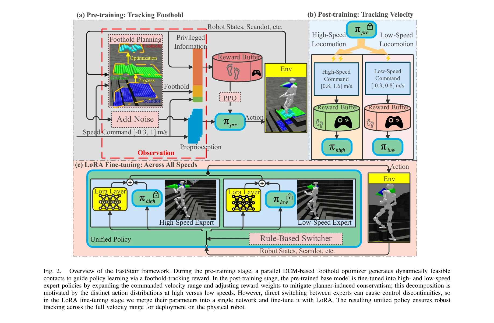
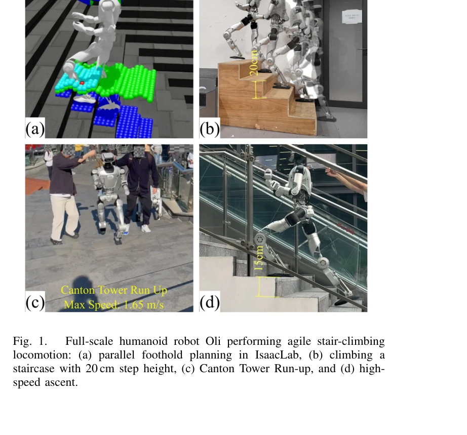

# FastStair: Learning to Run Up Stairs with Humanoid Robots

> **저자**: Yan Liu, Tao Yu, Haolin Song, Hongbo Zhu, Nianzong Hu, Yuzhi Hao, Xiuyong Yao, Xizhe Zang, Hua Chen, Jie Zhao | **날짜**: 2026-01-15 | **URL**: [https://arxiv.org/abs/2601.10365](https://arxiv.org/abs/2601.10365)

---

## Essence

*Fig. 2.*

FastStair는 model-based foothold planner와 model-free RL을 통합하여 humanoid robot의 고속 계단 등반을 실현하는 다단계 학습 프레임워크이다. DCM 기반 planner로 탐색을 안내하고 speed-specialized experts와 LoRA를 통해 보수성을 완화한다.

## Motivation

- **Known**: RL은 동적 이동을 생성할 수 있으나 암묵적 안정성 보상으로 인해 계단에서 불안정한 행동을 유발한다. Model-based planner는 명시적 안정성을 보장하지만 보수적 동작으로 속도를 제한한다.
- **Gap**: 고속과 안정성의 상충 관계를 동시에 해결할 수 있는 프레임워크가 부재하다. Planner 기반 가이던스는 보수성을 전이하여 고속성을 제약한다.
- **Why**: 계단 등반은 humanoid robot의 실제 배포에 필수적이며, 인간 수준의 민첩성과 안정성을 동시에 달성하는 것은 로봇 제어의 핵심 과제이다.
- **Approach**: Parallel DCM 기반 foothold planner를 RL 루프에 통합하여 안전 영역으로 탐색을 편향시키고, 속도별 experts 학습과 LoRA 기반 통합으로 보수성을 완화한다.

## Achievement

*Fig. 1.*

- **고속 계단 등반 달성**: 명령된 속도 1.65 m/s까지 안정적인 계단 등반 실현 및 33단계 나선형 계단(계단 높이 17 cm)을 12초에 완주
- **병렬 최적화 고속화**: Discrete search 기반 reformulation으로 RL 훈련 속도를 약 25배 가속화
- **다단계 학습 프레임워크**: Safety-focused base policy에서 출발하여 speed-specialized experts로 fine-tuning 후 LoRA로 통합하는 체계적 접근
- **실제 로봇 배포**: Oli humanoid robot에 배포하여 Canton Tower Robot Run Up Competition 우승

## How

*Fig. 2.*

- DCM(Divergent Component of Motion) 기반 foothold planner를 병렬 discrete search로 reformulate하여 GPU 병렬 계산에 최적화
- Pre-training 단계에서 planner가 생성한 feasible footholds를 foothold-tracking reward로 사용하여 안전한 기본 정책 학습
- Post-training 단계에서 저속[-0.3, 0.8 m/s]과 고속[0.8, 1.6 m/s] 명령을 통해 기본 정책을 두 개의 속도 전문가로 fine-tune
- LoRA (Low-Rank Adaptation) 레이어로 두 experts의 파라미터를 하나의 네트워크에 통합하여 전체 속도 범위에서 부드러운 전환 실현
- Rule-based switcher를 사용하여 commanded speed에 따라 experts 간 전환 제어

## Originality

- Model-based planner를 RL 탐색 가이더로 통합하되, 최적화-탐색 reformulation으로 계산 오버헤드를 최소화한 novel 접근
- 속도별 action distribution의 차이를 인식하고 이를 해결하기 위해 속도 전문가 분해와 LoRA 기반 통합이라는 새로운 해결책 제시
- DCM 기반 planner의 명시적 안정성 보장과 RL의 동적 민첩성을 체계적으로 조화시키는 다단계 프레임워크

## Limitation & Further Study

- 현재 방법은 계단 특화 설계로, 일반적인 지형(바위, 경사) 적응성이 검증되지 않음
- LoRA fine-tuning이 전문가 간 평활 전환을 보장하나, 극단적 속도 변화에서의 안정성 분석 부재
- Planner 계산 비용 감소에도 여전히 병렬 환경 필요로, 단일 에피소드 실시간 성능 분석 필요
- 후속 연구: (1) 다양한 지형에 대한 adaptive foothold planning, (2) 더 가벼운 LoRA 구조 탐색, (3) 학습 없이 새로운 계단 형태에 대한 generalization 메커니즘

## Evaluation

- Novelty: 4/5
- Technical Soundness: 3/5
- Significance: 4/5
- Clarity: 4/5
- Overall: 4/5

**총평**: FastStair는 model-based 안정성과 learning-based 민첩성의 근본적 상충을 다단계 학습과 LoRA 기반 통합으로 우아하게 해결한 혁신적 프레임워크이다. 실제 로봇 배포와 경쟁 우승으로 실용성이 입증되었다.
