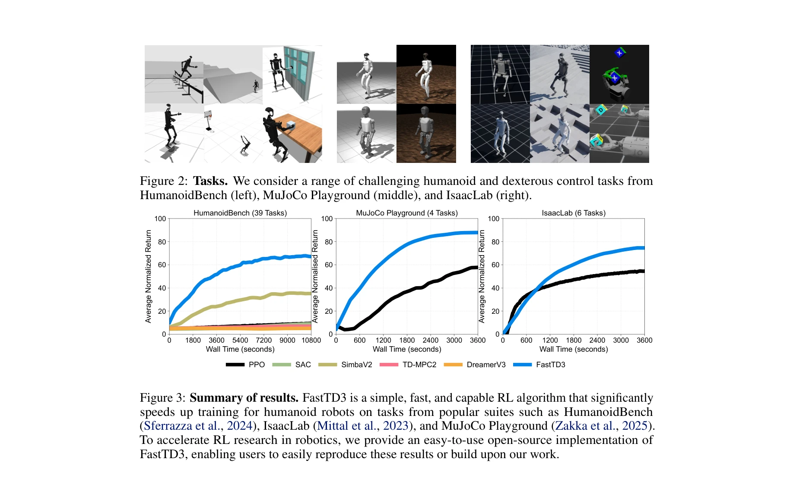
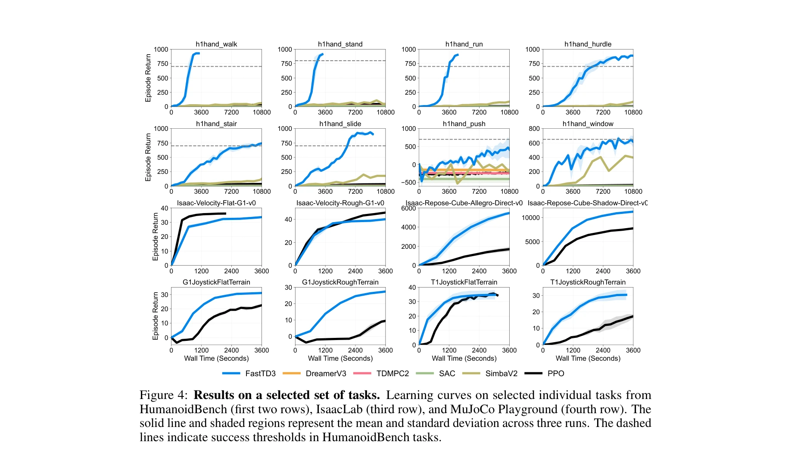
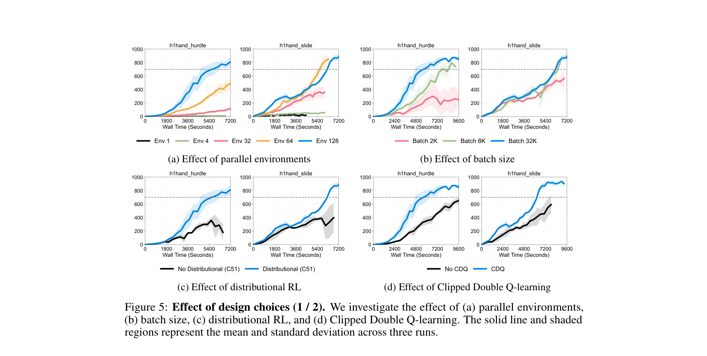

# FastTD3: Simple, Fast, and Capable Reinforcement Learning for Humanoid Control

> **저자**: Younggyo Seo, Carmelo Sferrazza, Haoran Geng, Michal Nauman, Zhao-Heng Yin, Pieter Abbeel | **날짜**: 2025-05-28 | **URL**: [https://arxiv.org/abs/2505.22642](https://arxiv.org/abs/2505.22642)

---

## Essence

*Figure 3: Summary of results. FastTD3 is a simple, fast, and capable RL algorithm that significantly*

FastTD3는 병렬 시뮬레이션, 대배치 업데이트, 분포 기반 크리틱 등의 간단한 수정을 통해 TD3를 최적화하여 humanoid 로봇 제어 태스크를 단일 A100 GPU에서 3시간 이내에 학습하는 빠르고 효율적인 오프-정책 강화학습 알고리즘을 제시한다.

## Motivation

- **Known**: PPO는 대규모 병렬 시뮬레이션으로 빠르지만 샘플 효율이 낮으며, 최근 오프-정책 RL 연구는 샘플 효율은 좋지만 벽시간이 길고 알고리즘 복잡도가 높다는 것이 알려져 있다.
- **Gap**: robotics에서 배포 가능한 정책을 학습하기 위해 빠른 벽시간과 높은 샘플 효율 모두를 달성하면서 구현이 단순한 오프-정책 RL 알고리즘이 부재하다.
- **Why**: reward 설계의 반복적 특성으로 인해 multiple 라운드의 reward shaping과 정책 재학습이 필요하므로, 빠르고 신뢰할 수 있는 RL 알고리즘이 실무에서 필수적이다.
- **Approach**: TD3에 병렬 환경, 대배치 업데이트, distributional critic (C51), 신중하게 튜닝된 hyperparameter를 결합하여 오프-정책 학습의 이점을 유지하면서 훈련 속도를 대폭 가속화한다.

## Achievement

*Figure 4: Results on a selected set of tasks. Learning curves on selected individual tasks from*

- **빠른 학습**: HumanoidBench의 39개 태스크를 단일 A100 GPU에서 평균 3시간 이내에 해결하며, MuJoCo Playground와 IsaacLab에서도 PPO보다 우수한 성능을 달성
- **오프-정책 RL의 강점 유지**: 샘플 효율성, demonstration 초기화, 실세계 배포 중 fine-tuning이 가능한 오프-정책 알고리즘의 이점을 활용
- **심플한 레시피**: 복잡한 asynchronous process 없이 병렬 시뮬레이션, 큰 배치 크기, distributional critic으로만 구성되어 구현과 재현이 용이
- **실세계 검증**: 최초로 MuJoCo Playground에서 학습한 오프-정책 RL 정책을 Booster T1 full-size humanoid 로봇에 성공적으로 sim-to-real 전이

## How

*Figure 5: Effect of design choices (1 / 2). We investigate the effect of (a) parallel environments,*

- **병렬 환경 활용**: 결정적 정책 그래디언트 알고리즘의 약점인 탐색을 병렬 환경의 다양성으로 보완하면서 값 함수 활용 능력 강화
- **대배치 학습**: 배치 크기 32,768을 사용하여 각 그래디언트 업데이트에서 높은 데이터 다양성을 보장하고 안정적인 학습 신호 제공
- **Distributional RL (C51)**: value 분포의 불확실성을 모델링하여 더 강력한 값 함수 추정
- **Clipped Double Q-learning**: TD3의 이중 Q-함수 구조를 유지하여 overestimation 방지
- **Hyperparameter 최적화**: 각 벤치마크와 환경에 대해 신중하게 튜닝된 hyperparameter 사용

## Originality

- PQL의 관찰을 기반으로 하지만, asynchronous process를 제거하고 단순한 동기식 구현으로 유사한 성능 달성
- 여러 기존 기법(병렬 시뮬레이션, 대배치, distributional critic)의 조합이지만, robotics humanoid control 벤치마크에서의 효과적인 통합과 최적화는 새로운 기여
- 복잡한 알고리즘 혁신 대신 기존 TD3의 신중한 엔지니어링으로 성과 달성하는 실용적 접근

## Limitation & Further Study

- **알고리즘 혁신의 부재**: PQL의 관찰을 기반으로 하며 asynchronous process를 제거한 것 외의 본질적인 알고리즘 기여 미흡
- **Hyperparameter 의존성**: 최적의 성능을 위해 각 벤치마크와 환경에 대한 신중한 hyperparameter 튜닝이 필요하여 일반화 능력 제한 가능
- **제한된 비교**: 최신 off-policy 알고리즘들(SR-SAC, SimbaV2, TD-MPC2 등)과의 상세한 ablation 비교 부족
- **후속 연구**: FastTD3에 최신 RL 개선 기법(attention mechanism, transformer 기반 정책, model-based planning 등)을 통합하여 성능 향상 탐색

## Evaluation

- Novelty: 3/5
- Technical Soundness: 3/5
- Significance: 4/5
- Clarity: 4/5
- Overall: 4/5

**총평**: FastTD3는 기존 기법의 조합이지만 humanoid robotics에서 실무적으로 매우 유용한 간단하고 빠른 솔루션을 제공하며, 오픈소스 구현을 통해 RL 연구 커뮤니티의 접근성을 크게 향상시킨다. 다만 알고리즘 혁신보다는 엔지니어링 최적화에 중점을 두고 있어 과학적 원창성은 제한적이다.
