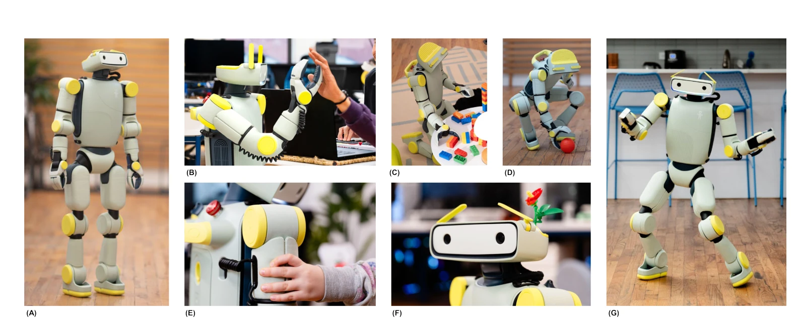
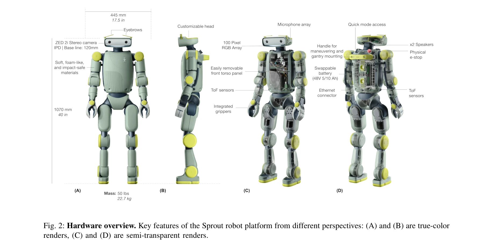

# Fauna Sprout: A lightweight, approachable, developer-ready humanoid robot

> **저자**: Fauna Robotics, :, Diego Aldarondo, Ana Pervan, Daniel Corbalan, Dave Petrillo, Bolun Dai, Aadhithya Iyer, Nina Mortensen, Erik Pearson, Sridhar Pandian Arunachalam, Emma Reznick, David Weis, Jacob Davison, Samuel Patterson, Tess Carella, Michael Suguitan, David Ye, Oswaldo Ferro, Nilesh Suriyarachchi, Spencer Ling, Erik Su, Daniel Giebisch, Peter Traver, Sam Fonseca, Mack Mor, Rohan Singh, Sertac Guven, Kangni Liu, Yaswanth Kumar Orru, Ashiq Rahman Anwar Batcha, Shruthi Ravindranath, Silky Arora, Hugo Ponte, Dez Hernandez, Utsav Chaudhary, Zack Walker, Michael Kelberman, Ivan Veloz, Christina Santa Lucia, Kat Casale, Helen Han, Michael Gromis, Michael Mignatti, Jason Reisman, Kelleher Guerin, Dario Narvaez, Christopher Anderson, Anthony Moschella, Robert Cochran, Josh Merel | **날짜**: 2026-01-26 | **URL**: [https://arxiv.org/abs/2601.18963](https://arxiv.org/abs/2601.18963)

---

## Essence

*Fig. 1: Robot in action. (A) Standing and looking up towards a person (B) performing closed-loop high-five interaction*

Sprout는 인간 환경에서의 안전한 배포, 표현성, 개발자 접근성을 강조하는 경량 휴머노이드 로봇 플랫폼이다. 낮은 물리적·기술적 진입장벽으로 구현된 통합 하드웨어-소프트웨어 스택을 제공한다.

## Motivation

- **Known**: 최근 학습 기반 제어, 대규모 시뮬레이션, 생성 모델의 발전으로 범용 로봇 제어기 개발이 가속화되고 있다. 그러나 기존 휴머노이드는 폐쇄 산업 시스템이거나 배포가 어려운 학술 프로토타입으로 인간 환경에서의 안전한 운영이 제한적이다.
- **Gap**: 현재 접근 가능한 휴머노이드 플랫폼은 인간 환경에서의 장기 배포, 표현적 상호작용, 비전문가 개발자 사용을 모두 지원하는 것이 부족하다. 특히 사회적 상호작용 기능이 대부분의 실용적 휴머노이드에서 미탐색 상태이다.
- **Why**: 접근 가능한 휴머노이드 플랫폼은 퍼스널 컴퓨터나 스마트폰처럼 로보틱스의 혁신을 촉발할 수 있는 기반이 된다. 교육자, 디자이너, 창의 기술자 등 다양한 그룹이 참여하여 실제 인간 환경에서의 embodied intelligence 개발을 가능하게 한다.
- **Approach**: Sprout는 1.07m 높이, 22.7kg 무게의 경량 설계로 운동 에너지를 제한하고, compliant control, 제한된 joint torque, soft exterior를 통해 안전성을 확보한다. 전신 제어, 통합 gripper 조작, VR 기반 teleoperation, 표현적 헤드(gaze, eyebrow, LED)를 단일 플랫폼으로 통합한다.

## Achievement

*Fig. 2: Hardware overview. Key features of the Sprout robot platform from different perspectives: (A) and (B) are true-c*

- **안전성 설계**: 낮은 운동 에너지, backdrivable motor, conservative joint torque limit, soft panel과 최소화된 pinch point로 인간 근접 운영 환경에서의 안전성 확보
- **하드웨어-소프트웨어 통합**: motor control API, whole-body controller, 내장 teleoperation·mapping·navigation 기능으로 다층 추상화 수준 지원
- **표현성과 상호작용**: articulated neck(gaze control), actuated eyebrow, LED array를 통한 비언어적 상호작용 신호로 사회적 상호작용 영역 확장
- **개발자 접근성**: rear handle, swappable battery, modular architecture로 전문가 이외의 교육자, 디자이너 참여 가능
- **확장 가능한 제어 아키텍처**: learned control, vision-language model, hierarchical control 등 다양한 제어 패러다임 수용 가능

## How

*Fig. 2: Hardware overview. Key features of the Sprout robot platform from different perspectives: (A) and (B) are true-c*

- 경량 형태(1.07m, 22.7kg)로 kinetic energy와 impact force 최소화
- Compliant controller를 통한 whole-body behavior 실행으로 접촉력 최소화
- Soft exterior panels, minimized pinch points, backdrivable motor로 기계적 안전성 강화
- Integrated gripper로 일상 물체의 넓은 범위에 대한 파지 능력 제공
- Non-screen 표현 요소(coordinated lights, physical eyebrow)로 embodiment 강조
- Modular hardware-software stack으로 저수준(motor control) 부터 고수준(planning, reasoning) 까지 API 제공
- VR 기반 teleoperation 인터페이스 통합
- GPU-accelerated physics simulation(IsaacLab, MuJoCo)과의 호환성 설계

## Originality

- 경량 설계와 compliant control의 결합으로 인간 환경 배포 중심의 휴머노이드 개발 방향 제시
- 산업용 폐쇄 시스템과 학술 프로토타입의 이분법을 벗어나 개발자 친화적 플랫폼 추구
- Digital screen 기반이 아닌 물리적 표현 요소(eyebrow, light)로 embodied interaction 강조
- Low-level control부터 high-level reasoning까지 modular하게 지원하는 통합 아키텍처
- 사회적 상호작용을 실용적 휴머노이드에 명시적으로 포함한 설계 철학

## Limitation & Further Study

- 경량 설계의 trade-off로 무거운 물체 조작이나 높은 속도 운동의 능력 제한 가능성
- 안전성 우선의 joint torque 제한이 복잡한 동역학 작업의 수행 능력 제약
- 플랫폼 시도(proof-of-concept) 수준의 evaluation으로 실제 배포 환경에서의 장기적 안정성 검증 부족
- VR teleoperation의 사용성과 학습곡선에 대한 상세한 사용자 연구 미부족
- 다양한 learned control 패러다임(VLA, language-conditioned policy 등)과의 실제 integration 사례 제시 부재
- **후속 연구**: 실제 인간 환경에서의 장기 배포 사례 연구, learned policy와의 통합 성능 평가, 비전문가 개발자를 대상으로 한 사용성 연구 필요

## Evaluation

- Novelty: 4/5
- Technical Soundness: 3/5
- Significance: 4/5
- Clarity: 4/5
- Overall: 4/5

**총평**: Sprout는 로보틱스 분야의 접근성 문제를 정면으로 해결하는 실용적 플랫폼으로, 안전성과 개발자 친화성을 중심으로 한 설계 철학이 명확하다. 인간 환경 배포와 사회적 상호작용이라는 과소 탐색된 영역을 강조함으로써 embodied AI 연구의 새로운 방향을 제시하는 의미 있는 기여이다.
