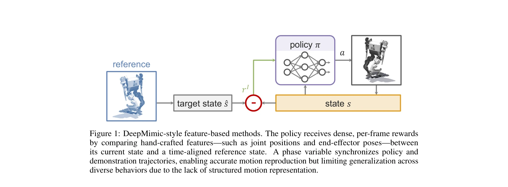

# Feature-Based vs. GAN-Based Learning from Demonstrations: When and Why

> **저자**: Chenhao Li, Marco Hutter, Andreas Krause | **날짜**: 2025-07-08 | **URL**: [https://arxiv.org/abs/2507.05906](https://arxiv.org/abs/2507.05906)

---

## Essence

*Figure 1: DeepMimic-style feature-based methods. The policy receives dense, per-frame rewards*

Feature-based와 GAN-based 학습 방법론을 비교 분석하여, 각 접근법의 장단점을 명확히 하고 작업별 우선순위에 따른 방법 선택 프레임워크를 제시한다.

## Motivation

- **Known**: DeepMimic 이후 feature-based 방법은 조밀한 보상으로 고충실도 모션 모방에 우수하고, GAN-based 방법은 암묵적 보상으로 확장성과 유연성을 제공한다.
- **Gap**: 기존 문헌에서는 특정 방법론의 경험적 성공 사례를 다루지만, 두 패러다임 간 체계적인 비교와 언제 어떤 방법을 선택해야 하는지에 대한 명확한 가이드라인이 부족하다.
- **Why**: 고차원 제어 문제에서 시연 데이터는 탐색 효율성을 획기적으로 향상시키는 핵심 학습 신호이며, 방법론 선택에 대한 명확한 기준을 제공함으로써 더욱 체계적이고 효율적인 정책 학습이 가능해진다.
- **Approach**: Physics-based control과 MDP 프레임워크를 기반으로 feature-based와 GAN-based 방법의 보상 함수 구조, 귀납적 편향, 작동 영역을 비교 분석한다. 구조화된 모션 표현의 중요성을 강조하며 작업별 우선순위(충실도, 다양성, 해석가능성, 적응성)에 따른 선택 프레임워크를 제시한다.

## Achievement

- **Feature-based 방법의 특성 분석**: Dense, interpretable 보상으로 고충실도 모션 모방에 우수하지만 비구조화된 환경에서 일반화 능력이 제한되며 reference 표현이 복잡하다는 점을 명확히 함
- **GAN-based 방법의 특성 분석**: Implicit, distributional 감시로 확장성과 적응 유연성을 제공하지만 훈련 불안정성과 조잡한 보상 신호의 문제를 가진다는 점을 규명함
- **구조화된 모션 표현의 수렴점 제시**: 두 패러다임 모두 구조화된 모션 표현(latent-conditioned, motion graph, motion manifold 등)의 중요성으로 수렴하고 있음을 보여줌
- **작업별 선택 프레임워크**: 일반적 우월성보다는 충실도, 다양성, 해석가능성, 적응성이라는 작업별 우선순위에 따른 방법론 선택의 원칙을 제공함

## How

*Figure 1: DeepMimic-style feature-based methods. The policy receives dense, per-frame rewards*

- Physics-based control 문제를 MDP (S, A, T, R, γ) 형식으로 정식화하여 상태, 행동, 동역학, 보상 함수의 역할을 명확히 함
- DeepMimic을 대표하는 feature-based 방법의 구조(phase variable, hand-crafted features, motion alignment)를 분석하고 limitations(multi-clip 확장성, motion clip 간 불연속성)을 지적함
- GAN-based 방법의 구조(discriminator, adversarial reward, short-window matching)를 분석하고 distributional similarity 학습의 이점과 훈련 불안정성을 비교함
- 최근 발전(latent-conditioned GAN, motion graph, motion manifold representation)에서 구조화된 표현의 공통적 중요성을 강조함
- Task-specific priorities(fidelity, diversity, interpretability, adaptability)별로 각 방법의 적합성을 매트릭스 형태로 제시하여 선택 가이드라인을 제공함

## Originality

- Feature-based와 GAN-based를 단순 비교하기보다 각 방법의 근본적 가정과 귀납적 편향의 관점에서 심층 분석함
- 보상 함수의 구조(explicit vs. implicit)를 중심으로 두 패러다임의 차이를 체계화하고, 이것이 확장성, 안정성, 일반화, 표현 학습에 미치는 영향을 분석함
- 구조화된 모션 표현이 두 패러다임의 수렴점이라는 통찰을 제시하여, 향후 연구 방향에 대한 개념적 프레임워크를 제공함
- 시연 데이터를 단순 제약이 아닌 고차원 제어에서의 핵심 학습 신호로 재정의하여 이론적 정당성을 강화함

## Limitation & Further Study

- Survey 성격으로 인해 최신 하이브리드 접근법(feature + GAN 결합)이나 다른 패러다임(diffusion-based 모방 학습)에 대한 분석이 제한적일 수 있음
- 작업별 우선순위 선택을 위한 정량적 메트릭이나 자동 선택 알고리즘을 제시하지 않아, 최종 선택은 여전히 실무자의 판단에 의존함
- Real-world robotics 환경에서의 실증적 검증(sim-to-real transfer, dynamics mismatch 처리)에 대한 논의가 제한적임
- 후속 연구로 구조화된 모션 표현 학습의 자동화, 다중 작업 동시 최적화, 온라인 적응 능력 강화 등이 필요함

## Evaluation

- Novelty: 4/5
- Technical Soundness: 3/5
- Significance: 4/5
- Clarity: 4/5
- Overall: 4/5

**총평**: 이 survey는 시연 학습의 두 주요 패러다임을 원칙적으로 비교하고, 실무자들이 작업 특성에 맞는 방법을 선택할 수 있도록 하는 개념적 프레임워크를 제공하는 가치 있는 기여이다. 구조화된 모션 표현의 수렴점을 강조함으로써 향후 연구의 방향성을 제시한다.
