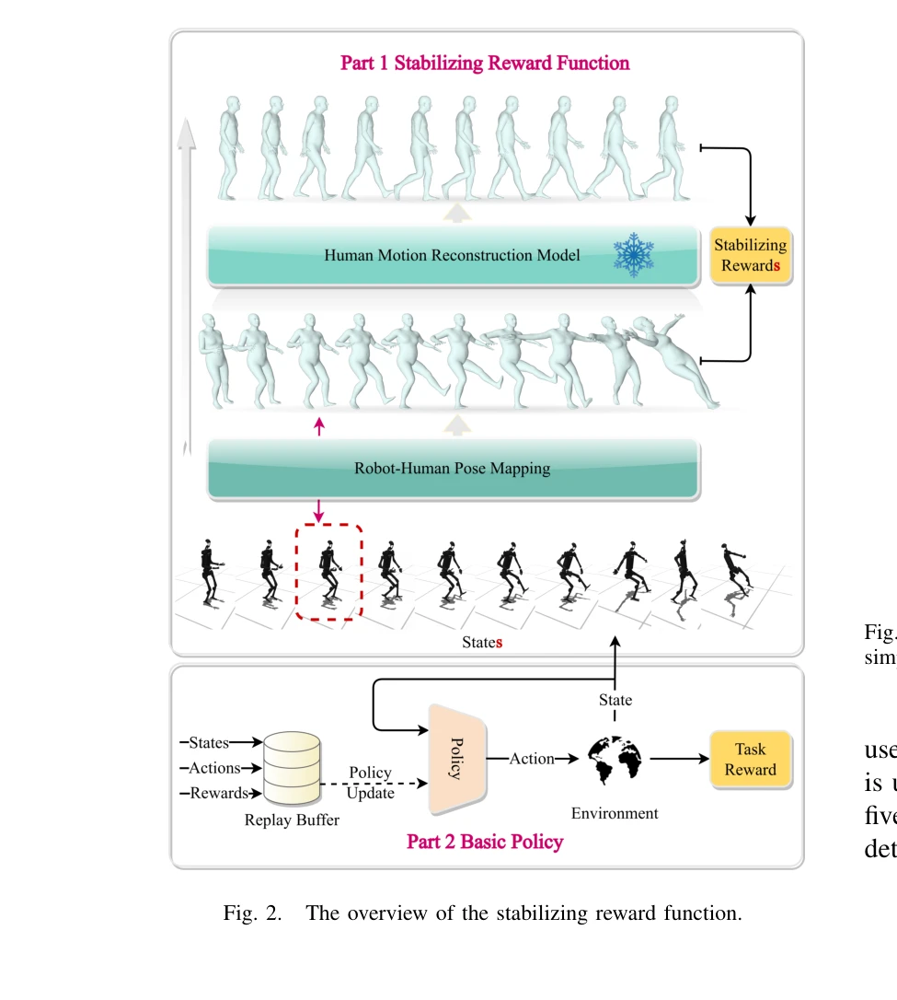

# FLAM: Foundation Model-Based Body Stabilization for Humanoid Locomotion and Manipulation

> **저자**: Xianqi Zhang, Hongliang Wei, Wenrui Wang, Xingtao Wang, Xiaopeng Fan, Debin Zhao | **날짜**: 2025-03-28 | **URL**: [https://arxiv.org/abs/2503.22249](https://arxiv.org/abs/2503.22249)

---

## Essence

*Fig. 1.*

FLAM은 인간 동작 재구성 모델 기반의 안정화 보상 함수를 설계하여 휴머노이드 로봇의 전신 제어에서 신체 안정성을 명시적으로 고려하는 강화학습 방법이다. 로봇 자세를 3D 가상 인간 모델에 매핑한 후 안정화된 자세를 재구성하여 보상을 계산함으로써 학습 과정을 가속화한다.

## Motivation

- **Known**: 강화학습은 휴머노이드 로봇의 전신 제어를 위해 널리 사용되고 있으며, 최근 foundation model들이 로봇공학 연구에서 활용되고 있다. 3D 가상 인간 모델(SMPL, SMPL-X)과 인간 동작 데이터셋(AMASS)은 인간 유사 동작을 학습시키는 데 도움이 되고 있다.
- **Gap**: 기존의 강화학습 방법들은 신체 안정성의 영향을 명시적으로 고려하지 않으며, 작업 보상에만 의존하기 때문에 높은 자유도를 가진 휴머노이드 로봇의 전신 제어에서 높은 성능을 달성하기 어렵다.
- **Why**: 휴머노이드 로봇이 복잡한 환경에서 보행과 조작을 동시에 수행해야 하기 때문에 신체 안정성은 기본 전제이며, 이를 명시적으로 고려하면 학습 효율성과 안정성을 동시에 개선할 수 있다.
- **Approach**: FLAM은 foundation model인 인간 동작 재구성 모델을 활용하여 안정화 보상 함수를 설계하고, 이를 작업 보상과 결합하여 정책을 학습한다. 로봇 자세의 재구성 전후 차이를 통해 안정성 정도를 정량화한다.

## Achievement

*Fig. 4.*

- **Foundation model 기반 안정화 방법**: 인간 동작 재구성 모델을 활용한 창의적인 안정화 보상 함수 설계로 기존 RL 방법들보다 우수한 성능 달성
- **학습 가속화**: 안정화 보상이 로봇을 안정적 자세 학습으로 유도하여 정책 학습 속도 향상 및 작업 완성 촉진
- **다중 작업 성능**: 보행 및 조작 벤치마크에서 state-of-the-art RL 방법들을 능가하는 성능 입증

## How

*Fig. 2.*

- 로봇의 고차원 자세 정보를 SMPL과 같은 3D 가상 인간 모델로 매핑
- 매핑된 인간 자세를 사전 학습된 인간 동작 재구성 모델(foundation model)에 입력하여 안정화된 자세 생성
- 원본 자세와 재구성된 자세 간의 차이를 계산하여 안정화 보상 함수 정의
- 안정화 보상과 작업 보상을 결합하여 최종 보상 신호 구성
- 기본 정책(basic policy)을 통합 보상으로 학습시켜 안정성과 작업 성능을 동시에 최적화

## Originality

- 인간 동작 재구성 foundation model을 안정화 보상 함수 설계에 창의적으로 응용한 점
- 로봇 자세를 3D 가상 인간 모델로 변환하여 인간 동작의 선행 지식을 활용한 혁신적 접근
- 안정성과 작업 성능을 동시에 고려하는 이원적 보상 구조의 설계
- 기존의 동작 모방(motion imitation)과 달리 재구성 모델의 안정성 특성을 부가 신호로 활용하는 차별성

## Limitation & Further Study

- SMPL 모델의 단순화로 인한 휴머노이드 로봇의 실제 복잡한 형태와의 불일치 가능성
- 사전 학습된 인간 동작 재구성 모델의 품질과 학습 성능 간의 의존성 미검증
- 안정화 보상과 작업 보상 간의 가중치 결합에서 하이퍼파라미터 튜닝에 대한 상세 분석 부재
- 실제 휴머노이드 로봇 하드웨어에서의 실시간 계산 비용 및 실행 가능성에 대한 논의 필요
- 다양한 환경 조건과 극단적 상황에서의 일반화 성능 평가 필요
- 후속 연구: foundation model의 도메인 적응 기법, 다양한 로봇 플랫폼으로의 확장, 동역학 기반 안정화 방법과의 비교

## Evaluation

- Novelty: 4/5
- Technical Soundness: 3/5
- Significance: 4/5
- Clarity: 4/5
- Overall: 4/5

**총평**: FLAM은 인간 동작 foundation model을 창의적으로 활용하여 휴머노이드 로봇의 안정성 문제를 해결한 효과적인 방법이다. 강화학습의 샘플 효율성 문제를 개선하고 다양한 작업에서 우수한 성능을 보여주며, 향후 로봇 제어의 중요한 기초를 제공할 수 있다.
