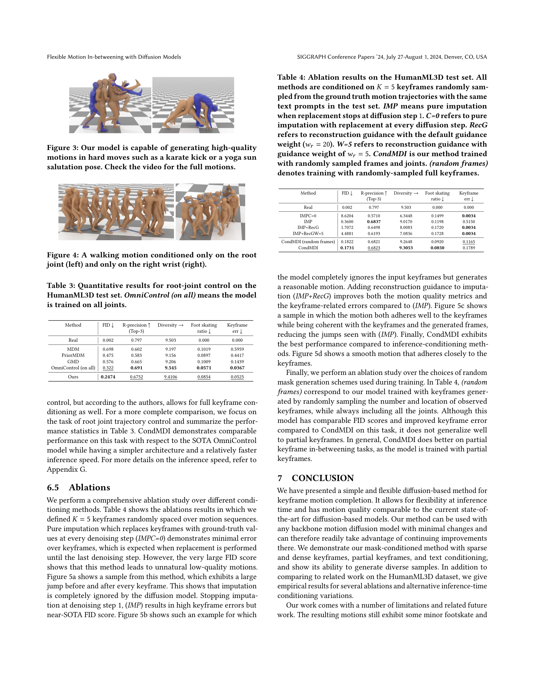

# Flexible Motion In-betweening with Diffusion Models

> **저자**: Setareh Cohan, Guy Tevet, Daniele Reda, Xue Bin Peng, Michiel van de Panne | **날짜**: 2024-05-17 | **URL**: [https://arxiv.org/abs/2405.11126](https://arxiv.org/abs/2405.11126)

---

## Essence

*Figure 1: Flexible motion in-betweening given a text prompt and spatio-temporally sparse keyframes. From left to right: *

본 논문은 diffusion model 기반의 CondMDI(Conditional Motion Diffusion In-betweening)를 제안하여 텍스트 조건과 유연한 keyframe 제약 조건 하에서 고품질의 다양한 인간 모션을 생성하는 unified 모델을 제시한다.

## Motivation

- **Known**: Motion in-betweening은 character animation의 핵심 작업이며, RNN 기반 방법들은 장기 의존성 모델링에 어려움을 겪었고, 최근 transformer 기반과 diffusion 기반 방법들이 진전을 이루고 있다.
- **Gap**: 기존 diffusion 기반 방법들(MDM, PriorMDM)은 sparse-in-time keyframe이나 partial pose 제약을 유연하게 처리하지 못하며, 고정된 keyframe 패턴에 제한된다.
- **Why**: Motion in-betweening의 자동화는 애니메이션 제작의 labor-intensive한 과정을 크게 줄일 수 있으며, 유연한 제약 조건 처리 능력은 실제 애니메이션 워크플로우에서 매우 중요하다.
- **Approach**: Masked conditional diffusion 모델을 사용하여 임의의 dense 또는 sparse keyframe 배치와 partial keyframe 제약을 지원하도록 학습하며, 마스크를 통해 관찰된 keyframe과 feature를 표시한다.

## Achievement

*Figure 3: Our model is capable of generating high-quality*

- **유연한 keyframe 처리**: arbitrary dense-or-sparse keyframe 배치와 partial pose 제약을 동시에 지원하는 unified 모델 달성
- **텍스트 조건 통합**: text prompt와 spatial constraint를 함께 처리하여 조건부 모션 생성 가능
- **높은 품질과 다양성**: HumanML3D 데이터셋에서 keyframe을 준수하면서도 고품질의 다양한 모션 생성 입증
- **빠른 추론 속도**: 대안 diffusion 기반 방법들에 비해 빠른 inference time 제공

## How

*Figure 2: Conditional Motion Diffusion In-betweening (CondMDI) overview. The model is fed a noisy motion sequence x𝑡,*

- Randomly sampled keyframe과 randomly sampled joint를 mask와 함께 학습하여 모든 가능한 in-betweening 시나리오의 공간에서 샘플링
- Masked conditional diffusion 아키텍처를 통해 관찰된 위치(keyframe)와 미관찰 위치를 명시적으로 구분
- Text conditioning과 spatial constraint를 diffusion 프로세스에 동시에 통합
- Guidance와 imputation-based 접근법과 비교하여 inference-time keyframing 성능 평가
- Root trajectory만의 제약이나 partial joint specification 등 다양한 제약 시나리오 지원

## Originality

- 기존 diffusion 기반 방법들의 limitation을 명시적으로 분석하고 masked conditioning을 통해 체계적으로 해결한 점
- Random sampling 기반 학습으로 arbitrary keyframe 패턴에 대한 일반화 능력을 확보한 점
- Text prompt와 spatial constraint의 유연한 조합을 unified 모델에서 구현한 점
- Inference-time 유연성을 강조하면서도 고품질 생성을 달성한 설계 철학

## Limitation & Further Study

- 평가가 주로 HumanML3D 데이터셋에 집중되어 다른 모션 도메인으로의 일반화 검증 부족
- Foot sliding이나 physical plausibility 같은 특정 artifacts에 대한 명시적 처리 방법 미제시
- Keyframe 제약 만족도와 모션 다양성 간의 trade-off에 대한 정량적 분석 제한
- 후속 연구: 더 다양한 모션 도메인 검증, 물리 제약 기반 diffusion guidance 개발, interactive editing을 위한 real-time inference 최적화 필요

## Evaluation

- Novelty: 4/5
- Technical Soundness: 3/5
- Significance: 4/5
- Clarity: 4/5
- Overall: 4/5

**총평**: 본 논문은 masked conditional diffusion을 통해 motion in-betweening의 장기적 제약인 flexible keyframe 처리를 우아하게 해결한 실용적이고 창의적인 방법을 제시하며, 애니메이션 제작의 자동화에 상당한 기여를 한다.
