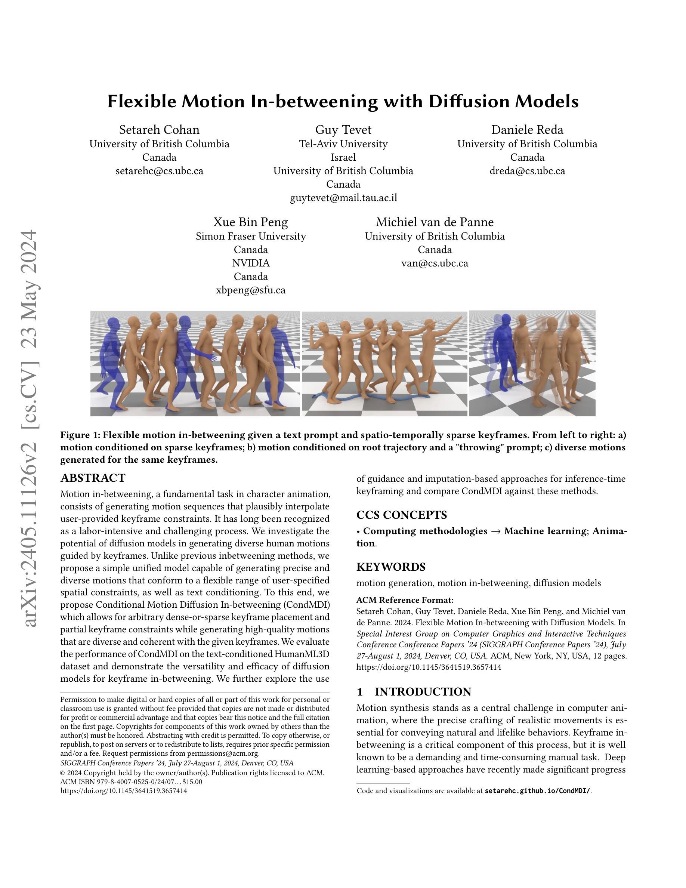
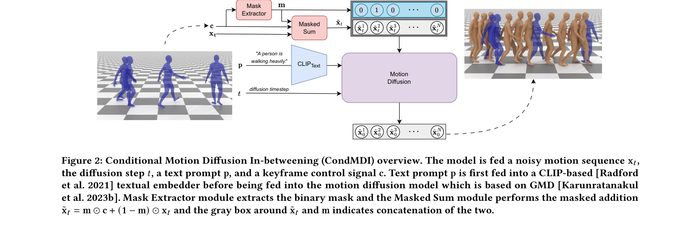

# Flexible Motion In-betweening with Diffusion Models

> **저자**: Setareh Cohan, Guy Tevet, Daniele Reda, Xue Bin Peng, Michiel van de Panne | **날짜**: 2024-05-17 | **URL**: [https://arxiv.org/abs/2405.11126](https://arxiv.org/abs/2405.11126)

---

## Essence

*Figure 1: Flexible motion in-betweening given a text prompt and spatio-temporally sparse keyframes. From left to right: *

CondMDI는 diffusion model 기반의 통합된 모션 인-비트위닝 방법으로, 텍스트 조건과 함께 유연한 keyframe 제약을 받아 다양하고 정밀한 인간 모션을 생성한다.

## Motivation

- **Known**: RNN과 Transformer 기반 방법들이 motion in-betweening을 위해 제안되었으나, 고정된 keyframe 패턴으로 제한되거나 diffusion model 기반 방법들도 전체 관절 궤적 지정 시 foot sliding 등의 부자연스러운 움직임을 보인다.
- **Gap**: 기존 diffusion 기반 방법들은 sparse temporal keyframe이나 부분적 pose 지정을 동시에 지원하거나, 다양한 keyframe 배치 패턴과 텍스트 조건을 유연하게 처리하는 통합 모델이 없다.
- **Why**: Motion in-betweening은 character animation에서 노동집약적인 핵심 작업이며, 유연한 제약 조건 처리와 다양성이 동시에 요구되는 실무 친화적 솔루션이 필요하다.
- **Approach**: 마스크된 조건부 diffusion model을 사용하여 무작위로 샘플링된 keyframe과 관절, 그리고 관찰된 keyframe과 특성을 나타내는 마스크로 학습함으로써 다양한 motion in-betweening 시나리오를 수용한다.

## Achievement

*Figure 2: Conditional Motion Diffusion In-betweening (CondMDI) overview. The model is fed a noisy motion sequence x𝑡,*

- **유연한 제약 처리**: 임의의 밀집 또는 희소 keyframe 배치, 부분적 keyframe 제약, 텍스트 조건을 통합 모델에서 지원
- **높은 품질 생성**: HumanML3D 데이터셋에서 keyframe 제약을 만족하면서도 자연스럽고 다양한 모션 생성
- **빠른 추론 속도**: 다른 diffusion 기반 방법 대비 향상된 추론 효율성
- **포괄적 비교**: imputation과 reconstruction guidance 등 대체 방법론 대비 성능 평가

## How

*Figure 2: Conditional Motion Diffusion In-betweening (CondMDI) overview. The model is fed a noisy motion sequence x𝑡,*

- 마스크 기반 조건부 diffusion model 아키텍처로 sparse temporal keyframe과 partial pose를 동시에 처리
- 학습 시 모든 가능한 motion in-betweening 시나리오의 공간에서 sampling하여 유연성 확보
- Text conditioning을 HumanML3D의 text annotation과 함께 통합
- Inference time에 guidance와 imputation 기반 접근법 비교 평가
- Root trajectory 지정 가능하도록 global 제약 조건 지원

## Originality

- 기존 방법과 달리 고정된 keyframe 패턴이 아닌 임의의 dense-or-sparse 배치를 통합 모델에서 지원
- Partial keyframe (부분 관절만 지정)을 text conditioning과 함께 처리하는 유일한 방법
- Masked diffusion 프레임워크를 motion in-betweening에 적용하여 inference-time 유연성 극대화
- Global spatial constraint와 sparse temporal keyframe을 동시에 처리하는 새로운 솔루션

## Limitation & Further Study

- 평가가 HumanML3D 데이터셋에만 국한되어 있으며, 다른 motion capture 데이터셋에서의 일반화 가능성 검증 부족
- Keyframe 정확도와 motion diversity 간의 trade-off 분석이 제한적
- 실제 animation studio 워크플로우에서의 사용성 평가 및 user study 결여
- 복잡한 multi-person interaction이나 물체 상호작용이 포함된 시나리오에 대한 확장성 미검증
- Guidance 방법의 computational cost와 성능 개선 정도에 대한 상세 분석 필요

## Evaluation

- Novelty: 4/5
- Technical Soundness: 4/5
- Significance: 4/5
- Clarity: 4/5
- Overall: 4/5

**총평**: CondMDI는 masked conditional diffusion model을 통해 motion in-betweening의 오랜 한계를 효과적으로 해결하며, 유연한 제약 처리와 텍스트 조건의 통합으로 실무적 가치가 높고 기술적으로도 우수한 기여를 제시한다.

## Related Papers

- 🔗 후속 연구: [[papers/1952_GENMO_A_GENeralist_Model_for_Human_MOtion/review]] — GENMO의 통합된 모션 생성 프레임워크가 CondMDI의 유연한 keyframe 기반 인-비트위닝을 포함할 수 있다.
- 🧪 응용 사례: [[papers/1935_From_Language_to_Locomotion_Retargeting-free_Humanoid_Contro/review]] — 언어 기반 동작 제어에 diffusion 기반 모션 인-비트위닝 기법을 적용할 수 있다.
- 🔄 다른 접근: [[papers/1917_Example-based_Motion_Synthesis_via_Generative_Motion_Matchin/review]] — 둘 다 제약 조건을 가진 모션 생성을 다루지만 CondMDI는 diffusion 기반을, GenMM은 Motion Matching 기반 접근법을 사용한다.
- 🔗 후속 연구: [[papers/1701_Taming_Diffusion_Probabilistic_Models_for_Character_Control/review]] — CondMDI의 keyframe 제약 기반 모션 인-비트위닝을 diffusion 확률 모델 제어와 결합하면 더 정밀한 캐릭터 제어가 가능하다.
- 🏛 기반 연구: [[papers/1960_Guided_Motion_Diffusion_for_Controllable_Human_Motion_Synthe/review]] — CondMDI의 텍스트 조건부 모션 생성이 Guided Motion Diffusion의 controllable human motion synthesis에 기반 기술을 제공한다.
- 🔗 후속 연구: [[papers/1858_cuRoboV2_Dynamics-Aware_Motion_Generation_with_Depth-Fused_D/review]] — cuRoboV2의 dynamics-aware motion generation을 텍스트 조건과 keyframe 제약이 결합된 더 복잡한 시나리오로 확장한 연구입니다.
- 🏛 기반 연구: [[papers/2146_TEDi_Temporally-Entangled_Diffusion_for_Long-Term_Motion_Syn/review]] — TEDi의 temporally-entangled diffusion 기법이 CondMDI의 keyframe 간 일관성 있는 모션 생성의 이론적 기반을 제공합니다.
- 🔗 후속 연구: [[papers/1701_Taming_Diffusion_Probabilistic_Models_for_Character_Control/review]] — 모션 생성에서 실시간 사용자 제어와 유연한 in-betweening이라는 보완적 기능을 제공하는 확산 모델 접근법을 다룬다.
- 🏛 기반 연구: [[papers/1614_Physically_Consistent_Humanoid_Loco-Manipulation_using_Laten/review]] — Flexible Motion In-betweening의 diffusion 기반 모션 보간 기법이 본 논문의 장기 조작 계획 생성의 기반이 됨
- 🔄 다른 접근: [[papers/1841_CLoSD_Closing_the_Loop_between_Simulation_and_Diffusion_for/review]] — 모션 생성을 위해 diffusion-RL 폐쇄 루프 vs flexible motion in-betweening이라는 서로 다른 diffusion 활용 방식을 비교할 수 있다
- 🔄 다른 접근: [[papers/1878_Diffusion_Forcing_for_Multi-Agent_Interaction_Sequence_Model/review]] — multi-agent interaction modeling에서 diffusion forcing과 flexible motion in-betweening이 서로 다른 시퀀스 생성 방법론을 제시한다.
- 🏛 기반 연구: [[papers/1952_GENMO_A_GENeralist_Model_for_Human_MOtion/review]] — flexible motion in-betweening이 GENMO의 통합된 동작 추정과 생성 프레임워크에 기반이 된다.
- 🔄 다른 접근: [[papers/1960_Guided_Motion_Diffusion_for_Controllable_Human_Motion_Synthe/review]] — 둘 다 텍스트 조건부 diffusion 기반 모션 생성을 다루지만, GMD는 공간적 제약과 자연어를 동시에, CondMDI는 keyframe 제약과 텍스트를 결합합니다.
- 🔗 후속 연구: [[papers/1917_Example-based_Motion_Synthesis_via_Generative_Motion_Matchin/review]] — 확산 모델 기반 유연한 모션 인터폴레이션이 예제 기반 모션 합성의 확장된 형태이다.
- 🔄 다른 접근: [[papers/2027_InterPrior_Scaling_Generative_Control_for_Physics-Based_Huma/review]] — 인간-객체 상호작용 생성에서 RL 기반 접근법 대신 diffusion model을 사용한 모션 생성 방법을 제시한다.
- 🏛 기반 연구: [[papers/2091_MaskedManipulator_Versatile_Whole-Body_Manipulation/review]] — Flexible Motion In-betweening의 diffusion 기반 모션 생성이 MaskedManipulator의 생성적 제어 정책의 기술적 기반을 제공한다.
- 🔗 후속 연구: [[papers/2092_MaskedMimic_Unified_Physics-Based_Character_Control_Through/review]] — 확산 모델을 이용한 모션 중간 프레임 생성을 물리 기반 캐릭터 제어로 확장한 발전된 형태이다.
- 🏛 기반 연구: [[papers/2137_PhysDiff_Physics-Guided_Human_Motion_Diffusion_Model/review]] — Flexible motion in-betweening with diffusion models가 PhysDiff의 physics-guided diffusion에서 motion projection 모듈 구현의 기술적 토대를 제공합니다.
- 🔄 다른 접근: [[papers/2146_TEDi_Temporally-Entangled_Diffusion_for_Long-Term_Motion_Syn/review]] — 장기 모션 생성을 위해 TEDi는 시간축 얽힘을 사용하고 Flexible Motion In-betweening은 diffusion 모델로 중간 모션을 생성하는 서로 다른 접근법을 제시합니다.
