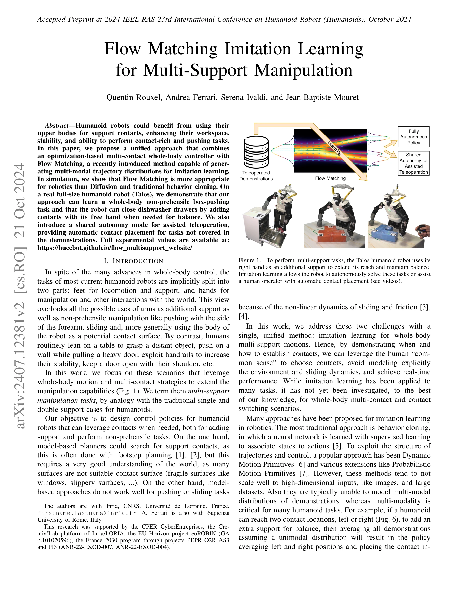
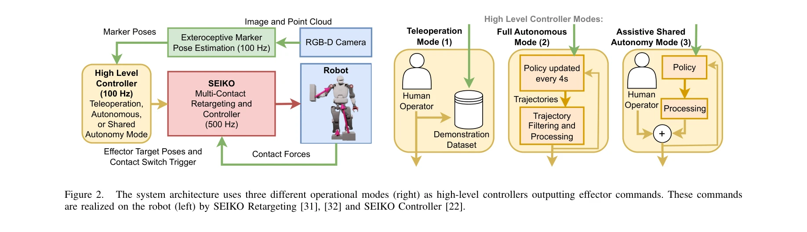

# Flow Matching Imitation Learning for Multi-Support Manipulation

> **저자**: Quentin Rouxel, Andrea Ferrari, Serena Ivaldi, Jean-Baptiste Mouret | **날짜**: 2024-07-17 | **URL**: [https://arxiv.org/abs/2407.12381](https://arxiv.org/abs/2407.12381)

---

## Essence

*Figure 1.*

본 논문은 Flow Matching 생성 모델을 활용하여 휴머노이드 로봇이 팔을 추가 지지점으로 사용하는 다중 접촉 조작 작업을 모방 학습으로 학습할 수 있는 통합 접근법을 제시한다. Talos 로봇에서 상자 밀기 및 식기세척기 문 닫기 작업을 성공적으로 수행하며, 공유 자율성 모드를 통해 인간 조작자를 지원한다.

## Motivation

- **Known**: 휴머노이드 로봇의 전신 제어 기술은 잘 알려져 있으며, Diffusion 기반의 생성 모델이 모방 학습에 적용되고 있다. 그러나 다중 접촉 전환 시나리오에서의 whole-body 모방 학습은 아직 연구되지 않았다.
- **Gap**: 기존 behavior cloning, DMP, ProMP는 고차원 입력에 확장성이 떨어지고 multi-modal 분포를 모델링하기 어렵다. 또한 Diffusion 방법은 로봇 응용에서 느린 추론 속도 문제가 있다.
- **Why**: 휴머노이드 로봇이 팔을 지지점으로 활용할 수 있다면 작업 공간, 안정성, 접촉 기반 작업 수행 능력을 크게 향상시킬 수 있으며, 이는 실제 환경의 복잡한 조작 작업에서 매우 중요하다.
- **Approach**: 최적화 기반 다중 접촉 전신 제어기와 Flow Matching 생성 모델을 결합하여 시연으로부터 전신 운동을 학습하고, 자율 모드와 공유 자율성 모드 두 가지 운영 방식을 지원한다.

## Achievement

*Figure 1.*

- **Flow Matching의 로봇 우월성 입증**: Diffusion 및 전통적 behavior cloning 대비 Flow Matching이 더 빠른 추론 속도와 결정론적 출력을 제공하면서 품질 손실이 없음을 시뮬레이션으로 증명
- **실제 휴머노이드 로봇 구현**: Talos 로봇에서 비파지형 상자 밀기 작업 및 식기세척기 문 닫기 작업(균형 유지를 위해 자유 손으로 추가 접촉 생성)을 성공적으로 학습 및 수행
- **공유 자율성 모드 개발**: 학습된 정책이 시연에 포함되지 않은 작업에서도 자동 접촉 배치를 제공하여 인간 조작자를 지원하는 assistive teleoperation 구현

## How

*Figure 2.*

- RGB-D 카메라로부터 마커 기반 자세 추정을 통해 상태 정보 수집 (100 Hz)
- Flow Matching 생성 모델을 통해 조건부 trajectory distribution을 학습하여 multi-modal 시연을 캡처
- SEIKO multi-contact retargeting 및 제어기에서 학습된 trajectory를 실시간 전신 제어로 변환 (500 Hz)
- 세 가지 운영 모드 구현: (1) 조작자 직접 조종, (2) 완전 자율 모드, (3) 공유 자율성 모드로 접촉 배치 자동화
- 전신 제어에서 접촉력 규제 및 균형 유지를 통해 안정성 보장

## Originality

- **처음으로 Flow Matching을 실제 휴머노이드 로봇에 배포**: 이론적 우월성을 실제 전신 제어 작업에서 검증한 첫 사례
- **다중 지지 조작(multi-support manipulation) 개념 도입**: 팔을 추가 지지점으로 활용하는 humanoid 작업을 체계적으로 정의하고 접근
- **공유 자율성을 통한 접촉 자동 배치**: 학습된 정책이 시연 시나리오 외의 변형된 작업에서도 자동으로 적절한 접촉점을 결정하는 능력 시연
- **End-to-end imitation learning for whole-body multi-contact tasks**: 전신 제어와 접촉 전환을 포함한 복잡한 조작을 단일 생성 모델로 처리

## Limitation & Further Study

- 시뮬레이션 비교는 Flow Matching vs Diffusion vs behavior cloning에 제한되어 있으며, 다른 최근 생성 모델(예: normalizing flows)과의 비교 부족
- 실제 로봇 실험이 특정 작업(상자 밀기, 식기세척기 문)에 제한되어 일반화 능력이 제한적으로 보임
- 시연 데이터 수집 방식(인간 조작자의 teleoperation retargeting)에 대한 상세한 설명이 부족
- 마찰 및 슬라이딩 동역학을 명시적으로 모델링하지 않는 대신 시연에 의존하므로, 크게 다른 표면이나 객체에 대한 일반화 한계 존재
- 공유 자율성 모드에서 사람-로봇 상호작용 안전성 및 안정성에 대한 정량적 평가 부족
- 후속 연구에서 더 복잡한 multi-contact 시나리오, 다양한 환경 조건에서의 강건성 검증 필요

## Evaluation

- Novelty: 4/5
- Technical Soundness: 3/5
- Significance: 4/5
- Clarity: 4/5
- Overall: 4/5

**총평**: 본 논문은 Flow Matching을 실제 휴머노이드 로봇의 다중 접촉 조작 학습에 처음 적용한 혁신적 연구로, 이론적 기여와 실제 구현이 잘 결합되어 있다. 공유 자율성 모드를 통한 실용적 응용 가치와 생성 모델의 로봇 적용 가능성을 명확히 입증한다.
