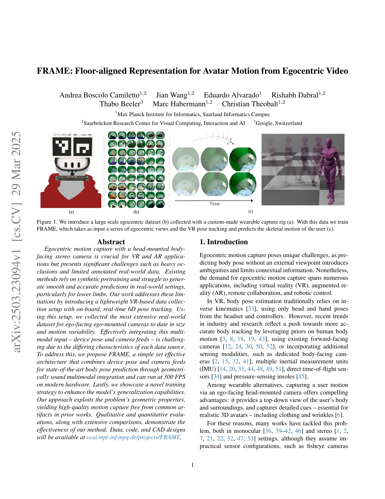
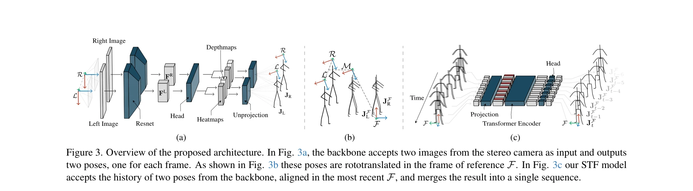

# FRAME: Floor-aligned Representation for Avatar Motion from Egocentric Video

> **저자**: Andrea Boscolo Camiletto, Jian Wang, Eduardo Alvarado, Rishabh Dabral, Thabo Beeler, Marc Habermann, Christian Theobalt | **날짜**: 2025-03-29 | **URL**: [https://arxiv.org/abs/2503.23094](https://arxiv.org/abs/2503.23094)

---

## Essence

*Figure 1. We introduce a large scale egocentric dataset (b) collected with a custom-made wearable capture rig (a). With *

VR/AR 환경에서 일인칭 시점의 스테레오 카메라와 헤드 트래킹을 활용하여 신체 자세를 추정하는 FRAME 아키텍처를 제안하며, 대규모 실제 데이터셋을 수집하여 합성 데이터 사전학습의 필요성을 제거했다.

## Motivation

- **Known**: 기존 일인칭 모션 캡처 방법들은 합성 데이터에 의존하며 실제 환경에서 일반화에 어려움을 겪고, 특히 하지의 정확도가 낮으며 temporal inconsistency와 body-floor penetration, foot skating 같은 아티팩트가 발생한다.
- **Gap**: 실제 환경 데이터의 부족(기존 최대 260k 프레임 미만)과 일인칭 설정의 기하학적 특성(카메라 간 상대 자세, 디바이스 6D 포즈)을 명시적으로 활용하지 못하는 기존 방법들의 한계가 있다.
- **Why**: VR/AR 애플리케이션에서 정확하고 부드러운 신체 모션 캡처는 현실감 있는 아바타 표현에 필수적이며, 실시간 성능(300 FPS)은 상호작용적 애플리케이션 구현에 중요하다.
- **Approach**: 경량의 VR 기반 데이터 수집 장비를 설계하여 기존의 6배 규모의 실제 데이터셋을 수집했으며, 카메라 피드와 디바이스 포즈를 기하학적으로 명시적으로 통합하는 FRAME 아키텍처를 제안하고, k-fold Cross Training Caching 전략으로 일반화 성능을 향상시켰다.

## Achievement

*Figure 3. Overview of the proposed architecture. In Fig. 3a, the backbone accepts two images from the stereo camera as i*

- **대규모 실제 데이터셋**: 기존 최대 260k 프레임 대비 약 1.56M 프레임 이상의 egocentric stereo 데이터셋 구축
- **높은 정확도**: MPJPE 기준 기존 state of the art 대비 28% 향상 달성
- **실시간 성능**: 최신 하드웨어에서 300 FPS의 고속 추론 가능
- **우수한 일반화**: k-fold Cross Training Caching 전략을 통해 미학습 데이터에 대한 일반화 능력 대폭 개선
- **아티팩트 제거**: body-floor penetration, foot skating 등 기존 방법의 시각적 아티팩트 제거

## How

*Figure 3. Overview of the proposed architecture. In Fig. 3a, the backbone accepts two images from the stereo camera as i*

- 경량 VR 기반 수집 장비: 스테레오 일인칭 카메라와 온보드 6D 포즈 트래킹으로 구성된 실용적 센서 구성
- 기하학적 명시적 통합: 카메라 좌표계에서 먼저 3D 자세를 예측한 후, 디바이스 포즈를 이용해 floor-aligned 좌표계로 회전-이동 변환하는 two-stage 접근
- Backbone 아키텍처: 스테레오 이미지를 처리하는 vision backbone과 디바이스 포즈를 처리하는 경로를 설계
- k-fold Cross Training Caching 전략: 학습 중 여러 fold에서 다양한 데이터 조합으로 학습하여 overfitting 방지 및 일반화 능력 강화
- Floor alignment: 중력 정렬 좌표계를 활용하여 하지 정확도 향상 및 물리적으로 현실적인 동작 생성

## Originality

- 일인칭 모션 캡처를 위한 기하학적으로 명시적인 multimodal 통합 방식 제안 (기존은 암시적 학습)
- 카메라 좌표계 → floor-aligned 좌표계로의 두 단계 예측 파이프라인이 기존의 단일 좌표계 방식보다 우월
- k-fold Cross Training Caching 전략으로 일반화 성능 향상 시키는 새로운 훈련 전략 도입
- 실제 VR 디바이스의 온보드 pose tracking을 직접 활용하는 현실적 접근
- 기존의 불편한 checkerboard 또는 SLAM 기반 camera pose 추적을 대체하는 경량의 ArUco 기반 추적 방식

## Limitation & Further Study

- 데이터셋 범위: 수집된 데이터셋이 특정 환경과 카메라 구성에 한정될 수 있으며, 극단적인 자세나 fast motion에 대한 강건성 미검증
- 카메라 구성 의존성: 제안 방법이 스테레오 카메라 설정과 신뢰할 수 있는 device pose tracking을 전제하므로, 다른 센서 구성으로의 적응 가능성 불명확
- 손/얼굴 포함 여부: 논문에서 full-body pose 추정만 다루므로 손 제스처나 얼굴 표정 등은 미포함
- 후속 연구: multimodal sensor fusion 방식의 더 깊은 이론적 분석, 극단적 occlusion 상황에서의 강건성 개선, 다양한 신체 형태(아동, 장애인 등)에 대한 적응성 연구

## Evaluation

- Novelty: 4/5
- Technical Soundness: 3/5
- Significance: 4/5
- Clarity: 4/5
- Overall: 4/5

**총평**: 일인칭 모션 캡처의 핵심 문제들(합성 데이터 의존성, 하지 정확도, 아티팩트)을 대규모 실제 데이터셋과 기하학적으로 명시적인 아키텍처로 체계적으로 해결하며, 실시간 성능과 높은 일반화 능력을 동시에 달성한 실용성 높은 연구다.

## Related Papers

- 🔄 다른 접근: [[papers/2010_HumanoidPano_Hybrid_Spherical_Panoramic-LiDAR_Cross-Modal_Pe/review]] — 둘 다 VR/AR 환경에서의 인간 자세 추정을 다루지만 FRAME은 스테레오 카메라를, HumanoidPano는 spherical panoramic을 사용한다.
- 🏛 기반 연구: [[papers/1898_EgoActor_Grounding_Task_Planning_into_Spatial-aware_Egocentr/review]] — 일인칭 시점 기반 태스크 계획이 FRAME의 VR/AR 자세 추정에 이론적 기반을 제공한다.
- 🔄 다른 접근: [[papers/1907_EmbodMocap_In-the-Wild_4D_Human-Scene_Reconstruction_for_Emb/review]] — 둘 다 iPhone 기반 모션 추정을 하지만 FRAME은 VR/AR 환경 자세 추정을, EmbodMocap은 실외 4D 재구성을 목표로 한다.
- 🔗 후속 연구: [[papers/2019_iCub3_Avatar_System_Enabling_Remote_Fully-Immersive_Embodime/review]] — FRAME의 일인칭 시점 자세 추정 기술을 iCub3 Avatar System의 fully-immersive embodiment와 결합하면 더 정확한 원격 제어가 가능하다.
- 🧪 응용 사례: [[papers/1758_WHOLE_World-Grounded_Hand-Object_Lifted_from_Egocentric_Vide/review]] — FRAME의 egocentric 자세 추정을 WHOLE의 world-grounded hand-object 학습에 적용하여 더 정확한 손-물체 상호작용 모델링이 가능하다.
- 🔄 다른 접근: [[papers/1857_CRISP_Contact-Guided_Real2Sim_from_Monocular_Video_with_Plan/review]] — 바닥 정렬 표현을 통한 다른 모션 재구성 방식을 제시합니다.
- 🔄 다른 접근: [[papers/1907_EmbodMocap_In-the-Wild_4D_Human-Scene_Reconstruction_for_Emb/review]] — 둘 다 iPhone 기반 모션 캡처를 하지만 EmbodMocap은 실외 장면 재구성을, FRAME은 VR/AR 환경 자세 추정을 목표로 한다.
- 🏛 기반 연구: [[papers/1998_Humanoid_Occupancy_Enabling_A_Generalized_Multimodal_Occupan/review]] — floor-aligned representation이 humanoid occupancy 인식에서 환경의 기하학적 구조를 정확히 파악하는 기반 기술을 제공합니다.
- 🏛 기반 연구: [[papers/2136_PHUMA_Physically-Grounded_Humanoid_Locomotion_Dataset/review]] — 자기중심 영상에서 아바타 모션을 추출하는 기본 기술이 PHUMA의 비디오 기반 모션 추출에 활용된다.
- 🔗 후속 연구: [[papers/2153_Towards_Adaptive_Humanoid_Control_via_Multi-Behavior_Distill/review]] — FRAME의 avatar motion 기법을 다중행동 증류와 결합하면 더 자연스럽고 다양한 휴머노이드 행동 생성이 가능합니다.
