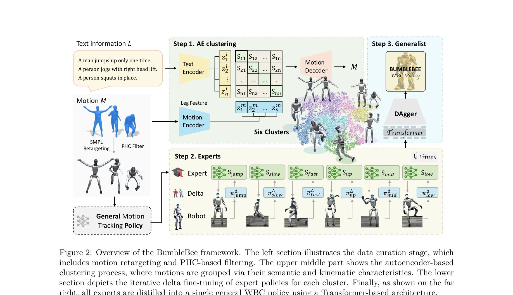
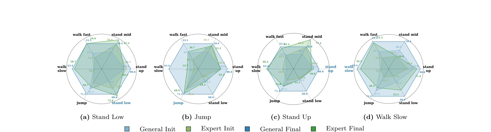

# From Experts to a Generalist: Toward General Whole-Body Control for Humanoid Robots

> **저자**: Yuxuan Wang, Ming Yang, Ziluo Ding, Yu Zhang, Weishuai Zeng, Xinrun Xu, Haobin Jiang, Zongqing Lu | **날짜**: 2025-06-15 | **URL**: [https://arxiv.org/abs/2506.12779](https://arxiv.org/abs/2506.12779)

---

## Essence

*Figure 2: Overview of the BumbleBee framework. The left section illustrates the data curation stage, which*

BumbleBee는 motion clustering과 sim-to-real adaptation을 결합하여 humanoid robot의 일반적인 whole-body control을 달성하는 expert-generalist 학습 프레임워크이다. 여러 motion cluster에서 전문가 정책을 훈련한 후 이를 통합 generalist controller로 distill한다.

## Motivation

- **Known**: 기존 프레임워크들은 단일 motion-specific 정책 훈련에는 우수하지만 diverse behavior에 걸친 일반화는 어려우며, conflicting control requirement와 mismatched data distribution 문제가 있다.
- **Gap**: 서로 다른 motion type들이 상충하는 control requirement를 가지고 있어서 단일 정책으로는 일반화가 어려운데, 이를 체계적으로 해결하는 clustering 기반의 구조화된 접근이 부족하다.
- **Why**: Humanoid robot이 diverse task를 수행하려면 agile하고 robust한 general whole-body control이 필수이며, 이를 통해 실제 세계에서 다양한 행동을 수행할 수 있는 실용적인 robot을 개발할 수 있다.
- **Approach**: Autoencoder 기반 clustering으로 motion feature와 text description을 이용해 behaviorally similar motion을 그룹화하고, 각 cluster에서 expert policy를 훈련한 후 delta action modeling으로 sim-to-real gap을 해결한 뒤 knowledge distillation으로 통합 generalist를 생성한다.

## Achievement

*Figure 4: Evaluation of expert vs. generalist models in MuJoCo, measured by success rate.*

- **Expert-to-Generalist Framework**: Motion clustering을 통해 conflicting gradient 문제를 완화하고 각 motion type의 specialized control을 가능하게 함
- **Auto-regressive Clustering Method**: Leg-specific motion feature와 text description을 결합하여 semantic과 kinematic 특성을 모두 반영한 clustering 달성
- **State-of-the-art Performance**: 시뮬레이션과 실제 humanoid robot에서 superior agility, robustness, generalization을 입증

## How

*Figure 2: Overview of the BumbleBee framework. The left section illustrates the data curation stage, which*

- SMPL 형식의 human motion을 robot-specific representation으로 retargeting하고 PHC filtering으로 데이터 품질 확보
- Self-supervised autoencoder를 사용하여 kinematic feature (joint 3D coordinate, foot velocity 포함)와 HumanML3D의 text annotation으로 motion clustering 수행
- General tracking policy를 먼저 전체 데이터셋으로 훈련한 후 각 cluster에서 fine-tuning하여 expert policy 획득
- 각 cluster에서 delta action model을 훈련하여 simulated와 real-world state transition의 차이를 모델링하고 iterative refinement 수행
- Transformer 기반 architecture를 사용한 knowledge distillation으로 모든 expert를 unified generalist controller로 통합

## Originality

- Motion clustering과 expert-generalist distillation 패러다임의 결합으로 mixture of experts (MoE) 개념을 humanoid whole-body control에 창의적으로 적용
- Leg-specific kinematic feature와 text semantic을 함께 활용한 이중 정보 기반 clustering 방식의 설계
- Cluster-specific delta action model을 통해 sim-to-real transfer를 motion type별로 최적화하는 접근
- 실제 robot에서 135초 이상의 연속 long-duration action 추적 성공으로 practical generalization 입증

## Limitation & Further Study

- Clustering 품질이 text annotation의 질과 motion feature extraction에 크게 의존하므로, annotation이 없는 새로운 motion type에 대한 확장성이 제한될 수 있음
- Delta action model의 iterative refinement는 실제 robot에서의 data collection이 필요하므로 sample efficiency 측면에서 개선 여지 있음
- 현재 방법은 6개 cluster로 고정되어 있는데, 최적의 cluster 수 결정을 위한 automatic methodology 부족
- 서로 다른 humanoid robot platform 간의 transfer learning 가능성 및 한계에 대한 논의 필요
- 추가 연구로 더 적응적인 clustering 방법, zero-shot generalization to unseen motions, 다양한 robot morphology에 대한 확장이 필요

## Evaluation

- Novelty: 4/5
- Technical Soundness: 4/5
- Significance: 4/5
- Clarity: 4/5
- Overall: 4/5

**총평**: BumbleBee는 motion clustering과 expert-generalist distillation을 통해 humanoid robot의 일반적인 whole-body control 문제를 효과적으로 해결하며, sim-to-real adaptation과 결합하여 실제 세계에서 agile하고 robust한 control을 달성한 우수한 연구이다. 기술적 창의성과 실험적 검증이 뛰어나고 robotics 분야에 의미 있는 기여를 한다.

## Related Papers

- 🔄 다른 접근: [[papers/1924_FARM_Frame-Accelerated_Augmentation_and_Residual_Mixture-of-/review]] — 둘 다 전문가 정책을 일반화하지만 BumbleBee는 motion clustering을, FARM은 frame acceleration과 MoE를 사용한다.
- 🔗 후속 연구: [[papers/2090_MASH_Cooperative-Heterogeneous_Multi-Agent_Reinforcement_Lea/review]] — BumbleBee의 expert-generalist 학습을 다중 에이전트 환경으로 확장하여 MASH의 cooperative-heterogeneous 학습이 가능하다.
- 🏛 기반 연구: [[papers/1665_Scalable_and_General_Whole-Body_Control_for_Cross-Humanoid_L/review]] — BumbleBee의 motion clustering 기반 일반화가 cross-humanoid 학습의 scalable whole-body control에 이론적 기반을 제공한다.
- 🔄 다른 접근: [[papers/1820_BeyondMimic_From_Motion_Tracking_to_Versatile_Humanoid_Contr/review]] — 둘 다 motion tracking에서 일반화된 whole-body control로의 전환을 다루지만, BumbleBee는 expert-generalist 프레임워크를, BeyondMimic은 versatile control 접근법을 사용합니다.
- 🔄 다른 접근: [[papers/1944_General_Humanoid_Whole-Body_Control_via_Pretraining_and_Fast/review]] — 둘 다 일반적인 whole-body control을 추구하지만, BumbleBee는 motion clustering 기반 expert 통합을, FAST는 대규모 사전학습과 residual adaptation을 사용합니다.
- 🏛 기반 연구: [[papers/1962_H-Zero_Cross-Humanoid_Locomotion_Pretraining_Enables_Few-sho/review]] — H-Zero의 cross-humanoid pretraining 개념이 BumbleBee의 generalist controller 학습에 필요한 다양성과 일반화 능력의 기반을 제공합니다.
- 🔗 후속 연구: [[papers/1744_Unleashing_Humanoid_Reaching_Potential_via_Real-world-Ready/review]] — 전문가에서 일반가로의 전신 제어 개념을 사전 학습된 원시 스킬들의 통합을 통해 구체화하여 CVAE 기반 통일 표현을 실현했다.
- 🔄 다른 접근: [[papers/1760_X-Loco_Towards_Generalist_Humanoid_Locomotion_Control_via_Sy/review]] — 둘 다 범용 전신 제어를 목표로 하지만 X-Loco는 정책 증류로, From Experts는 전문가 통합으로 접근한다.
- 🔄 다른 접근: [[papers/1944_General_Humanoid_Whole-Body_Control_via_Pretraining_and_Fast/review]] — 둘 다 일반적인 whole-body control을 추구하지만, FAST는 대규모 사전학습과 residual adaptation을, BumbleBee는 expert-generalist distillation을 사용합니다.
- 🔄 다른 접근: [[papers/1924_FARM_Frame-Accelerated_Augmentation_and_Residual_Mixture-of-/review]] — 둘 다 전문가-일반가 학습을 다루지만 FARM은 frame acceleration과 MoE를, BumbleBee는 motion clustering을 사용한다.
- 🏛 기반 연구: [[papers/1985_HOVER_Versatile_Neural_Whole-Body_Controller_for_Humanoid_Ro/review]] — experts to generalist의 whole-body control 일반화 방법론이 HOVER의 정책 증류를 통한 제어 모드 통합 기법의 기초를 제공한다.
- 🏛 기반 연구: [[papers/2136_PHUMA_Physically-Grounded_Humanoid_Locomotion_Dataset/review]] — From experts to generalist control의 일반화 접근법이 PHUMA의 대규모 인터넷 비디오 데이터로부터 일반적인 humanoid locomotion 학습의 기술적 토대를 제공합니다.
