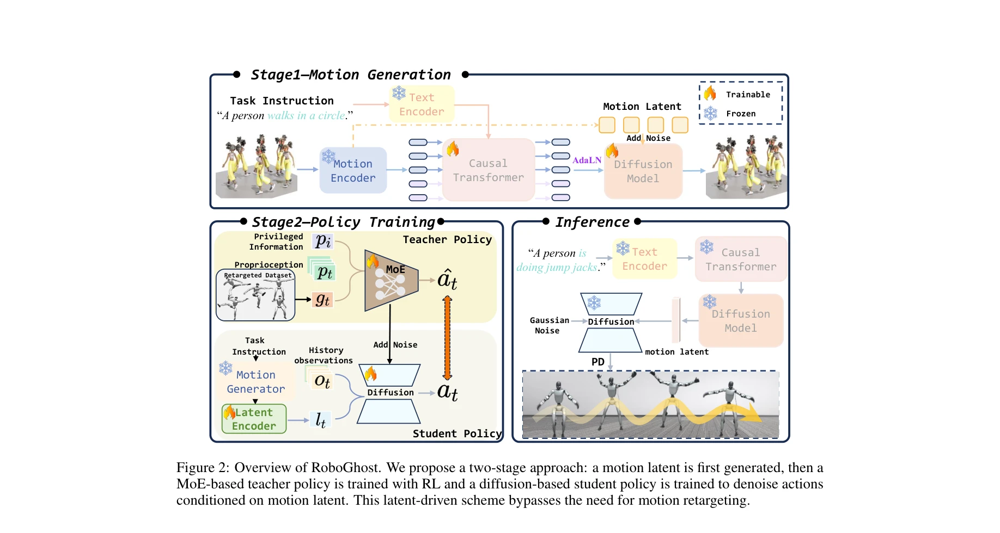
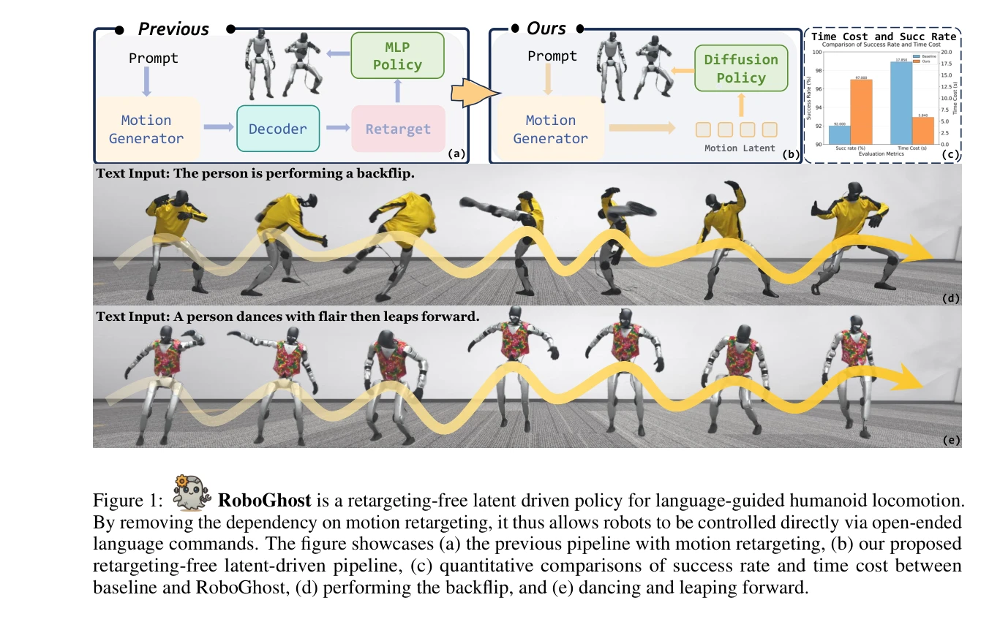

# From Language to Locomotion: Retargeting-free Humanoid Control via Motion Latent Guidance

> **저자**: Zhe Li, Cheng Chi, Yangyang Wei, Boan Zhu, Yibo Peng, Tao Huang, Pengwei Wang, Zhongyuan Wang, Shanghang Zhang, Chang Xu | **날짜**: 2025-10-17 | **DOI**: [10.48550/arXiv.2510.14952](https://doi.org/10.48550/arXiv.2510.14952)

---

## Essence

*Figure 2: Overview of RoboGhost. We propose a two-stage approach: a motion latent is first generated, then a*

RoboGhost는 언어 지시를 humanoid 로봇의 실행 가능한 동작으로 직접 변환하는 retargeting-free 프레임워크로, motion latent을 조건으로 하는 diffusion-based policy를 통해 기존의 다단계 파이프라인의 누적 오류와 지연을 제거한다.

## Motivation

- **Known**: 기존 language-guided humanoid 제어는 text-to-motion 생성, 로봇 형태로의 motion retargeting, physics-based controller를 이용한 추적의 3단계 파이프라인을 사용하며, 이는 누적 오류, 높은 지연, 약한 의미-제어 coupling을 야기한다.
- **Gap**: 기존 파이프라인은 명시적 human motion 디코딩과 retargeting에 의존하여 fragile하고 비효율적이며, 각 단계가 독립적으로 최적화되어 end-to-end 성능이 제한된다.
- **Why**: Real-time interactive humanoid 제어는 低延遲와 높은 신뢰성이 필수이며, language-guided 제어의 실제 배포를 위해서는 의미적 의도를 유지하면서 직접적인 action 생성 경로가 필요하다.
- **Approach**: Language-grounded motion latent을 semantic anchor로 활용하여 diffusion policy가 noise로부터 직접 executable action을 denoise하도록 하고, causal transformer-diffusion hybrid 구조로 장기적 coherence와 안정성을 동시에 확보한다.

## Achievement

*Figure 1:*

- **배포 지연 단축**: 기존 17.85초에서 5.84초로 단축하여 3배 이상의 속도 개선
- **성공률 및 추적 정확도 향상**: retargeting 손실 회피로 5% 높은 성공률과 감소된 추적 오류 달성
- **실제 humanoid 검증**: Unitree G1 등 실제 로봇에서 smooth하고 의미에 부합하는 locomotion 실증
- **멀티모달 확장성**: text 외 image, audio, music 등 다양한 input modality 지원 가능한 범용 프레임워크

## How

*Figure 2: Overview of RoboGhost. We propose a two-stage approach: a motion latent is first generated, then a*

- Motion generator: Continuous autoregressive 모델과 causal autoencoder를 결합하여 text로부터 compact motion latent lref 생성
- Teacher policy: MoE(Mixture of Experts) 기반 oracle policy를 RL로 학습하여 diverse하고 physically plausible한 action 생성
- Student policy: Motion latent을 조건으로 하는 diffusion-based policy를 학습하여 deployment cost 감소
- Causal transformer-diffusion architecture: Transformer backbone으로 long-horizon dependency 캡처, diffusion component로 stochastic stability 제공
- DDIM-accelerated sampling: 빠른 inference를 위해 DDIM 사용으로 실시간 배포 가능

## Originality

- 처음으로 motion latent 조건의 diffusion-based humanoid policy 제안 - 기존 discrete token이나 explicit motion tracking과 대비되는 새로운 패러다임
- Retargeting-free 접근법 - motion decoding과 kinematic retargeting 단계를 완전히 제거하는 근본적인 파이프라인 재설계
- Causal transformer-diffusion hybrid 아키텍처 - long-horizon coherence와 stochastic stability를 unified하는 새로운 motion generator 설계
- End-to-end latent-driven RL framework - MoE teacher와 diffusion student를 활용한 새로운 policy distillation 방식

## Limitation & Further Study

- Motion latent의 해석성 부족 - latent space의 의미적 구조나 제어 가능성에 대한 분석 부재
- Scale 제한 - 실험이 주로 locomotion task에 집중되어 whole-body manipulation이나 복잡한 상호작용 동작의 검증 부족
- Generalization 평가 미흡 - 보이지 않은 instruction이나 robot morphology 변화에 대한 일반화 성능 분석 제한적
- 멀티모달 확장의 구체적 구현 부재 - audio/music input의 실제 구현 및 평가는 제시되지 않음
- 후속 연구 방향: (1) Motion latent 해석성 향상, (2) 복잡한 manipulation task 확장, (3) 다양한 humanoid 형태로의 일반화, (4) Sim-to-real gap 분석

## Evaluation

- Novelty: 4/5
- Technical Soundness: 4/5
- Significance: 4/5
- Clarity: 4/5
- Overall: 4/5

**총평**: RoboGhost는 language-guided humanoid 제어의 근본적인 파이프라인 재설계를 통해 기존의 다단계 접근의 한계를 효과적으로 해결하며, 실제 로봇 배포에서 우수한 성능을 입증한 매우 영향력 있는 연구이다. 다만 해석성 강화와 복잡한 task로의 확장이 후속 과제로 남아있다.
