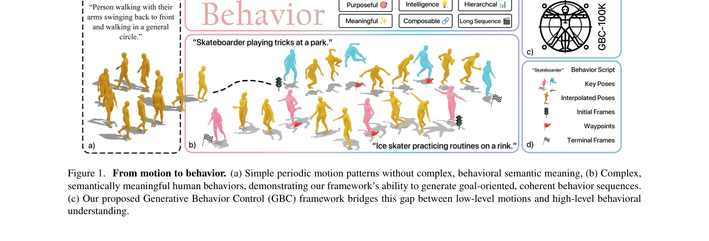
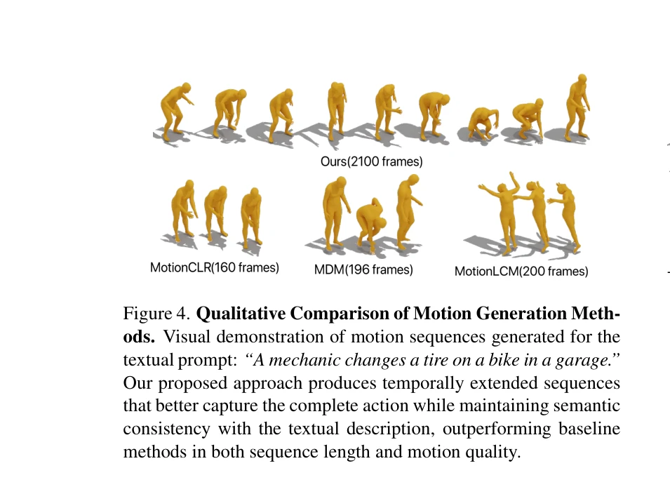
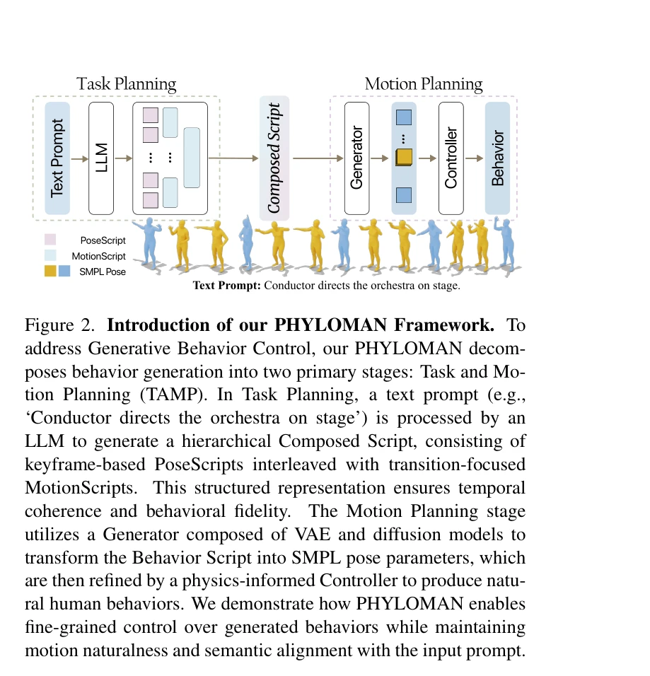

# From Motion to Behavior: Hierarchical Modeling of Humanoid Generative Behavior Control

> **저자**: Jusheng Zhang, Jinzhou Tang, Sidi Liu, Mingyan Li, Sheng Zhang, Jian Wang, Keze Wang | **날짜**: 2025-05-28 | **URL**: [https://arxiv.org/abs/2506.00043](https://arxiv.org/abs/2506.00043)

---

## Essence

*Figure 1. From motion to behavior. (a) Simple periodic motion patterns without complex, behavioral semantic meaning, (b)*

인간의 고수준 의도를 반영하는 계층적 행동 계획과 LLM을 결합하여 장기간의 물리적으로 타당한 인간 행동을 생성하는 통합 프레임워크 PHYLOMAN을 제시하고, 이를 위해 다층 텍스트 주석이 포함된 GBC-100K 대규모 데이터셋을 구축했다.

## Motivation

- **Known**: 기존 인간 동작 생성 방법들은 단기 저수준 동작이나 고수준 행동 계획 중 하나에만 집중하며, 물리 기반 제어 정책과 TAMP 접근법이 있으나 인간 행동의 복잡성과 의도성을 충분히 모델링하지 못하고 있다.
- **Gap**: 현존하는 방법들은 장기간에 걸친 시간적 일관성 유지, 복잡한 행동 수열의 물리적 타당성 보장, 고수준 목표와 저수준 행동 간 의미론적 간격을 동시에 해결하지 못하고 있다.
- **Why**: 인간의 일상적 활동은 계층적 의도와 목표 지향적 특성을 가지고 있으며, 이를 포괄적으로 모델링할 수 있다면 더욱 자연스럽고 다양하며 물리적으로 타당한 장기 행동 생성이 가능해져 로봇공학과 애니메이션 분야에 중요한 기여를 할 수 있다.
- **Approach**: LLM을 활용한 고수준 행동 계획과 로봇공학의 TAMP 프레임워크를 통합하여 계층적 행동 분해를 구현하고, PoseScripts와 MotionScripts를 결합한 병렬 동작 생성 파이프라인과 시뮬레이터 기반 제어 정책으로 물리적 정교함을 보장한다.

## Achievement

*Figure 4. Qualitative Comparison of Motion Generation Meth-*

- **GBC-100K 데이터셋**: 약 100K개의 주석이 달린 비디오-SMPL 쌍으로 구성되며, 다층 계층적 텍스트 설명과 목표 지향적 주석을 포함하여 기존 벤치마크의 한계를 극복
- **PHYLOMAN 프레임워크**: LLM 기반 계획과 물리 기반 제어를 통합하여 기존 방법 대비 10배 길이의 일관된 행동 생성 달성
- **정량적 성능 향상**: GBC-100K와 HumanML3D에서 물리적 일관성과 의미론적 신뢰도 측면에서 기존 최첨단 방법 대비 유의미한 개선 달성

## How

*Figure 2. Introduction of our PHYLOMAN Framework. To*

- LLM을 활용하여 고수준 지시사항을 계층적 행동 계획으로 분해
- PoseScripts와 MotionScripts를 통한 의미론적 정렬 동작 합성
- 병렬 동작 생성 파이프라인으로 다중 의미론적 일치 운동을 동시에 생성
- 시뮬레이터 기반 제어 정책을 적용하여 장시간 물리적 현실성 보장
- 다층 텍스트 주석으로 고수준 의도에서 저수준 동작까지의 매핑 지원

## Originality

- 동작 생성(motion generation)에서 행동 모델링(behavior modeling)으로 패러다임 전환을 주도
- LLM과 TAMP 기반 물리 제어를 처음으로 통합하여 의미론적 이해와 물리적 타당성을 동시에 달성
- 심리학·인지과학 기반 계층적 행동 분해를 계산 모델로 구현
- 목표 지향적 다층 주석을 갖춘 대규모 데이터셋을 최초로 구축

## Limitation & Further Study

- GBC-100K의 데이터 수집 프로세스와 주석 방법론의 상세 설명 부족
- 다양한 환경 조건(실외, 복잡한 배경 등)에서의 일반화 능력에 대한 평가 부재
- 제어 정책 학습에 소요되는 계산 비용과 학습 시간에 대한 분석 미비
- 후속 연구로 멀티에이전트 상호작용, 사회적 행동 모델링, 실시간 적응형 행동 생성 등이 필요

## Evaluation

- Novelty: 4/5
- Technical Soundness: 4/5
- Significance: 4/5
- Clarity: 4/5
- Overall: 4/5

**총평**: 본 논문은 인간 행동 생성에 LLM 기반 계획과 물리적 제어를 혁신적으로 통합하고 대규모 주석 데이터셋을 제공함으로써 장기간 의도 지향적 행동 생성의 새로운 기준을 제시한다. 기술적 우수성, 실무적 가치, 그리고 체계적인 실험 검증으로 인해 컴퓨터 비전 및 로봇공학 커뮤니티에 상당한 영향을 미칠 것으로 예상된다.
