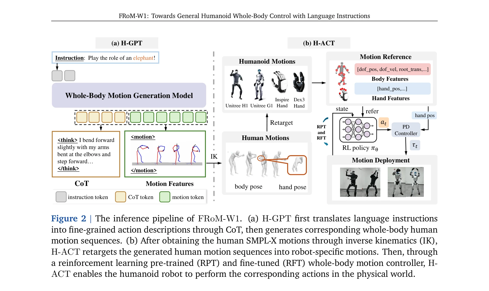
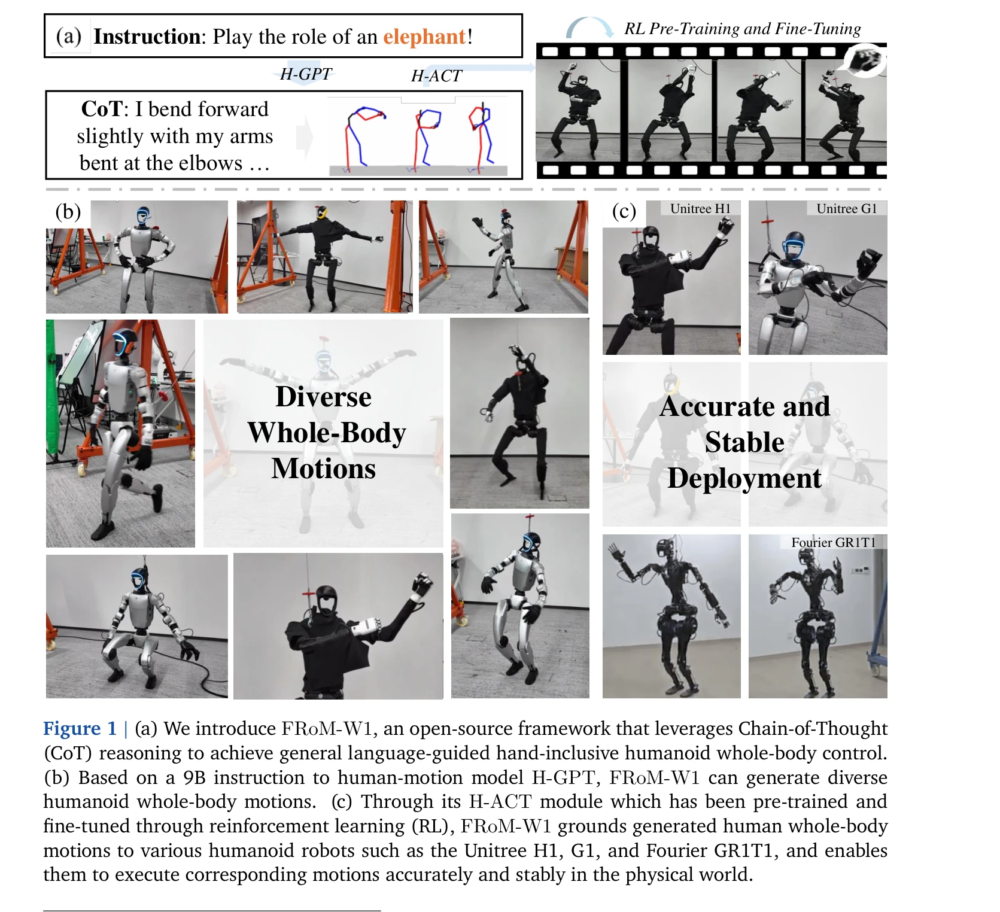

# FRoM-W1: Towards General Humanoid Whole-Body Control with Language Instructions

> **저자**: Peng Li, Zihan Zhuang, Yangfan Gao, Yi Dong, Sixian Li, Changhao Jiang, Shihan Dou, Zhiheng Xi, Enyu Zhou, Jixuan Huang, Hui Li, Jingjing Gong, Xingjun Ma, Tao Gui, Zuxuan Wu, Qi Zhang, Xuanjing Huang, Yu-Gang Jiang, Xipeng Qiu | **날짜**: 2026-01-19 | **DOI**: [10.48550/arXiv.2601.12799](https://doi.org/10.48550/arXiv.2601.12799)

---

## Essence

*Figure 2 | The inference pipeline of FRoM-W1. (a) H-GPT first translates language instructions*

FRoM-W1은 자연어 지시문으로부터 휴머노이드 로봇의 전신 움직임을 제어하는 오픈소스 프레임워크로, H-GPT 모델과 H-ACT 모듈의 2단계 구조로 언어 이해와 안정적인 로봇 실행을 동시에 달성한다.

## Motivation

- **Known**: 휴머노이드 로봇은 인상적인 동작을 수행할 수 있지만 대부분 하드코딩되거나 작업별로 학습되어 다용도성이 제한된다. 대규모 언어 모델과 reinforcement learning은 각각 언어 이해와 운동 제어에서 성공을 보였다.
- **Gap**: 휴머노이드 로봇의 전신 동작 제어를 위한 대규모 쌍을 이루는 데이터셋이 부족하며, 생성된 동작을 실제 물리 환경에서 안정적으로 실행하기 어렵다.
- **Why**: 일반적인 자연어 명령으로 휴머노이드 로봇을 제어하면 인간-로봇 상호작용이 자연스러워지고 로봇의 자율성과 적응성이 크게 향상된다.
- **Approach**: H-GPT는 대규모 인간 동작 데이터와 LLaMA-3.1 기반으로 Chain-of-Thought 기법을 활용하여 언어 지시문을 전신 인간 동작으로 변환하고, H-ACT는 생성된 인간 동작을 로봇별 동작으로 재타겟팅한 후 RL 사전학습과 미세조정을 통해 물리 시뮬레이션과 실제 로봇에 배포한다.

## Achievement

*Figure 1 | (a) We introduce FRoM-W1, an open-source framework that leverages Chain-of-Thought*

- **H-GPT 개발**: 9B 매개변수 모델로 VQ-VAE 기반 토큰화를 이용하여 HumanML3D-X 벤치마크에서 T2M-GPT 대비 2.5배 향상된 FID 성능 달성
- **Chain-of-Thought 통합**: CoT 기법으로 복잡한 자연어 지시문을 명확한 신체 동작 프리미티브로 분해하여 모델 일반화 능력 향상
- **H-ACT 모듈**: 인간-휴머노이드 동작 재타겟팅과 RL 기반 제어기로 안정적 실행 실현, MPJPE에서 15% 정확도 개선
- **다중 로봇 호환성**: Unitree H1, Unitree G1, Fourier GR1T1 등 다양한 형태의 휴머노이드 로봇에서 실증
- **완전 오픈소스**: 모델 코드, 체크포인트, 평가 벤치마크, 배포 모듈 모두 공개하여 커뮤니티 기여

## How

*Figure 2 | The inference pipeline of FRoM-W1. (a) H-GPT first translates language instructions*

- **VQ-VAE 토큰화**: 인간 SMPL-X 전신 동작 시퀀스를 토큰 시퀀스로 변환하여 LLM 학습에 적합한 형태로 준비
- **H-GPT 훈련**: LLaMA-3.1 기반으로 <instruction, CoT, motion> 삼중 데이터로 학습하여 언어-동작 매핑 학습
- **Chain-of-Thought 추론**: 각 지시문을 중간 텍스트 표현(예: '팔을 구부리고 앞으로 구부리며...')으로 분해하여 생성 품질 향상", '**동작 재타겟팅**: 생성된 인간 동작을 Inverse Kinematics(IK)를 통해 각 로봇의 특정 kinematics 구조로 변환
- **RL 사전학습(RPT)**: IsaacGym 물리 시뮬레이션에서 일반적인 전신 동작 제어기를 대규모로 사전학습
- **RL 미세조정(RFT)**: 추론 시점에 타겟 동작에 대해 reinforcement learning으로 제어기를 적응적으로 미세조정하여 추적 정확도와 안정성 향상
- **모듈식 배포**: PD controller와 시뮬레이션-현실 변환 인터페이스를 통해 실제 로봇에 경량 배포 구현

## Originality

- **두 단계 파이프라인**: 인간 뇌(언어 이해)와 소뇌(운동 제어) 역할 분리 개념으로부터 영감받아 H-GPT와 H-ACT 설계
- **부족한 로봇 데이터 극복**: 풍부한 인간 동작 데이터를 활용하여 대규모 로봇 데이터셋 부재 문제 해결
- **CoT 기반 동작 생성**: 추상적 언어 명령을 명시적 시간 구조를 가진 신체 프리미티브로 분해하는 Chain-of-Thought 적용으로 복잡한 지시문 처리
- **추론 시 RL 미세조정**: 배포 단계에서 RL 미세조정을 실행하여 동적 불확실성과 중력 효과에 적응적으로 대응
- **통합 오픈소스 프레임워크**: 언어 모델, 동작 생성, 로봇 제어, 배포까지 모든 단계를 단일 통합 프레임워크로 제공

## Limitation & Further Study

- **H-GPT 평가 제한**: HumanML3D-X와 δHumanML3D-X 벤치마크는 구성된 새로운 벤치마크이므로 기존 표준 벤치마크와의 직접 비교 부족
- **재타겟팅 오류 누적**: H-GPT에서 생성된 동작의 오류가 재타겟팅 단계를 거치면서 누적될 가능성
- **제한된 로봇 형태**: 주로 두 발 휴머노이드에 중점을 두었으며 다양한 형태의 로봇(사족보행 등)에 대한 확장성 미검증
- **실제 배포 시 안정성**: 물리 시뮬레이션과 실제 환경 간 sim-to-real 갭으로 인한 실패 사례 가능성
- **후속 연구 방향**: (1) 더 큰 규모의 multimodal 인간 동작 데이터 수집, (2) 3D 비전 센서와 통합하여 실시간 피드백 기반 동작 수정, (3) 다중 로봇 군집 제어로 확장, (4) 손가락 단위 정밀 제어 개선

## Evaluation

- Novelty: 4/5
- Technical Soundness: 3/5
- Significance: 4/5
- Clarity: 4/5
- Overall: 4/5

**총평**: FRoM-W1은 자연어 기반 휴머노이드 전신 제어라는 중요한 문제를 Chain-of-Thought와 2단계 RL 전략으로 창의적으로 해결하며, 완전 오픈소스 제공과 실제 로봇 실증을 통해 높은 실용성과 재현성을 보여준다.
