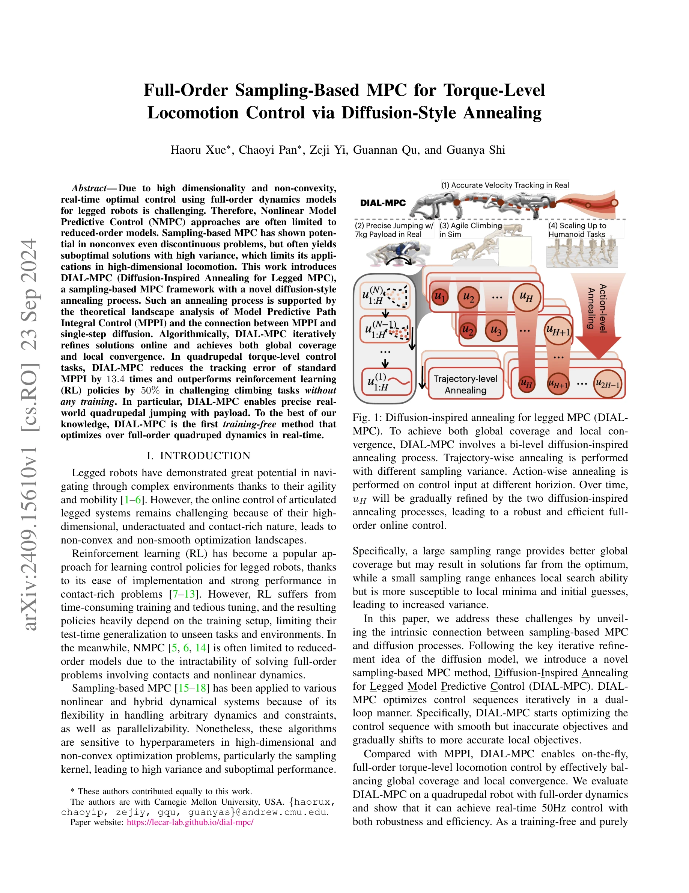
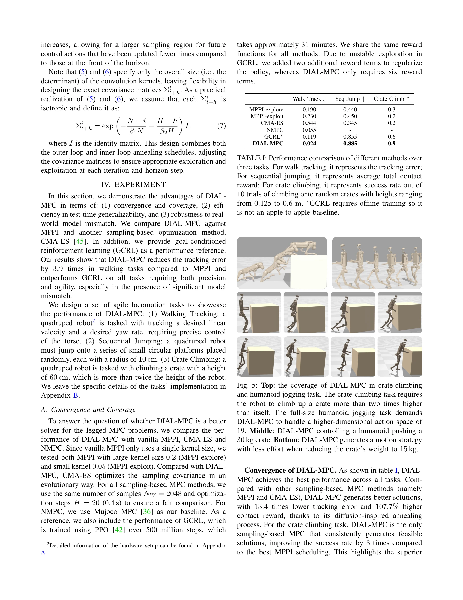
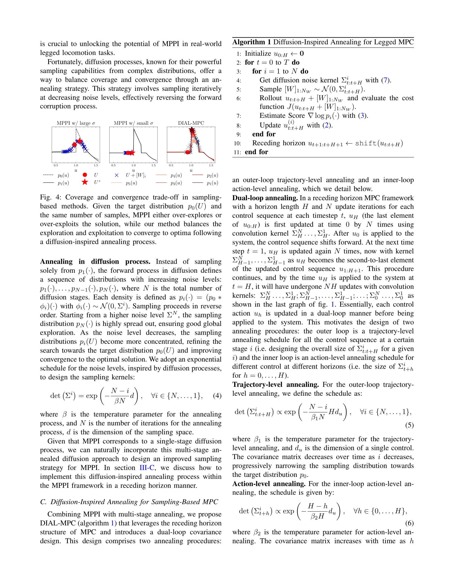

# Full-Order Sampling-Based MPC for Torque-Level Locomotion Control via Diffusion-Style Annealing

> **저자**: Haoru Xue, Chaoyi Pan, Zeji Yi, Guannan Qu, Guanya Shi | **날짜**: 2024-09-23 | **URL**: [https://arxiv.org/abs/2409.15610](https://arxiv.org/abs/2409.15610)

---

## Essence

*Fig. 1: Diffusion-inspired annealing for legged MPC (DIAL-*

DIAL-MPC는 diffusion 프로세스의 iterative refinement 아이디어를 sampling-based MPC에 적용하여 full-order 사족 로봇의 torque-level 제어를 실시간으로 수행하는 training-free 방법이다.

## Motivation

- **Known**: Sampling-based MPC는 MPPI 등으로 비선형 비볼록 최적화 문제를 다룰 수 있으나 고차원 문제에서 높은 분산과 부차적 해를 야기한다. NMPC는 보통 reduced-order 모델에 제한되어 full-order 동역학 최적화가 어렵다.
- **Gap**: 기존 sampling-based MPC는 global coverage와 local convergence 사이의 trade-off를 효과적으로 해결하지 못하며, full-order 사족 로봇 dynamics를 실시간으로 최적화하는 training-free 방법이 부재하다.
- **Why**: 사족 로봇의 민첩한 운동 제어(jumping, climbing 등)는 고차원 비선형 접촉 동역학을 요구하는데, RL은 일반화 부족이, NMPC는 모델 단순화의 한계가 있어 둘의 장점을 결합한 방법이 필요하다.
- **Approach**: MPPI를 single-stage diffusion으로 재해석하고, diffusion의 annealing 개념을 bi-level (trajectory-wise, action-wise) 방식으로 적용하여 sampling variance를 동적으로 조정함으로써 global-local 균형을 달성한다.

## Achievement

*Fig. 5: Top: the coverage of DIAL-MPC in crate-climbing*

- **Theoretical Foundation**: MPPI를 single-stage diffusion으로 수학적으로 동치 증명 (Proposition 1) 및 landscape analysis를 통해 annealing의 이론적 근거 제시
- **Full-Order Real-Time Control**: 사족 로봇의 full-order 동역학을 기반으로 50Hz 실시간 제어 달성으로 reduced-order 제약 극복
- **성능 향상**: MPPI 대비 tracking error 13.4배 감소, RL 정책 대비 climbing task에서 50% 성능 향상
- **실세계 검증**: payload를 포함한 정밀한 jumping 실험으로 실제 로봇 환경에서의 효과 입증

## How

*Fig. 4: Coverage and convergence trade-off in sampling-*

- MPPI 업데이트를 score function ∇log p₁(U)의 gradient ascent로 재해석 (식 2)
- Target distribution p₀(U) ∝ exp(-J(U)/λ)를 Gaussian noise kernel과의 convolution으로 diffused distribution p₁ 생성
- Trajectory-wise annealing: 여러 iteration에 걸쳐 sampling variance를 점진적으로 감소
- Action-wise annealing: horizon의 각 time step에서 다른 sampling variance 적용으로 local refinement 강화
- Bi-level 이중 루프 구조로 global coverage 후 local convergence 순차 달성
- Parallel simulation (Isaac Gym 등)을 활용하여 다수의 sample trajectory 동시 평가

## Originality

- MPPI와 diffusion process의 수학적 등가성 증명으로 새로운 이론적 관점 제시
- Diffusion의 annealing 개념을 MPC에 처음 적용한 novel framework
- Bi-level diffusion-inspired annealing (trajectory-wise + action-wise)으로 sampling-based 방법의 오래된 global-local trade-off 문제를 창의적으로 해결
- Training-free 조건 하에서 full-order legged robot control을 실시간으로 수행하는 첫 사례

## Limitation & Further Study

- 실험이 quadruped에 국한되어 있어 다른 형태의 사족 로봇이나 biped 등으로의 일반화 검증 부족
- Hyperparameter tuning (sampling variance schedule, annealing 속도 등)에 대한 체계적 가이드 및 민감도 분석 미제시
- 복잡한 terrain이나 높은 접촉 상호작용이 많은 환경에서의 성능 평가 제한
- Computational cost 분석 및 다른 sampling-based 방법과의 상세 runtime 비교 부재
- 후속 연구: biped, hexapod 등 다양한 형태 적용; contact 변수를 포함한 더 높은 차원 문제 확장; online learning으로 task-specific adaptation 추가

## Evaluation

- Novelty: 4/5
- Technical Soundness: 3/5
- Significance: 4/5
- Clarity: 4/5
- Overall: 4/5

**총평**: 본 논문은 MPPI와 diffusion의 수학적 연결을 통해 sampling-based MPC의 근본적 한계를 새로운 각도로 접근하며, diffusion-inspired annealing이라는 창의적 방법으로 full-order 사족 로봇의 실시간 제어를 training-free로 달성한 의미있는 기여이다.
