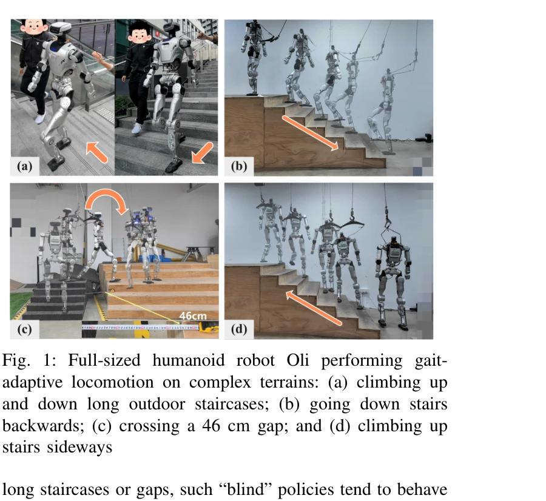

# Gait-Adaptive Perceptive Humanoid Locomotion with Real-Time Under-Base Terrain Reconstruction

> **저자**: Haolin Song, Hongbo Zhu, Tao Yu, Yan Liu, Mingqi Yuan, Wengang Zhou, Hua Chen, Houqiang Li | **날짜**: 2025-12-08 | **URL**: [https://arxiv.org/abs/2512.07464](https://arxiv.org/abs/2512.07464)

---

## Essence

*Fig. 2: Overview of the proposed Successive Teacher–Student (S-TS) framework and deployment pipeline. A teacher–student*

인간형 로봇의 복잡한 지형 보행을 위해 하향식 깊이 카메라로 촬영한 영상을 U-Net으로 높이맵으로 재구성하고, 이를 통합 정책에 입력하여 관절 제어와 보행 주기를 동시에 적응시키는 지각 기반 보행 프레임워크를 제시한다.

## Motivation

- **Known**: 강화학습 기반 인간형 로봇 보행 제어가 평탄하거나 완만한 지형에서는 성과를 보이고 있으며, 전방 깊이 카메라와 LiDAR 기반 고도맵 방법들이 지형 인식 보행에 사용되어 왔다.
- **Gap**: 기존 전방향 카메라 방식은 로봇이 감속하거나 방향을 바꿀 때 발 아래 지형을 놓치고, LiDAR 방식은 추가 매핑 파이프라인의 복잡성과 지연을 야기하며, 보행 주기를 외부에서 지정하는 방식은 지형 인식과 보행 타이밍의 긴밀한 결합을 방해한다.
- **Why**: 계단 오르내림이나 넓은 갭 횡단 같은 복잡한 지형에서 한 발의 실수나 타이밍 오류만으로도 균형 상실로 이어질 수 있으므로, 실시간 지형 감지와 보행 적응이 통합된 제어가 필수적이다.
- **Approach**: 하향식 깊이 카메라 기반 단일 프레임 U-Net 높이맵 재구성과 지각·자체감각 정보를 입력으로 하는 통합 정책이 관절 명령과 보행 주기 신호를 동시에 생성하며, Successive Teacher–Student 학습으로 효율적으로 정책을 학습한다.

## Achievement

*Fig. 1: Full-sized humanoid robot Oli performing gait-*

- **실시간 높이맵 재구성**: 하향식 깊이 카메라로부터 50Hz에서 작동하는 compact U-Net을 통해 자아중심적 높이맵을 실시간으로 구성
- **통합 적응형 정책**: 지형 정보와 자체감각 정보를 처리하여 관절 목표값과 보행 주기 신호를 동시에 출력하며, 명령 동작과 국소 지형에 따라 보행 리듬 자동 조정
- **효율적 지식 전이**: 단일 단계 Successive Teacher–Student 프레임워크로 특권적 관찰에서 부분 관찰로의 안정적이고 데이터 효율적인 지식 이전 실현
- **실제 로봇 검증**: 31-DoF, 1.65m 인간형 로봇으로 계단 오르내림(전진/후진), 46cm 갭 횡단 등 다양한 복잡 지형에서 견고한 전방향 보행 시연

## How

*Fig. 2: Overview of the proposed Successive Teacher–Student (S-TS) framework and deployment pipeline. A teacher–student*

- 하향식 깊이 카메라를 로봇 베이스 아래에 장착하여 발 주변 지지 영역 촬영
- U-Net 기반 경량 신경망으로 각 깊이 프레임을 조밀한 자아중심적 높이맵으로 변환하여 신체 및 다리 자체폐색 문제 해결
- 지각 높이맵과 자체감각 관찰을 통합 정책 네트워크에 입력하여 관절 명령과 스칼라 보행 주기 신호를 동시 출력
- Successive Teacher–Student 학습에서 특권적 정보로 학습한 teacher 정책이 noisy 부분 관찰의 student 인코더를 감독하고, switch gate로 점진적 환경 상호작용 전이
- 제어 루프와 동일한 50Hz 주파수에서 높이맵 재구성과 정책 실행으로 지형 변화에 빠른 반응

## Originality

- 기존의 전방향 카메라 중심 접근에서 벗어나 하향식 깊이 카메라로 발 아래 핵심 영역에 집중하고, 단일 프레임 U-Net 재구성으로 다중 센서 융합 및 명시적 시간 맵핑 회피
- 보행 주기를 외부 신호로 취급하지 않고 관절 제어와 동일 정책에서 동시 학습하는 end-to-end 설계로, 지형 인식과 보행 적응의 긴밀한 결합 실현
- 단일 단계 Successive Teacher–Student 프레임워크로 특권적 관찰에서 부분 관찰로의 전이를 기존 다단계 방식보다 효율적으로 수행

## Limitation & Further Study

- 하향식 카메라는 로봇 앞의 먼 거리 지형을 감지할 수 없어 급격한 장애물이나 예기치 않은 지형 변화에 대응 어려움 가능
- 31-DoF 특정 로봇 구조에 대해 학습되었으므로 다른 형태의 인간형 로봇으로의 일반화 검증 필요
- 실제 계단/갭 환경에 대한 테스트 데이터가 제한적이므로 더 다양한 실제 지형 환경에서의 강건성 검증 필요
- U-Net의 깊이 이미지 노이즈, 반사 등에 대한 민감도 분석 및 개선 여지 존재
- 후속 연구에서는 전방향 카메라와의 결합, 더 복잡한 자연 지형 대응, 다양한 인간형 로봇 플랫폼으로의 전이 학습 추진 권장

## Evaluation

- Novelty: 4/5
- Technical Soundness: 3/5
- Significance: 4/5
- Clarity: 4/5
- Overall: 4/5

**총평**: 인간형 로봇의 복잡 지형 보행이라는 중요한 문제를 하향식 깊이 카메라와 U-Net 기반 높이맵 재구성, 통합 적응형 정책의 조합으로 창의롭게 해결하였으며, 실제 로봇에서 계단 오르내림과 갭 횡단을 성공적으로 시연하여 높은 실용적 가치를 보인다.

## Related Papers

- 🔄 다른 접근: [[papers/1941_Gallant_Voxel_Grid-based_Humanoid_Locomotion_and_Local-navig/review]] — 둘 다 지각 기반 휴머노이드 보행을 다루지만 Gait-Adaptive는 하향식 깊이 카메라를, Gallant는 LiDAR 기반 voxel grid를 사용한다.
- 🏛 기반 연구: [[papers/1914_End-to-End_Humanoid_Robot_Safe_and_Comfortable_Locomotion_Po/review]] — Gait-Adaptive의 통합 정책 기반 보행 적응이 End-to-End 안전 보행 정책의 실시간 제어 구현에 기반 기술을 제공한다.
- 🔗 후속 연구: [[papers/2134_Perceptive_Humanoid_Parkour_Chaining_Dynamic_Human_Skills_vi/review]] — Gait-Adaptive의 지각 기반 보행을 dynamic human skills chaining과 결합하면 더 복잡한 parkour 동작이 가능하다.
- 🔄 다른 접근: [[papers/1619_PolygMap_A_Perceptive_Locomotion_Framework_for_Humanoid_Robo/review]] — 실시간 하향식 깊이 기반 높이맵 재구성과 PolygMap의 다각형 지각 프레임워크는 서로 다른 지형 인식 방법입니다.
- 🏛 기반 연구: [[papers/1780_A_Hybrid_Autoencoder_for_Robust_Heightmap_Generation_from_Fu/review]] — 퓨전 기반 견고한 높이맵 생성의 하이브리드 오토인코더 기술이 실시간 지형 인식의 핵심 기반입니다.
- 🔗 후속 연구: [[papers/1978_Hiking_in_the_Wild_A_Scalable_Perceptive_Parkour_Framework_f/review]] — 복잡한 지형에서의 perceptive parkour 연구를 하향식 카메라와 통합 정책을 통한 보다 세밀한 gait adaptation으로 발전시켰습니다.
- 🔄 다른 접근: [[papers/2010_HumanoidPano_Hybrid_Spherical_Panoramic-LiDAR_Cross-Modal_Pe/review]] — 둘 다 LiDAR와 카메라 융합을 통한 humanoid 인식을 다루지만, Gait-Adaptive는 깊이 기반 높이맵에, HumanoidPano는 panoramic cross-modal 접근법에 집중합니다.
- 🔄 다른 접근: [[papers/1658_RPL_Learning_Robust_Humanoid_Perceptive_Locomotion_on_Challe/review]] — depth camera와 LiDAR라는 서로 다른 센서를 사용한 지형 인식 기반 locomotion 접근법입니다.
- 🏛 기반 연구: [[papers/1693_STATE-NAV_Stability-Aware_Traversability_Estimation_for_Bipe/review]] — 지형 인식 기반 휴머노이드 보행의 개념을 안정성 예측과 traversability 정의로 확장하여 거친 지형에서의 안전한 이동을 실현했다.
- 🔗 후속 연구: [[papers/1713_Thinking_in_360_Humanoid_Visual_Search_in_the_Wild/review]] — 실시간 지형 인식을 통한 보행 제어에 360도 환경 인식 기능을 통합할 수 있습니다.
- 🏛 기반 연구: [[papers/1613_PhysHSI_Towards_a_Real-World_Generalizable_and_Natural_Human/review]] — Gait-Adaptive Perceptive Humanoid의 실시간 지각 기반 locomotion 기술이 PhysHSI의 실시간 환경 인식 모듈의 기초가 됨
- 🧪 응용 사례: [[papers/1633_Real-Time_Polygonal_Semantic_Mapping_for_Humanoid_Robot_Stai/review]] — 실시간 다각형 맵핑 기술이 Gait-Adaptive Perceptive Locomotion의 실시간 지형 인식에 직접 적용될 수 있다
- 🔄 다른 접근: [[papers/1746_VB-Com_Learning_Vision-Blind_Composite_Humanoid_Locomotion_A/review]] — 지형 인식 휴머노이드 보행을 위해 서로 다른 접근(시각 결손 대응 vs 실시간 지형 감지)을 통해 도전적인 환경에서의 안정적 이동을 달성한다.
- 🧪 응용 사례: [[papers/1780_A_Hybrid_Autoencoder_for_Robust_Heightmap_Generation_from_Fu/review]] — 실시간 지형 높이맵 생성 기술을 실제 인지적 휴머노이드 보행에 적용한 구체적 사례이다.
- 🔄 다른 접근: [[papers/1881_Distillation-PPO_A_Novel_Two-Stage_Reinforcement_Learning_Fr/review]] — 지각 기반 휴머노이드 보행을 distillation-PPO와 gait-adaptive perceptive learning이라는 서로 다른 학습 전략으로 구현한다
- 🔄 다른 접근: [[papers/1884_DPL_Depth-only_Perceptive_Humanoid_Locomotion_via_Realistic/review]] — 실시간 지형 추정을 통한 다른 지각적 인간형 보행 방식을 제시합니다.
- 🔄 다른 접근: [[papers/1941_Gallant_Voxel_Grid-based_Humanoid_Locomotion_and_Local-navig/review]] — 둘 다 3D 지형 인식을 다루지만 Gallant는 LiDAR voxel grid를, Gait-Adaptive는 깊이 카메라 높이맵을 사용한다.
- 🔗 후속 연구: [[papers/1978_Hiking_in_the_Wild_A_Scalable_Perceptive_Parkour_Framework_f/review]] — Gait-Adaptive의 지각적 보행을 복잡한 비정형 지형에서의 고속 이동으로 확장한 발전된 형태다.
- 🔗 후속 연구: [[papers/2056_Learning_Humanoid_Locomotion_over_Challenging_Terrain/review]] — PIM의 elevation map 기반 지각을 실시간 보행 적응과 결합하여 더 동적이고 반응적인 지형 내비게이션을 구현할 수 있다.
- 🔗 후속 연구: [[papers/2060_Learning_Perceptive_Humanoid_Locomotion_over_Challenging_Ter/review]] — 실시간 지형 인식과 적응적 보행을 결합한 확장된 접근법을 제시한다.
- 🏛 기반 연구: [[papers/2160_Traversing_Narrow_Paths_A_Two-Stage_Reinforcement_Learning_F/review]] — 보행 적응형 지각적 이동의 실시간 계획 기법이 좁은 경로에서의 발판 계획 및 추적 방법론의 기반이 됩니다.
