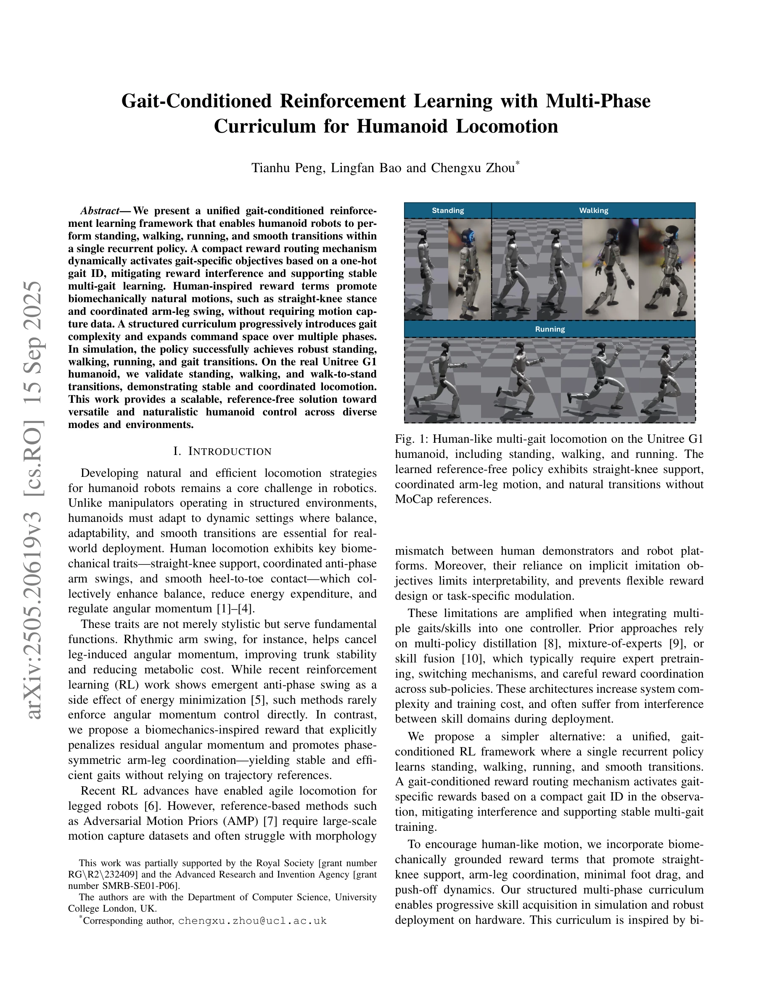

# Gait-Conditioned Reinforcement Learning with Multi-Phase Curriculum for Humanoid Locomotion

> **저자**: Tianhu Peng, Lingfan Bao, Chengxu Zhou | **날짜**: 2025-05-27 | **URL**: [https://arxiv.org/abs/2505.20619](https://arxiv.org/abs/2505.20619)

---

## Essence

*Fig. 1: Human-like multi-gait locomotion on the Unitree G1*

인간에게서 영감을 얻은 보상 형성과 gait-conditioned reward routing을 통해 단일 recurrent policy에서 서서기, 걷기, 달리기 및 전환을 학습하는 통합 reference-free RL 프레임워크를 제시한다.

## Motivation

- **Known**: Reference-기반 방법(AMP 등)은 MoCap 데이터에 의존하고 형태 불일치 문제가 있으며, 다중 기술 학습을 위해 정책 증류나 혼합 전문가 같은 복잡한 구조가 필요하다.
- **Gap**: MoCap 없이 자연스러운 다중 gait 전환을 지원하면서도 보상 간섭을 완화하고 단일 통합 정책으로 구현하는 방법이 부족하다.
- **Why**: 인간형 로봇의 실제 배포를 위해 안정적이고 효율적인 다중 움직임 모드가 필수적이며, 참조 데이터 없이 자연스러운 움직임을 생성할 수 있는 확장 가능한 솔루션이 필요하다.
- **Approach**: Gait ID 기반 동적 보상 라우팅 메커니즘과 직선 무릎 자세, arm-leg swing 조율 등 생물역학 기반 보상 항을 통합하고, 다단계 구조화된 커리큘럼으로 점진적으로 기술 복잡도를 확대한다.

## Achievement

*Fig. 1: Human-like multi-gait locomotion on the Unitree G1*

- **Reference-free multi-gait learning**: MoCap 데이터 없이 서서기, 걷기, 달리기, 전환을 단일 recurrent 정책으로 학습
- **Gait-conditioned reward routing**: One-hot gait ID 기반 동적 보상 활성화로 보상 간섭 완화 및 안정적 다중 gait 학습 지원
- **Biomechanically natural motion**: 각속도량 제약, 직선 무릎 자세, 조율된 arm-leg swing 등을 통해 인간처럼 자연스러운 움직임 생성
- **Real robot validation**: Unitree G1 인간형 로봇에서 서서기, 걷기, walk-to-stand 전환 실증

## How

- Gait-conditioned reward routing 메커니즘: gait ID를 통해 현재 모드에 해당하는 보상 목표만 활성화
- Biomechanical reward shaping: 각속도량 페널티, 직선 무릎 자세 장려, arm-leg anti-phase coordination, 발 드래그 최소화, push-off 동역학 등 포함
- Multi-phase curriculum: 초기 서서기 → 걷기 → 달리기 → 전환으로 단계적 복잡도 증가 및 명령 공간 확대
- Recurrent policy architecture: LSTM 기반으로 시간적 동역학 캡처하고 gait 전환 시 smooth 동작 가능
- One-hot gait ID encoding: 관찰에 포함된 compact 가이트 식별자로 정책 조건화

## Originality

- 단순하면서도 효과적인 gait-conditioned reward routing으로 다중 gait를 하나의 통합 정책으로 학습하는 방식
- MoCap 참조 없이 생물역학 원리에서 직접 도출한 보상 항으로 자연스러운 움직임 생성
- Multi-policy 증류나 혼합 전문가 같은 복잡한 모듈식 구조 대신 단일 recurrent 정책으로 다중 기술 통합
- 생물학적 운동 발달에서 영감을 받은 구조화된 다단계 커리큘럼

## Limitation & Further Study

- 시뮬레이션에서 다양한 gait 전환 실현이 실제 로봇에서는 제한적(walk-to-stand 등만 검증)
- 외부 충격이나 극단적 환경에 대한 견고성 평가 부족
- 보상 가중치 튜닝이 여전히 필요하며 완전 자동화된 설계 방법 미제시
- 후속 연구: 더 많은 gait 모드(계단 오르내리기, 점프 등) 확장, 시뮬-투-리얼 간극 감소, 동적 환경 적응성 강화

## Evaluation

- Novelty: 4/5
- Technical Soundness: 3/5
- Significance: 4/5
- Clarity: 4/5
- Overall: 4/5

**총평**: 이 논문은 gait-conditioned reward routing과 생물역학 기반 보상 설계를 통해 MoCap 없이 자연스러운 다중 gait 학습을 가능하게 하는 우아한 프레임워크를 제시하며, 실제 인간형 로봇에서의 검증으로 실용성을 입증한다.

## Related Papers

- 🔄 다른 접근: [[papers/1777_A_Gait_Driven_Reinforcement_Learning_Framework_for_Humanoid/review]] — 두 논문 모두 강화학습 기반 보행 프레임워크이지만 gait-conditioned vs behavior-driven 접근법이 다르다.
- 🏛 기반 연구: [[papers/2065_Learning_Symmetric_and_Low-energy_Locomotion/review]] — 대칭적이고 저에너지 보행 학습이 다중 phase 커리큘럼의 기본 원리를 제공한다.
- 🔄 다른 접근: [[papers/1637_Reinforcement_Learning_for_Versatile_Dynamic_and_Robust_Bipe/review]] — 둘 다 다양한 gait pattern 학습을 다루지만, Gait-Conditioned는 단일 recurrent policy에서의 통합 접근법을, Versatile Bipedal은 별도 제어 전략을 사용합니다.
- 🏛 기반 연구: [[papers/1695_StyleLoco_Generative_Adversarial_Distillation_for_Natural_Hu/review]] — StyleLoco의 자연스러운 humanoid locomotion 연구가 Gait-Conditioned의 서기-걷기-달리기 전환에서 필요한 스타일 일관성의 기초를 제공합니다.
- 🔗 후속 연구: [[papers/1955_GMT_General_Motion_Tracking_for_Humanoid_Whole-Body_Control/review]] — GMT의 일반적인 motion tracking을 gait conditioning과 multi-phase curriculum을 통해 더 세밀한 보행 제어로 특화시켰습니다.
- 🔄 다른 접근: [[papers/1635_Reduced-Order_Model-Guided_Reinforcement_Learning_for_Demons/review]] — ROM-GRL은 reduced-order model 기반 2단계 학습을, Gait-Conditioned RL은 다중 위상 커리큘럼을 통해 보행 학습을 다르게 접근함
- 🔄 다른 접근: [[papers/1777_A_Gait_Driven_Reinforcement_Learning_Framework_for_Humanoid/review]] — 둘 다 gait 기반 강화학습을 다루지만 하나는 실시간 planner에, 다른 하나는 multi-phase curriculum에 초점을 둔다.
- 🏛 기반 연구: [[papers/1955_GMT_General_Motion_Tracking_for_Humanoid_Whole-Body_Control/review]] — Gait-Conditioned의 multi-phase curriculum과 통합 정책 개념이 GMT의 Motion Mixture-of-Experts 아키텍처 설계의 기반이 됩니다.
- 🔗 후속 연구: [[papers/2003_Humanoid_Whole-Body_Badminton_via_Multi-Stage_Reinforcement/review]] — Gait-Conditioned의 다단계 커리큘럼을 배드민턴 특화 전신 제어로 확장한 발전된 형태다.
- 🧪 응용 사례: [[papers/2065_Learning_Symmetric_and_Low-energy_Locomotion/review]] — 대칭적이고 저에너지 보행 학습의 원리가 gait-conditioned 멀티 phase 커리큘럼에 적용될 수 있다.
- 🔄 다른 접근: [[papers/2094_Mechanical_Intelligence-Aware_Curriculum_Reinforcement_Learn/review]] — 다중 단계 커리큘럼을 통한 보행 조건부 강화학습과 기계적 지능 인식 커리큘럼이라는 다른 접근법을 제시한다.
- 🔄 다른 접근: [[papers/2153_Towards_Adaptive_Humanoid_Control_via_Multi-Behavior_Distill/review]] — Gait-conditioned RL with multi-phase curriculum가 다중행동 증류와 다른 curriculum 접근법으로 다양한 이족보행 행동 학습을 달성합니다.
