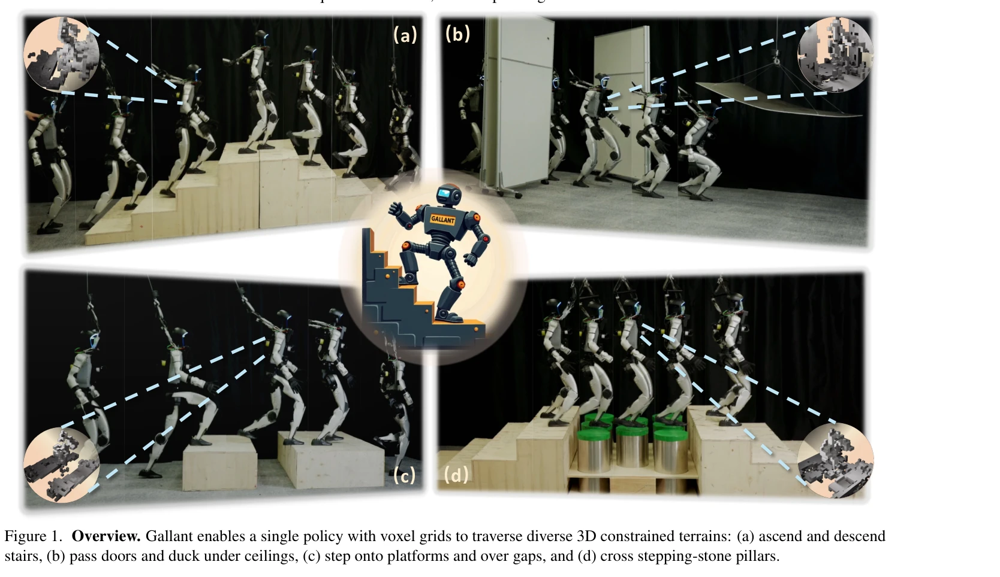
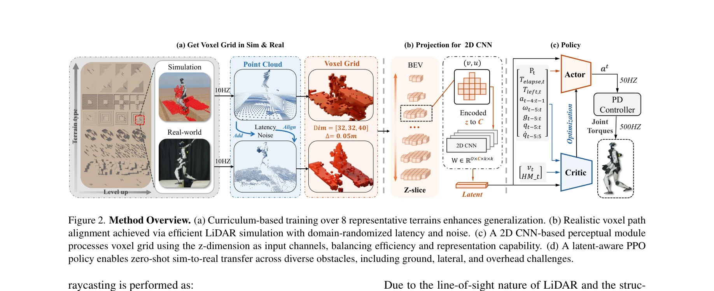

# Gallant: Voxel Grid-based Humanoid Locomotion and Local-navigation across 3D Constrained Terrains

> **저자**: Qingwei Ben, Botian Xu, Kailin Li, Feiyu Jia, Wentao Zhang, Jingping Wang, Jingbo Wang, Dahua Lin, Jiangmiao Pang | **날짜**: 2025-11-18 | **URL**: [https://arxiv.org/abs/2511.14625](https://arxiv.org/abs/2511.14625)

---

## Essence

*Figure 1. Overview. Gallant enables a single policy with voxel grids to traverse diverse 3D constrained terrains: (a) as*

Gallant는 Voxel Grid 기반의 LiDAR 인식과 z-grouped 2D CNN을 활용하여 인간형 로봇이 계단, 천장, 측면 장애물 등 3D 제약 지형을 단일 정책으로 횡단할 수 있게 하는 프레임워크이다.

## Motivation

- **Known**: 기존 인간형 로봇 이동 방법은 elevation map이나 depth image 기반 인식을 사용하여 지면 장애물에만 대응 가능하며, LiDAR 기반 point cloud 방법은 실시간 추론이 불가능하다.
- **Gap**: 기존 방법들은 3D 구조(오버행, 저천장, 다층 구조)를 포착하지 못하고, LiDAR 기반 접근도 계산 효율성과 학습 확장성 문제가 있다.
- **Why**: 인간형 로봇의 현실 배포는 다양한 3D 제약 환경에서 안전하고 견고한 운동이 필요하며, 이를 위해 효율적이면서도 3D 구조를 완전히 포착하는 인식 시스템이 필수적이다.
- **Approach**: Voxel Grid 표현을 사용하여 LiDAR 데이터를 구조화하고, z-grouped 2D CNN으로 이를 효율적으로 처리하며, 고충실도 LiDAR 시뮬레이션과 8개 지형 패밀리 커리큘럼으로 sim-to-real 일관성을 보장한다.

## Achievement

*Figure 1. Overview. Gallant enables a single policy with voxel grids to traverse diverse 3D constrained terrains: (a) as*

- **단일 정책으로 다양한 3D 제약 지형 대응**: 계단 오르내림, 측면 잡동사니, 천장 제약, 다층 구조, 좁은 통로 등을 하나의 정책으로 처리
- **높은 성공률**: 계단 등반 및 높은 플랫폼 딛기에서 거의 100%의 성공률 달성
- **효율적인 인식 처리**: z-grouped 2D CNN이 3D CNN 대비 우수한 성능과 낮은 추론 지연시간 제공
- **고충실도 시뮬레이션**: 동적 LiDAR 시뮬레이션으로 로봇 움직임을 포함한 현실적 관측 생성

## How

*Figure 2. Method Overview. (a) Curriculum-based training over 8 representative terrains enhances generalization. (b) Rea*

- Voxel Grid 표현: 로봇 중심의 3D LiDAR point cloud를 voxel로 변환하여 다층 구조 보존
- z-grouped 2D CNN: 높이 슬라이스를 채널로 취급하여 sparse voxel grid를 효율적으로 처리
- 고충실도 LiDAR 시뮬레이션: 센서 노이즈, 지연, 동적 객체 스캔을 모델링하여 현실적 훈련 데이터 생성
- 커리큘럼 학습: 8개의 대표적 지형 패밀리(지면 장애물, 측면 잡동사니, 천장 제약)를 단계적으로 학습
- End-to-end 최적화: Voxel Grid, 고유 감각, 목표 위치를 통합하여 PPO로 단일 정책 학습
- 위치 기반 공식화: 속도 추적 대신 상대 목표 위치를 입력으로 하여 국소 네비게이션과 이동을 통합

## Originality

- 인간형 로봇 이동 분야에서 **Voxel Grid를 직접 인식 표현으로 처음 도입**하여 기존 elevation map의 3D 정보 손실 문제 해결
- **z-grouped 2D CNN 아키텍처**: sparse voxel grid에 최적화된 효율적 처리 방식으로 3D CNN의 계산 비용을 개선
- **동적 LiDAR 시뮬레이션**: 로봇의 움직이는 링크를 포함한 현실적 스캔으로 sim-to-real 갭 축소
- **위치 기반 end-to-end 공식화**: 국소 네비게이션과 로콩을 단일 정책으로 통합

## Limitation & Further Study

- **계산 복잡도**: Voxel Grid 생성 및 CNN 처리의 실시간성 분석 부족
- **지형 다양성**: 8개 지형 패밀리가 모든 현실 환경을 대표하는지 검증 필요
- **로봇 일반화**: 특정 인간형 로봇(구체적 모델 명시 필요)에 대해서만 검증됨
- **시뮬레이션 정확도**: 실제 LiDAR 센서의 복잡한 특성(multipath, 재질별 반사)의 모델링 완성도 미흡 가능
- **후속연구**: (1) 다양한 로봇 플랫폼으로의 전이 학습 (2) 실시간 계산량 최적화 (3) 야외 환경의 날씨 영향 포함 (4) 더욱 복잡한 3D 지형 테스트

## Evaluation

- Novelty: 4/5
- Technical Soundness: 3/5
- Significance: 4/5
- Clarity: 4/5
- Overall: 4/5

**총평**: Gallant는 Voxel Grid와 효율적 CNN을 결합하여 인간형 로봇의 3D 지형 인식 문제를 체계적으로 해결하고, 고충실도 시뮬레이션과 end-to-end 최적화로 sim-to-real 일관성을 달성한 임팩트 있는 연구이다. 다만 실시간 성능과 지형 일반화의 추가 검증이 필요하다.

## Related Papers

- 🔄 다른 접근: [[papers/1939_Gait-Adaptive_Perceptive_Humanoid_Locomotion_with_Real-Time/review]] — 둘 다 3D 지형 인식을 다루지만 Gallant는 LiDAR voxel grid를, Gait-Adaptive는 깊이 카메라 높이맵을 사용한다.
- 🔗 후속 연구: [[papers/1914_End-to-End_Humanoid_Robot_Safe_and_Comfortable_Locomotion_Po/review]] — Gallant의 3D 제약 지형 횡단 능력을 End-to-End 안전 정책과 결합하면 복잡한 환경에서도 안전한 네비게이션이 가능하다.
- 🧪 응용 사례: [[papers/2080_Let_Humanoids_Hike_Integrative_Skill_Development_on_Complex/review]] — Gallant의 voxel grid 기반 지형 인식을 복잡한 하이킹 환경에 적용하여 더 robust한 통합 스킬 개발이 가능하다.
- 🔗 후속 연구: [[papers/1633_Real-Time_Polygonal_Semantic_Mapping_for_Humanoid_Robot_Stai/review]] — Real-Time Polygonal Semantic Mapping의 기초 연구를 voxel grid와 z-grouped CNN을 활용한 더 효과적인 3D 제약 지형 횡단 시스템으로 발전시켰습니다.
- 🔄 다른 접근: [[papers/1932_FocusNav_Spatial_Selective_Attention_with_Waypoint_Guidance/review]] — 둘 다 공간 인식 기반 humanoid navigation을 다루지만, Gallant는 voxel grid 기반 전체 3D 환경 이해에, FocusNav는 waypoint 안내 selective attention에 집중합니다.
- 🔄 다른 접근: [[papers/1633_Real-Time_Polygonal_Semantic_Mapping_for_Humanoid_Robot_Stai/review]] — Gallant의 복셀 그리드 기반 국소 내비게이션이 PyRoki의 다각형 의미 맵핑과는 다른 공간 표현 방식으로 계단 등반 문제에 접근한다.
- 🧪 응용 사례: [[papers/1856_CReF_Cross-modal_and_Recurrent_Fusion_for_Depth-conditioned/review]] — CReF의 depth-conditioned locomotion 기술이 Gallant의 voxel-based 지형 표현과 결합되어 더 강건한 지형 인식 시스템을 구축할 수 있다.
- 🔄 다른 접근: [[papers/1932_FocusNav_Spatial_Selective_Attention_with_Waypoint_Guidance/review]] — 둘 다 복잡한 3D 환경에서의 humanoid navigation을 다루지만, FocusNav는 selective attention을, Gallant는 voxel grid 기반 인식을 사용합니다.
- 🔄 다른 접근: [[papers/1939_Gait-Adaptive_Perceptive_Humanoid_Locomotion_with_Real-Time/review]] — 둘 다 지각 기반 휴머노이드 보행을 다루지만 Gait-Adaptive는 하향식 깊이 카메라를, Gallant는 LiDAR 기반 voxel grid를 사용한다.
- 🔄 다른 접근: [[papers/1914_End-to-End_Humanoid_Robot_Safe_and_Comfortable_Locomotion_Po/review]] — 둘 다 LiDAR 기반 휴머노이드 보행을 다루지만 End-to-End 정책은 안전성을, Gallant는 3D 제약 지형 횡단을 중심으로 한다.
- 🏛 기반 연구: [[papers/1998_Humanoid_Occupancy_Enabling_A_Generalized_Multimodal_Occupan/review]] — Gallant의 voxel grid-based locomotion이 Humanoid Occupancy의 occupancy perception system 구축을 위한 기초 방법론을 제공한다.
- 🔗 후속 연구: [[papers/2042_Learning_a_Vision-Based_Footstep_Planner_for_Hierarchical_Wa/review]] — Learning Vision-Based의 시각 기반 발걸음 계획이 Gallant의 복셀 그리드 기반 로코모션과 결합되어 더 정밀한 지형 인식 탐색 가능
- 🏛 기반 연구: [[papers/2122_One_Policy_but_Many_Worlds_A_Scalable_Unified_Policy_for_Ver/review]] — Gallant의 voxel grid-based locomotion이 DreamPolicy의 terrain-aware planning에서 3D 환경 표현과 navigation의 기술적 토대를 제공합니다.
