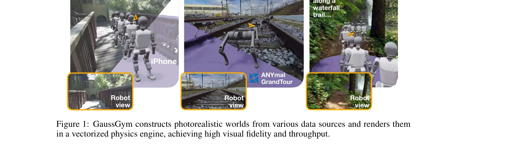

# GaussGym: An open-source real-to-sim framework for learning locomotion from pixels

> **저자**: Alejandro Escontrela, Justin Kerr, Arthur Allshire, Jonas Frey, Rocky Duan, Carmelo Sferrazza, Pieter Abbeel | **날짜**: 2025-10-17 | **URL**: [https://arxiv.org/abs/2510.15352](https://arxiv.org/abs/2510.15352)

---

## Essence

*Figure 1: GaussGym constructs photorealistic worlds from various data sources and renders them*

3D Gaussian Splatting을 IsaacGym 같은 벡터화된 물리 시뮬레이터에 통합하여 초당 100,000스텝 이상의 고속 시뮬레이션과 높은 시각적 충실도를 동시에 달성하는 포토리얼리스틱 로봇 시뮬레이션 프레임워크를 제시한다.

## Motivation

- **Known**: 기존 시뮬레이터들은 높은 물리 정확도를 제공하지만 RGB 기반 학습을 위한 충분한 시각적 충실도나 처리속도를 제공하지 못하며, 대부분의 실제 배포 정책은 깊이 맵이나 LiDAR 같은 기하학적 입력에 의존한다.
- **Gap**: 높은 처리량과 높은 시각적 충실도를 동시에 제공하면서도 다양한 데이터 소스를 쉽게 통합할 수 있는 포토리얼리스틱 시뮬레이션 프레임워크가 부족하며, RGB 픽셀로부터 직접 학습하는 시각-시뮬-현실 간의 갭이 명확하지 않다.
- **Why**: 로봇이 실제 환경에서 횡단보도, 물웅덩이 같은 의미론적 시각 정보를 활용할 수 있어야 하며, 이를 위해서는 고속의 포토리얼리스틱 학습 환경이 필수적이다.
- **Approach**: 3D Gaussian Splatting을 렌더러로 사용하여 IsaacGym 내에 통합하고, iPhone 스캔, 대규모 장면 데이터셋(GrandTour, ARKit), 생성 비디오 모델(Veo) 출력 등 다양한 소스의 데이터를 처리하여 현실적인 학습 환경을 구축한다.

## Achievement

*Figure 3: Velocity-tracking policies trained directly from pixels in GaussGym: Photorealistic envi-*

- **고속 시뮬레이션**: RTX 4090 GPU에서 640×480 해상도로 4,096개 병렬 환경에 대해 초당 100,000스텝 이상의 처리 속도 달성
- **포토리얼리스틱 환경**: 2,500개의 장면을 포함하고 다양한 데이터 소스 지원으로 사실적인 훈련 세계 생성
- **의미론적 학습**: RGB 정책이 깊이 전용 정책이 감지하지 못하는 원하지 않는 영역을 회피하도록 학습하여 의미론적 추론 능력 증명
- **시뮬-현실 전이**: 계단 오르기 작업에서 GaussGym에서 훈련한 시각적 이동 정책의 초기 제로샷 전이 성공
- **오픈소스 공개**: 전체 코드와 데이터 공개로 커뮤니티 접근성 확대

## How

*Figure 2: Data collection overview: GaussGym ingests data from various data sources and processes*

- 3D Gaussian Splatting을 벡터화된 물리 엔진에 드롭인 렌더러로 통합
- VGGT를 사용하여 다양한 데이터 소스에서 외부 파라미터(extrinsics), 내부 파라미터(intrinsics), 법선이 있는 포인트 클라우드 추출
- 추출된 포인트 클라우드에서 충돌 메시를 추정하고 3DGS 훈련에 사용
- RGB 입력으로부터 정책을 학습할 때 기하학적 재구성을 보조 손실 함수로 추가하여 학습 속도 및 성능 개선
- iPhone 스캔, SLAM 캡처, 기존 3D 데이터셋, 핸드헬드 비디오, 생성 비디오 모델 출력 등 다양한 입력 형식 지원

## Originality

- 3D Gaussian Splatting을 GPU 가속 물리 시뮬레이터에 처음으로 통합하여 고속성과 시각적 충실도의 트레이드오프 해결
- Veo 같은 생성 비디오 모델의 출력을 로봇 시뮬레이션 환경으로 직접 변환하는 파이프라인 제시
- 기하학적 재구성 보조 손실을 통해 RGB 기반 정책 학습의 어려움을 해결하는 실용적인 방법 제안
- 포토리얼리스틱 렌더링과 높은 처리량을 동시에 달성하는 구조적 혁신

## Limitation & Further Study

- RGB로부터 직접 학습이 여전히 도전적이며, 기하학적 보조 손실이 필수적인 점은 순수 RGB 정책 학습의 한계를 시사
- 시뮬-현실 전이는 계단 오르기 한 가지 작업에서만 시연되어 일반화 가능성에 대한 추가 검증 필요
- 3D Gaussian Splatting의 동적 객체나 변형 가능한 환경에 대한 확장성이 명확하지 않음
- 후속연구: 더 복잡한 현실 환경에서의 시뮬-현실 전이 검증, 동적 장면 지원 추가, 엔드-투-엔드 RGB 정책 학습 개선

## Evaluation

- Novelty: 4/5
- Technical Soundness: 4/5
- Significance: 4/5
- Clarity: 4/5
- Overall: 4/5

**총평**: 본 논문은 3D Gaussian Splatting을 물리 시뮬레이터와 통합하여 고속성과 시각적 충실도를 동시에 달성한 획기적인 작업으로, 포토리얼리스틱 로봇 학습에 새로운 가능성을 열었다. 오픈소스 공개와 광범위한 데이터 지원으로 향후 연구의 기반이 될 것으로 기대된다.

## Related Papers

- 🔄 다른 접근: [[papers/1846_ComFree-Sim_A_GPU-Parallelized_Analytical_Contact_Physics_En/review]] — 둘 다 고성능 로봇 시뮬레이션을 제공하지만 GaussGym은 3D Gaussian Splatting을, ComFree-Sim은 GPU 병렬 물리 엔진을 사용한다.
- 🧪 응용 사례: [[papers/2061_Learning_Sim-to-Real_Humanoid_Locomotion_in_15_Minutes/review]] — GaussGym의 고속 포토리얼리스틱 시뮬레이션이 15분 휴머노이드 학습의 시각적 충실도를 향상시킬 수 있다.
- 🔗 후속 연구: [[papers/1907_EmbodMocap_In-the-Wild_4D_Human-Scene_Reconstruction_for_Emb/review]] — GaussGym의 포토리얼리스틱 시뮬레이션에 EmbodMocap의 실제 환경 3D 재구성 데이터를 통합하면 더 현실적인 훈련 환경을 구축할 수 있다.
- 🏛 기반 연구: [[papers/2107_MOSAIC_Bridging_the_Sim-to-Real_Gap_in_Generalist_Humanoid_M/review]] — GaussGym의 고속 포토리얼리스틱 시뮬레이션이 MOSAIC의 sim-to-real 격차 해소를 위한 고품질 훈련 환경을 제공한다.
- 🔄 다른 접근: [[papers/1951_Genie_Sim_30__A_High-Fidelity_Comprehensive_Simulation_Platf/review]] — 둘 다 고충실도 시뮬레이션을 제공하지만 GaussGym은 Gaussian Splatting을, Genie Sim은 comprehensive simulation을 중심으로 한다.
- 🏛 기반 연구: [[papers/1673_Sim-and-Real_Co-Training_A_Simple_Recipe_for_Vision-Based_Ro/review]] — 실제-시뮬레이션 프레임워크의 기본적인 개념과 방법론을 제공한다.
- 🏛 기반 연구: [[papers/1620_PolySim_Bridging_the_Sim-to-Real_Gap_for_Humanoid_Control_vi/review]] — GaussGym의 real-to-sim 프레임워크가 PolySim의 다중 시뮬레이터 활용과 sim-to-real 전이의 이론적 기초를 제공함
- 🧪 응용 사례: [[papers/1846_ComFree-Sim_A_GPU-Parallelized_Analytical_Contact_Physics_En/review]] — ComFree-Sim의 고성능 접촉 시뮬레이션 엔진이 GaussGym과 같은 실시간 학습 환경에서 실질적으로 활용될 수 있다.
- 🧪 응용 사례: [[papers/1794_AGILE_A_Comprehensive_Workflow_for_Humanoid_Loco-Manipulatio/review]] — real-to-sim 프레임워크를 통해 실세계 데이터를 활용한 학습 파이프라인의 구체적 적용 사례이다.
- 🏛 기반 연구: [[papers/1877_DiffCoTune_Differentiable_Co-Tuning_for_Cross-domain_Robot_C/review]] — 실제-시뮬레이션 학습 프레임워크의 기본 구조를 제공합니다.
- 🔄 다른 접근: [[papers/1951_Genie_Sim_30__A_High-Fidelity_Comprehensive_Simulation_Platf/review]] — 고충실도 시뮬레이션 플랫폼과 실제-시뮬레이션 프레임워크는 모두 휴머노이드 학습 환경을 제공하지만 초점이 다르다.
- 🔗 후속 연구: [[papers/1907_EmbodMocap_In-the-Wild_4D_Human-Scene_Reconstruction_for_Emb/review]] — EmbodMocap의 실외 환경 3D 재구성 데이터를 GaussGym의 포토리얼리스틱 시뮬레이션에 통합하면 더 현실적인 훈련 환경을 제공할 수 있다.
- 🏛 기반 연구: [[papers/2006_Humanoid-Gym_Reinforcement_Learning_for_Humanoid_Robot_with/review]] — GaussGym의 real-to-sim 프레임워크가 Humanoid-Gym의 zero-shot sim-to-real 전이의 이론적 토대가 된다.
- 🧪 응용 사례: [[papers/2031_Iterative_Closed-Loop_Motion_Synthesis_for_Scaling_the_Capab/review]] — 실제-시뮬레이션 변환 프레임워크에서 CLAIMS가 생성한 다양한 난이도의 데이터를 활용하여 더 강건한 정책 학습이 가능하다.
- 🏛 기반 연구: [[papers/2056_Learning_Humanoid_Locomotion_over_Challenging_Terrain/review]] — 실제-시뮬레이션 학습 프레임워크가 PIM의 지각 기반 제어 정책을 현실 환경에 적용하기 위한 기본적인 변환 메커니즘을 제공한다.
- 🔗 후속 연구: [[papers/2077_Learning_with_pyCub_A_Simulation_and_Exercise_Framework_for/review]] — 교육용 시뮬레이션이 실제-시뮬레이션 프레임워크를 통한 실용적 학습으로 확장된다.
- 🔗 후속 연구: [[papers/2084_LiPS_Large-Scale_Humanoid_Robot_Reinforcement_Learning_with/review]] — 실제-시뮬레이션 프레임워크를 GPU 병렬 환경으로 확장하여 더 효율적인 휴머노이드 학습을 실현한다.
- 🏛 기반 연구: [[papers/2101_Mobi-π_Mobilizing_Your_Robot_Learning_Policy/review]] — GaussGym의 real-to-sim framework가 Mobi-π의 제한된 관점 문제 해결을 위한 3D representation 기법에 영감을 제공했다
- 🔄 다른 접근: [[papers/2104_MolmoSpaces_A_Large-Scale_Open_Ecosystem_for_Robot_Navigatio/review]] — MolmoSpaces는 대규모 시뮬레이션 환경, GaussGym은 real-to-sim 프레임워크로 서로 다른 방향의 로봇 학습 환경 구축을 제공한다.
- 🏛 기반 연구: [[papers/2162_TTT-Parkour_Rapid_Test-Time_Training_for_Perceptive_Robot_Pa/review]] — 실제에서 시뮬레이션으로의 메시 재구성 기술이 GaussGym의 open-source real-to-sim 프레임워크에 적용된다.
- 🏛 기반 연구: [[papers/2151_Toward_Reliable_Sim-to-Real_Predictability_for_MoE-based_Rob/review]] — GaussGym의 real-to-sim 프레임워크가 RoboGauge의 sim-to-real 예측 가능성 평가를 위한 기반 시뮬레이션 환경을 제공합니다.
