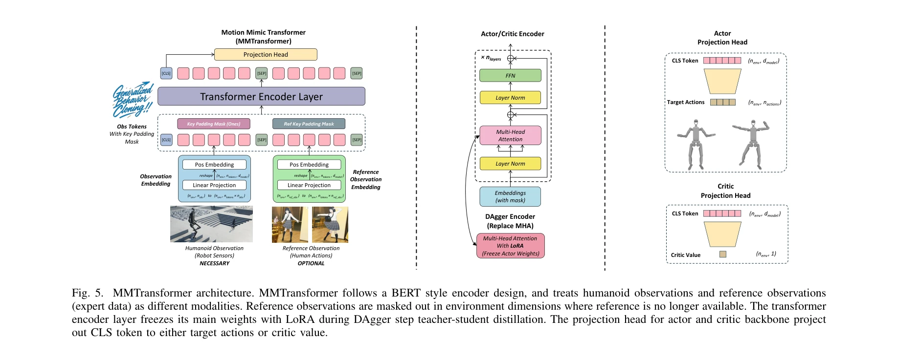

# GBC: Generalized Behavior-Cloning Framework for Whole-Body Humanoid Imitation

> **저자**: Yifei Yao, Chengyuan Luo, Jiaheng Du, Wentao He, Jun-Guo Lu | **날짜**: 2025-08-13 | **DOI**: [10.48550/arXiv.2508.09960](https://doi.org/10.48550/arXiv.2508.09960)

---

## Essence

*Fig. 1. GBC data processing pipeline. MoCap data (angle-axis representation)*

GBC는 이질적인 휴머노이드 로봇들을 위한 통합 행동 모방 프레임워크로, differentiable IK 기반 데이터 파이프라인, DAgger-MMPPO 알고리즘, MMTransformer 아키텍처를 결합하여 인간 모션캡처 데이터를 다양한 로봇에 자동으로 재타겟팅하고 학습한다.

## Motivation

- **Known**: 기존 연구들은 IK 기반 또는 최적화 기반 모션 재타겟팅 방식을 제시했으나, 특정 로봇 구성에 의존적이거나 실시간 처리에 제약이 있었다. Behavior Cloning과 RL을 결합한 접근도 있으나 단일 로봇 구성에만 초점을 맞추고 있었다.
- **Gap**: 이질적 형태의 다양한 휴머노이드 로봇들에 대해 보편적으로 작동하는 통합 데이터 처리 및 학습 파이프라인이 부재했으며, MoCap 데이터를 효율적으로 변환하면서도 로봇 간 전이 가능성을 갖춘 시스템이 없었다.
- **Why**: 휴머노이드 로봇의 고차원 행동공간, 복잡한 역학, 다양한 자유도는 기존 제어 방법의 병목을 야기하며, 인간 수준의 자연스러운 행동 학습을 위해서는 데이터 기반의 범용 프레임워크가 필수적이다.
- **Approach**: MoCap 데이터를 처리하기 위한 differentiable IK 네트워크를 설계하고, 이를 바탕으로 RL과 IL을 결합한 DAgger-MMPPO 알고리즘과 MMTransformer 아키텍처를 제안하여, 여러 로봇 구성에서 통일된 워크플로우를 실현한다.

## Achievement

*Fig. 1. GBC data processing pipeline. MoCap data (angle-axis representation)*

- **실시간 differentiable IK 기반 데이터 파이프라인**: MoCap 데이터를 다양한 로봇 구성에 자동으로 적응시켜 물리적으로 가능한 시연 데이터셋으로 변환
- **DAgger-MMPPO 알고리즘**: 두 단계 RL을 통해 효율적 행동 모방을 달성하며, AMP 같은 다른 IL 방법들과 통합 가능
- **MMTransformer 아키텍처**: 로봇의 자기중심적 관찰과 참조 모션 상태를 서로 다른 모달리티로 취급하여 그 관계를 모델링
- **Isaac Lab 기반 오픈소스 플랫폼**: GPU 가속 스케줄링, 커리큘럼 학습, 물리 기반 보조, 증강 랜덤화 전략을 통합한 효율적 학습 환경 제공
- **다중 로봇 검증**: Unitree G1, Unitree H1-2, Fourier GR1, Turin 등 다양한 로봇 구성에서 일반화 및 전이 능력 입증

## How

*Fig. 5. MMTransformer architecture. MMTransformer follows a BERT style encoder design, and treats humanoid observations *

- Differentiable IK 네트워크를 통해 인간 골격 구조를 로봇 구성에 매핑하고, 최적화 기반 후처리로 연속성과 물리적 가능성 보장
- MMTransformer 아키텍처에서 로봇 관찰 및 참조 모션을 다중 모달리티로 인코딩하여 상태 공간 사이의 맵핑 능력 강화
- DAgger-MMPPO 알고리즘으로 두 단계 강화학습을 수행: 먼저 시연 데이터에서 초기 정책 학습 후, 온라인 상호작용으로 정책 개선
- Isaac Lab 기반 확장으로 다양한 로봇 모델에 대해 간단한 설정 파일만으로 전체 워크플로우 실행 가능
- 커리큘럼 학습, 물리 기반 보조, 랜덤화 전략으로 모방 학습 성능 최적화

## Originality

- **통합 프레임워크의 독창성**: 데이터 처리부터 알고리즘 학습까지 이질적 로봇들에 대해 일원화된 솔루션을 처음으로 제시
- **Differentiable IK 네트워크**: 학습 기반 IK를 통해 기존 최적화 기반 방식의 실시간성 및 일반화 한계를 극복
- **MMTransformer 설계**: BERT 스타일 인코더로 로봇 관찰과 참조 모션을 다중 모달리티로 처리하는 새로운 아키텍처
- **DAgger-MMPPO 알고리즘**: DAgger의 온라인 개선과 PPO의 안정성을 결합하며, IL 방법들(예: AMP)과의 통합 가능성 제시
- **오픈소스 플랫폼 제공**: Isaac Lab 기반으로 구성 파일 작성만으로 실행 가능한 실용적 배포 환경 제공

## Limitation & Further Study

- **평가의 제한성**: 대부분의 검증이 시뮬레이션 내에서 수행되었으며, 실제 로봇 하드웨어에서의 배포 성능 및 안정성에 대한 검증 부족
- **MoCap 의존성**: AMASS 포맷 준수 필요성으로 인한 MoCap 데이터 수집 및 전처리의 초기 비용 존재
- **다양한 로봇 형태에 대한 일반화**: 현재 네 가지 휴머노이드 로봇에서만 검증되었으므로, 매우 이질적인 형태(예: 다리 개수 또는 센서 구성이 크게 다른 로봇)에 대한 적응성 미검증
- **동적 환경 및 교란 처리**: 정적 또는 약한 교란 환경에서의 성능 검증이 주이며, 동적 환경에서의 강건성 평가 필요
- **후속 연구 방향**: (1) 실제 로봇 플랫폼에서의 배포 및 long-horizon 작업 검증, (2) 더 다양한 휴머노이드 형태에 대한 확장성 연구, (3) 온라인 학습 시 실시간 안전 제약 조건 통합, (4) 다중 모달리티 센서(시각, 촉각 등)와의 통합

## Evaluation

- Novelty: 4/5
- Technical Soundness: 4/5
- Significance: 4/5
- Clarity: 4/5
- Overall: 4/5

**총평**: 본 논문은 이질적 휴머노이드 로봇들의 행동 모방을 위한 첫 번째 통합 프레임워크를 제시하며, differentiable IK, MMTransformer, DAgger-MMPPO 알고리즘을 결합하여 데이터 처리부터 정책 학습까지 일원화된 솔루션을 제공한다. 오픈소스 플랫폼 제공과 다중 로봇 검증을 통해 실용성과 확장성을 입증했으나, 실제 로봇 배포 성능 및 동적 환경에서의 강건성에 대한 검증이 후속과제이다.

## Related Papers

- 🔄 다른 접근: [[papers/1906_Embodiment-Aware_Generalist_Specialist_Distillation_for_Unif/review]] — 둘 다 다양한 휴머노이드 embodiment 간 일반화를 다루지만 GBC는 행동 모방에, Embodiment-Aware는 specialist distillation에 초점을 맞춘다.
- 🔗 후속 연구: [[papers/1962_H-Zero_Cross-Humanoid_Locomotion_Pretraining_Enables_Few-sho/review]] — H-Zero의 cross-humanoid 사전학습이 GBC의 통합 행동 모방 프레임워크를 강화할 수 있다.
- 🏛 기반 연구: [[papers/1678_SkillBlender_Towards_Versatile_Humanoid_Whole-Body_Loco-Mani/review]] — 일반적인 행동 클로닝 프레임워크를 통한 전신 휴머노이드 제어의 기초를 제공한다.
- 🔄 다른 접근: [[papers/1712_The_Role_of_Domain_Randomization_in_Training_Diffusion_Polic/review]] — 전신 휴머노이드 제어를 위해 서로 다른 접근(Diffusion Policies vs Generalized Behavior-Cloning)을 통해 데이터 요구사항과 성능을 비교 분석한다.
- 🔄 다른 접근: [[papers/1906_Embodiment-Aware_Generalist_Specialist_Distillation_for_Unif/review]] — GBC의 generalized behavior-cloning이 EAGLE과 다른 접근으로 multiple humanoid control의 일반화 문제를 해결한다.
- 🏛 기반 연구: [[papers/1962_H-Zero_Cross-Humanoid_Locomotion_Pretraining_Enables_Few-sho/review]] — GBC의 cross-humanoid 행동 모방이 H-Zero의 locomotion pretraining에 이론적 기반을 제공한다.
- 🏛 기반 연구: [[papers/2026_InterMimic_Towards_Universal_Whole-Body_Control_for_Physics-/review]] — 행동 복제 기반의 전신 휴머노이드 제어에 대한 일반화된 프레임워크 제공
- 🔄 다른 접근: [[papers/2027_InterPrior_Scaling_Generative_Control_for_Physics-Based_Huma/review]] — 둘 다 생성형 전신 제어이지만 InterPrior는 모방학습-강화학습 결합, GBC는 행동 복제 프레임워크 기반
- 🔗 후속 연구: [[papers/2061_Learning_Sim-to-Real_Humanoid_Locomotion_in_15_Minutes/review]] — 행동 복제와 강화학습을 결합하여 빠른 휴머노이드 제어 정책 학습을 확장한다.
- 🏛 기반 연구: [[papers/2082_LHM-Humanoid_Learning_a_Unified_Policy_for_Long-Horizon_Huma/review]] — GBC의 generalized behavior-cloning이 LHM-Humanoid의 통합 정책 학습에 방법론적 기반을 제공했다
