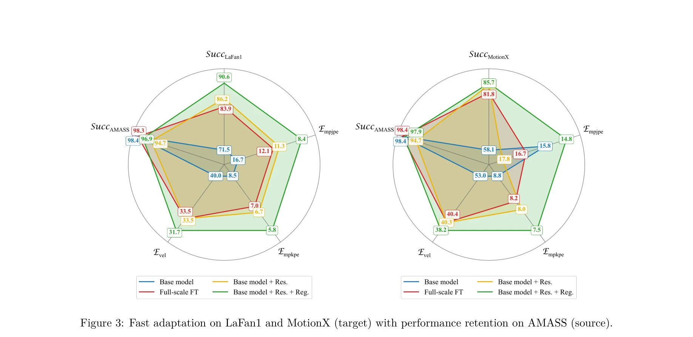

# General Humanoid Whole-Body Control via Pretraining and Fast Adaptation

> **저자**: Zepeng Wang, Jiangxing Wang, Shiqing Yao, Yu Zhang, Ziluo Ding, Ming Yang, Yuxuan Wang, Haobin Jiang, Chao Ma, Xiaochuan Shi, Zongqing Lu | **날짜**: 2026-02-12 | **DOI**: [10.48550/arXiv.2602.11929](https://doi.org/10.48550/arXiv.2602.11929)

---

## Essence

*Figure 2: An overview of FAST. Our framework consists of three stages. (1) We construct a curated*

FAST는 대규모 사전학습과 경량 잔여 정책 적응을 결합하여 인간형 로봇의 일반적인 전신 제어를 가능하게 하는 프레임워크이다. Center-of-Mass-Aware Control과 Parseval-Guided Residual Policy Adaptation을 통해 분포 외 동작에 대한 빠른 적응과 안정적인 균형을 동시에 달성한다.

## Motivation

- **Known**: 기존 학습 기반 전신 제어 방법들은 작은 모션 데이터셋으로 학습되어 고품질의 제어된 환경에서는 잘 작동하나, 실제 세계의 다양한 소스(비디오 추정, 텍스트 생성, 저품질 모션)로부터 나온 분포 외 동작에 대해서는 견고성이 떨어진다.
- **Gap**: 기존 방법들은 (1) 단순 확장 기반 학습은 계산 제약과 추론 지연으로 인해 배포 불가능하고, (2) 빠른 적응 시 사전학습 능력의 손상(catastrophic forgetting)이 발생하며, (3) 고동적 동작에서의 균형 유지가 어렵다.
- **Why**: 인간형 로봇이 실제 환경에서 다양한 작업을 수행하기 위해서는 단일 제어기가 이질적인 모션 소스에 대응하면서도 저지연과 높은 주파수 제어를 유지해야 하기 때문이다.
- **Approach**: FAST는 (1) Center-of-Mass 관찰과 목적함수를 포함한 일반 정책을 대규모로 사전학습하고, (2) Parseval-Guided Residual Policy Adaptation으로 직교성과 KL 제약 하에서 경량 델타 정책을 학습하여 빠른 적응을 가능하게 한다.

## Achievement

*Figure 3: Fast adaptation on LaFan1 and MotionX (target) with performance retention on AMASS (source).*

- **Zero-shot 견고성**: 사전학습된 정책이 고동적 동작과 분포 외 모션을 포함한 다양한 시나리오에서 강력한 추적 성능을 보임
- **빠른 적응 효율성**: Parseval 정규화와 KL 제약을 통해 경량 잔여 정책으로 새로운 모션 분포에 신속하게 특화되면서 사전학습 능력 보존
- **물리적 안정성**: Center-of-Mass-Aware 제어가 저품질 모션 추적 시에도 균형 유지와 안정성 향상
- **실제 배포 검증**: 시뮬레이션과 실제 로봇 실험에서 기존 최고 성능 방법들(SONIC, KungfuBot2)을 일관되게 초과 달성

## How

*Figure 2: An overview of FAST. Our framework consists of three stages. (1) We construct a curated*

- AMASS, OMOMO, LaFan1, Motion-X 등의 공개 데이터셋을 SMPL 형식으로 인간-인간형 로봇 재지정(retargeting)하여 대규모 큐레이션된 모션 데이터셋 구성
- Mixture-of-Experts 아키텍처를 사용하여 다양한 모션 분포에 대응하는 일반 정책 학습
- Center-of-Mass-Pressure 거리를 모니터링하는 CoM-Aware 제어 목적함수 도입: r(a,s) = rtrack(a,s) + rstability
- Parseval 정규화(직교성 유도)와 KL 발산 제약을 결합하여 잔여 정책 학습: Ltotal = LRL + λp·LParseval + λk·LKL
- 적응 시 기본 정책 πb에 잔여 정책 πr의 출력을 더하는 구조: at = abt + art로 경량성과 안정성 균형 유지

## Originality

- Center-of-Mass-Aware Control을 명시적으로 통합한 점: 기존 추적 기반 접근과 달리 균형 관련 관찰과 목적함수를 정책 설계에 직접 포함
- Parseval 정규화와 KL 제약의 조합: 직교성을 강제하여 잔여 정책의 표현 공간을 제한하면서도 KL 제약으로 기본 정책과의 거리 유지로 catastrophic forgetting 완화
- 다양한 모션 소스(오프라인 모캡, 실시간 텔레오퍼레이션, 텍스트-모션, 비디오 추정)를 단일 프레임워크에서 통합 처리하는 일반성
- 저지연 요구사항을 만족하면서도 빠른 적응을 가능하게 하는 실용적 설계: 큰 모델 확장 대신 경량 잔여 학습 강조

## Limitation & Further Study

- 모션 데이터셋의 규모와 품질이 사전학습 성능에 미치는 영향에 대한 상세한 절제(ablation) 분석 부족
- Parseval 정규화의 강도(λp)와 KL 제약(λk)의 가중치 선택에 대한 민감도 분석 또는 자동 조정 방법 미제시
- 실제 로봇 실험이 제한적이며, 다양한 신체 구조를 가진 다른 인간형 로봇에 대한 일반화 검증 부재
- 후속 연구: (1) 적응 파라미터의 자동 최적화 메커니즘 개발, (2) 추가 실제 로봇 플랫폼에서의 검증, (3) 온라인 적응 중 안정성 보장에 대한 이론적 분석

## Evaluation

- Novelty: 4/5
- Technical Soundness: 4/5
- Significance: 4/5
- Clarity: 4/5
- Overall: 4/5

**총평**: FAST는 실용적인 제약 조건 하에서 인간형 로봇의 일반적이고 견고한 전신 제어를 달성하는 잘 설계된 프레임워크이며, Center-of-Mass-Aware 제어와 Parseval-Guided 잔여 적응의 조합은 분포 외 동작 적응에서 새로운 접근 방식을 제시한다.
