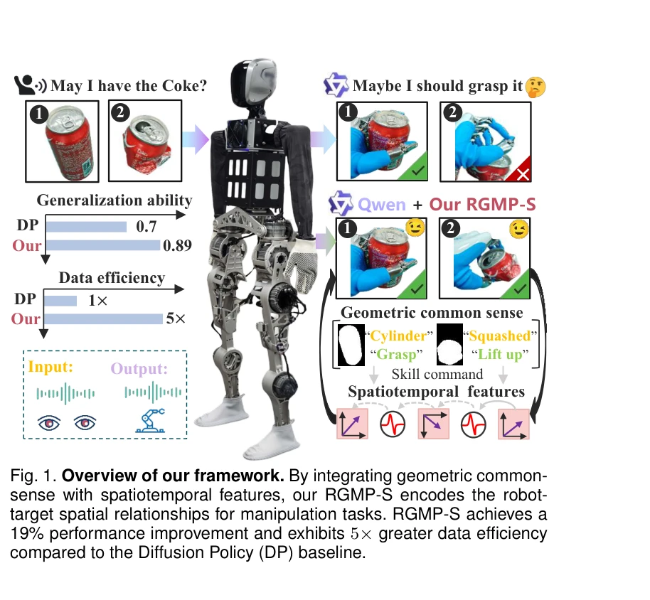
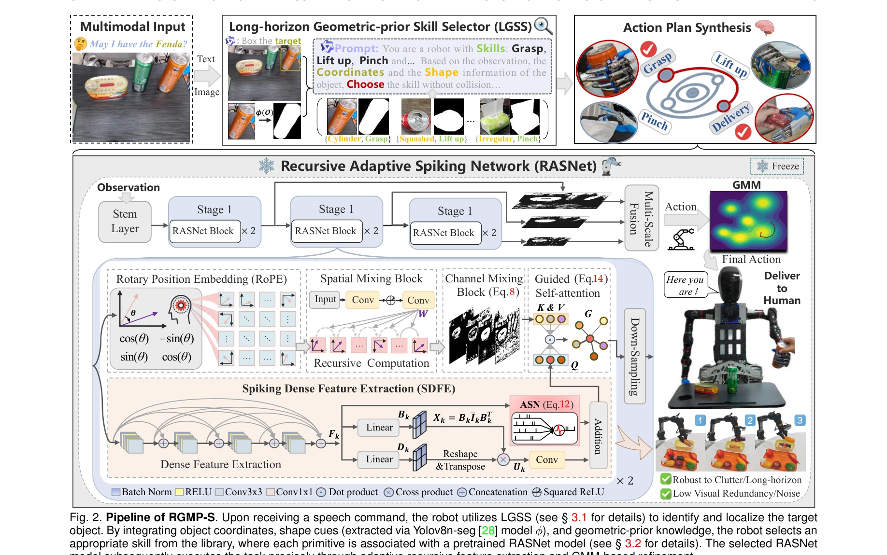

# Generalizable Geometric Prior and Recurrent Spiking Feature Learning for Humanoid Robot Manipulation

> **저자**: Xuetao Li, Wenke Huang, Mang Ye, Jifeng Xuan, Bo Du, Sheng Liu, Miao Li | **날짜**: 2026-01-13 | **URL**: [https://arxiv.org/abs/2601.09031](https://arxiv.org/abs/2601.09031)

---

## Essence

*Fig. 1. Overview of our framework. By integrating geometric common-*

RGMP-S는 기하학적 선행 정보와 spiking 신경망을 결합하여 인간형 로봇 조작을 위한 고수준 의미론적 추론과 저수준 동작 생성을 동시에 달성하는 프레임워크다.

## Motivation

- **Known**: Vision-Language Model(VLM)은 로봇의 의미론적 이해에 우수하고, diffusion policy는 고충실도 궤적 생성에 탁월하지만, VLM은 기하학적 추론 부족으로 기술 가능성 검증에 실패하고 diffusion policy는 추론 지연 문제가 있다.
- **Gap**: VLM은 객체의 의미는 인식하지만 기하학적 변형에 따른 물리적 상호작용 가능성을 판단하지 못하며, 변환기 기반 아키텍처는 거대 데이터셋에 의존하여 샘플 효율성이 낮고 공간 관계를 명시적으로 모델링하지 못한다.
- **Why**: 인간형 로봇이 실세계의 다양하고 미지의 환경에서 신뢰할 수 있게 작동하려면 기하학적 추론 능력과 제한된 시연으로부터의 데이터 효율적 학습이 필수적이다.
- **Approach**: Long-horizon Geometric Prior Skill Selector(LGSS)로 2D 기하학적 편향을 통해 3D 공간 제약을 인코딩하고, Recursive Adaptive Spiking Network로 시공간적 일관성을 보존하면서 희소 시연으로부터 장기간 동역학 특징을 추출한다.

## Achievement

*Fig. 1. Overview of our framework. By integrating geometric common-*

- **기하학적 기반 기술 선택**: 변형된 콜라캔 같은 비표준 기하학에 대해 grasp에서 pinch로 적절히 전환하는 기능
- **샘플 효율성 향상**: diffusion policy 대비 5배 높은 데이터 효율성 달성
- **성능 개선**: 기존 기준선 대비 19% 성능 향상
- **다양한 로봇 플랫폼 검증**: 커스텀 인간형 로봇, 데스크톱 매니퓰레이터, 상용 로봇 3가지 이질적 플랫폼에서 실험 완료

## How

*Fig. 2. Pipeline of RGMP-S. Upon receiving a speech command, the robot utilizes LGSS (see § 3.1 for details) to identify*

- VLM에 가벼운 2D 기하학적 귀납 편향을 통합하여 3D 장면 이해 지원
- Long-horizon Geometric Prior Skill Selector로 의미론적 명령어와 공간 제약을 정렬
- Recursive Adaptive Spiking Network로 로봇-객체 상호작용을 재귀적 spiking을 통해 매개변수화
- 시공간 일관성 유지와 희소 시연 시나리오의 과적합 완화
- Maniskill 시뮬레이션 벤치마크와 3가지 실세계 로봇 시스템에서 광범위 실험 수행

## Originality

- 기존의 조잡한 bounding box나 접촉점 기반 공간 지시자를 넘어 명시적 기하학적 추론을 VLM에 통합하는 혁신적 접근
- Spiking neural network을 로봇 조작의 시공간 동역학 모델링에 적용하는 새로운 시도
- 단순 매개변수 스케일링을 거부하고 구조적 귀납 편향으로 데이터 효율성을 확보하는 철학적 차별성
- 2D 입력에서 암묵적 기하학 구조를 추출하여 비용 높은 3D 재구성 회피

## Limitation & Further Study

- Recursive Adaptive Spiking Network의 학습 역학과 그래디언트 흐름에 대한 이론적 분석 부족
- Long-horizon 작업에서 LGSS의 누적 오류 전파 메커니즘 미분석
- 실험이 주로 조작 관련 작업에 제한되어 있으며 더 복잡한 다단계 계획 작업에 대한 검증 필요
- Spiking network의 생물학적 타당성과 실제 로봇 신경망 구현 간의 격차 미해결
- 후속 연구로 시간 연속 spiking dynamics 모델과 신경형태 하드웨어 통합 탐구 필요

## Evaluation

- Novelty: 4/5
- Technical Soundness: 4/5
- Significance: 4/5
- Clarity: 3/5
- Overall: 4/5

**총평**: RGMP-S는 기하학적 추론과 spiking neural network을 창의적으로 결합하여 인간형 로봇 조작에서 기술 가능성 검증과 데이터 효율성이라는 두 가지 근본적 도전을 동시에 해결한다. 다양한 실제 로봇 플랫폼에서의 광범위한 검증과 19% 성능 향상, 5배 데이터 효율성 개선은 높은 실용적 가치를 입증한다.

## Related Papers

- 🔄 다른 접근: [[papers/1642_RGMP_Recurrent_Geometric-prior_Multimodal_Policy_for_General/review]] — 둘 다 기하학적 정보와 정책 학습을 결합하지만 RGMP-S는 spiking 신경망을, RGMP는 multimodal policy를 사용한다.
- 🏛 기반 연구: [[papers/2157_Towards_Proprioception-Aware_Embodied_Planning_for_Dual-Arm/review]] — proprioception-aware embodied planning이 RGMP-S의 기하학적 선행 정보 활용에 이론적 기반을 제공한다.
- 🔗 후속 연구: [[papers/2023_InEKFormer_A_Hybrid_State_Estimator_for_Humanoid_Robots/review]] — RGMP-S의 spiking 기반 저전력 추론을 InEKFormer의 hybrid state estimation과 결합하면 더 효율적인 휴머노이드 인지 시스템이 가능하다.
- 🧪 응용 사례: [[papers/1872_Dexterous_Safe_Control_for_Humanoids_in_Cluttered_Environmen/review]] — RGMP-S의 geometric prior와 spiking 네트워크를 cluttered environment에서의 dexterous control에 적용하여 더 안전하고 효율적인 조작이 가능하다.
- 🏛 기반 연구: [[papers/1871_Dexterity_from_Smart_Lenses_Multi-Fingered_Robot_Manipulatio/review]] — multi-fingered robot manipulation의 smart lens 기반 dexterity 연구가 RGMP-S의 고수준 의미론적 추론과 저수준 동작 생성의 기초를 제공합니다.
- 🔗 후속 연구: [[papers/1965_HAIC_Humanoid_Agile_Object_Interaction_Control_via_Dynamics-/review]] — RGMP-S의 기하학적 선행 정보 활용을 dynamics-aware world model과 결합하여 더 강건한 humanoid 조작 제어로 발전시켰습니다.
- 🏛 기반 연구: [[papers/1642_RGMP_Recurrent_Geometric-prior_Multimodal_Policy_for_General/review]] — RGMP의 기하학적 추론이 Generalizable Geometric Prior의 recurrent spiking feature 방법론을 휴머노이드 조작에 적용한 것이다
- 🏛 기반 연구: [[papers/1965_HAIC_Humanoid_Agile_Object_Interaction_Control_via_Dynamics-/review]] — RGMP-S의 기하학적 선행 정보와 multimodal policy 연구가 HAIC의 dynamics-aware world model 설계에서 필요한 기하학적 이해의 기초를 제공합니다.
