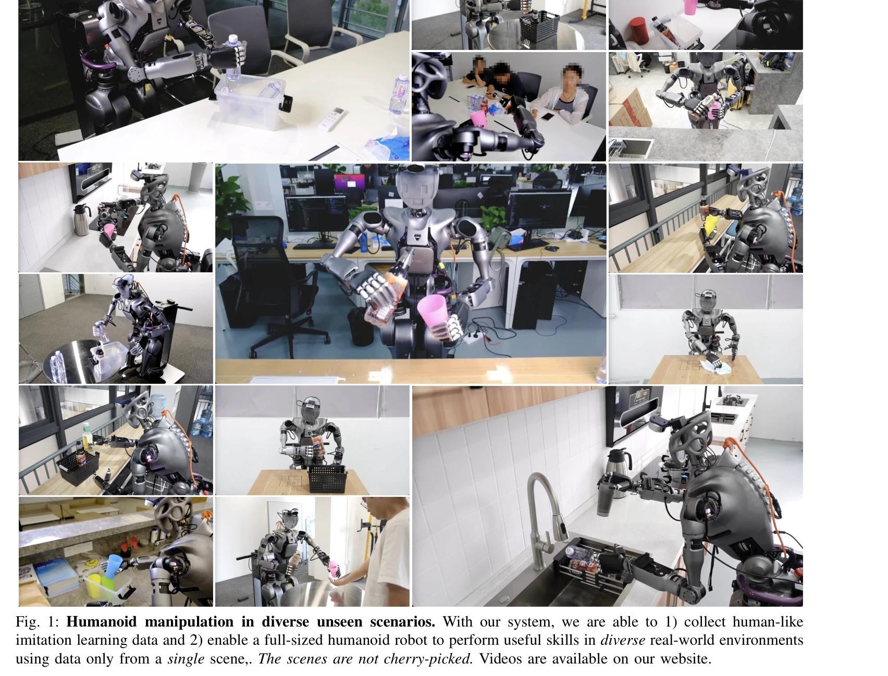
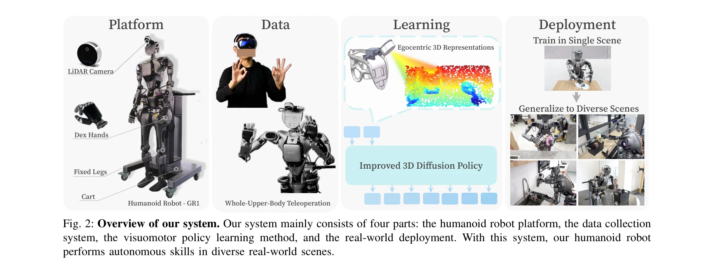

# Generalizable Humanoid Manipulation with 3D Diffusion Policies

> **저자**: Yanjie Ze, Zixuan Chen, Wenhao Wang, Tianyi Chen, Xialin He, Ying Yuan, Xue Bin Peng, Jiajun Wu | **날짜**: 2024-10-14 | **URL**: [https://arxiv.org/abs/2410.10803](https://arxiv.org/abs/2410.10803)

---

## Essence

*Fig. 1: Humanoid manipulation in diverse unseen scenarios. With our system, we are able to 1) collect human-like*

이 논문은 단일 장면에서 수집한 데이터만으로 휴머노이드 로봇이 다양한 미지의 실제 환경에서 자율적으로 조작 작업을 수행하도록 하는 3D Diffusion Policy 기반 시스템을 제시한다.

## Motivation

- **Known**: 최근 휴머노이드 로봇 하드웨어와 원격 조작 시스템이 발전했으나, 기존 학습 방법의 낮은 일반화 능력과 다양한 장면의 데이터 수집 비용으로 인해 휴머노이드 조작 기술은 훈련 장면에만 제한되어 있다.
- **Gap**: 휴머노이드 로봇이 미지의 실제 환경에서 학습된 조작 기술을 일반화하지 못하는 문제가 해결되지 않았으며, 특히 단일 장면 데이터로 장면 일반화를 달성한 사례가 없다.
- **Why**: 일반화 가능한 휴머노이드 조작 기술은 실제 환경에서 로봇의 자율성을 확보하고 데이터 수집 비용을 획기적으로 줄일 수 있어 로봇공학의 중요한 목표이다.
- **Approach**: 전신 상체 원격 조작 시스템과 높이 조절 가능한 카트를 갖춘 25-DoF 휴머노이드 로봇 플랫폼을 구축하고, DP3를 개선한 iDP3 알고리즘으로 egocentric 3D point cloud 기반 정책을 학습하여 미지의 장면으로 일반화시킨다.

## Achievement

*Fig. 1: Humanoid manipulation in diverse unseen scenarios. With our system, we are able to 1) collect human-like*

- **휴머노이드 조작의 장면 일반화**: 단일 장면 데이터만으로 주방, 회의실, 사무실 등 다양한 미지의 실제 환경에서 zero-shot 일반화를 달성한 최초의 풀 사이즈 휴머노이드 로봇 시스템
- **개선된 3D Diffusion Policy (iDP3)**: 카메라 캘리브레이션과 point cloud 분할이 필요 없는 egocentric 버전 DP3를 제시하여 실제 노이즈가 많은 인간 조작 데이터에서 학습 가능
- **포괄적 실제 환경 평가**: 2000회 이상의 실제 로봇 에피소드를 통한 엄격한 정책 평가로 시스템의 실용성 입증
- **완전한 상체 원격 조작 시스템**: Apple Vision Pro 기반 전신 상체 원격 조작으로 머리, 허리, 팔, 손을 포함하는 인간과 유사한 동작 데이터 수집

## How

*Fig. 2: Overview of our system. Our system mainly consists of four parts: the humanoid robot platform, the data collecti*

- Fourier GR1 휴머노이드 로봇을 높이 조절 가능한 카트에 장착하고 RealSense L515 LiDAR 센서를 로봇 헤드에 장착
- Apple Vision Pro로 인간의 3D 위치와 방향 정보를 실시간 캡처하여 Relaxed IK와 회전 변환을 통해 로봇 관절 각도로 변환
- egocentric 3D point cloud와 proprioceptive 정보(로봇 관절 위치)를 입력으로 하는 improved DP3 학습 (카메라 캘리브레이션과 segmentation 제거)
- 단일 장면에서 수집한 observation-action 쌍 데이터로 diffusion 기반 정책 학습 후 다양한 미지 장면에서 배포 및 평가

## Originality

- 휴머노이드 로봇의 **장면 일반화** 달성: 기존 휴머노이드 로봇 연구는 훈련 장면 내에만 국한되었으나, 이 논문은 단일 장면 데이터로 다양한 미지 환경에서 작동하는 최초의 사례
- **Egocentric DP3 (iDP3) 개발**: 기존 third-person 3D Diffusion Policy를 egocentric 관점으로 재구성하여 카메라 캘리브레이션 불필요 및 노이즈가 많은 실제 데이터에 적용 가능하게 개선
- **전신 상체 원격 조작 포함 허리**: 기존 양팔 조작 시스템과 달리 허리와 능동 비전을 포함하여 로봇의 작업 공간 대폭 확장
- **대규모 실제 환경 평가**: 기존 연구 대비 2000회 이상의 실제 로봇 에피소드로 시스템의 견고성과 일반화 능력을 엄격하게 검증

## Limitation & Further Study

- 높이 조절 가능한 카트 사용으로 하체의 복잡한 전신 제어 회피: 전신 제어 기술이 성숙해질 때까지는 이 단순화된 접근이 필요하며, 향후 다리를 활성화한 완전 휴머노이드로의 확장 필요
- 단일 LiDAR 센서로 인한 약 0.5초의 원격 조작 지연시간: 다중 센서 사용 시 지연 시간이 과도하여 데이터 수집 실패 가능성
- RealSense L515에 대한 높은 의존성: 다른 LiDAR 센서(Livox Mid-360 등)는 해상도와 주파수가 접촉 중심 조작에 부족함을 보여줌
- 단일 로봇 플랫폼 평가: Fourier GR1만 사용하여 iDP3의 다른 휴머노이드 및 모바일 로봇 플랫폼으로의 일반성 미검증
- 데이터 수집이 단일 장면으로 제한되어 있으므로, 극단적인 환경 변화나 보이지 않은 객체 카테고리에 대한 일반화 한계 가능성

## Evaluation

- Novelty: 4/5
- Technical Soundness: 3/5
- Significance: 4/5
- Clarity: 4/5
- Overall: 4/5

**총평**: 이 논문은 휴머노이드 로봇의 장면 일반화 조작이라는 미해결 문제를 최초로 해결하며, 개선된 3D Diffusion Policy와 완전한 실제 환경 시스템을 통해 단일 장면 데이터만으로 다양한 미지 환경에서의 자율 작동을 달성한 의미 있는 기여를 제시한다.
