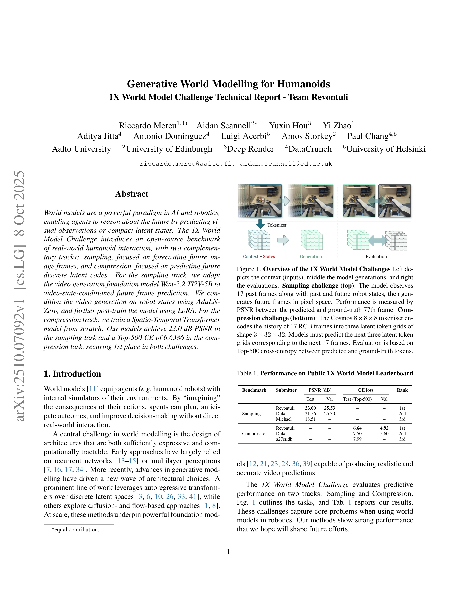

# Generative World Modelling for Humanoids: 1X World Model Challenge Technical Report

> **저자**: Riccardo Mereu, Aidan Scannell, Yuxin Hou, Yi Zhao, Aditya Jitta, Antonio Dominguez, Luigi Acerbi, Amos Storkey, Paul Chang | **날짜**: 2025-10-08 | **URL**: [https://arxiv.org/abs/2510.07092](https://arxiv.org/abs/2510.07092)

---

## Essence

*Figure 1. Overview of the 1X World Model Challenges Left de-*

1X World Model Challenge에서 humanoid 로봇의 미래 상태 예측을 위해 Wan 2.2 TI2V-5B를 video-state-conditioned 프레임 예측으로 적응시키고, Spatio-Temporal Transformer를 압축 트랙용으로 훈련하여 두 트랙 모두에서 1위를 달성했다.

## Motivation

- **Known**: World model은 AI와 로봇공학에서 에이전트가 시각적 관찰이나 compact latent state를 예측함으로써 미래를 추론할 수 있게 한다. 최근 generative model의 발전은 autoregressive transformer와 diffusion-based 접근법을 활용한 강력한 foundation model을 만들었다.
- **Gap**: 실제 humanoid 로봇 상호작용 데이터에 대한 world model의 성능이 충분히 벤치마크되지 않았으며, pixel space 예측과 discrete latent space 예측 사이의 trade-off를 체계적으로 비교한 연구가 부족하다.
- **Why**: World model은 로봇이 직접 상호작용 없이 계획을 수립하고 결과를 예상할 수 있게 하므로, 실제 humanoid 로봇 제어 시스템의 효율성과 안전성을 크게 향상시킬 수 있다.
- **Approach**: Sampling 트랙에서는 Wan 2.2 TI2V-5B의 masking을 수정하여 video-state-conditioned 예측을 구현하고 AdaLN-Zero와 LoRA를 적용했으며, Compression 트랙에서는 discrete token 예측을 위해 Spatio-Temporal Transformer를 처음부터 훈련했다.

## Achievement

*Figure 1. Overview of the 1X World Model Challenges Left de-*

- **Sampling 트랙 1위**: 23.0 dB PSNR으로 미래 프레임 예측에서 우수한 성능 달성
- **Compression 트랙 1위**: Top-500 CE 6.6386으로 discrete latent code 예측에서 최고 성능 달성
- **Ensemble 기법**: 다중 샘플 예측으로 Gaussian blur보다 우수한 성능 획득
- **Architecture 적응**: Text-image-to-video 모델을 video-state-conditioned 설정으로 효과적으로 재설계

## How

*Figure 2. State conditioning of DiT-Block. Wan2.2 TI2V-5B*

- Sampling 트랙: Wan 2.2 TI2V-5B의 입력 latent masking을 확장하여 여러 프레임을 고정하는 video-to-video 조건화 구현
- State 조건화: 연속 각도와 속도 상태를 sinusoidal feature로 augment한 후 MLP로 projection하고, 1D convolution으로 temporal compression
- AdaLN-Zero: Robot state 특징을 flow matching timestep embedding과 결합하여 DiT block의 30개 계층에서 modulation 적용
- LoRA fine-tuning: Rank 32의 LoRA를 Wan 2.2 DiT backbone에 적용하여 효율적인 적응
- Ensemble inference: 예측 불확실성을 활용하여 최대 100개의 샘플을 평균화하여 PSNR 개선
- Compression 트랙: Cosmos 8×8×8 tokenizer로 인코딩된 discrete latent code의 top-500 cross-entropy 최소화를 위한 Spatio-Temporal Transformer 훈련

## Originality

- Text-image-to-video 모델을 robot state 조건화가 가능한 video-state-conditioned 예측 모델로 창의적으로 변환
- AdaLN-Zero 메커니즘을 robot state 특징과 flow matching timestep embedding의 결합으로 확장하여 시간-공간적 modulation 실현
- Gaussian blur 기반 post-processing보다 ensemble 기반 불확실성 활용이 우수함을 실증적으로 입증
- Pixel space와 discrete latent space 두 가지 상이한 예측 패러다임을 동시에 해결하는 통합적 접근

## Limitation & Further Study

- Ensemble 기반 추론은 단일 샘플 추론보다 계산 비용이 높아 실시간 로봇 제어 응용에 제약 가능성
- PSNR 메트릭의 한계로 인해 blur 효과가 선호되는 경향이 있으며, 실제 로봇 제어 성능과의 correlation이 명확하지 않음
- State 조건화의 temporal compression이 robot state의 동적 정보를 어느 정도 손실할 수 있음
- 후속 연구: 실시간성과 성능의 trade-off를 최적화하는 경량 ensemble 기법 개발, 로봇 제어 태스크에서의 world model 성능 검증, 더 긴 예측 horizon에 대한 성능 평가

## Evaluation

- Novelty: 4/5
- Technical Soundness: 4/5
- Significance: 4/5
- Clarity: 4/5
- Overall: 4/5

**총평**: 본 논문은 대규모 foundation model을 robot state 조건화로 효과적으로 적응시키고, pixel space와 discrete latent space에서 모두 최고 성능을 달성함으로써 실제 humanoid 로봇 world modeling의 새로운 벤치마크를 제시했다. 방법론의 명확한 설명과 포괄적인 ablation study는 향후 world model 연구에 큰 기여가 될 것으로 예상된다.

## Related Papers

- 🔗 후속 연구: [[papers/1951_Genie_Sim_30__A_High-Fidelity_Comprehensive_Simulation_Platf/review]] — Genie Sim 3.0의 종합적인 시뮬레이션 플랫폼이 1X World Model Challenge의 세계 모델링 기법을 통합할 수 있다.
- 🔄 다른 접근: [[papers/2096_MetaWorld-X_Hierarchical_World_Modeling_via_VLM-Orchestrated/review]] — 둘 다 계층적 세계 모델링을 다루지만 Generative World Modelling은 video 예측에, MetaWorld-X는 VLM 기반 조율에 초점을 맞춘다.
- 🔄 다른 접근: [[papers/1888_DreamZero_World_Action_Models_are_Zero-shot_Policies/review]] — 둘 다 world model을 다루지만 Generative World Modelling은 video-state 예측을, DreamZero는 zero-shot policy를 중심으로 한다.
- 🔗 후속 연구: [[papers/2005_Humanoid_World_Models_Open_World_Foundation_Models_for_Human/review]] — 1X World Model Challenge의 video 예측 기술을 Humanoid World Models의 open world foundation과 결합하면 더 포괄적인 세계 모델이 가능하다.
- 🔗 후속 연구: [[papers/1412_GR00T_N1_An_Open_Foundation_Model_for_Generalist_Humanoid_Ro/review]] — Genie Sim 3.0의 고품질 시뮬레이션 환경이 GR00T N1의 합성 데이터 생성과 모델 훈련에 확장 적용될 수 있음
- 🔗 후속 연구: [[papers/1791_Advancing_Humanoid_Locomotion_Mastering_Challenging_Terrains/review]] — 1X World Model의 생성형 세계 모델링이 DWL의 denoising 접근법을 더욱 정교하게 발전시킵니다.
- 🔗 후속 연구: [[papers/1885_DreamControl-v2_Simpler_and_Scalable_Autonomous_Humanoid_Ski/review]] — DreamControl-v2의 diffusion 기반 motion generation이 1X World Model의 generative world modeling과 결합되어 더 포괄적인 휴머노이드 AI 시스템을 구축할 수 있다.
- 🏛 기반 연구: [[papers/1887_DreamGen_Unlocking_Generalization_in_Robot_Learning_through/review]] — generative world model이 DreamGen의 video world model 기반 로봇 학습 파이프라인의 핵심 이론적 토대를 마련한다.
- 🔗 후속 연구: [[papers/1888_DreamZero_World_Action_Models_are_Zero-shot_Policies/review]] — 1X World Model의 generative world modelling 프레임워크가 DreamZero의 world action model을 더욱 고도화할 수 있는 확장 방향을 제시한다.
- 🏛 기반 연구: [[papers/1897_Ego-Vision_World_Model_for_Humanoid_Contact_Planning/review]] — generative world model의 기본 원리가 ego-vision world model for contact planning의 이론적 토대를 마련한다.
- 🏛 기반 연구: [[papers/1951_Genie_Sim_30__A_High-Fidelity_Comprehensive_Simulation_Platf/review]] — generative world modelling이 Genie Sim 3.0의 LLM 기반 장면 생성에 이론적 기반을 제공한다.
- 🔄 다른 접근: [[papers/2005_Humanoid_World_Models_Open_World_Foundation_Models_for_Human/review]] — 1X World Model의 generative world modeling과 HWM은 모두 humanoid world model을 다루지만 서로 다른 생성 모델 구조를 사용한다.
- 🔗 후속 연구: [[papers/2027_InterPrior_Scaling_Generative_Control_for_Physics-Based_Huma/review]] — 생성형 제어 프레임워크를 휴머노이드 전용 world model과 결합하여 더 정교한 물리 기반 시뮬레이션을 구현할 수 있다.
- 🏛 기반 연구: [[papers/2082_LHM-Humanoid_Learning_a_Unified_Policy_for_Long-Horizon_Huma/review]] — 1X World Model의 생성형 세계 모델링이 LHM-Humanoid의 장시간 다중 객체 조작을 위한 환경 이해의 기반을 제공한다.
- 🔄 다른 접근: [[papers/2154_Towards_Bridging_the_Gap_between_Large-Scale_Pretraining_and/review]] — SAC 기반 정책 사전학습은 model-free 접근법을 사용하고 Generative World Modelling은 생성형 세계 모델을 통한 서로 다른 휴머노이드 학습 전략입니다.
