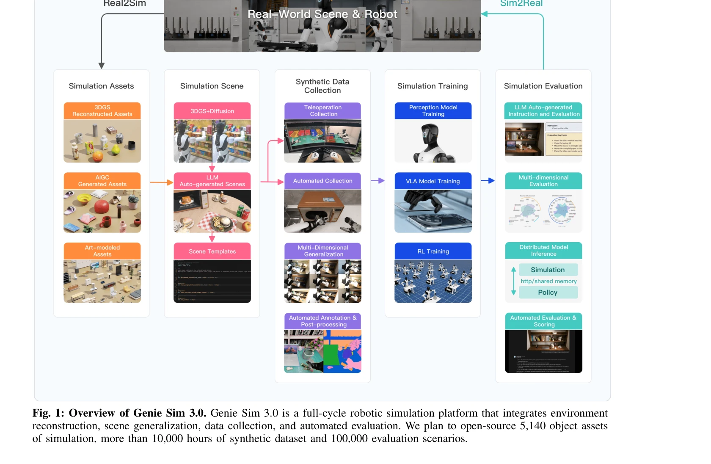

# Genie Sim 3.0 : A High-Fidelity Comprehensive Simulation Platform for Humanoid Robot

> **저자**: Chenghao Yin, Da Huang, Di Yang, Jichao Wang, Nanshu Zhao, Chen Xu, Wenjun Sun, Linjie Hou, Zhijun Li, Junhui Wu, Zhaobo Liu, Zhen Xiao, Sheng Zhang, Lei Bao, Rui Feng, Zhenquan Pang, Jiayu Li, Qian Wang, Maoqing Yao | **날짜**: 2026-01-05 | **URL**: [https://arxiv.org/abs/2601.02078](https://arxiv.org/abs/2601.02078)

---

## Essence

*Fig. 1: Overview of Genie Sim 3.0. Genie Sim 3.0 is a full-cycle robotic simulation platform that integrates environment*

Genie Sim 3.0은 LLM 기반 장면 생성, VLM 기반 자동 평가, 10,000시간 이상의 합성 데이터를 제공하는 휴머노이드 로봇 통합 시뮬레이션 플랫폼이다.

## Motivation

- **Known**: 로봇 학습을 위해서는 대규모 다양한 훈련 데이터와 신뢰할 수 있는 평가 벤치마크가 필수적이다. 실제 로봇 데이터 수집은 높은 비용과 확장성 문제를 야기한다.
- **Gap**: 기존 시뮬레이션 벤치마크는 조각화, 제한된 범위, 불충분한 충실도로 인해 sim-to-real 전이가 어렵다. 또한 고충실도 환경 생성은 전문가의 수동 작업을 요구하고, 평가는 고정된 메트릭에 의존하며 인간 평가는 확장성이 떨어진다.
- **Why**: 확장 가능한 로봇 학습 모델 개발을 위해서는 자동화된 고충실도 장면 생성, 대규모 합성 데이터, 그리고 자동화된 다차원 평가 체계가 필수적이다.
- **Approach**: LLM을 활용하여 자연어 명령으로 고충실도 장면을 생성하고, 다차원 도메인 랜더마이제이션을 통해 장면을 일반화하며, VLM 기반 자동 평가 파이프라인을 구축한다.

## Achievement

- **Genie Sim Generator**: 자연어 인터페이스로 고충실도 시뮬레이션 장면을 실시간 생성하고 다중 라운드 대화를 통해 반복 개선을 지원한다.
- **다차원 장면 일반화**: 조명, 배경, 레이아웃, 포즈, 궤적, 센서 노이즈, 로봇 형태 등을 매개변수화하여 단일 장면에서 수천 개의 다양한 시나리오를 분 단위로 생성한다.
- **LLM 기반 자동 평가 벤치마크**: 100,000개 이상의 평가 시나리오를 생성하고 VLM으로 자동 채점하여 의미론적 이해, 공간 추론, 작업 실행의 다차원 역량 프로필을 구성한다.
- **Sim-to-Real 전이 검증**: 합성 데이터가 제어된 조건 하에서 실제 로봇 데이터의 효과적인 대체재가 될 수 있음을 실증한다.
- **대규모 오픈소스 공개**: 5,140개 자산, 10,000+ 시간 데이터셋, 100,000+ 평가 시나리오, 완전한 코드베이스를 공개한다.

## How

- LLM을 활용한 자연언어 기반 장면 생성 파이프라인 구축
- 3D 재구성과 시각 생성 합성(visual generative synthesis)을 통한 고충실도 시뮬레이션
- 원격조종(teleoperation)과 자동화 기반 이중 모드 데이터 수집
- LLM으로 작업 지시 및 평가 프로토콜을 자동 생성
- VLM으로 생성된 시나리오에 대한 작업 실행 및 자동 채점
- 353개 범주에서 5,140개 시뮬레이션 준비 객체를 지원하는 의미 기반 자산 검색 시스템
- 조명, 배경, 레이아웃, 포즈, 궤적, 센서 노이즈, 로봇 형태에 걸친 포괄적 도메인 랜더마이제이션

## Originality

- 로봇 장면 생성에 LLM을 활용한 최초의 자연어 인터페이스 접근법
- VLM 기반 자동 평가 파이프라인을 도입하여 인간 평가의 주관성과 확장성 문제 해결
- 단일 생성 장면에서 수천 개의 매개변수화된 시나리오를 동적으로 생성하는 다차원 일반화 방법론
- LLM으로 평가 시나리오와 작업 지시를 대규모로 생성하는 자동화된 벤치마크 구성 방식
- 대규모 합성 데이터의 sim-to-real 전이 가능성을 체계적으로 검증한 실증적 결과

## Limitation & Further Study

- 실제 sim-to-real 전이의 성공률과 범위에 대한 구체적인 정량화 부재
- VLM 기반 평가의 신뢰성과 인간 평가와의 상관성에 대한 상세한 검증 부족
- 특정 도메인(예: 복잡한 물리 상호작용, 변형 가능한 물체)에서의 성능 한계 미언급
- LLM 생성 장면의 현실성 정도와 생성 오류율에 대한 정량적 분석 미제시
- 후속 연구로는 실제 로봇 플랫폼에서의 광범위한 배포 테스트, 다양한 로봇 형태에 대한 일반화 검증, VLM 평가의 신뢰성 개선이 필요

## Evaluation

- Novelty: 4/5
- Technical Soundness: 4/5
- Significance: 4/5
- Clarity: 4/5
- Overall: 4/5

**총평**: Genie Sim 3.0은 LLM/VLM과 로봇 시뮬레이션을 통합한 혁신적 플랫폼으로, 자동화된 장면 생성, 대규모 합성 데이터, 다차원 평가 벤치마크를 통해 로봇 학습 개발 사이클을 크게 가속화할 수 있는 높은 기여도의 연구이다.

## Related Papers

- 🔄 다른 접근: [[papers/1942_GaussGym_An_open-source_real-to-sim_framework_for_learning_l/review]] — 고충실도 시뮬레이션 플랫폼과 실제-시뮬레이션 프레임워크는 모두 휴머노이드 학습 환경을 제공하지만 초점이 다르다.
- 🔗 후속 연구: [[papers/1846_ComFree-Sim_A_GPU-Parallelized_Analytical_Contact_Physics_En/review]] — GPU 병렬화된 물리 시뮬레이션이 고충실도 플랫폼의 핵심 확장 기술이다.
- 🏛 기반 연구: [[papers/2006_Humanoid-Gym_Reinforcement_Learning_for_Humanoid_Robot_with/review]] — 강화학습용 휴머노이드 짐이 종합적인 시뮬레이션 플랫폼의 기반을 제공한다.
- 🏛 기반 연구: [[papers/1949_Generative_World_Modelling_for_Humanoids_1X_World_Model_Chal/review]] — generative world modelling이 Genie Sim 3.0의 LLM 기반 장면 생성에 이론적 기반을 제공한다.
- 🔄 다른 접근: [[papers/2161_Trinity_A_Modular_Humanoid_Robot_AI_System/review]] — 둘 다 통합된 휴머노이드 AI 시스템을 다루지만 Genie Sim은 시뮬레이션에, Trinity는 모듈식 실제 로봇에 초점을 맞춘다.
- 🔗 후속 연구: [[papers/1644_RoboCasa_Large-Scale_Simulation_of_Everyday_Tasks_for_Genera/review]] — Genie Sim 3.0의 고충실도 시뮬레이션이 RoboCasa의 kitchen 환경을 더 포괄적인 시뮬레이션 플랫폼으로 확장
- 🔄 다른 접근: [[papers/1647_RoboPlayground_구조화된_물리_도메인을_통한_로봇_평가_민주화/review]] — 구조화된 물리 도메인 평가와 Genie Sim의 포괄적 시뮬레이션은 로봇 성능 검증의 상호 보완적 접근
- 🔗 후속 연구: [[papers/1620_PolySim_Bridging_the_Sim-to-Real_Gap_for_Humanoid_Control_vi/review]] — Genie Sim 3.0의 고충실도 시뮬레이션 플랫폼이 PolySim의 다중 시뮬레이터 통합 접근법을 더욱 발전시킬 수 있음
- 🏛 기반 연구: [[papers/1858_cuRoboV2_Dynamics-Aware_Motion_Generation_with_Depth-Fused_D/review]] — Genie Sim의 high-fidelity 시뮬레이션 환경이 cuRoboV2의 dynamics-aware motion generation을 검증하고 개발하는 플랫폼을 제공한다.
- 🏛 기반 연구: [[papers/1868_DexHub_and_DART_Towards_Internet_Scale_Robot_Data_Collection/review]] — Genie Sim 3.0의 고충실도 시뮬레이션 플랫폼이 DART의 클라우드 기반 데이터 수집을 위한 핵심 인프라를 제공한다.
- 🧪 응용 사례: [[papers/1892_E-SDS_Environment-aware_See_it_Do_it_Sorted_-_Automated_Envi/review]] — E-SDS의 환경 통계 기반 보상 함수 생성이 Genie Sim 3.0의 고충실도 시뮬레이션 환경에서 더 정교한 지형 적응 정책을 개발할 수 있다.
- 🔄 다른 접근: [[papers/1942_GaussGym_An_open-source_real-to-sim_framework_for_learning_l/review]] — 둘 다 고충실도 시뮬레이션을 제공하지만 GaussGym은 Gaussian Splatting을, Genie Sim은 comprehensive simulation을 중심으로 한다.
- 🔗 후속 연구: [[papers/1949_Generative_World_Modelling_for_Humanoids_1X_World_Model_Chal/review]] — Genie Sim 3.0의 종합적인 시뮬레이션 플랫폼이 1X World Model Challenge의 세계 모델링 기법을 통합할 수 있다.
- 🏛 기반 연구: [[papers/2096_MetaWorld-X_Hierarchical_World_Modeling_via_VLM-Orchestrated/review]] — Genie Sim 3.0의 고충실도 시뮬레이션 플랫폼이 MetaWorld-X의 계층적 세계 모델링의 시뮬레이션 기반을 제공한다.
- 🧪 응용 사례: [[papers/2100_Mimicking-Bench_A_Benchmark_for_Generalizable_Humanoid-Scene/review]] — Mimicking-Bench의 23K 인간 상호작용 모션이 Genie Sim 3.0의 고충실도 시뮬레이션 플랫폼에서 다양한 휴머노이드 행동 학습에 활용될 수 있다.
- 🏛 기반 연구: [[papers/2104_MolmoSpaces_A_Large-Scale_Open_Ecosystem_for_Robot_Navigatio/review]] — Genie Sim 3.0의 고품질 시뮬레이션 플랫폼이 MolmoSpaces의 230k 환경을 생성하고 검증하는 기술적 기반을 제공한다.
- 🏛 기반 연구: [[papers/2157_Towards_Proprioception-Aware_Embodied_Planning_for_Dual-Arm/review]] — 고충실도 종합 시뮬레이션 플랫폼이 이중팔 휴머노이드의 고유감각 인식 계획에 필요한 시뮬레이션 환경을 제공한다.
- 🔗 후속 연구: [[papers/2125_Opening_the_Sim-to-Real_Door_for_Humanoid_Pixel-to-Action_Po/review]] — Genie Sim 3.0의 고품질 시뮬레이션 플랫폼을 GPU 가속 포토리얼리스틱 시뮬레이션과 teacher-student 학습으로 특화한 연구이다.
