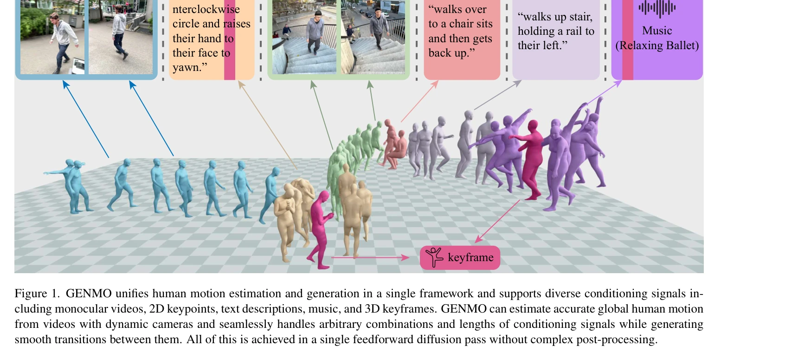
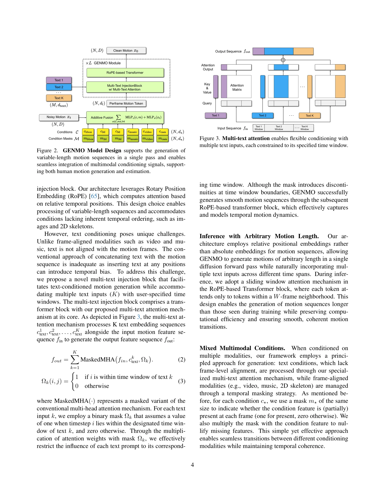

# GENMO: A GENeralist Model for Human MOtion

> **저자**: Jiefeng Li, Jinkun Cao, Haotian Zhang, Davis Rempe, Jan Kautz, Umar Iqbal, Ye Yuan | **날짜**: 2025-05-02 | **URL**: [https://arxiv.org/abs/2505.01425](https://arxiv.org/abs/2505.01425)

---

## Essence

*Figure 1. GENMO unifies human motion estimation and generation in a single framework and supports diverse conditioning s*

GENMO는 인간 동작 추정과 생성을 단일 프레임워크에서 통합하는 generalist 모델로, 동작 추정을 제약 조건이 있는 동작 생성으로 재구성하여 정확한 추정과 다양한 생성을 동시에 달성한다.

## Motivation

- **Known**: 기존에는 동작 생성 모델(텍스트, 음악, 키프레임 기반)과 동작 추정 모델(비디오 기반)이 별도의 특화된 모델로 분리되어 있었으며, 최근 연구들은 generative prior가 occlusion 같은 어려운 추정 조건에서 도움이 되고 대규모 비디오 데이터가 생성 모델의 현실성을 높인다는 것을 보여주었다.
- **Gap**: 기존 방법들은 두 작업 간 지식 전이가 제한되고 별도 모델을 유지해야 하며, 기존의 multimodal 생성 방법들은 추정 정밀도가 낮고, 장시간 동작 생성은 복잡한 후처리가 필요하다.
- **Why**: 인간 동작 모델링은 게임, 애니메이션, 3D 콘텐츠 제작 등에 광범위하게 적용되며, 추정과 생성을 단일 모델로 통합하면 지식 공유를 통한 성능 향상과 모델 유지 비용 감소의 이점을 얻을 수 있다.
- **Approach**: Diffusion model 프레임워크 위에 dual-mode 훈련 패러다임을 도입하여, 추정 모드에서는 zero-initialized noise와 최대 timestep으로 MLE를 강제하고, 생성 모드에서는 전통적인 diffusion 훈련을 수행한다. 또한 estimation-guided 훈련 목표로 in-the-wild 비디오의 2D 어노테이션을 활용한다.

## Achievement

*Figure 1. GENMO unifies human motion estimation and generation in a single framework and supports diverse conditioning s*

- **Unified Framework**: motion 추정과 생성을 단일 모델에서 동시에 처리하며, 비디오, 2D keypoint, 텍스트, 음악, 3D keyframe 등 다양한 조건 신호 조합에 대응
- **State-of-the-art Performance**: global motion 추정, local motion 추정, music-to-dance 생성 등 다양한 task에서 최고 성능 달성
- **Architecture Innovation**: variable-length motion을 처리하고 임의의 multimodal 조건 조합을 서로 다른 시간 간격에서 지원하면서 복잡한 후처리 없이 단일 feedforward diffusion pass로 생성
- **Bidirectional Synergy**: generative prior가 occlusion 같은 도전적 조건에서 추정 성능을 개선하고, 다양한 비디오 데이터가 생성 표현력을 향상

## How

*Figure 2.*

- Dual-mode 훈련 패러다임: (1) 추정 모드에서 zero-initialized noise와 최대 timestep을 입력하여 조건 신호 기반 MLE 수행, (2) 생성 모드에서 표준 diffusion 훈련으로 풍부한 생성 분포 학습
- Motion representation으로 joint local and global motion representation 사용
- Estimation-guided 훈련 목표로 2D 어노테이션이 있는 in-the-wild 비디오를 활용하여 3D ground-truth 없이도 generative 다양성 향상
- Multi-text attention mechanism으로 flexible conditioning 지원
- Condition mask 매트릭스를 통해 임의의 개수와 조합의 multimodal 입력을 다른 시간 간격에서 처리
- Diffusion denoiser 아키텍처로 variable-length motion 시퀀스 생성

## Originality

- Motion 추정을 제약 조건이 있는 동작 생성으로 재구성하여 두 task를 통합하는 새로운 관점 제시
- Regression과 diffusion 사이의 synergy를 탐구하는 dual-mode 훈련 패러다임 제안
- Estimation-guided 훈련 목표로 2D 어노테이션만으로 3D ground-truth 없이 모델 훈련 가능하게 함
- Variable-length motion과 임의의 multimodal 조건 조합을 처리하는 아키텍처 혁신
- 단일 feedforward diffusion pass에서 복잡한 post-processing 없이 다중 조건 동작 생성

## Limitation & Further Study

- 논문에서 명시적으로 언급한 한계점이 부족함. 추정 정확도와 생성 다양성 간의 trade-off에 대한 심화 분석 필요
- 극도로 긴 시퀀스(예: 수 분 이상)에서의 성능 검증 부재
- 실시간 추론 시간과 계산 비용에 대한 구체적 평가 미흡
- 다양한 신체 유형, 의류, 극단적 카메라 움직임에 대한 generalization 능력 평가 필요
- Estimation-guided 훈련의 2D annotation 정확도에 대한 민감성 분석 필요

## Evaluation

- Novelty: 4/5
- Technical Soundness: 3/5
- Significance: 4/5
- Clarity: 4/5
- Overall: 4/5

**총평**: GENMO는 동작 추정과 생성의 오랫동안의 분리를 혁신적으로 통합하는 첫 번째 generalist 모델로, dual-mode 훈련과 estimation-guided 목표를 통해 두 작업 간 상승 효과를 효과적으로 달성하며, 다양한 benchmark에서 state-of-the-art 성능을 입증한다.

## Related Papers

- 🏛 기반 연구: [[papers/1930_Flexible_Motion_In-betweening_with_Diffusion_Models/review]] — flexible motion in-betweening이 GENMO의 통합된 동작 추정과 생성 프레임워크에 기반이 된다.
- 🔗 후속 연구: [[papers/2035_Kimodo_Scaling_Controllable_Human_Motion_Generation/review]] — Kimodo의 제어 가능한 인간 동작 생성이 GENMO의 generalist 모델을 확장할 수 있다.
- 🏛 기반 연구: [[papers/1936_From_Motion_to_Behavior_Hierarchical_Modeling_of_Humanoid_Ge/review]] — GENMO의 generalist 인간 동작 모델이 PHYLOMAN의 GBC-100K 데이터셋을 활용하여 더 풍부한 동작 추정과 생성을 달성할 수 있다.
- 🔗 후속 연구: [[papers/2168_UniAct_Unified_Motion_Generation_and_Action_Streaming_for_Hu/review]] — GENMO의 통합 동작 추정-생성을 UniAct의 unified motion generation과 결합하면 더 포괄적인 휴머노이드 행동 시스템이 가능하다.
- 🧪 응용 사례: [[papers/1666_Scaling_Large_Motion_Models_with_Million-Level_Human_Motions/review]] — GENMO의 generalist 모델을 million-level human motion 데이터에 적용하여 대규모 motion tracking policy 학습이 가능하다.
- 🔗 후속 연구: [[papers/1666_Scaling_Large_Motion_Models_with_Million-Level_Human_Motions/review]] — GENMO의 일반적인 모션 모델을 백만 단위 데이터로 확장하여 더 강력한 모션 생성 능력을 달성한다.
- 🔗 후속 연구: [[papers/1643_RL_from_Physical_Feedback_Aligning_Large_Motion_Models_with/review]] — GENMO의 범용 모션 모델이 RLPF의 대규모 모션 생성 모델을 휴머노이드 실행가능성으로 확장하는 프레임워크임
- 🏛 기반 연구: [[papers/1815_Being-M05_A_Real-Time_Controllable_Vision-Language-Motion_Mo/review]] — GENMO의 generalist motion model 개념과 Being-M0.5의 controllable motion model이 대규모 데이터 기반 모션 생성의 공통 방향을 제시한다.
- 🏛 기반 연구: [[papers/1862_DeepMimic_Example-Guided_Deep_Reinforcement_Learning_of_Phys/review]] — 인간 모션에 대한 일반적 모델링 접근법의 기초를 제공합니다.
- 🏛 기반 연구: [[papers/1936_From_Motion_to_Behavior_Hierarchical_Modeling_of_Humanoid_Ge/review]] — 범용 인간 모션 모델이 계층적 휴머노이드 행동 생성의 기반을 제공한다.
- 🔗 후속 연구: [[papers/1930_Flexible_Motion_In-betweening_with_Diffusion_Models/review]] — GENMO의 통합된 모션 생성 프레임워크가 CondMDI의 유연한 keyframe 기반 인-비트위닝을 포함할 수 있다.
- 🔄 다른 접근: [[papers/2035_Kimodo_Scaling_Controllable_Human_Motion_Generation/review]] — 대규모 인간 모션 생성에서 GENMO는 일반화된 접근을, Kimodo는 제어 가능성에 집중
- 🏛 기반 연구: [[papers/2146_TEDi_Temporally-Entangled_Diffusion_for_Long-Term_Motion_Syn/review]] — GENMO의 일반화된 인간 모션 모델링 기법이 TEDi의 장기 모션 시퀀스 생성을 위한 기반 이론을 제공합니다.
