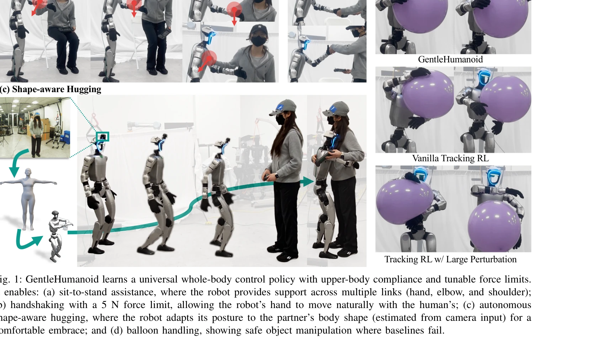
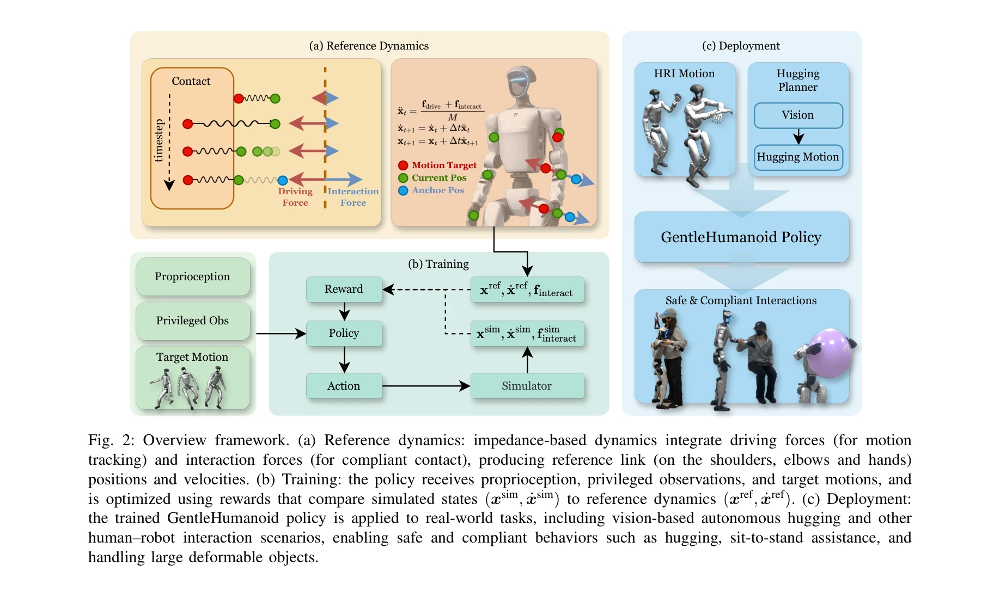

# GentleHumanoid: Learning Upper-body Compliance for Contact-rich Human and Object Interaction

> **저자**: Qingzhou Lu, Yao Feng, Baiyu Shi, Michael Piseno, Zhenan Bao, C. Karen Liu | **날짜**: 2025-11-06 | **DOI**: [10.48550/arXiv.2511.04679](https://doi.org/10.48550/arXiv.2511.04679)

---

## Essence

*Fig. 1: GentleHumanoid learns a universal whole-body control policy with upper-body compliance and tunable force limits.*

GentleHumanoid는 impedance control을 whole-body motion tracking 정책에 통합하여 humanoid 로봇의 상체 compliance를 학습하는 프레임워크이다. 이는 human motion data에서 샘플링한 spring-based formulation을 통해 resistive contact와 guiding contact를 통일적으로 모델링한다.

## Motivation

- **Known**: 최근 RL 기반 humanoid 제어는 rigid tracking과 external force 억제에 중점을 두고 있으며, 기존 impedance-augmented 방법들은 base 또는 end-effector 제어에 제한되어 있다.
- **Gap**: shoulder, elbow, wrist 등 multiple links에서 coordinated compliance가 필요한 상황(hugging, sit-to-stand assistance)에서 whole-body upper-body compliance를 제공하는 통합 프레임워크가 부재한다.
- **Why**: humanoid 로봇이 human-centered environment에서 안전하고 자연스러운 physical interaction을 수행해야 하며, 특히 여러 신체 부위가 동시에 접촉하는 상황에서 force를 효과적으로 조정할 필요가 있다.
- **Approach**: unified spring-based formulation으로 driving force(motion tracking)와 interaction force(contact)를 결합하고, human motion dataset에서 샘플링한 완전한 posture를 이용하여 kinematically consistent interaction forces를 생성한다. Task-adjustable force thresholds를 통해 safety를 보장한다.

## Achievement

*Fig. 1: GentleHumanoid learns a universal whole-body control policy with upper-body compliance and tunable force limits.*

- **통합 impedance control 프레임워크**: motion tracking과 compliance를 동시에 달성하는 whole-body humanoid 제어 정책 개발
- **Unified interaction force modeling**: resistive contact(surface pressing)와 guiding contact(human push/pull)를 단일 spring-based formulation으로 통합
- **Kinematically consistent forces**: human motion data에서 샘플링한 complete postures를 사용하여 shoulder, elbow, wrist 간 coordinated force 생성
- **Safety mechanism**: task-specific adjustable force thresholds로 deployment 시 안전성 보장
- **Comprehensive evaluation**: gentle hugging, sit-to-stand assistance, balloon handling 등 diverse tasks에서 baseline 대비 peak contact force 감소 및 task success 유지 입증

## How

*Fig. 2: Overview framework. (a) Reference dynamics: impedance-based dynamics integrate driving forces (for motion*

- Reference dynamics 모델: M¨xi = fdrive,i + finteract,i 형태로 각 link의 motion을 driving force와 interaction force의 합으로 표현
- Driving force: classical impedance control의 virtual spring-damper system으로 target motion을 추적
- Interaction force 모델링: (i) resistive contact는 initial contact point에서 spring anchor를 고정하여 restoring force 생성, (ii) guiding contact는 human motion dataset의 upper-body postures에서 spring anchors 샘플링
- RL training: diverse interaction scenarios에 노출시키기 위해 simulated interaction forces(MuJoCo/IsaacGym 대비 개선) 사용
- Force thresholding: training 중 force limits 적용, deployment 시 task별로 조정 가능
- Evaluation: Unitree G1 humanoid에서 force gauge와 custom pressure-sensing pad(40 calibrated capacitive taxels)로 contact forces/pressures 측정

## Originality

- Human motion dataset에서 complete postures를 샘플링하여 kinematically consistent multi-link compliance를 실현한 점이 기존 end-effector 중심의 impedance control과 구별됨
- Resistive contact와 guiding contact를 unified spring-based formulation으로 통합하는 novel approach
- Vision-based human shape estimation을 결합한 autonomous hugging pipeline으로 personalized interaction 구현
- Custom pressure-sensing pad를 설계하여 distributed contact forces 측정을 위한 새로운 평가 방법론 제시

## Limitation & Further Study

- 상체 compliance에만 초점을 맞추었으므로, 하체 locomotion과의 simultaneous compliance 학습 필요
- Human motion data 기반 sampling이 rare or unusual interaction scenarios에 대한 generalization을 제한할 수 있음
- Real-world deployment에서 실제 human-robot physical interaction 데이터 수집의 어려움이 남아있음
- Force thresholds의 최적값 설정 및 다양한 body types에 대한 adaptation 방법 개선 필요
- 다양한 humanoid morphology(Boston Dynamics Atlas, Honda ASIMO 등)에 대한 general transferability 검증 필요

## Evaluation

- Novelty: 4/5
- Technical Soundness: 3/5
- Significance: 4/5
- Clarity: 4/5
- Overall: 4/5

**총평**: GentleHumanoid는 humanoid 로봇의 안전한 human-robot physical interaction을 위한 실질적이고 창의적인 솔루션을 제시한다. Unified spring-based formulation과 human motion data 기반 contact modeling의 조합은 novel하며, 실제 Unitree G1에서의 검증과 custom pressure-sensing 평가 방법론은 논문의 신뢰성을 높인다.
