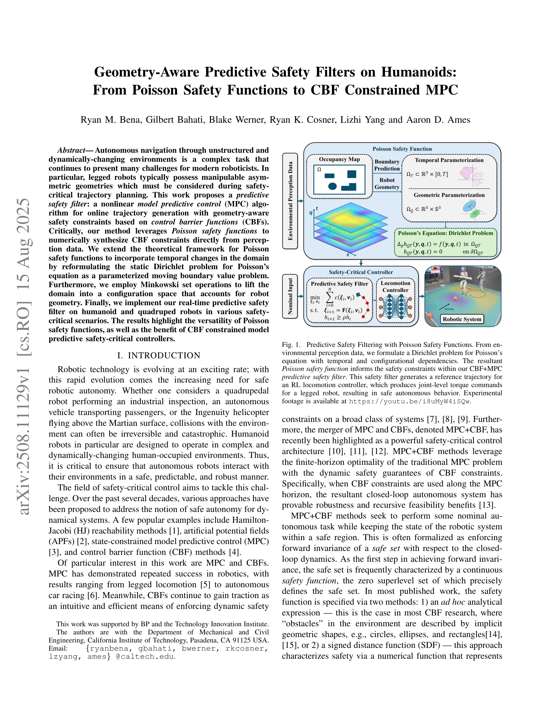

# Geometry-Aware Predictive Safety Filters on Humanoids: From Poisson Safety Functions to CBF Constrained MPC

> **저자**: Ryan M. Bena, Gilbert Bahati, Blake Werner, Ryan K. Cosner, Lizhi Yang, Aaron D. Ames | **날짜**: 2025-08-15 | **URL**: [https://arxiv.org/abs/2508.11129](https://arxiv.org/abs/2508.11129)

---

## Essence

*Fig. 1.*

본 논문은 Poisson safety function을 기반으로 한 geometry-aware predictive safety filter를 제안하며, CBF constrained MPC를 통해 humanoid 및 quadruped 로봇의 실시간 안전한 궤적 생성을 구현한다.

## Motivation

- **Known**: MPC와 CBF는 로봇의 안전-임계 제어에서 널리 사용되어 왔으며, safety function은 주로 ad hoc analytical expression 또는 SDF(signed distance function)로 정의되어 왔다.
- **Gap**: 기존 방법들은 로봇의 비대칭적 기하학적 특성과 동적으로 변화하는 환경을 고려한 geometry-aware 안전 제약을 충분히 다루지 못하며, 정적 Poisson safety function을 시간-변화하는 환경에 직접 적용하기 어렵다.
- **Why**: 로봇이 인간 환경에서 자율 네비게이션을 수행할 때 충돌은 치명적일 수 있으므로, 로봇의 기하학적 형태를 고려한 실시간 안전 제어가 중요하다.
- **Approach**: 정적 Dirichlet 문제를 moving boundary value problem으로 재구성하여 시간-변화하는 safety function을 생성하고, Minkowski set operation을 이용해 configuration space에서 로봇 기하학을 반영한 Poisson safety function을 구성한다.

## Achievement

*Fig. 1.*

- **시간-변화하는 Poisson Safety Function**: 정적 Dirichlet 문제를 parameterized moving boundary problem으로 재구성하여 미래 시간 구간에서 안전 집합의 진화를 외삽하는 safety function 개발
- **Configuration Space 확장**: Minkowski set operation을 기반으로 로봇 점유도(occupancy)를 고려한 고차원 configuration space에서의 Poisson safety function 도출
- **MPC+CBF 예측 안전 필터**: DCBF 제약을 포함한 비선형 MPC 알고리즘으로 실시간 geometry-aware 궤적 생성 구현
- **실제 로봇 검증**: Quadruped 및 humanoid 로봇을 이용한 다양한 안전-임계 시나리오에서 실험적 성능 입증

## How

*Fig. 1.*

- Poisson 방정식 ∇²h = 0을 moving boundary conditions와 함께 풀어 시간-종속 safety function h(x,t) 생성
- 로봇의 기하학적 형태를 Minkowski sum 연산으로 표현하여 configuration space에 lift
- DCBF 정의 h(F(x,u)) ≥ ρh(x)를 제약 조건으로 MPC 최적화 문제에 통합
- 단일-integrator 동역학에 대해 ||u - π_nom(x)||²를 최소화하면서 DCBF 제약을 만족하는 제어 입력 생성
- 생성된 reference trajectory를 reinforcement learning 기반 locomotion controller에 입력하여 joint-level torque command 생성

## Originality

- 정적 Poisson safety function을 동적 환경 및 moving boundary condition으로 확장한 이론적 기여
- Minkowski set operation을 통해 로봇의 비대칭 기하학을 configuration space에 정형적으로 반영하는 방법론
- Poisson safety function과 MPC+CBF를 결합한 새로운 predictive safety filter 아키텍처
- Humanoid 로봇에 적용된 geometry-aware safety constraint 설계의 실용적 구현

## Limitation & Further Study

- Poisson 방정식 해결의 계산 복잡도가 configuration space의 차원에 따라 급증할 수 있으며, 실시간 성능 확장성 평가 부족
- 실험이 주로 제어된 실험실 환경에서 수행되어 극도로 동적인 환경이나 예측 불가능한 장애물에 대한 robustness 평가 필요
- ρ ∈ [0,1] 파라미터 선택의 체계적 가이드 및 safety margin 설정에 대한 이론적 분석 부족
- 장시간 navigation task에서의 누적 오차(accumulated discretization error) 영향 분석 미흡
- 고차원 configuration space에서의 Poisson 방정식 수치 해법의 안정성 및 수렴성에 대한 이론적 보장 부재

## Evaluation

- Novelty: 4/5
- Technical Soundness: 3/5
- Significance: 4/5
- Clarity: 4/5
- Overall: 4/5

**총평**: 본 논문은 Poisson safety function을 시간-동적 환경과 로봇 기하학에 맞게 확장하고 MPC+CBF와 통합하여 실시간 안전한 자율 네비게이션을 실현한 우수한 연구이다. 이론적 확장과 실제 로봇 검증이 잘 균형을 이루고 있으며, 안전-임계 로봇 제어의 실질적 문제 해결에 기여한다.
