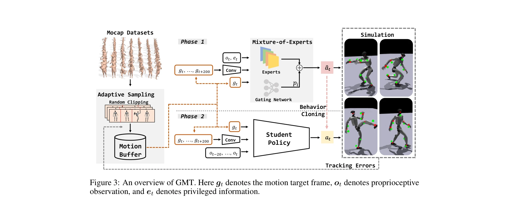
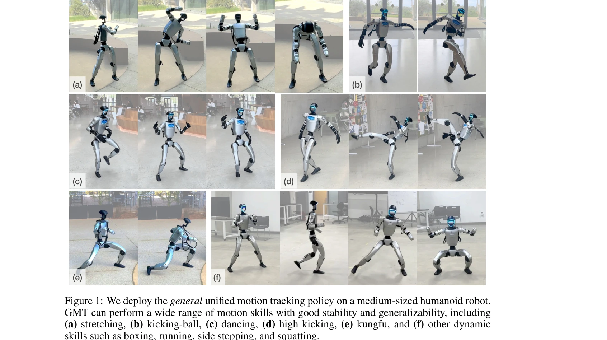

# GMT: General Motion Tracking for Humanoid Whole-Body Control

> **저자**: Zixuan Chen, Mazeyu Ji, Xuxin Cheng, Xuanbin Peng, Xue Bin Peng, Xiaolong Wang | **날짜**: 2025-06-17 | **URL**: [https://arxiv.org/abs/2506.14770](https://arxiv.org/abs/2506.14770)

---

## Essence

*Figure 3: An overview of GMT. Here gt denotes the motion target frame, ot denotes proprioceptive*

GMT는 humanoid 로봇이 다양한 전신 모션을 추적할 수 있도록 하는 통합 정책을 학습하는 프레임워크로, Adaptive Sampling 전략과 Motion Mixture-of-Experts 아키텍처를 핵심 요소로 제안한다.

## Motivation

- **Known**: Character animation 분야에서는 single unified controller로 다양한 모션을 수행하는 성공 사례들이 있으며, 최근 humanoid 로봇에서도 motion imitation 기반 제어 연구가 활발하다.
- **Gap**: 기존 연구들은 부분 관찰성, 하드웨어 제약, 불균형 데이터 분포, 모델 표현력 문제 중 일부만 해결하였으며, 진정한 의미의 unified general motion tracking controller는 아직 개발되지 못했다.
- **Why**: Humanoid 로봇이 일상 환경에서 다양한 작업을 수행하려면 광범위한 모션 기술을 보유해야 하며, 이를 위해 수작업 설계를 피하고 human motion data를 활용하는 general purpose controller가 필수적이다.
- **Approach**: GMT는 teacher-student 훈련 프레임워크 내에서 Adaptive Sampling으로 데이터 분포 불균형을 해결하고, Motion MoE 아키텍처로 모델 표현력을 향상시키며, 부분 관찰성과 하드웨어 제약을 체계적으로 처리한다.

## Achievement

*Figure 1: We deploy the general unified motion tracking policy on a medium-sized humanoid robot.*

- **Adaptive Sampling 전략**: 어려운 모션 세그먼트에 대한 샘플링 비율을 자동으로 증가시켜 AMASS 데이터셋의 불균형 문제를 해결
- **Motion MoE 아키텍처**: 모션 manifold의 다른 영역에 대한 전문화를 강화하여 단일 정책의 표현력과 일반화 능력 개선
- **실제 로봇 배포**: 중형 humanoid 로봇에서 stretching, kicking, dancing, high kicking, kung fu 등 다양한 기술을 안정적으로 수행 달성
- **State-of-the-art 성능**: 8925개 필터링된 motion clips를 사용하여 기존 방법들(ExBody2, HumanPlus, OmniH2O)을 능가하는 성능 달성

## How

*Figure 3: An overview of GMT. Here gt denotes the motion target frame, ot denotes proprioceptive*

- Teacher-student 훈련 프레임워크 도입: privileged information을 활용한 teacher policy를 PPO로 학습한 후 DAgger를 통해 student policy에 지식 이전
- Adaptive Sampling 구현: 각 motion clip의 tracking error를 추적하고 어려운 세그먼트의 샘플링 확률을 동적으로 조정
- Motion Mixture-of-Experts 구성: gating network로 현재 motion target frame에 가장 적합한 expert를 선택하여 모션 처리
- Motion input design: 미래 motion target frames를 CNN으로 처리하여 시간적 의존성 및 모션 다양성 캡처
- Dataset curation: AMASS 데이터셋을 humanoid 로봇 하드웨어 제약에 맞게 필터링하여 불가능한 모션 제거

## Originality

- **Adaptive Sampling의 동적 비율 조정**: 기존의 random clipping이나 고정 확률 기반 샘플링과 달리 실시간 tracking error에 기반한 적응형 샘플링으로 학습 효율성 극대화
- **Motion Manifold 기반 MoE**: 단순 task 분류가 아닌 motion manifold 상의 서로 다른 영역을 gating network로 자동 식별하여 전문화
- **통합 설계의 시너지**: 부분 관찰성, 하드웨어 제약, 데이터 불균형, 모델 표현력 문제를 단일 프레임워크 내에서 체계적으로 해결하는 holistic approach

## Limitation & Further Study

- 전신 제어의 상충 관계: 기존 연구들이 언급한 상체와 하체 제어 간의 본질적 충돌이 완전히 해소되었는지 불명확하며, 더 복잡한 조작 작업과의 통합 가능성 미검증
- Dataset 의존성: AMASS 데이터셋에 기반하고 있으며, 다른 humanoid 플랫폼이나 매우 다른 모션 분포에서의 일반화 능력 미실증
- Partial observability 처리의 한계: teacher-student 프레임워크가 필요하며, 실제 배포 중 예상치 못한 visual occlusion이나 센서 노이즈에 대한 robustness 부재
- 후속 연구 방향: (1) 더 큰 규모의 다양한 humanoid 플랫폼에서의 검증, (2) 적응형 정책으로의 확장을 통한 실시간 task planning 통합, (3) 제약 기반 제어와의 결합을 통한 안전성 보장

## Evaluation

- Novelty: 4/5
- Technical Soundness: 3/5
- Significance: 4/5
- Clarity: 4/5
- Overall: 4/5

**총평**: GMT는 humanoid 로봇의 general motion tracking에 대한 실질적인 해결책을 제시하며, Adaptive Sampling과 Motion MoE라는 두 가지 실용적 기법으로 기존의 산발적 접근들을 통합한 우수한 연구이다. 실제 로봇 배포 성공과 상태-최첨단 성능은 높은 가치를 제시하지만, 더 광범위한 하드웨어 검증과 이론적 분석 강화가 필요하다.

## Related Papers

- 🔄 다른 접근: [[papers/1640_ResMimic_From_General_Motion_Tracking_to_Humanoid_Whole-body/review]] — 둘 다 일반적인 모션 추적을 다루지만 GMT는 Mixture-of-Experts를, ResMimic은 residual 기법을 사용한다.
- 🔗 후속 연구: [[papers/2158_Track_Any_Motions_under_Any_Disturbances/review]] — 다양한 교란 하에서의 모션 추적이 GMT의 적응적 샘플링 전략을 보완할 수 있다.
- 🔄 다른 접근: [[papers/1985_HOVER_Versatile_Neural_Whole-Body_Controller_for_Humanoid_Ro/review]] — GMT의 통합 정책과 HOVER의 다목적 제어기는 모두 단일 모델로 다양한 휴머노이드 제어 모드를 지원하는 접근법을 제시합니다.
- 🏛 기반 연구: [[papers/2058_Learning_Humanoid_Standing-up_Control_across_Diverse_Posture/review]] — 다양한 자세에서의 기립 제어 학습이 GMT의 adaptive sampling 전략과 motion tracking 능력의 기반이 됩니다.
- 🔄 다른 접근: [[papers/1820_BeyondMimic_From_Motion_Tracking_to_Versatile_Humanoid_Contr/review]] — 둘 다 motion tracking에서 versatile control로의 발전을 다루지만, GMT는 unified policy 학습에, BeyondMimic은 tracking에서 전체적 제어로의 확장에 집중합니다.
- 🏛 기반 연구: [[papers/1743_UniTracker_Learning_Universal_Whole-Body_Motion_Tracker_for/review]] — UniTracker의 universal whole-body motion tracking 연구가 GMT의 다양한 전신 모션 추적을 위한 통합 정책 학습의 기초를 제공합니다.
- 🏛 기반 연구: [[papers/1940_Gait-Conditioned_Reinforcement_Learning_with_Multi-Phase_Cur/review]] — Gait-Conditioned의 multi-phase curriculum과 통합 정책 개념이 GMT의 Motion Mixture-of-Experts 아키텍처 설계의 기반이 됩니다.
- 🏛 기반 연구: [[papers/1685_SONIC_Supersizing_Motion_Tracking_for_Natural_Humanoid_Whole/review]] — 모션 트래킹 기반 전신 제어의 기본 개념을 대규모 모델과 통합된 토큰 공간으로 확장하여 자연스러운 움직임을 실현했다.
- 🏛 기반 연구: [[papers/1640_ResMimic_From_General_Motion_Tracking_to_Humanoid_Whole-body/review]] — GMT의 범용 모션 추적 기법이 ResMimic의 일반 모션 추적 정책 기반 잔차 학습의 핵심 기초를 제공함
- 🔗 후속 연구: [[papers/1655_Robust_and_Generalized_Humanoid_Motion_Tracking/review]] — GMT의 일반적인 모션 추적 방법론을 dynamics-conditioned aggregation으로 확장하여 노이즈에 더 강건하게 만든다.
- 🔗 후속 연구: [[papers/1691_Stabilizing_Humanoid_Robot_Trajectory_Generation_via_Physics/review]] — 모션 트래킹의 기본 개념을 물리 기반 학습과 제어 기반 보정으로 확장하여 모방학습의 안정성을 크게 향상시켰다.
- 🔄 다른 접근: [[papers/1698_Symphony_A_Heuristic_Normalized_Calibrated_Advantage_Actor_a/review]] — 둘 다 휴머노이드 전신 제어를 다루지만 이 논문은 안전한 훈련을 위한 정규화된 Actor-Critic에, GMT는 일반적인 동작 추적에 중점을 둡니다.
- 🔗 후속 연구: [[papers/1743_UniTracker_Learning_Universal_Whole-Body_Motion_Tracker_for/review]] — 일반적 모션 트래킹에서 UniTracker의 universal 접근법과 GMT의 general 접근법이 유사한 목표를 가진다.
- 🏛 기반 연구: [[papers/1753_VisualMimic_Visual_Humanoid_Loco-Manipulation_via_Motion_Tra/review]] — GMT의 일반적인 모션 추적 기술이 VisualMimic의 task-agnostic keypoint tracker 개발에 기여합니다.
- 🔄 다른 접근: [[papers/1896_EGM_Efficiently_Learning_General_Motion_Tracking_Policy_for/review]] — 일반화된 모션 추적에서 bin-based curriculum learning과 전통적인 motion tracking 접근법의 서로 다른 학습 효율성 전략을 비교한다.
- 🔗 후속 연구: [[papers/1940_Gait-Conditioned_Reinforcement_Learning_with_Multi-Phase_Cur/review]] — GMT의 일반적인 motion tracking을 gait conditioning과 multi-phase curriculum을 통해 더 세밀한 보행 제어로 특화시켰습니다.
- 🔄 다른 접근: [[papers/1929_FLAM_Foundation_Model-Based_Body_Stabilization_for_Humanoid/review]] — FLAM의 foundation model 기반 안정화와 GMT의 일반적 동작 추적은 휴머노이드 전신 제어의 서로 다른 접근방식입니다.
- 🔄 다른 접근: [[papers/1971_Heracles_Bridging_Precise_Tracking_and_Generative_Synthesis/review]] — Heracles의 state-conditioned diffusion과 GMT의 adaptive sampling은 모두 외부 교란에 대한 humanoid 적응을 위한 서로 다른 생성 모델 접근법입니다.
- 🔄 다른 접근: [[papers/1975_Hierarchical_visuomotor_control_of_humanoids/review]] — 휴머노이드 전신 제어를 이 논문은 계층적 아키텍처로, GMT는 통합된 모션 추적으로 접근한다.
- 🔄 다른 접근: [[papers/1985_HOVER_Versatile_Neural_Whole-Body_Controller_for_Humanoid_Ro/review]] — HOVER의 정책 증류 기반 통합과 GMT의 Mixture-of-Experts는 모두 다양한 제어 모드를 단일 정책으로 통합하는 서로 다른 아키텍처 접근법입니다.
- 🔄 다른 접근: [[papers/2038_KungfuBot2_Learning_Versatile_Motion_Skills_for_Humanoid_Who/review]] — 다양한 모션 스킬 학습에서 GMT는 일반적인 추적을, VMS는 전문화된 혼합 전문가 활용
- 🔄 다른 접근: [[papers/2158_Track_Any_Motions_under_Any_Disturbances/review]] — 두 논문 모두 범용적인 동작 추적을 다루지만 이 논문은 교란 적응에, GMT는 일반적인 전신 제어에 집중합니다.
- 🔗 후속 연구: [[papers/2133_PDF-HR_Pose_Distance_Fields_for_Humanoid_Robots/review]] — GMT의 일반적인 모션 추적을 휴머노이드 특화 pose distance field를 통해 더 정확하고 신뢰할 수 있는 포즈 평가로 발전시킨 연구이다.
