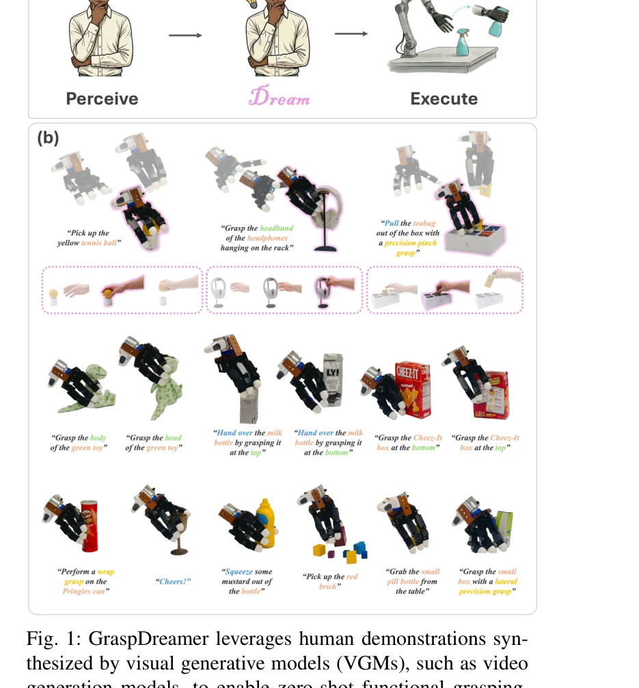
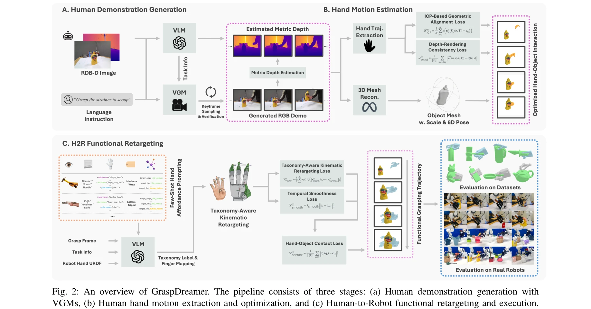

# GraspDreamer: 생성형 인간 시연 기반 기능적 파지 모방 학습

> **저자**:  | **날짜**: 2026-04-08 | **URL**: [https://arxiv.org/abs/2604.07517](https://arxiv.org/abs/2604.07517)

---

## Essence

*Fig. 1: GraspDreamer leverages human demonstrations syn-*

Visual Generative Model (VGM)으로 생성한 인간 시연 비디오로부터 기능적 파지를 학습하여 실제 데이터 수집 없이 제로샷 로봇 파지를 가능하게 하는 GraspDreamer 방법을 제안한다. 인터넷 규모의 사전학습 데이터에 인코딩된 인간-물체 상호작용 프라이어를 활용하여 데이터 효율성과 일반화 성능을 동시에 달성한다.

## Motivation

- **Known**: 기존 함수적 파지 학습은 simulation-first 합성이나 대규모 인간 시연 데이터셋 수집에 의존하며, Foundation Model을 활용한 최근 방법들도 로봇 액션으로의 간극을 메우기 위해 다량의 실제 데이터를 필요로 한다.
- **Gap**: 인터넷 규모의 사전학습 VGM에 내재된 인간 상호작용 프라이어를 로봇 파지에 직접 활용할 수 있는 방법론이 부족하며, 다양한 로봇 하드웨어에 걸쳐 일반화되는 통합 프레임워크가 없다.
- **Why**: 실제 로봇 파지 데이터 수집은 비용과 시간이 많이 소요되므로, VGM의 생성 능력을 활용하여 데이터 효율적이고 확장 가능한 솔루션이 필요하다. 또한 다양한 로봇 손(parallel-jaw gripper, Allegro, Shadow hand 등)에 일반화되는 방법이 실무 적용에 중요하다.
- **Approach**: VGM으로 태스크 지향적 인간 시연을 생성하고, VLM 기반 affordance 추론과 kinematic retargeting을 통해 인간 동작을 로봇 손에 기능적으로 재적응시키는 3단계 파이프라인을 제시한다. 손-물체 접촉 정제를 추가로 적용하여 물리적 실현 가능성을 보장한다.

## Achievement

*Fig. 3: Qualitative results on the TaskGrasp dataset. The*

- **데이터 효율성**: 실제 파지 데이터 수집 없이 VGM 기반 합성 데이터로 제로샷 기능적 파지 달성
- **벤치마크 성능**: TaskGrasp (parallel-jaw) 및 DexGraspNet (Allegro, Shadow hand) 공개 벤치마크에서 기존 방법 대비 우수한 성능과 일반화 능력 입증
- **실세계 검증**: Allegro 손과 parallel-jaw gripper의 실제 로봇 실험으로 방법의 유효성 확인
- **확장성**: 다운스트림 조작 태스크로의 자연스러운 확장 가능성 및 visuomotor policy 학습을 위한 데이터 생성 메커니즘 제시

## How

*Fig. 2: An overview of GraspDreamer. The pipeline consists of three stages: (a) Human demonstration generation with*

- VLM을 이용해 입력 언어 명령과 장면 관찰로부터 '태스크-물체-부분' 정보를 추출하여 생성 과정 정규화", 'Veo 등 VGM으로 추출된 정보를 조건으로 인간 RGB-D 시연 비디오 생성 후, VLM 검증을 통한 폐루프 생성 프로세스 적용
- Video-Depth-Anything (VDA) 모델로 생성된 비디오의 깊이맵 추정 및 메트릭 스케일 보정
- 손 궤적 최적화(hand trajectory optimization)를 통해 생성된 인간 손 동작을 시간적으로 일관성있고 물리적으로 그럴듯하게 정제
- VLM 기반 affordance 추론으로 파지 부위의 기능적 특성 파악
- Taxonomy-aware kinematic retargeting으로 인간 손 관절 구성을 로봇 손 자유도에 맞춤
- Hand-object contact refinement로 접촉 제약조건 만족 확보 후 실행 가능한 파지 구성 생성

## Originality

- VGM의 인터넷 규모 사전학습 데이터를 활용하여 노동 집약적 데이터 수집을 완전히 회피하는 혁신적 접근
- 인간 시연을 보편적 중간 표현으로 채택하여 다양한 로봇 embodiment로 유연하게 재적응 가능하게 설계
- VLM 기반 affordance 추론, taxonomy-aware retargeting, 접촉 정제를 통합한 체계적인 인간-로봇 기능적 재적응 프레임워크 제시
- Concurrent 연구들과 달리 단일 로봇 손에만 국한하지 않고 Allegro, Shadow hand, parallel-jaw gripper 등 이기종 로봇에 일반화되는 통합 방법 제안

## Limitation & Further Study

- VGM 생성 품질에 의존적이며, 복잡한 다중 손가락 상호작용이나 미묘한 기능적 제약조건은 생성된 시연에서 누락될 가능성
- VLM 검증 폐루프의 반복 필요로 인한 추론 시간 증가 가능성
- Monocular 깊이 추정의 스케일 모호성 해결 방식이 논문에서 완전히 설명되지 않음 (본문 발췌 중단)
- 실제 로봇 환경의 동적 장애물, 변수 조명, 복잡한 배경에서의 일반화 성능에 대한 광범위한 평가 필요
- 후속 연구: 더 고충실도 깊이 예측 모델 활용, 다중 모달 입력(촉각, 청각 등) 통합, 사용자 피드백 기반 적응적 재생성 메커니즘 개발 가능

## Evaluation

- Novelty: 4/5
- Technical Soundness: 3/5
- Significance: 4/5
- Clarity: 4/5
- Overall: 4/5

**총평**: GraspDreamer는 VGM의 생성 능력을 창의적으로 활용하여 기능적 파지의 데이터 수집 부담을 획기적으로 감소시키면서도 다양한 로봇 플랫폼에 일반화되는 실용적 솔루션을 제시한다. 공개 벤치마크와 실세계 실험의 광범위한 검증으로 방법의 유효성을 충실히 입증하였다.

## Related Papers

- 🔄 다른 접근: [[papers/1900_EgoDex_Learning_Dexterous_Manipulation_from_Large-Scale_Egoc/review]] — 둘 다 대규모 egocentric 데이터를 활용하지만 GraspDreamer는 생성형 모델을, EgoDex는 직접적인 조작 학습을 사용한다.
- 🔗 후속 연구: [[papers/1961_H-RDT_Human_Manipulation_Enhanced_Bimanual_Robotic_Manipulat/review]] — H-RDT의 인간 조작 사전학습이 GraspDreamer의 기능적 파지 학습을 강화할 수 있다.
- 🏛 기반 연구: [[papers/2000_Humanoid_Policy__Human_Policy/review]] — 대규모 자아중심 인간 데모 활용이라는 공통 데이터 소스를 기반으로 서로 다른 cross-embodiment 학습 방법론을 제시합니다.
- 🏛 기반 연구: [[papers/1961_H-RDT_Human_Manipulation_Enhanced_Bimanual_Robotic_Manipulat/review]] — 생성형 인간 시연 기반 학습이 H-RDT의 대규모 egocentric 데이터 활용에 기반을 제공한다.
- 🏛 기반 연구: [[papers/2083_Lightning_Grasp_High_Performance_Procedural_Grasp_Synthesis/review]] — 기능적 파지 모방 학습의 이론적 기반을 제공한다.
- 🔗 후속 연구: [[papers/2114_Object-Centric_Dexterous_Manipulation_from_Human_Motion_Data/review]] — Object-centric 다지털 조작을 생성형 기능적 파지 학습으로 확장하여 더 지능적인 물체 조작을 달성할 수 있다.
