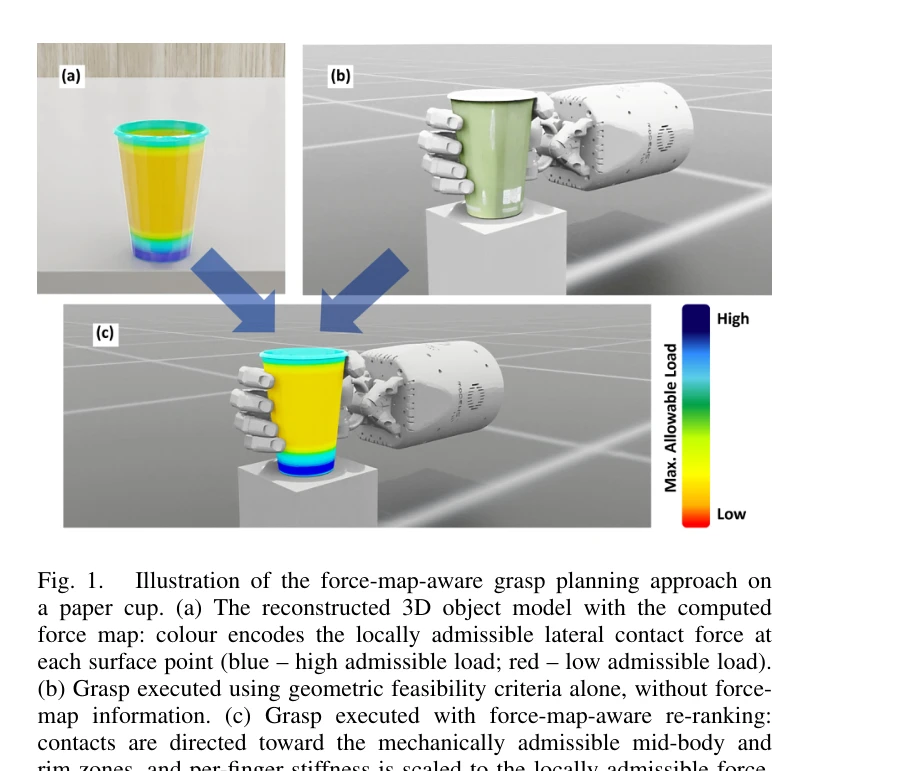

# GraspSense: 언어 기반 인지와 힘 맵을 활용한 손재주 로봇 파지 계획

> **저자**:  | **날짜**: 2026-04-07 | **URL**: [https://arxiv.org/abs/2604.05697](https://arxiv.org/abs/2604.05697)

---

## Essence

*Fig. 1.*

다섯 손가락 로봇 손의 파지 계획과 그립 실행을 위해 언어 명령으로부터 물체의 국소적 기계적 특성을 인코딩하는 힘 맵을 구성하고, 이를 파지 선택과 임피던스 제어에 통합하는 파이프라인을 제안한다.

## Motivation

- **Known**: 기존 파지 계획자들은 기하학적·운동학적 지표(안정성, 도달가능성, 충돌회피)를 기반으로 다중 손가락 파지를 생성하며, LLM과 3D 재구성 기술이 로봇 조작에 활용되고 있다.
- **Gap**: 기존 방법들은 물체 표면을 기계적으로 균질한 것으로 취급하며, 파지 선택과 그립 힘 제어를 독립적으로 처리하므로, 구조적으로 약한 영역에 대한 접촉이 손상을 초래할 수 있다.
- **Why**: 종이컵, 플라스틱, 유리 같은 실제 물체들은 국소적으로 다른 기계적 강도를 가지므로, 기하학적으로 완벽한 파지도 물리적으로 안전하지 않을 수 있으며, 이를 고려한 조작이 일상 물체 조작의 신뢰성을 결정한다.
- **Approach**: 자연언어 명령으로부터 의미를 추출하여 3D 재구성 후 physics-informed 기하 분석으로 국소 벽두께 근사를 통해 힘 맵을 구성하고, 이를 기반으로 파지 후보를 재순위화하며, 임피던스 제어로 각 접촉점의 허용 힘에 맞춰 손가락 강성을 조절한다.

## Achievement

*Fig. 1.*

- **힘 맵 구성 모듈**: 재구성된 3D 물체 모델에서 국소 벽두께의 physics-informed 기하 근사를 통해 표면 영역별로 기계적으로 안전한 최대 측면 접촉 힘을 추정하는 공간 분포 맵을 생성
- **물리 기반 파지 선택 기준**: 고전적 다중 기준 순위화(안정성, 도달가능성, 충돌회피)를 확장하여 힘 맵 인식 재순위화 단계를 추가, 기하학적으로 동등한 후보 중 기계적으로 허용 가능한 접촉 영역을 가진 파지를 선택
- **임피던스 기반 그립 실행 전략**: 각 접촉점의 국소 허용 힘에 따라 손가락별 강성을 조절하여 물체 구조에 대해 안전하면서도 신뢰성 있는 파지 유지를 구현
- **통합 파이프라인**: 자연언어 명령에서 그립 실행까지 Isaac Sim에서 통합하여 종이, 플라스틱, 유리 컵 등 세 가지 재료의 컵형 물체에서 검증, 일관되게 구조적으로 강한 접촉 영역 선택과 안전한 그립 힘 범위 유지 확인

## How

*Fig. 2.*

- Qwen LLM이 자연언어 명령을 파싱하여 목표 물체(O), 동작 유형(a), 상호작용 모드(λ)를 추출
- YOLO-World로 개방어휘 물체 검출, SAM으로 픽셀 정확 이진 마스크 생성, SAM3D로 3D 재구성 수행
- 재구성된 모델을 Isaac Sim으로 변환하여 physics-informed 기하 분석 수행
- 국소 벽두께 근사를 통해 각 표면 위치에서 변형 없이 허용 가능한 최대 측면 접촉 힘을 인코딩하는 힘 맵 계산
- DexGraspNet 등의 생성 모델로 파지 후보 생성 후 기하학적 유효성과 작업 목표 일관성으로 필터링
- 고전적 지표로 비교 가능한 후보들을 힘 맵 인식 기준으로 재순위화하여 기계적으로 허용 가능한 영역의 접촉을 선호
- 임피던스 제어기가 각 손가락의 강성을 접촉점의 국소 허용 힘에 따라 스케일링하여 파지 실행

## Originality

- 기존 파지 계획에서 기하학적·운동학적 기준만 고려하던 패러다임을 벗어나 국소적 기계적 특성을 명시적으로 통합하는 첫 시도
- 3D 재구성으로부터 국소 벽두께를 근사하여 물리 기반 힘 맵을 자동으로 구성하는 새로운 방법론
- 힘 맵을 파지 선택과 임피던스 제어의 두 단계에서 모두 활용하여 파지 생성과 그립 실행을 물리적으로 통합
- 자연언어 명령으로부터 시작하여 구조 분석, 파지 계획, 힘 제어까지 일관된 완전 파이프라인 구현

## Limitation & Further Study

- 현재는 컵형 물체에 대해서만 검증되었으므로, 복잡한 기하학적 형태와 비균질 재료 구성에 대한 일반화 필요
- 힘 맵 구성이 국소 벽두께 근사에 의존하므로, 정확한 재료 특성(탄성 계수, 항복 강도 등)에 대한 정량적 모델이 필요
- SAM3D와 물리 시뮬레이션 기반 분석의 계산 비용 및 실시간 적용 가능성에 대한 논의 부재
- 실제 로봇 하드웨어(Shadow Hand 등)에서의 실험 검증이 시뮬레이션 기반으로만 수행됨
- 후속 연구에서 다양한 재료, 형태, 취약성을 가진 물체로 확장 및 실제 하드웨어 검증 필요

## Evaluation

- Novelty: 4/5
- Technical Soundness: 3/5
- Significance: 4/5
- Clarity: 4/5
- Overall: 4/5

**총평**: 이 논문은 기하학적 파지 계획의 오랜 한계를 인식하고 물리 기반 구조 분석을 통해 국소적 기계적 안전성을 파지 선택과 힘 제어에 통합하는 창의적인 접근법을 제시하며, 완전한 파이프라인 구현과 검증으로 실용적 가치를 보여준다.
