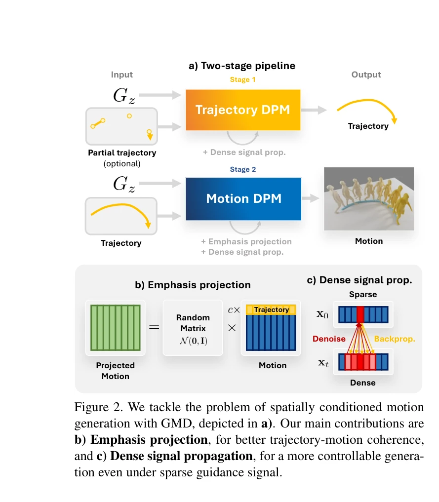
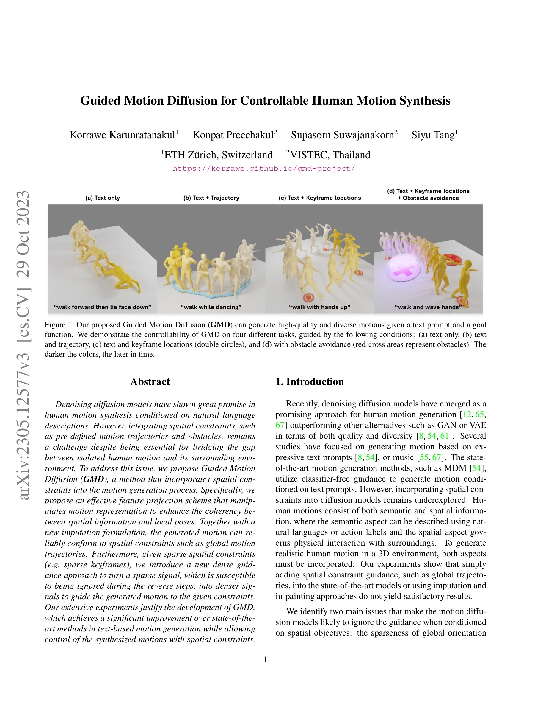

# Guided Motion Diffusion for Controllable Human Motion Synthesis

> **저자**: Korrawe Karunratanakul, Konpat Preechakul, Supasorn Suwajanakorn, Siyu Tang | **날짜**: 2023-05-21 | **URL**: [https://arxiv.org/abs/2305.12577](https://arxiv.org/abs/2305.12577)

---

## Essence

*Figure 2. We tackle the problem of spatially conditioned motion*

Guided Motion Diffusion (GMD)는 자연어 설명과 공간적 제약(궤적, 키프레임, 장애물 회피)을 동시에 고려하여 인간의 모션을 합성하는 diffusion model 기반 방법을 제안한다.

## Motivation

- **Known**: Denoising diffusion model은 자연어 기반 인간 모션 합성에서 우수한 성능을 보이고 있으며, classifier-free guidance를 통해 조건부 생성이 가능하다.
- **Gap**: 기존 diffusion 기반 모션 생성 방법은 텍스트 조건에는 강하지만 전역 궤적이나 장애물 회피 같은 공간적 제약을 통합하기 어렵고, 특히 sparse guidance 신호를 무시하는 경향이 있다.
- **Why**: 현실적인 3D 환경에서 인간 모션을 합성하려면 의미론적 정보(텍스트)와 공간적 정보(궤적, 장애물)를 동시에 고려해야 하며, 이는 애니메이션, 게임, VR 등 많은 응용 분야에서 필수적이다.
- **Approach**: Motion representation 내에서 전역 방향 정보의 중요도를 증가시키는 emphasis projection과 sparse 신호를 dense 신호로 확장하는 dense signal propagation 기법을 제안하여 공간 제약 조건의 coherency를 향상시킨다.

## Achievement

*Figure 1. Our proposed Guided Motion Diffusion (GMD) can generate high-quality and diverse motions given a text prompt a*

- **Emphasis projection**: 모션 representation에서 지역 자세와 전역 방향 간의 불균형을 해결하여 공간 정보의 중요도를 조정함으로써 spatial guidance 신호가 노이즈로 무시되는 문제를 완화
- **Dense signal propagation**: Reinforcement Learning의 credit assignment 개념을 차용하여 sparse keyframe이나 궤적 점을 denoiser를 통해 인접 프레임으로 역전파함으로써 dense guidance 신호 생성
- **GMD 프레임워크**: 위 두 기법을 통합한 U-Net 기반 아키텍처로 텍스트와 공간적 제약을 동시에 처리 가능한 최초의 모션 생성 방법 제시
- **다중 태스크 적용성**: 궤적 조건화, 키프레임 조건화, 장애물 회피 등 다양한 공간 제어 작업에서 우수한 성능 달성
- **SOTA 달성**: 기존 텍스트 기반 모션 생성 방법 대비 유의미한 성능 향상

## How

*Figure 2. We tackle the problem of spatially conditioned motion*

- **두 단계 파이프라인**: Stage 1에서 trajectory DPM으로 공간 궤적 생성, Stage 2에서 Motion DPM으로 최종 모션 생성
- **Emphasis projection**: 모션 representation 벡터에서 전역 방향(4차원)과 지역 자세(259차원)의 불균형을 random matrix를 통한 feature projection으로 조정
- **새로운 imputation 공식화**: Projected space에서 기존 inpainting 기법을 동작 가능하도록 수정
- **Dense signal propagation**: Sparse guidance point를 denoiser의 역전파(backpropagation)를 통해 이웃 프레임으로 확산하여 dense guidance 신호 생성
- **Classifier-free guidance 통합**: 텍스트 조건과 공간 조건을 unified framework에서 결합

## Originality

- 모션 representation 내 구성 요소 간 중요도 불균형을 명시적으로 식별하고 이를 해결하는 emphasis projection 기법의 독창성
- Sparse guidance 문제를 RL의 credit assignment와 연계하여 해석하고, denoiser 역전파를 통한 signal propagation이라는 새로운 솔루션 제시
- 기존 inpainting 기법을 projected space에서 동작하도록 재공식화하여 이론적 근거 제공
- 텍스트와 공간적 제약을 unified diffusion framework에서 처리하는 최초 시도

## Limitation & Further Study

- Emphasis projection의 하이퍼파라미터(projection 강도 등) 선택에 대한 명확한 가이드라인 부족
- Dense signal propagation이 denoiser를 여러 번 역전파해야 하므로 계산 비용이 증가할 가능성
- 극도로 복잡한 다중 제약 조건(여러 궤적 + 장애물 회피 동시) 처리 능력에 대한 평가 제한
- 후속 연구: (1) 다양한 motion representation에 대한 emphasis projection의 일반화, (2) 계산 효율성 개선, (3) 더 복잡한 공간-의미론 상호작용 모델링

## Evaluation

- Novelty: 4/5
- Technical Soundness: 4/5
- Significance: 4/5
- Clarity: 4/5
- Overall: 4/5

**총평**: GMD는 모션 생성의 중요한 미충족 요구(공간적 제약 통합)를 새로운 관점에서 해결하며, emphasis projection과 dense signal propagation이라는 두 가지 우아하고 일반적인 기법으로 강력한 성과를 달성한 고품질의 논문이다.
