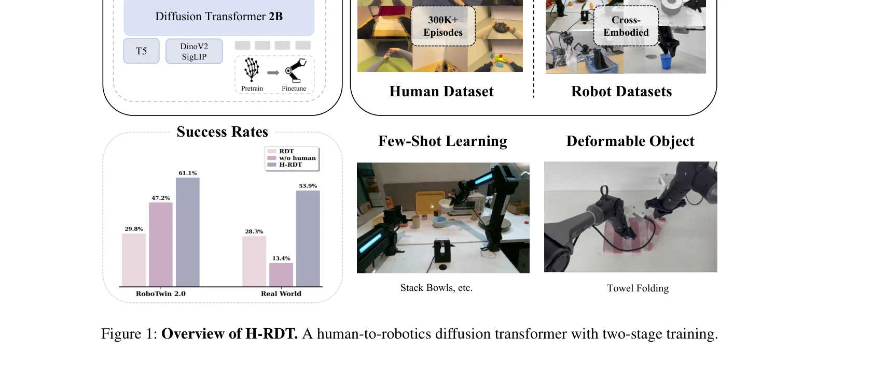
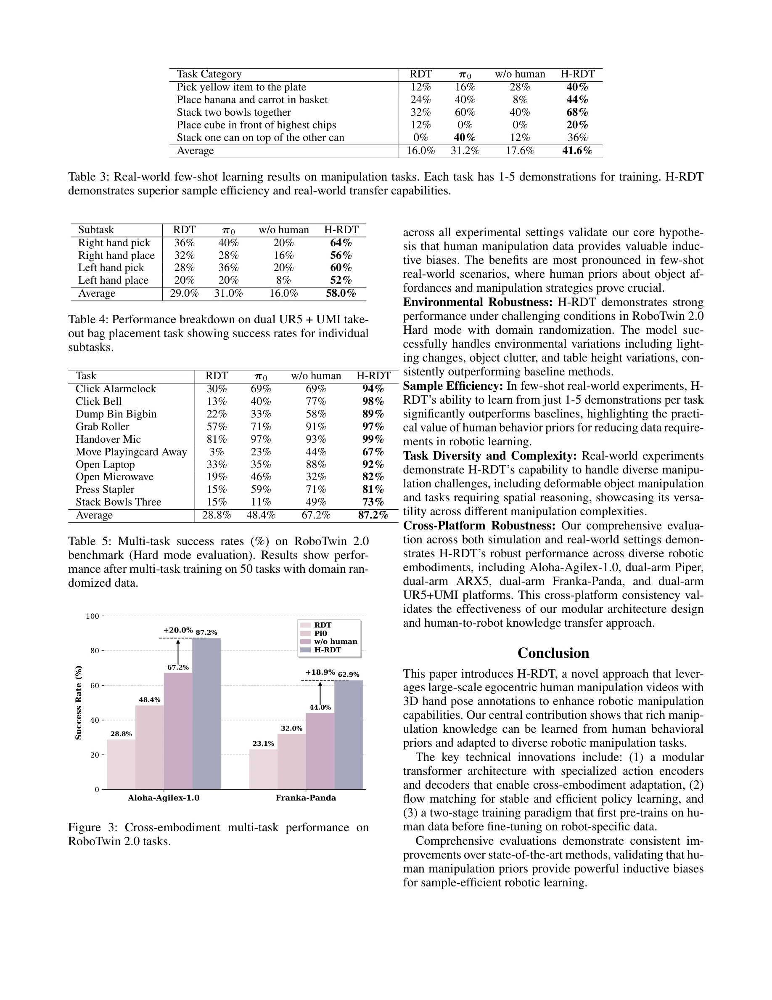

# H-RDT: Human Manipulation Enhanced Bimanual Robotic Manipulation

> **저자**: Hongzhe Bi, Lingxuan Wu, Tianwei Lin, Hengkai Tan, Zhizhong Su, Hang Su, Jun Zhu | **날짜**: 2025-07-31 | **URL**: [https://arxiv.org/abs/2507.23523](https://arxiv.org/abs/2507.23523)

---

## Essence

*Figure 1: Overview of H-RDT. A human-to-robotics diffusion transformer with two-stage training.*

H-RDT는 대규모 egocentric 인간 조작 데이터로 사전학습하고 모듈식 action encoder/decoder를 통해 다양한 로봇에 fine-tuning하는 두 단계 diffusion transformer 기반 접근법으로, 로봇 조작 학습을 향상시킨다.

## Motivation

- **Known**: 최근 robotic foundation model들은 cross-embodiment robot dataset으로 사전학습하여 데이터 규모를 증가시키고 있으나, 서로 다른 로봇 embodiment의 diverse morphology와 action space로 인해 unified training이 어렵다. 로봇 demonstration 데이터는 teleopertion 의존으로 인해 수집 비용이 높고 확장성이 제한된다.
- **Gap**: 기존 cross-embodiment 사전학습은 heterogeneous robot dataset에만 의존하여 데이터 규모와 품질이 제한되며, 대규모의 readily accessible한 인간 조작 데이터(예: 829시간의 EgoDex)의 잠재력을 충분히 활용하지 못하고 있다. 이전 human-to-robot 연구들도 modest scale(2k~27k demos)에서만 작동했다.
- **Why**: 대규모 egocentric human manipulation 데이터는 object affordances, 자연스러운 manipulation strategies, task decomposition patterns 같은 풍부한 behavioral priors를 제공하여, 로봇 policy learning의 data scarcity 문제를 해결하고 cross-embodiment generalization을 개선할 수 있다.
- **Approach**: H-RDT는 flow matching 기반 2B parameter diffusion transformer로 338k 인간 조작 에피소드에서 먼저 사전학습하고, 모듈식 action encoder/decoder를 통해 다양한 로봇에 cross-embodiment fine-tuning한다. 이를 통해 통일된 human embodiment에서 학습한 manipulation knowledge를 diverse robot platform으로 효과적으로 전이시킨다.

## Achievement

*Figure 3: Cross-embodiment multi-task performance on*

- **데이터 효율성**: simulation에서 training from scratch 대비 13.9%, real-world에서 40.5% 성능 향상을 달성하여 인간 manipulation 사전학습의 효과를 입증
- **최신 기술 초과**: π0와 RDT 포함 기존 state-of-the-art 방법들을 bimanual robotic manipulation에서 능가
- **대규모 인간 데이터 활용**: 338k 에피소드(829시간)의 EgoDex 데이터를 사용하여 이전 방법(2k~27k demos)의 수십 배 규모로 확장
- **포괄적 평가**: simulation, real-world, single-task, multitask, few-shot learning, robustness를 포함한 광범위한 실험으로 강력한 검증
- **모듈식 전이 구조**: 모듈식 action encoder/decoder 설계로 humanoid-specific 가정 없이 임의의 로봇 morphology로 일반화

## How

*Figure 2: H-RDT framework. Our approach consists of two main stages: (1) pre-training on large-scale human manipulation*

- **두 단계 학습**: (1) 대규모 egocentric human manipulation video(EgoDex)에서 diffusion transformer 사전학습, (2) 모듈식 action encoder/decoder를 통한 robot-specific cross-embodiment fine-tuning
- **Flow matching**: 기존 diffusion 대비 향상된 안정성과 효율성을 제공하는 training paradigm 적용
- **멀티모달 입력**: 다양한 RGB camera로부터의 visual observation, proprioceptive robot state, language instruction을 통합
- **Modular action adapters**: human action space를 각 로봇의 특정 action space(예: joint positions, end-effector poses)로 변환하는 embodiment-specific encoder/decoder
- **Diffusion transformer 아키텍처**: 2B parameter transformer로 복잡한 action distribution을 모델링하여 multimodal action generation 수행

## Originality

- **대규모 인간 데이터 활용**: 이전의 modest scale(2k~27k) 인간 데이터 사용과 달리 338k 에피소드로 확장하여 체계적으로 human behavioral prior의 잠재력 활용
- **모듈식 human-to-robot 전이**: humanoid-specific 가정(EgoMimic의 co-training, HAT의 differentiable retargeting)을 벗어나 임의의 로봇 morphology로 generalize 가능한 modular adapter 설계
- **데이터 불일치 해결**: unified human embodiment의 behavioral prior로 heterogeneous robot dataset의 conflict 문제를 완화하면서 대규모 사전학습 이점 확보
- **Flow matching 도입**: RDT 기반 아키텍처에 flow matching을 적용하여 training stability와 efficiency 개선

## Limitation & Further Study

- **embodiment 간극**: 인간과 로봇의 손가락 개수, end effector 타입, forward kinematics 차이는 여전히 modular adapter의 설계 복잡도를 증가시키며, 이러한 간극을 완전히 극복했는지 불명확
- **인간 데이터 특성의 영향**: EgoDex 데이터셋의 특정 collection protocol, annotator skill, 편향이 학습된 policy에 미치는 영향에 대한 분석 부족
- **평가의 제한성**: real-world 실험이 특정 로봇 embodiment(bimanual manipulation robot)에 주로 집중되어 있어 diverse robot morphology에 대한 generalization 검증이 미흡
- **few-shot 학습 상세 분석 부족**: few-shot 설정에서의 개선 메커니즘(human prior의 initialization 효과 vs. in-context learning)에 대한 심층 분석 필요
- **후속연구**: (1) transformer architecture 이외의 policy class에 대한 human data transfer 가능성, (2) domain gap 감소를 위한 human-robot data 혼합 비율 최적화, (3) 실시간 ODE inference의 computational cost 감소 방안 탐색

## Evaluation

- Novelty: 4/5
- Technical Soundness: 4/5
- Significance: 4/5
- Clarity: 4/5
- Overall: 4/5

**총평**: H-RDT는 대규모 egocentric human manipulation 데이터의 가치를 체계적으로 입증하면서, 모듈식 전이 구조를 통해 diverse robot platform으로의 확장 가능성을 보여준 혁신적 연구이다. 광범위한 실험과 강력한 empirical 결과가 robotic manipulation 학습의 data scarcity 문제 해결에 실질적인 기여를 하고 있다.
