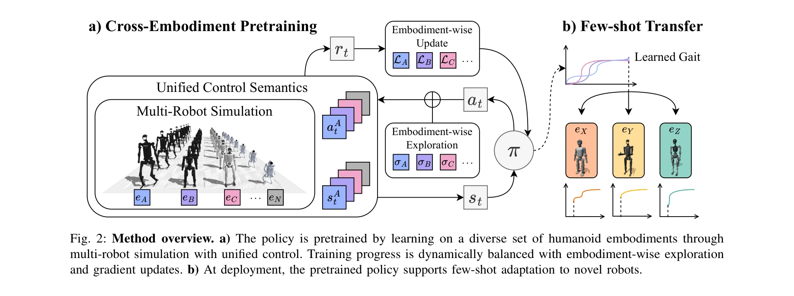
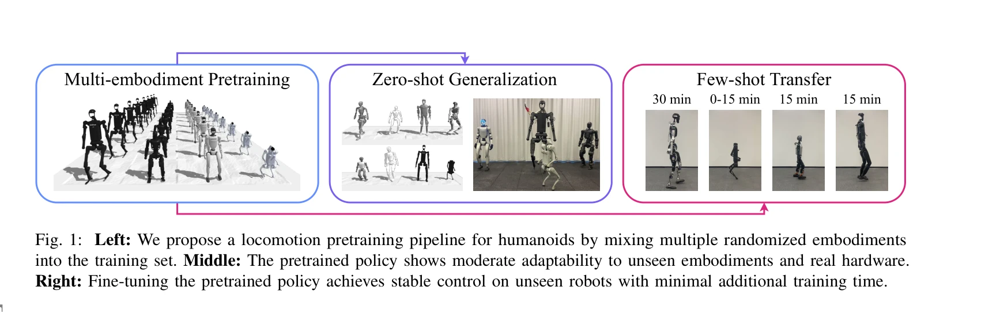

# H-Zero: Cross-Humanoid Locomotion Pretraining Enables Few-shot Novel Embodiment Transfer

> **저자**: Yunfeng Lin, Minghuan Liu, Yufei Xue, Ming Zhou, Yong Yu, Jiangmiao Pang, Weinan Zhang | **날짜**: 2025-11-30 | **URL**: [https://arxiv.org/abs/2512.00971](https://arxiv.org/abs/2512.00971)

---

## Essence

*Fig. 2: Method overview. a) The policy is pretrained by learning on a diverse set of humanoid embodiments through*

H-Zero는 다양한 휴머노이드 로봇 embodiment에서 사전학습된 일반화된 이동 정책을 학습하여 미지의 로봇으로의 제로샷 및 소수샷 전이를 가능하게 하는 파이프라인이다.

## Motivation

- **Known**: Deep reinforcement learning은 물리 시뮬레이션과 domain randomization을 통해 로봇 이동 제어기 학습에 성공했으나, 기존 방법은 특정 로봇 설계에 맞춘 것으로 새로운 embodiment마다 광범위한 재학습이 필요하다.
- **Gap**: 다양한 휴머노이드 플랫폼 간의 높은 자유도, 가변 morphology, 동적 물리 상호작용으로 인해 일반화된 제어기를 개발하기 어렵고, 특히 이러한 제어기가 최소한의 미세조정으로 신규 embodiment에 빠르게 적응할 수 있는 방법이 부족하다.
- **Why**: 휴머노이드 로봇 플랫폼의 다양화로 각 로봇마다 맞춤형 제어기를 개발하는 것은 비용이 많이 들기 때문에, 새로운 embodiment에 최소한의 학습 시간과 자원으로 적응할 수 있는 scalable한 해결책이 중요하다.
- **Approach**: 통일된 제어 의미론(unified control semantics)을 통해 다양한 embodiment의 입출력을 표준화하고, 물리 parameter 무작위화, 다양한 관찰, 다양한 환경 rollout 및 탐색 학습 전략을 포함한 cross-embodiment 다양성을 통해 일반화된 기본 정책을 학습한다.

## Achievement

*Fig. 1: Left: We propose a locomotion pretraining pipeline for humanoids by mixing multiple randomized embodiments*

- **통일된 제어 인터페이스**: 상태 변환(state transformation)을 통해 diverse humanoid embodiment 간의 정책 입출력을 표준화하는 hardware-agnostic joint state space 개발
- **제로샷 전이 성능**: 미지의 로봇에서 사전학습된 정책이 전체 episode duration의 최대 81% 유지
- **빠른 소수샷 적응**: 30분 이내의 미세조정으로 미지의 humanoid 및 upright quadruped에 대한 안정적인 제어 달성
- **현실 세계 전이**: 시뮬레이션에서 학습한 사전학습 및 미세조정된 정책이 실제 로봇에서도 일관된 성능 유지

## How

*Fig. 2: Method overview. a) The policy is pretrained by learning on a diverse set of humanoid embodiments through*

- 통일된 제어 의미론: 각 로봇의 물리 joint를 hardware-agnostic unified environment space로 매핑하는 bidirectional transformation M 정의
- Kinematic alignment: joint direction 조정 s와 중립 위치 offset b를 통해 diverse morphology 간의 일관된 motion 보장
- Embodiment descriptor: embodiment별 특성을 policy에 제공하여 cross-embodiment 학습 지원
- Embodiment-wise exploration과 gradient update: 학습 중 다양한 embodiment으로부터의 경험으로 균형잡힌 정책 학습
- Physical parameter randomization: 링크 길이, 질량 분포 등의 물리 변수 무작위화로 generalization 향상
- Multi-embodiment 사전학습 후 소수샷 미세조정: 기존 로봇 세트에서의 사전학습으로 학습된 표현을 신규 embodiment에 빠르게 적응

## Originality

- Unified control semantics 프레임워크: GNN이나 Transformer와 달리 간단한 kinematic alignment를 통해 embodiment 간의 표준화된 제어 인터페이스 제공하는 점이 혁신적
- 제한된 embodiment 세트에서의 사전학습이 새로운 morphology (humanoid 및 quadruped)로의 광범위한 전이를 가능하게 하는 것이 기존 procedural generation 방식보다 효율적
- 30분의 미세조정으로 실제 로봇 배포를 가능하게 하는 practical 접근: 기존 cross-embodiment 학습의 계산 비용 문제를 크게 개선

## Limitation & Further Study

- 사전학습 embodiment 세트의 선택이 신규 embodiment의 성능에 중요한 영향을 미칠 가능성 있음 - embodiment 선택 가이드라인 부재
- 실험이 주로 humanoid와 upright quadruped에 집중되어 있어 더 다양한 legged locomotion 형태(hexapod 등)로의 확장성 미검증
- 논문에서 제시된 81% episode duration 유지율이 특정 task에 대해 아직 충분하지 않을 수 있으므로, 더 복잡한 navigation task나 불규칙한 지형에서의 성능 평가 필요
- 후속 연구: (1) embodiment 분포 최적화를 위한 자동 선택 메커니즘 개발, (2) 극단적으로 다른 morphology를 포함한 broader generalization 범위 확대, (3) real-world multi-robot 학습 시나리오에서의 온라인 적응 메커니즘

## Evaluation

- Novelty: 4/5
- Technical Soundness: 3/5
- Significance: 4/5
- Clarity: 4/5
- Overall: 4/5

**총평**: H-Zero는 unified control semantics를 통해 실용적이고 확장 가능한 cross-embodiment 이동 제어 솔루션을 제시하며, 30분의 미세조정으로 신규 로봇에 적응할 수 있는 점에서 현실 배포 관점에서 큰 의의가 있다. 다만 embodiment 선택의 체계화와 더 다양한 형태의 로봇으로의 일반화 능력 검증이 필요하다.

## Related Papers

- 🏛 기반 연구: [[papers/1943_GBC_Generalized_Behavior-Cloning_Framework_for_Whole-Body_Hu/review]] — GBC의 cross-humanoid 행동 모방이 H-Zero의 locomotion pretraining에 이론적 기반을 제공한다.
- 🔗 후속 연구: [[papers/2122_One_Policy_but_Many_Worlds_A_Scalable_Unified_Policy_for_Ver/review]] — One Policy but Many Worlds의 확장 가능한 통합 정책이 H-Zero의 few-shot 전이를 보완할 수 있다.
- 🔄 다른 접근: [[papers/1987_HuBE_Cross-Embodiment_Human-like_Behavior_Execution_for_Huma/review]] — H-Zero의 cross-humanoid locomotion과 HuBE의 cross-embodiment behavior는 모두 서로 다른 로봇 간 기술 전이를 다루되 초점이 다릅니다.
- 🔗 후속 연구: [[papers/2013_HumanX_Toward_Agile_and_Generalizable_Humanoid_Interaction_S/review]] — H-Zero의 다양한 embodiment 사전학습을 HumanX가 상호작용 스킬로 확장하여 더 복잡한 humanoid 행동을 학습합니다.
- 🏛 기반 연구: [[papers/2153_Towards_Adaptive_Humanoid_Control_via_Multi-Behavior_Distill/review]] — 다중 행동 증류를 통한 적응형 humanoid 제어가 H-Zero의 cross-embodiment 전이 학습의 이론적 기반을 제공합니다.
- 🔗 후속 연구: [[papers/1621_PPF_Pre-training_and_Preservative_Fine-tuning_of_Humanoid_Lo/review]] — PPF의 pre-training과 fine-tuning 개념을 cross-humanoid에서 few-shot novel embodiment로의 일반화까지 확장한 포괄적인 프레임워크입니다.
- 🔄 다른 접근: [[papers/1665_Scalable_and_General_Whole-Body_Control_for_Cross-Humanoid_L/review]] — 둘 다 cross-humanoid locomotion을 다루지만, H-Zero는 사전학습 기반 few-shot 전이에, Scalable Whole-Body Control은 일반적인 확장성에 집중합니다.
- 🏛 기반 연구: [[papers/1944_General_Humanoid_Whole-Body_Control_via_Pretraining_and_Fast/review]] — FAST의 pretraining과 fast adaptation 프레임워크가 H-Zero의 cross-humanoid pretraining과 zero-shot 전이의 기술적 기반을 제공합니다.
- 🔄 다른 접근: [[papers/1665_Scalable_and_General_Whole-Body_Control_for_Cross-Humanoid_L/review]] — 두 논문 모두 교차-휴머노이드 일반화를 다루지만, 전신 제어와 보행 사전학습이라는 다른 접근을 사용한다.
- 🏛 기반 연구: [[papers/1634_Realistic_Lip_Motion_Generation_Based_on_3D_Dynamic_Viseme_a/review]] — H-RDT의 인간 시연 기반 조작 학습이 입술 운동의 coarticulation 모델링에 필요한 인간 발화 패턴 이해를 제공한다
- 🏛 기반 연구: [[papers/1906_Embodiment-Aware_Generalist_Specialist_Distillation_for_Unif/review]] — H-Zero의 cross-humanoid locomotion pretraining이 EAGLE의 embodiment-aware 다중 로봇 제어를 위한 기본적인 사전 학습 방법론을 제공한다.
- 🏛 기반 연구: [[papers/1934_From_Experts_to_a_Generalist_Toward_General_Whole-Body_Contr/review]] — H-Zero의 cross-humanoid pretraining 개념이 BumbleBee의 generalist controller 학습에 필요한 다양성과 일반화 능력의 기반을 제공합니다.
- 🔗 후속 연구: [[papers/1943_GBC_Generalized_Behavior-Cloning_Framework_for_Whole-Body_Hu/review]] — H-Zero의 cross-humanoid 사전학습이 GBC의 통합 행동 모방 프레임워크를 강화할 수 있다.
- 🔄 다른 접근: [[papers/1987_HuBE_Cross-Embodiment_Human-like_Behavior_Execution_for_Huma/review]] — HuBE의 인간-유사 행동 실행과 H-Zero의 locomotion 중심 접근법은 cross-embodiment 전이에서 서로 다른 행동 범위를 다룹니다.
- 🔄 다른 접근: [[papers/2068_Learning_to_Get_Up_Across_Morphologies_Zero-Shot_Recovery_wi/review]] — 두 논문 모두 교차 휴머노이드 일반화를 다루지만 통합 복구 정책은 낙상에, H-Zero는 보행에 중점을 둔다.
- 🔄 다른 접근: [[papers/2123_One-shot_Adaptation_of_Humanoid_Whole-body_Motion_with_Walki/review]] — 둘 다 few-shot humanoid control이지만 One-shot Adaptation은 motion adaptation에, H-Zero는 cross-humanoid pretraining에 중점을 둔다
