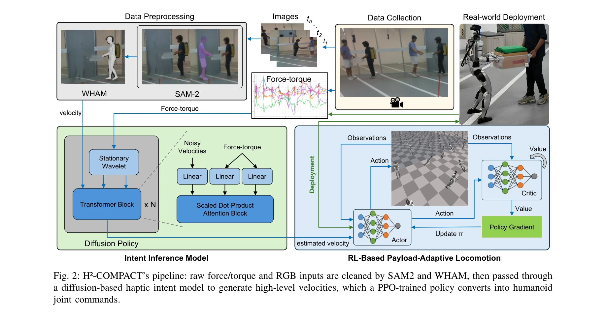
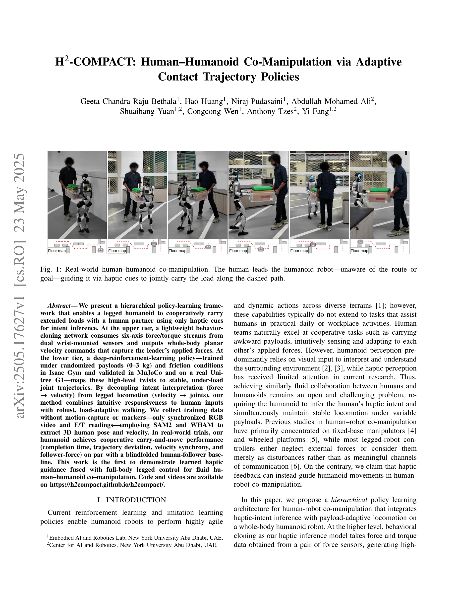

# H2-COMPACT: Human-Humanoid Co-Manipulation via Adaptive Contact Trajectory Policies

> **저자**: Geeta Chandra Raju Bethala, Hao Huang, Niraj Pudasaini, Abdullah Mohamed Ali, Shuaihang Yuan, Congcong Wen, Anthony Tzes, Yi Fang | **날짜**: 2025-05-23 | **URL**: [https://arxiv.org/abs/2505.17627](https://arxiv.org/abs/2505.17627)

---

## Essence

*Fig. 2: H²-COMPACT’s pipeline: raw force/torque and RGB inputs are cleaned by SAM2 and WHAM, then passed through*

힘각 센서 기반 haptic intent inference와 reinforcement learning 기반 locomotion policy를 계층적으로 결합하여 인간-휴머노이드 협력 물체 운반을 실현한다.

## Motivation

- **Known**: 고정형 매니퓨레이터와 바퀴 로봇에서의 물리적 인간-로봇 협작이 연구되었으나, legged humanoid의 전신 동작 제어와 haptic intent inference를 통합한 연구는 미흡하다.
- **Gap**: humanoid의 하체 폐색으로 인해 vision 기반 감지가 어려운 co-manipulation 환경에서, force/torque 신호만으로 human intent를 해석하고 동시에 payload-adaptive locomotion을 수행하는 방법이 부재하다.
- **Why**: humanoid가 인간의 자연스러운 협력 활동(무거운 물체 운반 등)에 참여할 수 있다면 실무 환경에서의 실용성이 획기적으로 높아진다.
- **Approach**: Behavior cloning으로 force/torque→whole-body velocity 매핑을 학습하고, PPO 기반 정책으로 velocity→joint trajectory 제어를 학습하여 계층적 분리를 통해 robust co-manipulation을 구현한다.

## Achievement

*Fig. 1: Real-world human–humanoid co-manipulation. The human leads the humanoid robot—unaware of the route or*

- **Hierarchical Policy Learning**: Force-to-velocity intent inference와 velocity-to-joint locomotion을 분리하여 직관적 responsiveness와 robust control의 조합 달성
- **Haptic Intent Inference Model**: Multi-resolution stationary wavelet transform과 diffusion policy를 활용한 compact force/torque 처리로 minimal sensor data만으로 human intent 학습
- **Vision-only Data Collection**: Motion-capture 없이 RGB video와 F/T sensor만으로 SAM2, WHAM을 활용한 human pose/velocity 추출
- **Sim-to-Real Validation**: Isaac Gym의 randomized payloads (0-3 kg) 및 friction 조건 학습, MuJoCo와 실제 Unitree G1 humanoid에서 검증
- **Human-level Performance**: Blindfolded human-follower baseline과 comparable한 completion time, trajectory deviation, velocity synchrony, follower-force 달성

## How

*Fig. 2: H²-COMPACT’s pipeline: raw force/torque and RGB inputs are cleaned by SAM2 and WHAM, then passed through*

- Dual ATI Mini-40/45 센서에서 6-axis force/torque 수집 (T=H×S 샘플)
- Stationary wavelet transform으로 multi-resolution force/torque encoding (approximation coefficients 추출)
- Cross-attention Transformer 기반 conditional diffusion policy로 (F,τ) → (vx, vy, ωz) 매핑
- DDIM sampling으로 inference time에 deterministic velocity 생성
- PPO로 high-level velocity commands를 humanoid joint angles로 변환하는 locomotion policy 학습
- Isaac Gym에서 randomized payloads와 friction으로 robust policy 사전학습
- SAM2로 배경 제거, WHAM으로 3D human pose/velocity 추출하여 supervision 생성
- Real Unitree G1 humanoid에서 human-humanoid co-manipulation 실험 평가

## Originality

- Legged humanoid의 전신 제어와 haptic intent inference의 최초 통합 (기존: fixed-base arm, wheeled platform)
- Motion-capture free 데이터 수집 파이프라인 (SAM2 + WHAM 활용)
- Multi-resolution wavelet transform + diffusion policy 기반 compact haptic inference model의 설계
- Randomized payload/friction 조건에서의 load-adaptive locomotion policy 학습
- Human-human baseline과의 정량적 비교를 통한 co-manipulation 성능 검증

## Limitation & Further Study

- Payload range이 0-3 kg로 제한적이며, 더 무거운 물체의 운반 가능성 미검증
- 현재 framework는 planar motion (vx, vy, ωz)만 지원하며, 수직 방향 제어 미지원
- Diffusion policy의 inference latency 및 computational cost에 대한 상세 분석 부재
- 다양한 환경 (계단, 좁은 공간 등)에서의 generalization 성능 미평가
- Human leader의 intent가 ambiguous한 상황에서의 policy 행동 분석 필요
- 다중 인간-로봇 팀 확장 가능성에 대한 논의 부재

## Evaluation

- Novelty: 4/5
- Technical Soundness: 3/5
- Significance: 4/5
- Clarity: 4/5
- Overall: 4/5

**총평**: Haptic-based intent inference와 force-adaptive legged locomotion의 계층적 결합으로 인간-휴머노이드 협력 물체 운반의 새로운 패러다임을 제시하며, motion-capture free 데이터 수집과 sim-to-real 검증을 통해 실용성 높은 연구로 평가된다.
