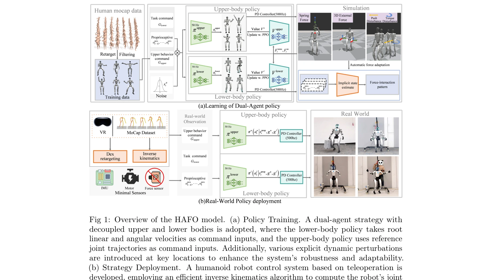
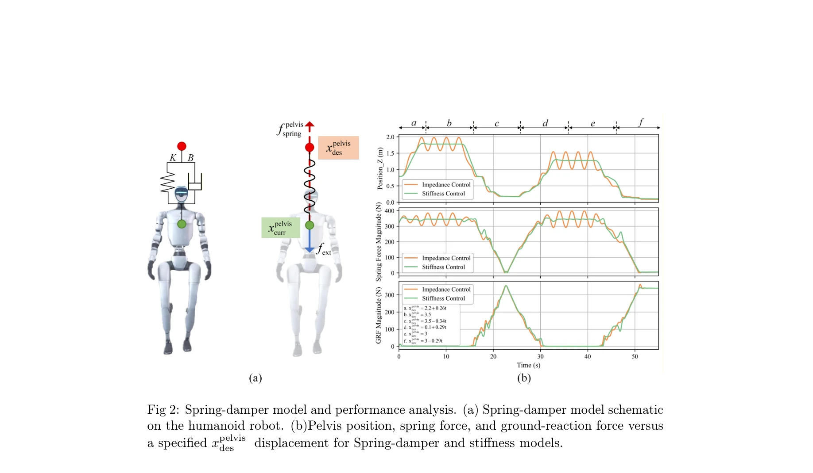

# HAFO: A Force-Adaptive Control Framework for Humanoid Robots in Intense Interaction Environments

> **저자**: Chenhui Dong, Haozhe Xu, Wenhao Feng, Zhipeng Wang, Yanmin Zhou, Yifei Zhao, Bin He | **날짜**: 2026-01-29 | **DOI**: [10.48550/arXiv.2511.20275](https://doi.org/10.48550/arXiv.2511.20275)

---

## Essence

*Fig 1: Overview of the HAFO model. (a) Policy Training. A dual-agent strategy with*

HAFO는 dual-agent RL 프레임워크를 통해 humanoid robot의 하체 보행과 상체 조작을 동시에 최적화하여 강한 외력 상호작용 환경에서 안정적이고 정밀한 제어를 달성한다.

## Motivation

- **Known**: RL 기반 humanoid locomotion과 경량 object manipulation은 진전했으나, 강한 외력 상호작용 환경에서의 견고하고 정밀한 제어는 미흡하다.
- **Gap**: 기존 RL 방법들은 외력을 명시적으로 모델링하지 않아 인간 개입이나 환경 접촉 시 불안정성을 보이며, lower-RL-upper-IK 방식은 상체의 개루프 제어로 외력 적응이 어렵다.
- **Why**: Humanoid robot의 고중심, 좁은 지지대 특성상 고하중 조작과 고도 작업(로프 현수) 같은 강한 외력 환경에서의 안정적 제어가 실제 응용에 필수적이다.
- **Approach**: Spring-damper system으로 외력을 명시적으로 모델링하고, dual-agent(하체-상체) 구조에 constrained residual action space를 적용하며, curriculum learning으로 점진적으로 외력을 증가시킨다.

## Achievement

*Fig 3: Unitree G1 Humanoid robot sim2sim results. We evaluate the model’s performance*

- **Dual-agent RL 프레임워크**: 하체는 견고한 보행, 상체는 정밀한 조작을 독립적으로 최적화하면서 협력적 전신 제어 달성
- **Spring-damper 동적 모델**: 외부 인장력을 spring-damper 시스템으로 모델링하여 세밀한 외력 제어 가능
- **자동 모드 전환**: 명시적 상태 머신 없이 RL 정책이 지면 보행과 공중 현수 사이의 모드 전환을 자율적으로 생성
- **다중 환경 적응**: 단일 dual-agent 정책으로 고하중, 추력 교란, 로프 현수 등 다양한 외력 환경에서 안정적 제어
- **고도 작업 선례**: 로프 현수 상태에서의 안정적 운영을 달성한 첫 locomotion 제어 전략

## How

*Fig 2: Spring-damper model and performance analysis. (a) Spring-damper model schematic*

- Lower body agent와 upper body agent의 분리된 RL 정책으로 coupled training 수행
- Constrained residual action space로 상체 에이전트 훈련 안정성과 샘플 효율성 향상
- Spring-damper 파라미터(강성, 감쇠)를 curriculum learning 스케줄에 따라 점진적으로 증가
- 외력 적용 지점을 randomize하여 다양한 교란 조건에 대한 일반화 능력 강화
- Adversarial training으로 robust disturbance-rejection response 학습

## Originality

- Spring-damper 모델을 통한 명시적 외력 동적 모델링으로 기존의 암묵적 처리 방식 개선
- Dual-agent 분리 전략과 constrained residual action space의 결합으로 훈련 안정성과 효율성 동시 달성
- Curriculum learning과 randomization을 통한 progressive force adaptation으로 모드 전환의 자동 생성
- Humanoid robot의 로프 현수 상태 제어라는 novel 응용 분야 개척

## Limitation & Further Study

- 로프 현수 조건이 준정적(quasi-static) 상태에 제한될 가능성 있음 — 동적 현수 조건 확대 필요
- Spring-damper 모델의 파라미터 설정 과정이 manual tuning에 의존할 수 있음 — 자동 파라미터 최적화 연구 필요
- 실제 로봇 실험이 sim2sim 수준에 머물러 있음 — sim2real transfer와 실제 환경 검증 필요
- 복합 외력(여러 방향의 동시 교란) 조건에 대한 평가 부족 — 더 복잡한 상호작용 시나리오 탐색 필요
- 외력 측정 센서 의존성이 낮지만, 실제 환경에서의 외력 추정 정확도 영향 분석 필요

## Evaluation

- Novelty: 4/5
- Technical Soundness: 3/5
- Significance: 4/5
- Clarity: 4/5
- Overall: 4/5

**총평**: HAFO는 spring-damper 모델과 dual-agent RL의 결합으로 humanoid robot의 강한 외력 적응 제어에서 새로운 기준을 제시하며, 특히 로프 현수라는 novel 응용에서 안정적 제어를 최초 달성한 의미 있는 연구다.

## Related Papers

- 🔄 다른 접근: [[papers/1922_FALCON_Learning_Force-Adaptive_Humanoid_Loco-Manipulation/review]] — 둘 다 강한 외력 환경에서의 force-adaptive control을 다루지만, HAFO는 dual-agent RL 프레임워크를, FALCON은 단일 정책 기반 접근법을 사용합니다.
- 🔗 후속 연구: [[papers/1714_Thor_Towards_Human-Level_Whole-Body_Reactions_for_Intense_Co/review]] — Thor의 intense contact에 대한 human-level reaction 연구를 dual-agent 최적화를 통한 하체-상체 통합 제어로 발전시켰습니다.
- 🏛 기반 연구: [[papers/1923_FAME_Force-Adaptive_RL_for_Expanding_the_Manipulation_Envelo/review]] — FAME의 force-adaptive RL 연구가 HAFO의 강한 외력 상호작용에서 필요한 적응적 제어 전략의 기초를 제공합니다.
- 🏛 기반 연구: [[papers/1714_Thor_Towards_Human-Level_Whole-Body_Reactions_for_Intense_Co/review]] — Force-adaptive 제어 프레임워크의 개념을 강한 접촉 상호작용에서 인간 수준의 반응을 생성하는 Thor 시스템으로 확장하여 구현했다.
- 🏛 기반 연구: [[papers/1836_CHIP_Adaptive_Compliance_for_Humanoid_Control_through_Hindsi/review]] — HAFO의 힘 적응형 제어 프레임워크가 CHIP의 강인한 조작을 위한 적응적 컴플라이언스 메커니즘 구현에 이론적 기반을 제공한다.
- 🔄 다른 접근: [[papers/1922_FALCON_Learning_Force-Adaptive_Humanoid_Loco-Manipulation/review]] — HAFO의 force-adaptive control이 이중 에이전트가 아닌 다른 아키텍처로 휴머노이드의 힘 적응 문제를 해결하는 접근을 제시한다.
- 🔄 다른 접근: [[papers/1923_FAME_Force-Adaptive_RL_for_Expanding_the_Manipulation_Envelo/review]] — 둘 다 외부 힘에 대한 적응적 제어를 다루지만 FAME은 양팔 조작에, HAFO는 일반적인 힘 적응에 초점을 맞춘다.
