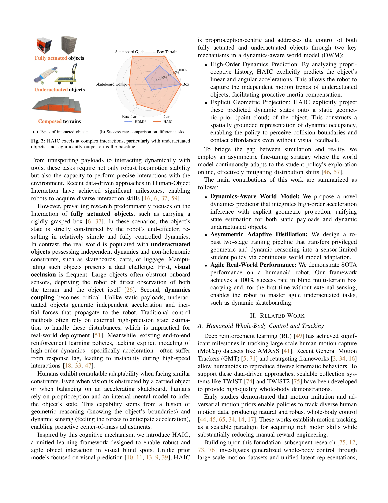

# HAIC: Humanoid Agile Object Interaction Control via Dynamics-Aware World Model

> **저자**: Dongting Li, Xingyu Chen, Qianyang Wu, Bo Chen, Sikai Wu, Hanyu Wu, Guoyao Zhang, Liang Li, Mingliang Zhou, Diyun Xiang, Jianzhu Ma, Qiang Zhang, Renjing Xu | **날짜**: 2026-02-12 | **DOI**: [10.48550/arXiv.2602.11758](https://doi.org/10.48550/arXiv.2602.11758)

---

## Essence

*Fig. 3: Overview of our Dynamics-aware World Model. It predicts object*

HAIC는 humanoid 로봇이 독립적인 동역학을 가진 미작동(underactuated) 물체와 상호작용할 수 있도록 dynamics-aware world model을 통해 proprioception만으로 고차 가속도를 예측하고 기하학적 projection을 통해 시각 blind spot에서도 강건한 제어를 실현한다.

## Motivation

- **Known**: Humanoid 로봇은 완전 작동(fully actuated) 물체 조작에서 성과를 보였으며, recent research는 large-scale motion datasets과 motion imitation을 통해 whole-body control을 향상시켰다.
- **Gap**: 기존 방법들은 로봇의 end-effector에 경직되게 결합된 완전 작동 물체 중심이며, 독립적인 동역학과 비홀로노믹 제약을 가진 underactuated 물체(스케이트보드, 카트 등)에 대한 제어 능력이 부족하고 외부 상태 추정에 의존한다.
- **Why**: Underactuated 물체와의 상호작용은 시각 폐색과 동역학 결합력의 복잡성을 야기하며, proprioception 기반의 robust 제어 방법 개발은 현실의 미구조화된 환경에서 humanoid 로봇의 실용성을 크게 향상시킬 수 있다.
- **Approach**: Proprioceptive history로부터 고차 가속도를 명시적으로 예측하고 이를 static geometric prior에 projection하여 dynamic occupancy map을 구성하는 dynamics predictor를 제안하며, asymmetric fine-tuning을 통해 world model이 policy 탐색에 지속 적응하도록 설계했다.

## Achievement

*Fig. 2: HAIC excels at complex interactions, particularly with underactuated*

- **Dynamics-Aware World Model**: High-order acceleration inference와 geometric projection을 통합하여 정적 payload와 동적 underactuated 물체에 대한 통일된 상태 추정 실현
- **Asymmetric Adaptive Distillation**: Privileged geometric/dynamic reasoning을 sensor-limited student policy로 전이하는 robust two-stage training pipeline 개발
- **Real-World Performance**: Skateboarding, cart pushing/pulling, multi-terrain box carrying 등의 agile underactuated tasks에서 SOTA 성능 달성 및 external sensing 없이 100% 성공률 입증

## How

*Fig. 3: Overview of our Dynamics-aware World Model. It predicts object*

- Proprioceptive history 분석을 통한 선형/각 가속도 명시적 예측으로 underactuated 물체의 독립적 운동 추세 포착
- 예측된 동역학 상태를 점군(point cloud) 기반 static geometric prior에 명시적으로 project하여 spatially grounded dynamic occupancy 표현 구성
- 시뮬레이션과 실제 환경의 격차 해소를 위한 asymmetric fine-tuning 전략으로 world model이 student policy 탐색에 온라인 적응
- Multi-object interaction 지원을 위한 Contact Guidance Strategy 설계
- Inertial perturbation에 대한 사전적(proactive) 보상을 통한 agile interaction 실현

## Originality

- Proprioception-centric dynamics prediction 패러다임으로 vision-based world model과 차별화
- High-order acceleration 명시적 예측과 geometric projection의 novel 결합으로 blind spot에서의 collision boundary 및 contact affordance 추론 가능
- Asymmetric adaptive distillation을 통한 distribution shift 대응으로 sim-to-real transfer 강건성 향상
- Underactuated 물체 제어를 humanoid whole-body control의 unified framework 내에 포함시킨 첫 시도

## Limitation & Further Study

- 외부 state estimation 없이는 극도의 동역학 변화(예: 급격한 하중 변화)에 대한 적응 능력 검증 필요
- 정적 geometric prior가 변형 가능한 물체(deformable objects)에 대해서는 제한적일 수 있음
- Real-world 실험이 특정 humanoid 플랫폼과 task set에 제한되어 다른 로봇 형태로의 일반화 검증 부족
- Asymmetric fine-tuning의 online adaptation이 실시간 성능에 미치는 영향 및 계산 복잡도 분석 필요
- 장시간 interaction에서 world model의 누적 오류(drift)가 성능에 미치는 영향에 대한 분석 보완 필요

## Evaluation

- Novelty: 4/5
- Technical Soundness: 3/5
- Significance: 4/5
- Clarity: 4/5
- Overall: 4/5

**총평**: 본 논문은 humanoid 로봇의 underactuated 물체 상호작용이라는 현실적으로 중요한 문제를 proprioception 기반의 창의적인 dynamics prediction과 geometric projection으로 우아하게 해결하며, 실제 로봇에서 SOTA 성능을 입증한 매우 강력한 기여이다.

## Related Papers

- 🔄 다른 접근: [[papers/1980_HiWET_Hierarchical_World-Frame_End-Effector_Tracking_for_Lon/review]] — HAIC의 dynamics-aware world model과 HiWET의 hierarchical tracking은 모두 복잡한 물체 상호작용을 위한 서로 다른 제어 전략입니다.
- 🏛 기반 연구: [[papers/1897_Ego-Vision_World_Model_for_Humanoid_Contact_Planning/review]] — ego-vision world model이 HAIC의 proprioception 기반 dynamics 예측과 시각 blind spot 보완에 필요한 기반 기술을 제공합니다.
- 🧪 응용 사례: [[papers/1779_A_Humanoid_Visual-Tactile-Action_Dataset_for_Contact-Rich_Ma/review]] — visual-tactile-action dataset이 HAIC의 proprioception 기반 물체 상호작용 제어를 실제 contact-rich manipulation에 적용할 데이터를 제공합니다.
- 🔗 후속 연구: [[papers/1998_Humanoid_Occupancy_Enabling_A_Generalized_Multimodal_Occupan/review]] — Multimodal occupancy perception이 HAIC의 시각 blind spot 문제 해결을 보완합니다.
- 🔄 다른 접근: [[papers/2158_Track_Any_Motions_under_Any_Disturbances/review]] — Track Any Motions 기법이 proprioception 기반 접근법과 다른 방식으로 disturbance 상황을 처리합니다.
- 🏛 기반 연구: [[papers/1946_Generalizable_Geometric_Prior_and_Recurrent_Spiking_Feature/review]] — RGMP-S의 기하학적 선행 정보와 multimodal policy 연구가 HAIC의 dynamics-aware world model 설계에서 필요한 기하학적 이해의 기초를 제공합니다.
- 🔄 다른 접근: [[papers/1965_HAIC_Humanoid_Agile_Object_Interaction_Control_via_Dynamics-/review]] — HAIC 자체와의 연결이므로 제외
- 🔗 후속 연구: [[papers/1946_Generalizable_Geometric_Prior_and_Recurrent_Spiking_Feature/review]] — RGMP-S의 기하학적 선행 정보 활용을 dynamics-aware world model과 결합하여 더 강건한 humanoid 조작 제어로 발전시켰습니다.
- 🔄 다른 접근: [[papers/1908_Embrace_Collisions_Humanoid_Shadowing_for_Deployable_Contact/review]] — 환경과의 상호작용을 contact-agnostic shadowing과 dynamics-aware object interaction이라는 서로 다른 접근법으로 처리한다
- ⚖️ 반론/비판: [[papers/1980_HiWET_Hierarchical_World-Frame_End-Effector_Tracking_for_Lon/review]] — HiWET의 명시적 end-effector 추적과 HAIC의 proprioception 기반 암시적 제어는 humanoid 조작을 위한 대조적인 접근법입니다.
- 🔗 후속 연구: [[papers/1998_Humanoid_Occupancy_Enabling_A_Generalized_Multimodal_Occupan/review]] — HAIC의 dynamics-aware world model이 multimodal occupancy perception으로 환경 인식을 확장합니다.
- 🔗 후속 연구: [[papers/2036_Kinematics-Aware_Multi-Policy_Reinforcement_Learning_for_For/review]] — 동역학 기반 객체 상호작용 제어를 kinematics-aware 다중 정책과 결합하여 더 정교한 force-capable 조작을 구현할 수 있다.
- 🔗 후속 연구: [[papers/2149_TOP_Time_Optimization_Policy_for_Stable_and_Accurate_Standin/review]] — 휴머노이드 민첩한 객체 상호작용을 시간 최적화를 통해 더 안정적이고 정확하게 확장한 방법론이다.
