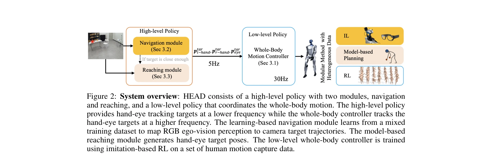
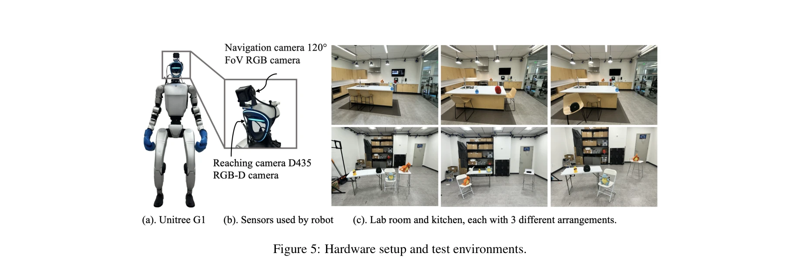

# Hand-Eye Autonomous Delivery: Learning Humanoid Navigation, Locomotion and Reaching

> **저자**: Sirui Chen, Yufei Ye, Zi-Ang Cao, Jennifer Lew, Pei Xu, C. Karen Liu | **날짜**: 2025-08-05 | **URL**: [https://arxiv.org/abs/2508.03068](https://arxiv.org/abs/2508.03068)

---

## Essence

*Figure 2: System overview: HEAD consists of a high-level policy with two modules, navigation*

인간 모션 캡처와 에고센트릭 비전 데이터로부터 휴머노이드 로봇의 네비게이션, 로코모션, 리칭 능력을 학습하는 HEAD 프레임워크를 제안한다. 고수준 정책이 손과 눈의 목표 위치를 명령하고 저수준 whole-body controller가 추적하는 모듈식 접근법을 채택한다.

## Motivation

- **Known**: 휴머노이드 로봇 제어를 위해 human motion capture 데이터를 활용하는 것이 효과적이며, VR 디바이스로부터 head와 hand 포즈를 추출하여 제어하는 방식이 알려져 있다. 또한 시각 기반 2D 네비게이션 방법들이 바퀴 로봇에서 성공적으로 적용되었다.
- **Gap**: 기존 휴머노이드 제어는 상체 조작과 하체 로코모션을 독립적으로 처리하거나 부조화를 야기한다. 또한 2D 추상화를 기반한 네비게이션은 3D 공간에서 다양한 높이의 객체를 다루는 휴머노이드의 특성을 충분히 활용하지 못한다.
- **Why**: 휴머노이드는 인간 환경에서 조작 작업을 수행하기 위해 네비게이션과 리칭을 조화롭게 수행할 수 있어야 하며, 이는 실제 배송, 청소, 돌봄 등 다양한 실용적 응용의 기초가 된다.
- **Approach**: 모듈식 설계로 고수준 정책(hand-eye 위치 명령)과 저수준 controller(whole-body 모션 추적)를 분리하고, GAN 기반 RL을 통해 대규모 human motion capture 데이터에서 학습한다. 여러 데이터 소스(대규모 인간 탐색 데이터, 목표 환경의 중규모 시연, 소량의 로봇 경험)를 활용하여 도메인 시프트를 완화한다.

## Achievement

*Figure 5: Hardware setup and test environments.*

- **Whole-body controller 학습**: GAN 기반 RL 프레임워크로 눈과 양손의 위치/방향 추적을 학습하며, 상체와 하체를 위한 별도의 discriminator로 독립적인 보상과 조화로운 협력을 동시에 달성
- **3D 네비게이션 능력**: 2D 추상화를 벗어나 3차원 공간에서 다양한 높이의 장애물을 회피하며 네비게이션과 리칭을 동시에 수행
- **실제 로봇 배포**: Unitree G1 휴머노이드에서 실제 실내 환경에서 안정적인 네비게이션과 리칭 성능 입증
- **도메인 적응**: 대규모 human 데이터와 소규모 robot 데이터를 혼합하여 embodiment gap과 perception domain shift를 효과적으로 완화

## How

*Figure 2: System overview: HEAD consists of a high-level policy with two modules, navigation*

- High-level policy: Aria glasses에서 수집한 에고센트릭 비전 데이터로부터 카메라(head) 위치/방향 궤적과 손 위치를 예측
- Low-level whole-body controller: 5시간의 정제된 human motion capture 데이터를 GAN 기반 RL로 학습
- GAN 기반 RL: 특정 full-body 궤적 추적이 아닌 human demonstration의 분포를 모방하도록 formulation
- Dual discriminator: 상체(손)와 하체(보행) 움직임을 독립적으로 보상하여 composability 증진
- Root-free policy: 월드 좌표의 root position/velocity에 의존하지 않고 카메라 정보로부터 global 정보 추론
- Mixed dataset training: 일반화를 위한 대규모 인간 탐색 데이터 + 도메인 시프트 완화를 위한 목표 환경 데이터 + 작은 규모의 로봇 경험 활용

## Originality

- **모듈식 분리**: egocentric perception과 physical action을 명시적으로 분리하여 서로 다른 데이터 소스와 알고리즘을 유연하게 결합
- **sparse 3-point tracking**: 전체 body joint 대신 눈과 양손 세 점만으로 navigation, locomotion, reaching을 통일된 인터페이스로 제어
- **GAN 기반 RL formulation**: distribution matching을 통해 sparse 목표 추적 문제와 대규모 데이터 활용의 격차 해소
- **Root-free policy design**: 실제 로봇 배포에서 어려운 정확한 root 정보 추정 필요성을 제거하고 카메라 기반 추론으로 대체
- **실세계 검증**: 시뮬레이션뿐 아니라 실제 Unitree G1 로봇에서 복잡한 인간 환경에서의 성능 입증

## Limitation & Further Study

- High-level policy 학습을 위해 여전히 Aria glasses로 수집한 labeled 인간 데이터가 필요하며, 이는 확장성을 제한할 수 있음
- Whole-body controller 학습에 필요한 5시간의 정제된 motion capture 데이터 큐레이션 비용이 높음
- Root-free 정책이 카메라 기반 추론에 의존하므로 시각적 모호성이나 악조건에서의 성능이 불명확
- 평가가 주로 실내 인간 환경으로 제한되어 있으며, 실외나 극단적으로 다른 환경으로의 일반화 가능성 미검증
- **후속 연구**: (1) 약한 감독(weak supervision)이나 self-supervised learning으로 labeled 데이터 요구량 감소, (2) 카메라 기반 localization의 robustness 향상, (3) 다양한 환경과 로봇 형태에 대한 일반화 능력 평가

## Evaluation

- Novelty: 4/5
- Technical Soundness: 3/5
- Significance: 4/5
- Clarity: 4/5
- Overall: 4/5

**총평**: HEAD는 모듈식 설계와 sparse 3-point tracking을 통해 휴머노이드 로봇의 통합적 navigation, locomotion, reaching을 효과적으로 학습하는 창의적인 접근을 제시하며, 실제 로봇에서의 동작 검증으로 실용성을 입증한다. 다만 human 데이터 의존성과 정제 비용, 환경 일반화 가능성에 대한 추가 분석이 필요하다.
