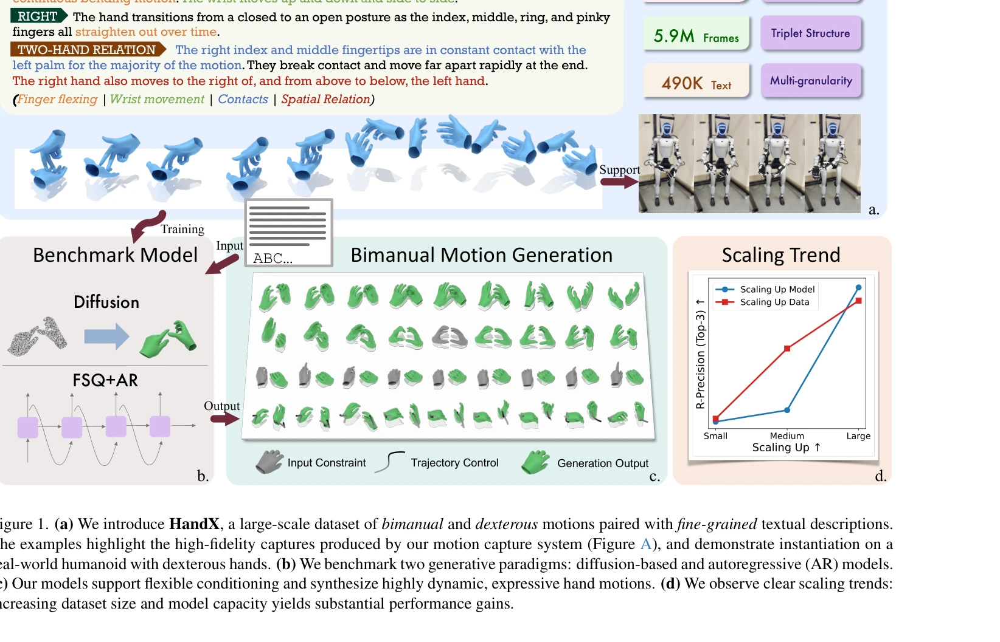

# HandX: Scaling Bimanual Motion and Interaction Generation

> **저자**:  | **날짜**: 2026-03-30 | **URL**: [https://arxiv.org/abs/2603.28766](https://arxiv.org/abs/2603.28766)

---

## Essence

*Figure 1. (a) We introduce HandX, a large-scale dataset of bimanual and dexterous motions paired with fine-grained textu*

HandX는 양손의 섬세한 움직임과 상호작용을 생성하기 위한 통합 기반을 제공하는 대규모 dataset, annotation 전략, 그리고 평가 방법론을 제시한다.

## Motivation

- **Known**: Human motion generation은 diffusion model과 autoregressive model 등으로 발전했으나, 대부분의 whole-body 모델은 손의 섬세한 손가락 움직임, 접촉 타이밍, 양손 조율 등을 놓치고 있다. 기존 hand-centric dataset은 object interaction에만 초점을 맞추거나 coarse annotation을 제공한다.
- **Gap**: 고품질의 bimanual hand motion을 위한 fine-grained text annotation과 inter-hand contact dynamics를 포함한 대규모 dataset이 부족하며, 손의 fidelity와 bimanual coordination을 평가하는 표준화된 metric이 없다.
- **Why**: 현실적인 손 움직임 합성은 immersive media, telepresence, embodied AI, human-computer interaction 등에서 필수적이며, humanoid 로봇의 dexterous hand 제어를 위해 중요하다.
- **Approach**: 기존 대규모 dataset을 consolidate하고 새로운 motion-capture dataset을 수집한 후, 구조화된 motion feature 추출과 LLM을 활용한 two-stage annotation 전략을 적용한다. 이를 바탕으로 diffusion과 autoregressive 모델을 benchmarking하고 scaling trend를 분석한다.

## Achievement

- **HandX Dataset**: 54.2시간의 고충실도 bimanual motion과 490K개의 fine-grained text description을 포함한 5.9M frame의 대규모 통합 dataset 구성
- **Scalable Annotation**: Contact event와 finger flexion 같은 structured feature를 추출한 후 LLM으로 semantically rich description을 생성하는 decoupled two-stage 전략 개발
- **Unified Benchmarking**: Diffusion과 autoregressive 모델을 multiple conditioning mode (text-to-motion, in-betweening, trajectory control)로 벤치마크하고 hand-focused metric 제안
- **Scaling Analysis**: Model capacity와 training data 크기 증가에 따른 명확한 성능 향상 추세 입증
- **Humanoid Deployment**: 생성된 dexterous motion이 실제 humanoid 로봇 platform으로 전이 가능함을 시연

## How

- 기존의 egocentric dataset과 human-object interaction dataset을 standardized skeleton representation과 frame rate로 consolidate하고 quality control 수행
- 새로운 motion-capture system으로 underrepresented bimanual interaction의 high-fidelity sequence 수집, 특히 finger-level contact dynamics 강조
- Structured event descriptor (touch, slide, release 등)를 자동으로 추출한 후 이를 바탕으로 LLM이 fine-grained text description 생성
- Masked conditioning을 활용하여 single model이 diverse control mode (text-to-motion, in-betweening, keyframe-guided synthesis) 지원 가능하게 구현
- Contact timing과 finger articulation을 평가하는 hand-focused metric 정의 및 도입
- Model size와 dataset size를 체계적으로 변경하며 scaling trend 분석

## Originality

- 양손 coordination과 inter-hand contact에 중점을 두고 fine-grained bimanual motion을 위한 첫 대규모 통합 dataset 구축
- Structured feature extraction과 LLM 활용의 decoupled annotation 전략으로 확장성 있는 high-quality text supervision 실현
- Hand motion 특화 metric 개발로 contact accuracy와 finger-level fidelity 평가 가능하게 함
- Masked conditioning 메커니즘으로 단일 모델에서 multiple task (text-to-motion, in-betweening, trajectory control) 동시 지원
- Humanoid 로봇 플랫폼으로의 실제 deployment 시연으로 현실 적용 가능성 검증

## Limitation & Further Study

- Motion capture 시스템의 마커 기반 방식이 extreme pose나 fast motion에서 정확도 저하 가능성
- LLM 기반 annotation이 생성된 description의 일관성과 semantic precision이 manual review에 완전히 의존
- Benchmark model들이 real-time inference 성능을 충분히 고려하지 않은 것으로 보이며, latency 평가 부재
- Cross-domain generalization (예: 다른 skeleton format이나 motion capture system)에 대한 robustness 평가 미흡
- 후속 연구: 더 강력한 contact prediction mechanism, zero-shot transfer learning 능력 개선, 더 복잡한 multi-hand scenario 확장

## Evaluation

- Novelty: 4/5
- Technical Soundness: 3/5
- Significance: 4/5
- Clarity: 4/5
- Overall: 4/5

**총평**: HandX는 bimanual hand motion generation의 significant gap을 체계적으로 해결하는 comprehensive framework를 제시하며, large-scale dataset, scalable annotation 전략, 그리고 detailed benchmarking을 통해 손 움직임 합성 분야의 새로운 표준을 제시한다. 실제 humanoid deployment까지 입증한 점에서 학술적, 실용적 가치가 높다.

## Related Papers

- 🏛 기반 연구: [[papers/2015_HUMOTO_A_4D_Dataset_of_Mocap_Human_Object_Interactions/review]] — HUMOTO의 고충실도 인간-객체 상호작용 데이터가 HandX의 양손 섬세한 움직임과 상호작용 생성을 위한 기반 데이터를 제공합니다.
- 🔗 후속 연구: [[papers/2009_HumanoidGen_Data_Generation_for_Bimanual_Dexterous_Manipulat/review]] — HandX의 bimanual motion dataset을 HumanoidGen이 LLM 추론과 결합하여 자동화된 양손 조작 데이터 생성으로 확장합니다.
- 🧪 응용 사례: [[papers/1869_DexMimicGen_Automated_Data_Generation_for_Bimanual_Dexterous/review]] — DexMimicGen의 자동화된 양손 조작 데이터 생성이 HandX dataset의 실제 적용 사례를 제시합니다.
- 🏛 기반 연구: [[papers/1868_DexHub_and_DART_Towards_Internet_Scale_Robot_Data_Collection/review]] — DexHub의 인터넷 규모 로봇 데이터 수집이 HandX의 대규모 bimanual motion 데이터셋 구축에 기반이 됩니다.
- 🔗 후속 연구: [[papers/2169_UniDex_A_Robot_Foundation_Suite_for_Universal_Dexterous_Hand/review]] — UniDex의 universal dexterous handling이 HandX의 bimanual interaction generation을 더욱 발전시킵니다.
- 🔄 다른 접근: [[papers/1853_Coordinated_Humanoid_Manipulation_with_Choice_Policies/review]] — Choice Policy의 다중 후보 행동 생성과 HandX의 양손 동작 생성은 복잡한 조작 작업에서 서로 다른 행동 모델링 접근법을 제시한다.
- 🧪 응용 사례: [[papers/1854_Coordinated_Humanoid_Robot_Locomotion_with_Symmetry_Equivari/review]] — 양손 동작 생성에서 대칭성 원리가 직접 적용됩니다.
- 🔗 후속 연구: [[papers/1775_A_Closed-Form_Geometric_Retargeting_Solver_for_Upper_Body_Hu/review]] — HandX의 bimanual motion generation이 SEW-Mimic의 상체 제어와 결합되어 전신 manipulation을 완성합니다.
- 🔗 후속 연구: [[papers/1869_DexMimicGen_Automated_Data_Generation_for_Bimanual_Dexterous/review]] — DexMimicGen의 양손 정교 조작 데이터 생성이 HandX의 양손 동작과 상호작용 생성으로 확장되어 더 복잡하고 다양한 양손 조작 시나리오를 구현한다.
- 🏛 기반 연구: [[papers/2009_HumanoidGen_Data_Generation_for_Bimanual_Dexterous_Manipulat/review]] — 양손 모션 및 상호작용 생성 확장이 휴머노이드 데이터 생성의 기반 기술이다.
- 🔗 후속 연구: [[papers/2015_HUMOTO_A_4D_Dataset_of_Mocap_Human_Object_Interactions/review]] — HandX의 bimanual motion과 interaction 생성을 HUMOTO가 고충실도 4D 모션캡처로 확장하여 더 정확한 인간-객체 상호작용 데이터를 제공합니다.
- 🔗 후속 연구: [[papers/2075_Learning_Visuotactile_Skills_with_Two_Multifingered_Hands/review]] — Learning Visuotactile Skills의 양손 다중지 조작을 HandX의 bimanual motion generation과 결합하여 더 정교한 양손 협업 작업이 가능하다.
- 🔄 다른 접근: [[papers/2169_UniDex_A_Robot_Foundation_Suite_for_Universal_Dexterous_Hand/review]] — HandX의 bimanual motion generation과 UniDex의 8종 로봇핸드 universal control은 손재주 제어의 서로 다른 일반화 접근법임
