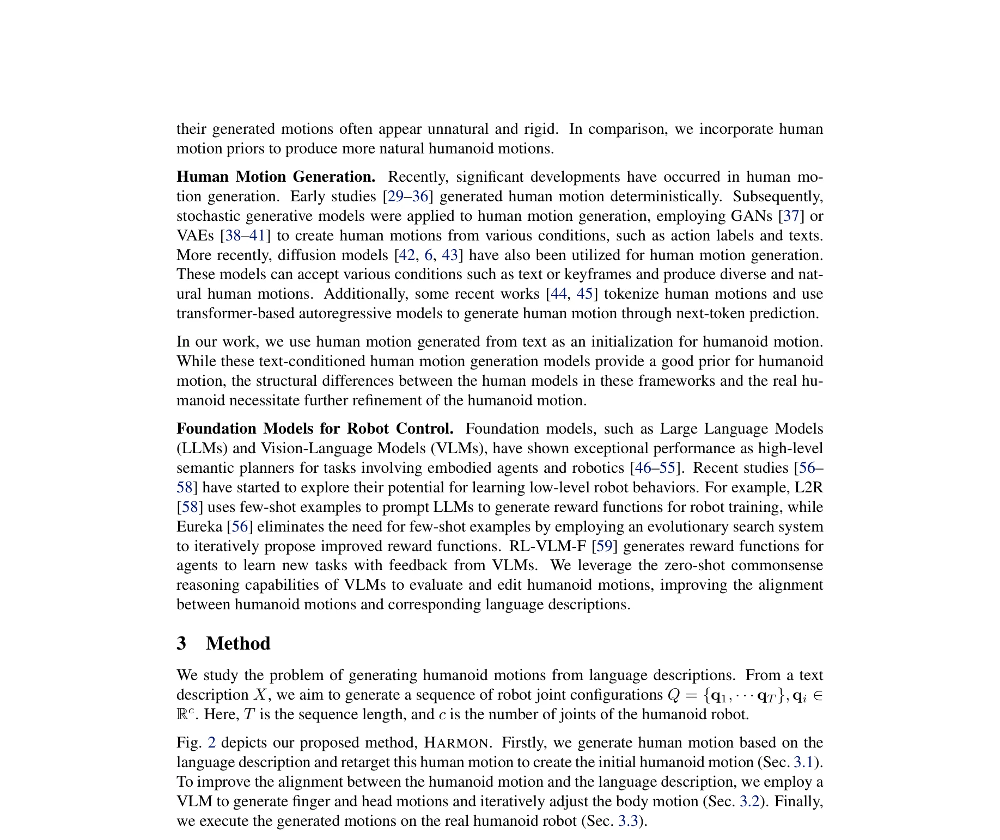
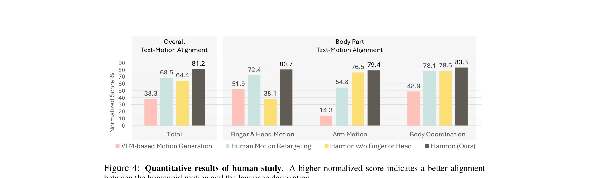

# Harmon: Whole-Body Motion Generation of Humanoid Robots from Language Descriptions

> **저자**: Zhenyu Jiang, Yuqi Xie, Jinhan Li, Ye Yuan, Yifeng Zhu, Yuke Zhu | **날짜**: 2024-10-16 | **URL**: [https://arxiv.org/abs/2410.12773](https://arxiv.org/abs/2410.12773)

---

## Essence

*Fig. 2 depicts our proposed method, HARMON. Firstly, we generate human motion based on the*

인간 모션 데이터셋으로부터 사전학습된 프라이어를 활용하고 Vision Language Model을 통해 손가락과 머리 모션을 생성·편집하여 휴머노이드 로봇의 자연스러운 전신 모션을 언어 설명으로부터 생성한다.

## Motivation

- **Known**: 휴머노이드 로봇은 인간과의 공존을 위해 자연언어 이해와 인간과 유사한 행동이 필요하며, 대규모 인간 모션 데이터셋과 diffusion model을 활용한 텍스트 기반 인간 모션 생성 기술이 발전했다.
- **Gap**: 인간과 휴머노이드의 신체 구조 차이(손가락, 머리 모션 부재, 운동학적 제약)로 인해 직접적인 모션 재타겟팅만으로는 의미 손실이 발생하며, 언어 설명과의 정렬 문제가 존재한다.
- **Why**: 휴머노이드 로봇이 인간 환경에 자연스럽게 통합되고 인간과 협력하기 위해서는 자연언어 지시로부터 표현력 있는 전신 모션을 생성하고 실행할 수 있어야 한다.
- **Approach**: PhysDiff를 이용한 인간 모션 생성 → inverse kinematics 기반 재타겟팅 → VLM의 상식적 추론 능력을 활용한 손가락/머리 모션 생성 및 반복적 팔 모션 조정을 통해 언어 정렬도를 개선한다.

## Achievement

*Figure 4: Quantitative results of human study. A higher normalized score indicates a better alignment*

- **자연스러운 전신 모션 생성**: PhysDiff의 인간 모션 프라이어와 VLM 기반 편집을 결합하여 자연스럽고 표현력 있는 휴머노이드 모션을 생성
- **높은 사용자 평가**: 인간 평가 연구에서 생성된 모션이 86.7%의 테스트 케이스에서 우수한 것으로 평가됨
- **실제 로봇 검증**: Fourier GR1 휴머노이드 로봇에서 생성된 모션을 성공적으로 실행하여 시뮬레이션과 실제 환경 간 전이 가능성 입증

## How

*Fig. 2 depicts our proposed method, HARMON. Firstly, we generate human motion based on the*

- PhysDiff diffusion model을 이용하여 텍스트 설명으로부터 SMPL 파라미터 기반 인간 모션 생성
- SMPL 바디 셰이프 파라미터 β를 최적화하여 인간과 휴머노이드 간 신체 크기 차이를 최소화
- 역운동학(IK)을 기반으로 SMPL 조인트 위치를 휴머노이드 조인트 구성으로 변환
- GPT-4V 등의 VLM을 이용하여 원본 텍스트 설명에서 손가락/머리 모션 설명 추출
- VLM의 판단(VLM Judge)과 조정(VLM Motion Adjust) 과정을 반복하여 팔 모션 정제 및 손가락 궤적 생성
- 생성된 모션을 상반신과 하반신으로 분리하여 독립적으로 제어 및 실행

## Originality

- 인간 모션 프라이어와 VLM 기반 편집을 결합한 새로운 휴머노이드 모션 생성 파이프라인 제시
- 손가락과 머리 모션 생성이라는 구체적인 문제를 VLM의 상식적 추론을 통해 해결하는 창의적 접근
- 언어 정렬도 평가와 반복적 모션 조정을 위해 VLM을 judge로 활용하는 새로운 활용 방식
- 실제 휴머노이드 로봇에서의 검증으로 실용적 가치 입증

## Limitation & Further Study

- PhysDiff 생성 모션의 질과 VLM의 편집 능력에 의존하므로 두 모델의 한계가 최종 결과에 영향
- 손가락 모션 생성 정확도는 VLM이 시각적 피드백에 기반하므로 세밀한 손가락 움직임 포착에 한계 가능성
- 상반신과 하반신의 독립적 제어로 인한 조화도 저하 가능성 - 전신 협응 모션의 표현력 제한
- 대규모 정량적 평가와 다양한 휴머노이드 로봇 플랫폼에 대한 검증 필요
- 후속연구: VLM 판단 루프의 수렴성 보장, 복잡한 다인 상호작용 모션 생성, 더 다양한 로봇 형태에 대한 적응성 개선

## Evaluation

- Novelty: 4/5
- Technical Soundness: 3/5
- Significance: 4/5
- Clarity: 4/5
- Overall: 4/5

**총평**: 이 논문은 인간 모션 프라이어와 VLM의 상식적 추론을 창의적으로 결합하여 언어로부터 자연스러운 휴머노이드 모션을 생성하는 실용적인 방법을 제시하며, 실제 로봇 실험과 높은 사용자 평가로 그 유효성을 입증했다.

## Related Papers

- 🔄 다른 접근: [[papers/1708_TextOp_Real-time_Interactive_Text-Driven_Humanoid_Robot_Moti/review]] — 사전학습된 프라이어 기반 전신 모션 생성과 실시간 텍스트 기반 모션 제어는 서로 다른 언어-모션 변환 접근법을 사용한다.
- 🔗 후속 연구: [[papers/1960_Guided_Motion_Diffusion_for_Controllable_Human_Motion_Synthe/review]] — 제어 가능한 인간 모션 합성이 휴머노이드 전신 모션 생성의 확장된 응용이다.
- 🏛 기반 연구: [[papers/1666_Scaling_Large_Motion_Models_with_Million-Level_Human_Motions/review]] — 대규모 인간 모션 데이터가 휴머노이드 모션 생성의 기반 자원이다.
- 🏛 기반 연구: [[papers/1996_Humanoid_Locomotion_as_Next_Token_Prediction/review]] — Next token prediction 방식의 humanoid control이 Harmon의 language-driven motion generation 기반이 됩니다.
- 🔗 후속 연구: [[papers/1935_From_Language_to_Locomotion_Retargeting-free_Humanoid_Contro/review]] — Language to locomotion retargeting이 Harmon의 전신 모션 생성을 보행 제어로 확장합니다.
- 🏛 기반 연구: [[papers/1915_Endowing_GPT-4_with_a_Humanoid_Body_Building_the_Bridge_Betw/review]] — GPT-4를 휴머노이드에 적용하는 기초 연구가 Harmon의 언어 기반 전신 동작 생성의 이론적 토대가 된다.
- 🔗 후속 연구: [[papers/1912_EMOTION_Expressive_Motion_Sequence_Generation_for_Humanoid_R/review]] — Harmon의 언어 기반 동작 생성을 감정적 표현까지 확장한 EMOTION의 발전된 형태다.
- 🏛 기반 연구: [[papers/1669_Semantic_Co-Speech_Gesture_Synthesis_and_Real-Time_Control_f/review]] — Harmon의 전신 모션 생성 기술이 제스처와 조화된 휴머노이드 전체 움직임 생성에 필요한 기반이다
- 🔄 다른 접근: [[papers/1918_ExBody2_Advanced_Expressive_Humanoid_Whole-Body_Control/review]] — Harmon의 전신 동작 생성이 모션 캡처 데이터 학습이 아닌 다른 방식으로 표현적 휴머노이드 제어를 달성하는 접근을 제시한다.
- 🔗 후속 연구: [[papers/1996_Humanoid_Locomotion_as_Next_Token_Prediction/review]] — Harmon의 language-driven motion generation이 next token prediction 방식을 언어 입력으로 확장합니다.
- 🏛 기반 연구: [[papers/2148_TokenHSI_Unified_Synthesis_of_Physical_Human-Scene_Interacti/review]] — Harmon의 language-conditioned motion generation이 TokenHSI의 transformer 기반 통합 정책에서 다양한 HSI 작업의 토큰 기반 모델링의 기술적 토대를 제공합니다.
