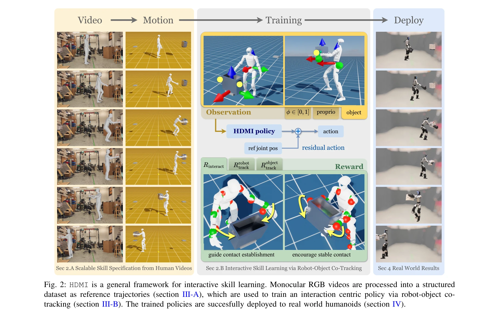
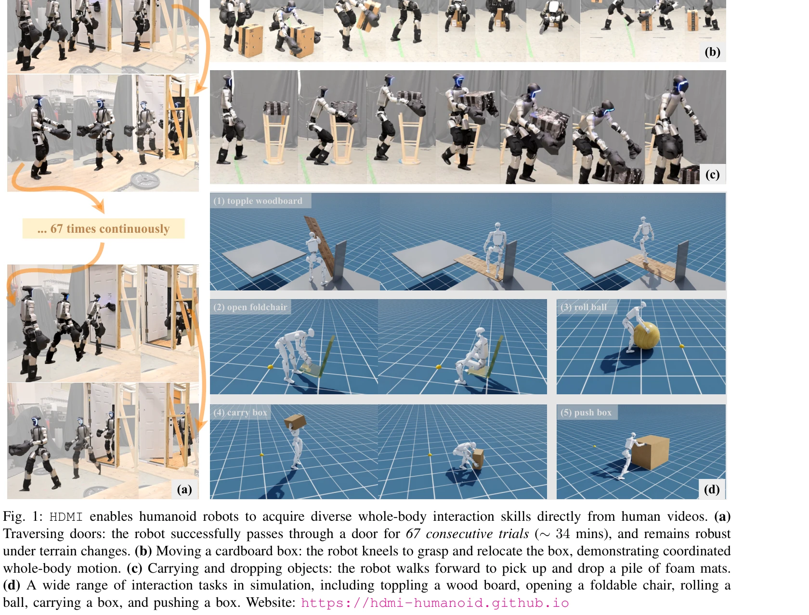

# HDMI: Learning Interactive Humanoid Whole-Body Control from Human Videos

> **저자**: Haoyang Weng, Yitang Li, Nikhil Sobanbabu, Zihan Wang, Zhengyi Luo, Tairan He, Deva Ramanan, Guanya Shi | **날짜**: 2025-09-27 | **DOI**: [10.48550/arXiv.2509.16757](https://doi.org/10.48550/arXiv.2509.16757)

---

## Essence

*Fig. 2: HDMI is a general framework for interactive skill learning. Monocular RGB videos are processed into a structured*

HDMI는 단일 모노큘러 RGB 비디오에서 인간의 상호작용을 추출하여 휴머노이드 로봇이 물체와의 전신 상호작용 기술을 학습하는 프레임워크이다. Robot-object co-tracking을 통해 강화학습 정책을 훈련하고 실제 로봇에 제로샷 배포한다.

## Motivation

- **Known**: 휴머노이드 로봇은 자유공간 로코모션과 조작 작업에서 독립적으로 성공을 보였으나, 접촉이 많은 전신 상호작용 작업은 상대적으로 제한적이다. 인간 비디오로부터의 학습은 로코모션에서는 성공했지만 물체 상호작용을 명시적으로 모델링하지 못했다.
- **Gap**: 기존 인간-물체 상호작용 학습 방법은 작업별 motion reference 생성 파이프라인이나 수동 보상 엔지니어링에 의존하여 일반성이 제한적이다. 전신 상호작용 학습은 부정확한 motion reference 하에서 접촉 동작을 유도하고 도전적인 자세에서 균형을 유지해야 하는 새로운 RL 훈련 과제를 제시한다.
- **Why**: 휴머노이드 로봇이 인간 환경에서 광범위한 작업을 수행하려면 물체와의 robust한 전신 상호작용이 필수적이며, 풍부한 인간 비디오 데이터를 활용하여 확장 가능하고 일반화 가능한 학습 프레임워크를 구축하는 것이 중요하다.
- **Approach**: HDMI는 (i) 포즈 추정 및 retargeting으로 비디오에서 인간과 물체 궤적을 추출하여 구조화된 데이터셋 구축, (ii) unified object representation, residual action space, general interaction reward를 포함한 RL 정책 훈련, (iii) 실제 휴머노이드에 학습된 정책 배포의 세 단계로 구성된다.

## Achievement

*Fig. 1: HDMI enables humanoid robots to acquire diverse whole-body interaction skills directly from human videos. (a)*

- **일반성**: 손/발 상호작용, 강체/관절 물체(고정/부유 기반) 등 다양한 상호작용 유형을 하나의 프레임워크로 처리
- **실제 로봇 성능**: Unitree G1에서 67회 연속 문 개폐 및 통과, 6가지 구별되는 로코-조작 작업 성공
- **시뮬레이션 성능**: 총 14가지 작업을 시뮬레이션에서 성공적으로 수행
- **첫 성과**: 인간 비디오로부터 직접 학습하는 일반적인 전신 휴머노이드-물체 상호작용 프레임워크의 첫 사례

## How

*Fig. 2: HDMI is a general framework for interactive skill learning. Monocular RGB videos are processed into a structured*

- **Video Processing**: GVHMR와 LocoMujoco를 사용하여 SMPL 포즈 추정 및 retargeting으로 인간 및 물체 궤적 추출
- **Reference Dataset**: 각 프레임에서 로봇과 물체의 상태, 관절 위치, 물체의 위치/방향, 관절 상태(관절형 물체) 및 이진 접촉 신호로 구성된 구조화된 reference motion 생성
- **Unified Object Representation**: 다양한 물체의 기하학과 유형에 대응하기 위해 물체 중심 프레임의 point clouds 및 keypoints 추출
- **Residual Action Space**: reference joint position에 대한 잔차 동작으로 탐색 공간을 제한하여 도전적인 자세에서 안정적인 학습
- **Interaction Reward Design**: contact point tracking, contact establishment 단계별 보상, 물체 궤적 추적 등을 포함한 통합 보상으로 부정확한 reference에서도 robust한 접촉
- **RL Training**: DeepMimic 스타일의 훈련으로 reference state 초기화, phase variable 제공, tracking error 기반 에피소드 종료, PPO 최적화 수행
- **Zero-Shot Deployment**: 시뮬레이션에서 훈련된 정책을 추가 fine-tuning 없이 실제 Unitree G1 로봇에 직접 배포

## Originality

- 모노큘러 RGB 비디오에서 인간-물체 상호작용을 추출하여 휴머노이드 전신 상호작용 학습에 직접 활용하는 최초의 일반 프레임워크 제시
- Robot-object co-tracking 문제로 설정하여 작업별 보상 엔지니어링을 회피하는 새로운 관점 도입
- 다양한 물체 기하학과 상호작용 유형을 처리하기 위한 unified object representation, residual action space, general interaction reward의 세 가지 targeted 컴포넌트 설계

## Limitation & Further Study

- 현재 framework는 모노큘러 RGB 비디오의 포즈 추정 정확도에 의존하므로, 가려진 부분이나 복잡한 인터랙션에서 추정 오류가 발생할 수 있음
- Reference motion dataset 구축을 위한 수동 annotate (특히 접촉 신호)가 필요하므로, 완전 자동화의 확장성 제약
- 실제 환경의 변동성(마찰, 물체 무게, 표면 특성 등)에 대한 일반화 능력은 시뮬레이션 도메인 랜더마이제이션에 의존하며 추가 연구 필요
- 더 복잡한 양손 조작이나 다중 물체 상호작용으로의 확장은 아직 검증되지 않음

## Evaluation

- Novelty: 4/5
- Technical Soundness: 3/5
- Significance: 4/5
- Clarity: 4/5
- Overall: 4/5

**총평**: HDMI는 휴머노이드 로봇의 전신 물체 상호작용을 위한 일반적이고 실용적인 프레임워크로, 인간 비디오 활용이라는 확장 가능한 데이터 소스와 함께 robot-object co-tracking이라는 우아한 문제 설정을 통해 실제 로봇에서 강력한 성능을 달성했으며, 휴머노이드 로보틱스 분야에 의미 있는 기여를 한다.
