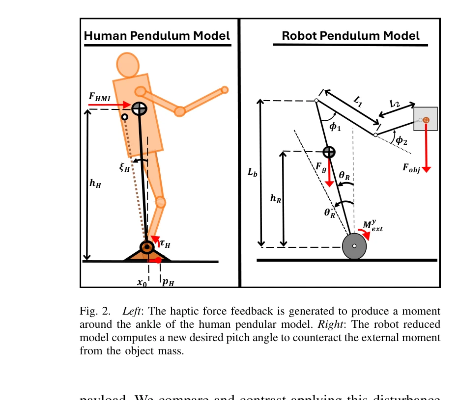
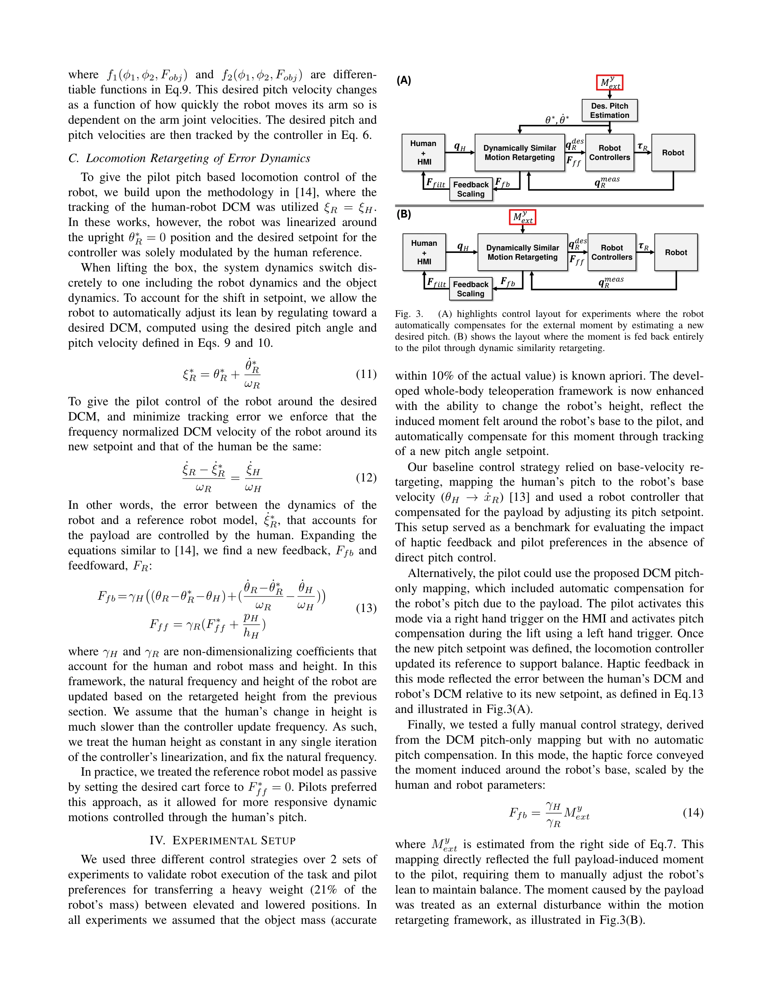

# Heavy lifting tasks via haptic teleoperation of a wheeled humanoid

> **저자**: Amartya Purushottam, Jack Yan, Christopher Yu, Joao Ramos | **날짜**: 2025-05-26 | **URL**: [https://arxiv.org/abs/2505.19530](https://arxiv.org/abs/2505.19530)

---

## Essence

*Fig. 1.*

휠형 휴머노이드 로봇의 Dynamic Mobile Manipulation을 위해 햅틱 피드백을 통한 원격 조종 프레임워크를 제시하며, 인간의 전신 모션을 로봇에 재타겟팅하여 무거운 물체 들어올리기를 수행한다.

## Motivation

- **Known**: 휴머노이드 로봇은 전신 협조를 요구하는 작업에 활용될 수 있으며, 원격 조종 및 모션 재타겟팅 기술이 기존에 존재한다. 하지만 기존 연구는 고정된 높이에서의 작업이나 가벼운 페이로드만을 다루었다.
- **Gap**: 높이 조절이 가능한 휠형 휴머노이드의 DMM 작업에서 무거운 페이로드로 인한 pitch 모멘트를 명시적으로 처리하고, 몰입감 있는 햅틱 피드백을 통합한 통합 시스템이 부재하다.
- **Why**: 창고나 소매점 같은 실제 환경에서 휴머노이드가 신뢰성 있게 배포되려면 무거운 물체를 동적으로 들어올리고 운반하면서 균형을 유지해야 하는데, 이는 산업 적용성과 안전성 측면에서 중요하다.
- **Approach**: 인간의 pitch와 각속도를 기반으로 DCM dynamic similarity를 통한 모션 재타겟팅을 적용하고, 페이로드로 인한 외부 모멘트를 추정하여 로봇의 원하는 pitch 각도를 자동으로 조정하며, 이를 햅틱 피드백 또는 컨트롤러 보상으로 구현한다.

## Achievement

*Fig. 2.*

- **높이 조절 기능 추가**: 고정 높이에서 벗어나 로봇의 높이를 동적으로 변경하는 모션 재타겟팅 전략 개발
- **자동 pitch 보상**: 알려진 객체 질량을 기반으로 페이로드 유도 외부 모멘트를 보상하는 새로운 desired pitch 각도 계산 방법 제시
- **햅틱 피드백 통합**: DCM 에러와 end-effector 외부력을 인간 발목에 생성되는 모멘트로 변환하여 폐루프 제어 실현
- **비교 평가**: 조종사 보상 vs 로봇 컨트롤러 보상 두 가지 disturbance rejection 방식을 2.5kg 물체 들어올리기 실험으로 비교

## How

*Fig. 3.*

- Wheeled inverted pendulum 모델로 인간과 로봇을 표현하여 DCM (Divergent Component of Motion) 기반 동적 유사성 구현
- Human-Machine Interface를 통해 인간의 arm 모션, 높이, pitch, center of pressure를 측정 및 캡처
- 식(2)를 통해 DCM 에러와 scaled external forces를 조합하여 햅틱 피드백 신호 생성
- Robot controller에서 페이로드 추정값을 이용하여 equilibrium pitch angle을 자동 조정하는 로직 구현
- Barbell과 box lifting 실험에서 세 가지 telelocomotion 매핑 (수동 vs 자동 balance 보조) 비교 평가

## Originality

- 기존 DCM dynamic similarity 기반 teleoperation에 height variation과 y-축 pitch 모멘트 보상을 통합한 최초의 시도
- 페이로드 유도 외부 모멘트를 명시적으로 모델링하여 두 가지 보상 전략(pilot vs controller compensation)을 정량적으로 비교
- Haptic feedback을 단순 힘 전달을 넘어 인간의 발목 모멘트로 표현하여 더 직관적인 제어 경험 제공

## Limitation & Further Study

- 실험이 barbell과 box lifting으로 제한되어 있으며, 다른 형태의 DMM 작업(bending down, placing objects)에 대한 검증 부재
- 로봇의 mass center 추정과 contact state 변화에 따른 동역학 변화를 완전히 반영하지 못함
- Human-robot 사이의 크기 차이 보상을 위한 스케일링 게인(γH, γR)의 최적 설정 방법이 명확하지 않음
- 비상 상황이나 예상치 못한 disturbance에 대한 안정성 및 fail-safe 메커니즘 논의 부재
- 후속 연구: 더 무거운 페이로드, 복잡한 loco-manipulation 시나리오, 실시간 mass estimation 알고리즘, 그리고 자율 제어와 teleoperation의 하이브리드 접근법 필요

## Evaluation

- Novelty: 4/5
- Technical Soundness: 3/5
- Significance: 4/5
- Clarity: 4/5
- Overall: 4/5

**총평**: 본 논문은 무거운 물체 들어올리기 작업을 위한 휠형 휴머노이드의 원격 조종에서 높이 조절, 자동 pitch 보상, 햅틱 피드백을 통합한 실질적이고 잘 설계된 시스템을 제시하며, 기존 연구의 명확한 한계를 극복한 의미 있는 기여이다.

## Related Papers

- 🔄 다른 접근: [[papers/1977_High-Speed_and_Impact_Resilient_Teleoperation_of_Humanoid_Ro/review]] — IMU 기반 고속 텔레오퍼레이션이 햅틱 기반 휠형 휴머노이드 제어와 다른 원격조종 방식을 제시합니다.
- 🔗 후속 연구: [[papers/2147_TeleGate_Whole-Body_Humanoid_Teleoperation_via_Gated_Expert/review]] — TeleGate의 gated expert 기반 전신 텔레오퍼레이션이 햅틱 피드백 방식을 발전시킵니다.
- 🏛 기반 연구: [[papers/1757_Whole-body_Multi-contact_Motion_Control_for_Humanoid_Robots/review]] — Whole-body dynamic throwing 기술이 무거운 물체 들어올리기의 동역학적 기반이 됩니다.
- 🔗 후속 연구: [[papers/1756_Whole-Body_Bilateral_Teleoperation_with_Multi-Stage_Object_P/review]] — 무거운 물체 조작에서 다단계 매개변수 추정과 haptic teleoperation이라는 보완적 접근법을 제시한다.
- 🔄 다른 접근: [[papers/1977_High-Speed_and_Impact_Resilient_Teleoperation_of_Humanoid_Ro/review]] — 햅틱 피드백 기반 원격조종이 IMU 기반 고속 텔레오퍼레이션과 다른 피드백 방식을 사용합니다.
