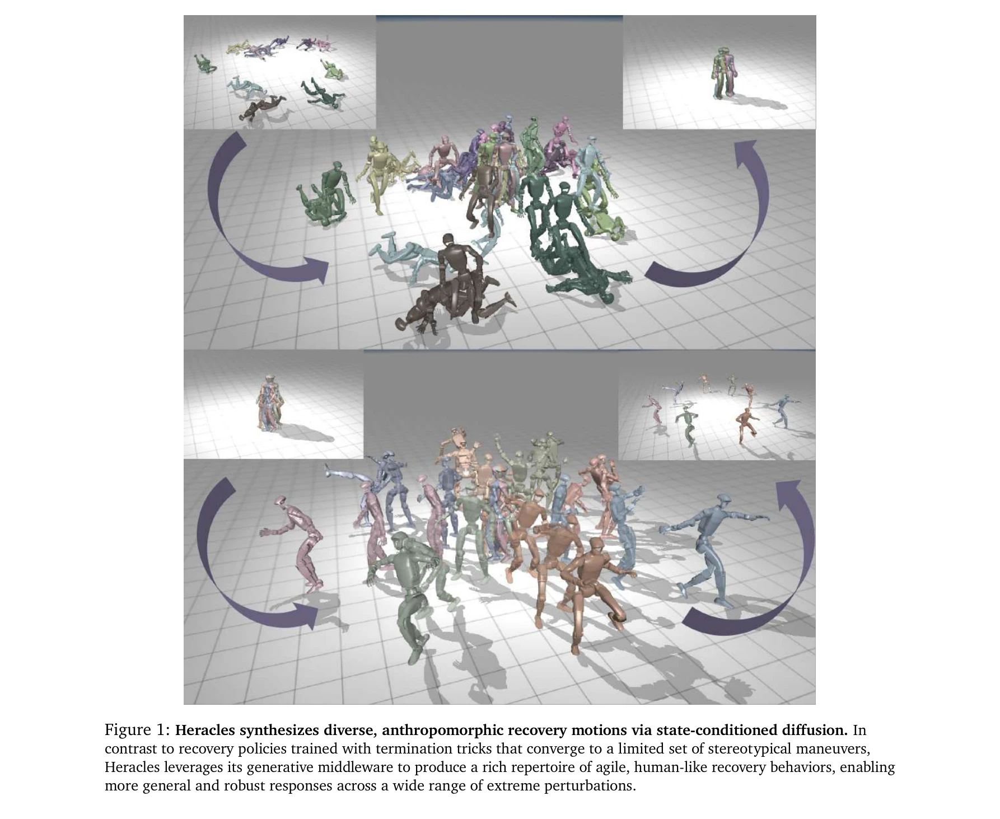
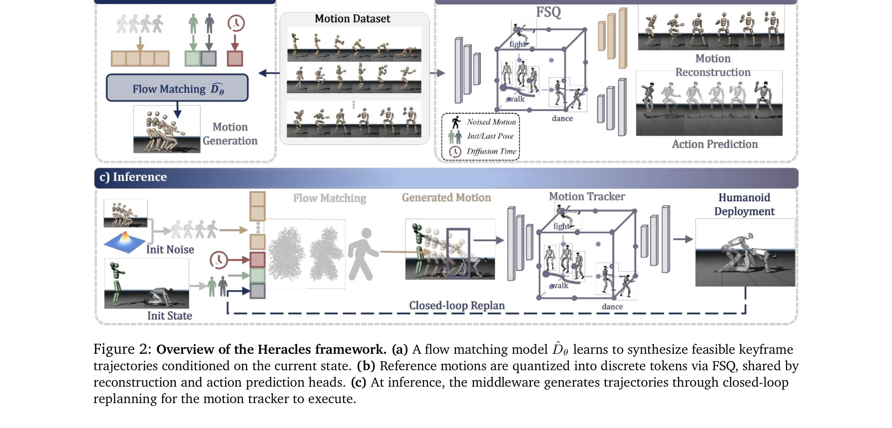

# Heracles: Bridging Precise Tracking and Generative Synthesis for General Humanoid Control

> **저자**: Zelin Tao, Zeran Su, Peiran Liu, Jingkai Sun, Wenqiang Que, Jiahao Ma, Jialin Yu, Jiahang Cao, Pihai Sun, Hao Liang, Gang Han, Wen Zhao, Zhiyuan Xu, Jian Tang, Qiang Zhang, Yijie Guo | **날짜**: 2026-03-31 | **DOI**: [10.48550/arXiv.2603.27756](https://doi.org/10.48550/arXiv.2603.27756)

---

## Essence

*Figure 1: Heracles synthesizes diverse, anthropomorphic recovery motions via state-conditioned diffusion. In*

Heracles는 state-conditioned diffusion 미들웨어를 통해 정밀한 모션 추적과 생성적 적응을 통합하여 휴머노이드 로봇이 극단적인 외부 교란 상황에서도 자연스러운 복구 동작을 수행하도록 한다.

## Motivation

- **Known**: 최근 deep reinforcement learning 기반 휴머노이드 컨트롤러는 reference-tracking 패러다임으로 다양한 모션 캡처 데이터를 정밀하게 추적할 수 있지만, 심각한 환경 교란 상황에서는 경직된 비자연스러운 실패 모드를 보인다.
- **Gap**: 정밀한 추적 능력과 생성적 적응성 사이의 근본적 간극이 존재하며, 기존 추적 기반 컨트롤러는 대규모 state deviation에서 인간다운 복구 행동을 생성하지 못한다.
- **Why**: 휴머노이드 로봇이 현실 세계의 불가예측적인 환경에서 안정적으로 동작하려면 엄밀한 작업 실행과 유연한 회복 능력을 동시에 갖춰야 하며, 이는 일반적 목적의 휴머노이드 제어의 필수 요건이다.
- **Approach**: state-conditioned diffusion 미들웨어를 high-level reference motion과 low-level physics tracker 사이의 중간층으로 배치하여, 로봇의 실시간 상태에 따라 암묵적으로 behavior를 적응시킨다. state가 reference에 가까우면 identity map으로 작동하고, significant deviation 시 생성적 복구 궤적을 합성한다.

## Achievement

*Figure 1: Heracles synthesizes diverse, anthropomorphic recovery motions via state-conditioned diffusion. In*

- **생성적 제어 미들웨어 패러다임**: state-conditioned diffusion을 기반으로 정밀 추적과 생성적 합성을 유기적으로 결합하는 새로운 미들웨어 아키텍처 제시
- **일반적 목적 제어를 위한 향상된 아키텍처**: 기저 physics tracker와 전체 제어 프레임워크를 개선하여 고충실도 추적 특성을 유지하면서 생성적 사전 지식을 통합
- **강건한 자연스러운 복구 및 모션 일반화**: 물리적 휴머노이드 로봇에서 극단적인 out-of-distribution 교란 상황 하에서 창발적이고 인간다운 복구 행동을 달성

## How

*Figure 2: Overview of the Heracles framework. (a) A flow matching model ^𝐷𝜃learns to synthesize feasible keyframe*

- Flow matching 기반 diffusion model을 real-time 로봇 상태에 대해 조건화하여 reference motion을 적응적으로 변환
- State alignment 정도에 따라 diffusion process가 암묵적으로 identity map 또는 생성적 synthesizer로 동작하도록 설계
- Low-level physics tracker (control policy)의 reference로 diffusion 모델의 출력을 사용하여 고주파 물리 실행 수행
- Zero-shot tracking 충실도를 보존하면서 동시에 extreme perturbation에 대한 anthropomorphic recovery 능력 확보
- 명시적 mode-switching이나 복잡한 상태 기계 없이 state conditioning을 통한 부드러운 동작 전환

## Originality

- 정밀 추적과 생성적 적응을 단일 미들웨어 층으로 통합하는 novel 접근법 (기존 explicit mode-switching 회피)
- State-conditioned diffusion이 자동으로 tracking과 generation 사이를 연속적으로 보간하는 implicit adaptability 메커니즘
- 기존 tracking-first 패러다임에서 open-ended 생성적 아키텍처로의 패러다임 전환
- 극단적 OOD perturbation 환경에서도 zero-shot 추적 성능을 유지하면서 anthropomorphic recovery 달성

## Limitation & Further Study

- Diffusion 기반 미들웨어의 실시간 계산 오버헤드 및 inference latency에 대한 상세 분석 부족
- 다양한 정도의 perturbation에 대한 state-conditioning threshold 선택의 자동화 방법론 미흡
- 생성된 복구 동작의 다양성이 학습 데이터의 anthropomorphic quality에 의존하는 한계
- Large-scale humanoid 모델에 대한 확장성과 sim-to-real 격차 폐쇄의 구체적 전략 필요
- 다양한 신체 형태(morphology)의 휴머노이드에 대한 일반화 가능성 검증 필요

## Evaluation

- Novelty: 4/5
- Technical Soundness: 3/5
- Significance: 4/5
- Clarity: 4/5
- Overall: 4/5

**총평**: Heracles는 state-conditioned diffusion을 활용한 혁신적인 제어 미들웨어를 제시하여 휴머노이드 로봇의 정밀 추적과 생성적 적응성의 오래된 딜레마를 우아하게 해결하며, 물리적 로봇 실험을 통한 강건한 성능 검증으로 실질적 가치를 입증한다.
