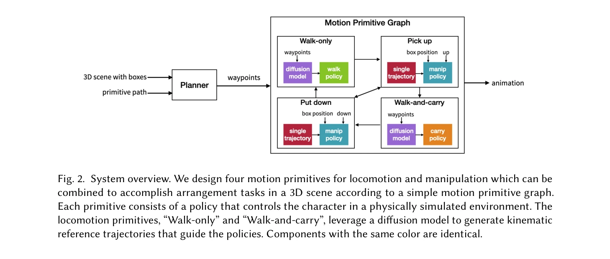
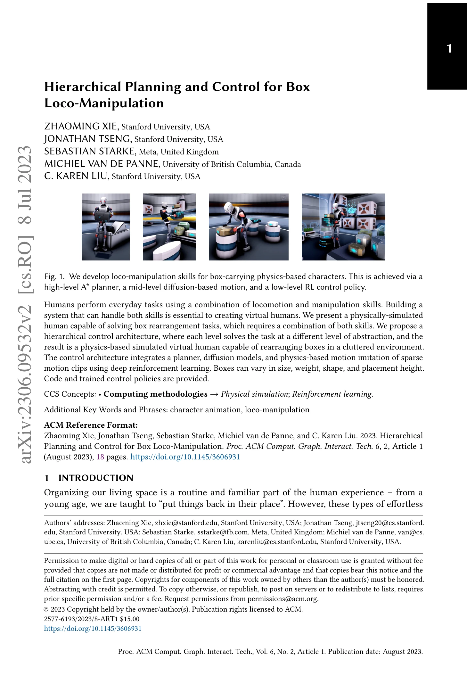

# Hierarchical Planning and Control for Box Loco-Manipulation

> **저자**: Zhaoming Xie, Jonathan Tseng, Sebastian Starke, Michiel van de Panne, C. Karen Liu | **날짜**: 2023-06-15 | **URL**: [https://arxiv.org/abs/2306.09532](https://arxiv.org/abs/2306.09532)

---

## Essence

*Fig. 2. System overview. We design four motion primitives for locomotion and manipulation which can be*

물리 기반 시뮬레이션 인간 캐릭터가 box rearrangement 작업을 수행하기 위해 계획, diffusion model, 강화학습을 계층적으로 조합하는 시스템을 제시한다.

## Motivation

- **Known**: 물리 기반 캐릭터 애니메이션에서 이동과 조작 기술을 개별적으로는 성숙했으나, 두 기술을 유연하게 결합하는 것은 여전히 도전적이다.
- **Gap**: 기존 physics-based loco-manipulation 방법들은 단순화된 상호작용에 의존하거나 계산 비용이 크며, 다양한 객체 속성(크기, 무게, 높이)에 대한 일반화 능력이 부족하다.
- **Why**: 인간처럼 행동하는 가상 캐릭터 개발은 컴퓨터 애니메이션과 로봇공학에서 근본적이며, 실제 환경에서의 물체 정리 작업은 현실적인 응용 시나리오다.
- **Approach**: 고수준의 A* planner로 경로를 계획하고, diffusion model로 현실적인 보행 궤적을 생성하며, 강화학습 기반 physics-controlled policy로 움직임을 모방한다.

## Achievement

*Fig. 1. We develop loco-manipulation skills for box-carrying physics-based characters. This is achieved via a*

- **계층적 제어 아키텍처**: 추상화 수준에 따라 계획과 제어를 분리하여 다양한 배치 작업에 일반화 가능하게 함
- **Diffusion model 기반 locomotion 생성**: bidirectional root representation을 도입하여 waypoint 조건을 만족하는 현실적인 보행 궤적 생성
- **Object-aware RL policy**: 단일 motion clip으로부터 학습하여 다양한 상자 무게, 크기, 높이에 일반화 가능한 물체 조작 기술 습득
- **실제 작업 수행**: 장애물이 있는 클러터된 환경에서 상자를 픽업, 운반, 배치하는 완전 자동화된 작업 달성

## How

*Fig. 2. System overview. We design four motion primitives for locomotion and manipulation which can be*

- 고수준: A* pathfinding으로 pick-up과 place-down 위치 사이의 기본 경로 계획
- 중간 수준: diffusion model에 bidirectional root control을 적용하여 waypoint 조건을 만족하는 kinematic locomotion 궤적 생성
- 저수준: imitation-based deep reinforcement learning으로 diffusion 생성 궤적과 motion clip을 추적하는 physics-based control policy 학습
- Motion primitives: walk-only, walk-and-carry, pickup, place-down의 4가지 기본 동작을 조합하여 복합 작업 수행
- Generalization: object-aware reward formulation으로 다양한 객체 특성에 대응하는 robust carrying behavior 구현

## Originality

- Physics-based character animation에 diffusion model을 활용한 최초의 시도로, 단순성과 유연성을 모두 확보
- Bidirectional root representation으로 diffusion model의 waypoint 추종 정확도 향상
- 단일 motion clip에서 출발하여 RL을 통해 다양한 객체 속성에 일반화되는 manipulation skill 학습 방식의 독창성
- High-level planner, mid-level diffusion trajectory generation, low-level physics control의 3단계 계층 구조의 명확한 설계

## Limitation & Further Study

- Diffusion model의 sampling 시간과 계산 비용에 대한 분석 및 최적화 방안 부족
- 단일 human skeleton 및 특정 환경 설정에만 제한되어 있으며, 다양한 체형이나 환경의 일반화 능력 미검증
- Motion capture 데이터의 부족으로 pickup/placement 동작을 단일 clip에 의존하고 있어, 더 다양한 접근 방식에 대한 확장성 제한
- 후속 연구: (1) 실제 로봇에의 sim-to-real transfer, (2) 더 복잡한 multi-object manipulation 및 협력 작업, (3) 사용자 상호작용 및 지시학습 통합

## Evaluation

- Novelty: 4/5
- Technical Soundness: 4/5
- Significance: 4/5
- Clarity: 4/5
- Overall: 4/5

**총평**: 본 논문은 물리 기반 캐릭터 애니메이션에서 loco-manipulation의 도전적인 문제를 diffusion model과 RL을 계층적으로 조합하여 우아하게 해결하며, 높은 기술적 완성도와 실용적 가치를 동시에 갖춘 우수한 연구이다.

## Related Papers

- 🧪 응용 사례: [[papers/1674_Sim-to-Real_Learning_for_Humanoid_Box_Loco-Manipulation/review]] — 계층적 계획과 제어 방법론이 실제 박스 조작 작업의 sim-to-real 학습에 직접 적용될 수 있다.
- 🏛 기반 연구: [[papers/1702_Task_and_Motion_Planning_for_Humanoid_Loco-manipulation/review]] — 휴머노이드 loco-manipulation을 위한 작업 및 동작 계획의 이론적 기반을 제공한다.
- 🔄 다른 접근: [[papers/1995_Humanoid_Hanoi_Investigating_Shared_Whole-Body_Control_for_S/review]] — Humanoid Hanoi의 skill-based framework와 유사하게 box manipulation을 위한 계층적 접근법을 사용하지만 diffusion model을 추가로 활용한다.
- 🧪 응용 사례: [[papers/2089_ManiSkill-HAB_A_Benchmark_for_Low-Level_Manipulation_in_Home/review]] — ManiSkill-HAB 벤치마크의 가정 환경 조작 작업들이 box rearrangement 시스템의 실제 적용 시나리오를 제공한다.
- 🏛 기반 연구: [[papers/1929_FLAM_Foundation_Model-Based_Body_Stabilization_for_Humanoid/review]] — FLAM의 foundation model 기반 안정화가 box loco-manipulation의 제어 기반이 됩니다.
- 🔗 후속 연구: [[papers/1674_Sim-to-Real_Learning_for_Humanoid_Box_Loco-Manipulation/review]] — 계층적 박스 로코-조작 계획이 단순 박스 집기/운반을 복잡한 계층적 조작으로 확장
- 🏛 기반 연구: [[papers/1692_StageACT_Stage-Conditioned_Imitation_for_Robust_Humanoid_Doo/review]] — 박스 loco-manipulation에서 계층적 계획과 단계별 조건부 모방 학습이 상호 보완적인 제어 전략을 제공한다.
- 🔄 다른 접근: [[papers/1702_Task_and_Motion_Planning_for_Humanoid_Loco-manipulation/review]] — 최적화 기반 TAMP와 계층적 박스 로코-조작 계획은 복합 조작의 서로 다른 계획 패러다임
- 🧪 응용 사례: [[papers/1757_Whole-Body_Dynamic_Throwing_with_Legged_Manipulators/review]] — 전신 투척 기술이 box loco-manipulation의 물체 던지기 단계에 직접 활용 가능합니다.
- 🧪 응용 사례: [[papers/1792_Adversarial_Locomotion_and_Motion_Imitation_for_Humanoid_Pol/review]] — 계층적 계획과 제어 접근법이 ALMI의 상반신-하반신 분리 학습을 box manipulation 작업에 적용하는 데 활용될 수 있다.
- 🏛 기반 연구: [[papers/1974_Hierarchical_Vision-Language_Planning_for_Multi-Step_Humanoi/review]] — 상자 로코-조작을 위한 계층적 계획이 다단계 조작의 기반 기술이다.
- 🔄 다른 접근: [[papers/1995_Humanoid_Hanoi_Investigating_Shared_Whole-Body_Control_for_S/review]] — box rearrangement를 위해 diffusion model을 사용하는 것과 달리 Humanoid Hanoi는 task-agnostic WBC를 통한 skill 조합 방식을 제안한다.
- 🔗 후속 연구: [[papers/2036_Kinematics-Aware_Multi-Policy_Reinforcement_Learning_for_For/review]] — Kinematics-Aware의 force-capable loco-manipulation이 박스 로코-조작의 계층적 계획 제어와 결합되어 산업 응용 향상
- 🧪 응용 사례: [[papers/2049_Learning_Differentiable_Reachability_Maps_for_Optimization-b/review]] — 미분 가능한 도달성 맵을 박스 조작 계획에 적용한 구체적 사례
- 🏛 기반 연구: [[papers/2085_Load-Aware_Locomotion_Control_for_Humanoid_Robots_in_Industr/review]] — Load-Aware Locomotion Control의 분리-협조 구조가 Hierarchical Planning and Control for Box Loco-Manipulation의 계층적 제어 아키텍처 설계에 이론적 기반을 제공한다.
- 🏛 기반 연구: [[papers/2165_ULC_A_Unified_and_Fine-Grained_Controller_for_Humanoid_Loco-/review]] — hierarchical planning and control이 ULC의 상체-하체 통합 제어에서 sequential skill acquisition의 이론적 기반을 제공함
- 🏛 기반 연구: [[papers/2126_Opt2Skill_Imitating_Dynamically-feasible_Whole-Body_Trajecto/review]] — Hierarchical Planning and Control의 계층적 계획 제어 기법이 Opt2Skill의 최적화와 RL을 결합한 통합 파이프라인 설계에 이론적 기반을 제공한다.
