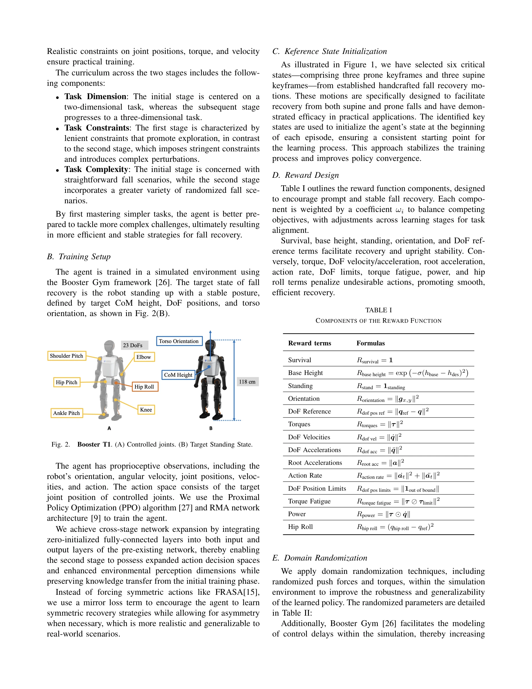

# HiFAR: Multi-Stage Curriculum Learning for High-Dynamics Humanoid Fall Recovery

> **저자**: Penghui Chen, Yushi Wang, Changsheng Luo, Wenhan Cai, Mingguo Zhao | **날짜**: 2025-02-27 | **URL**: [https://arxiv.org/abs/2502.20061](https://arxiv.org/abs/2502.20061)

---

## Essence

*Fig. 1.*

HiFAR는 다단계 커리큘럼 학습 프레임워크를 통해 휴머노이드 로봇의 자율적 낙상 회복을 학습하는 방법을 제시하며, 저차원 태스크에서 시작하여 고차원 배포 시나리오로 점진적으로 확장한다.

## Motivation

- **Known**: 기존 연구들은 FSM 기반 접근법, MPC 같은 최적화 기법, 그리고 RL 기반 낙상 회복 방법들을 제시했으나, 고차원 동역학과 접촉 풍부한 환경에서의 적응성과 견고성이 제한적이다.
- **Gap**: 기존 RL 기반 방법들은 희소 보상, 복잡한 충돌 시나리오, 시뮬레이션과 실제 환경의 차이로 인해 다양한 낙상 형태(앙와위, 복와위, 측와위)에서 견고하고 빠른 회복을 달성하지 못한다.
- **Why**: 휴머노이드 로봇이 동적이고 구조화되지 않은 환경에서 자율적으로 낙상에서 회복할 수 있는 능력은 실제 배포를 위해 필수적이며, 빠른 회복은 가동 중단 시간을 최소화하고 안전성을 강화한다.
- **Approach**: HiFAR은 (1) 저차원 2D 낙상 시나리오에서 기본 회복 정책을 학습하고 (2) 고차원 배포 시나리오로 확장하는 2단계 curriculum learning 프레임워크를 제안하며, KSI와 reward shaping을 활용하여 학습을 가속화한다.

## Achievement

*Fig. 1.*

- **다단계 커리큘럼 설계**: 복잡한 고차원 낙상 회복 태스크를 단순한 저차원 태스크로 분해하고 점진적으로 복잡성을 증가시키는 stage division 전략 제시
- **KSI와 reward shaping 적용**: Key State Initialization과 reward shaping을 통해 학습 과정을 효과적으로 유도하고 정책 수렴을 가속화
- **차원 확장 메커니즘**: 추가 구동 관절을 통한 차원 확장으로 다양한 낙상 시나리오에서의 견고한 일반화 능력 달성
- **실제 로봇 검증**: 실제 휴머노이드 로봇 Booster T1에서 다양한 낙상에 대해 높은 성공률, 빠른 회복 시간, 견고성 및 일반화 능력을 입증

## How

*Fig. 2.*

- Stage 1: 제어를 (x, z) 평면의 관절로 제한하여 저차원 2D 낙상 회복 정책 학습 (자가 충돌 위험 감소)
- Stage 2: 추가 관절을 활성화하여 고차원 배포 시나리오로 확장, 제약 조건과 변동성 추가
- KSI (Key State Initialization)를 사용하여 에이전트를 특정 주요 상태로 초기화하고 안정적인 학습 지점 제공
- Reward shaping을 통해 희소 보상 문제를 해결하고 정책 학습 방향 가이드
- Booster Gym 프레임워크 활용으로 시뮬레이션과 실제 로봇 간의 시뮬-투-리얼 전환 최적화

## Originality

- 기존 HumanUp의 2단계 학습과 달리, HiFAR은 추적 태스크 대신 자율적 낙상 회복을 직접 학습하여 회복 속도와 적응성 향상
- 저차원 초기화에서 고차원 배포로의 점진적 차원 확장 전략으로 복잡한 접촉 시나리오에서의 효과적인 학습 달성
- KSI와 reward shaping의 조합으로 희소 보상과 고차원 동역학 문제를 체계적으로 해결
- 앙와위, 복와위, 측와위를 포함한 다양한 낙상 형태에 대한 통일된 정책 학습

## Limitation & Further Study

- 현재 방법은 2단계 커리큘럼으로 제한되어 있으며, 추가 단계의 필요성이나 효과에 대한 분석 부족
- 실제 로봇 실험이 특정 환경(Booster T1)에서만 수행되어 다른 휴머노이드 플랫폼으로의 일반화 검증 필요
- 외부 교란(external disturbances) 조건에서의 견고성 평가가 정성적이며 정량적 분석 강화 필요
- 시뮬레이션-현실 간의 갭(domain randomization 등의 구체적 기법)에 대한 상세한 기술 설명 필요
- 후속 연구로 3단계 이상의 고급 커리큘럼 전략과 다중 휴머노이드 플랫폼에서의 적응성 검증 제안

## Evaluation

- Novelty: 4/5
- Technical Soundness: 3/5
- Significance: 4/5
- Clarity: 4/5
- Overall: 4/5

**총평**: HiFAR은 다단계 커리큘럼 학습과 KSI, reward shaping을 효과적으로 결합하여 복잡한 고차원 낙상 회복 문제를 체계적으로 해결하며, 실제 로봇 검증을 통해 높은 실용성과 견고성을 입증한 우수한 연구이다.
