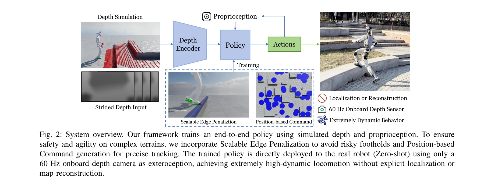
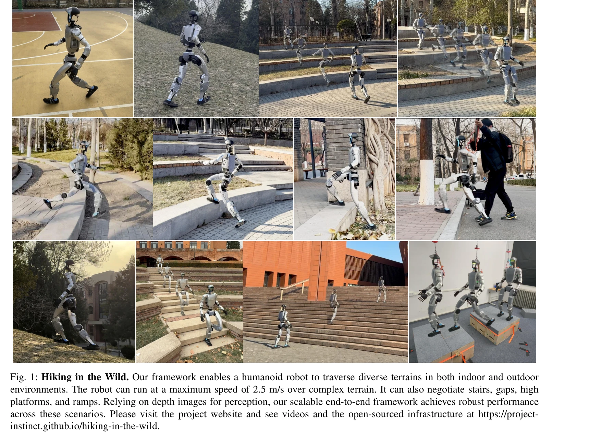

# Hiking in the Wild: A Scalable Perceptive Parkour Framework for Humanoids

> **저자**: Shaoting Zhu, Ziwen Zhuang, Mengjie Zhao, Kun-Ying Lee, Hang Zhao | **날짜**: 2026-01-12 | **DOI**: [10.48550/arXiv.2601.07718](https://doi.org/10.48550/arXiv.2601.07718)

---

## Essence

*Fig. 2: System overview. Our framework trains an end-to-end policy using simulated depth and proprioception. To ensure*

이 논문은 깊이 카메라와 proprioception을 직접 joint actions으로 변환하는 end-to-end RL 프레임워크를 제시하여, 외부 상태 추정 없이 humanoid 로봇이 복잡한 비정형 지형에서 최대 2.5 m/s의 속도로 안전하게 이동할 수 있게 한다.

## Motivation

- **Known**: Blind locomotion은 proprioception만으로 견고한 성능을 보이지만 반응형이어서 큰 장애물 회피가 어렵다. LiDAR 기반 elevation map 방식은 상태 추정 드리프트와 모션 디스토션 문제가 있다.
- **Gap**: 기존 depth 기반 방법들은 낮은 속도와 단순 지형(평면, 계단)에만 적용되며 임의적 구성으로 인해 재현과 확장이 어렵다. 또한 foothold precision과 reward hacking 문제가 미해결되어 있다.
- **Why**: Humanoid 로봇이 실제 야외 환경에서 안전하고 신속하게 이동하려면 forward-looking perception이 필수적이며, 재현 가능하고 확장 가능한 통합 프레임워크가 필요하다.
- **Approach**: Single-stage RL을 통해 raw depth와 proprioception을 직접 joint actions에 매핑하되, Terrain Edge Detection + Foot Volume Points로 foothold safety를 보장하고, Flat Patch Sampling으로 reward hacking을 해결한다.

## Achievement

*Fig. 1: Hiking in the Wild. Our framework enables a humanoid robot to traverse diverse terrains in both indoor and outdo*

- **Zero-shot Sim-to-Real transfer**: 외부 localization이나 map reconstruction 없이 시뮬레이션 정책이 실제 로봇에서 바로 작동
- **High-speed robust traversal**: 계단, 갭, 경사지, 불규칙한 잔디 지형에서 최대 2.5 m/s 속도로 안전하게 주행
- **Scalable safety mechanism**: Terrain Edge Detection이 임의의 trimesh에 자동으로 적용되어 case-by-case 구현 불필요
- **Reward hacking 해결**: Flat Patch Sampling이 위치 기반 속도 명령을 생성하여 의미 있는 탐험 보장
- **Open-source 배포**: 최소한의 하드웨어 수정으로 실제 로봇에 배포 가능한 훈련/배포 코드 공개

## How

*Fig. 2: System overview. Our framework trains an end-to-end policy using simulated depth and proprioception. To ensure*

- Mixture-of-Experts (MoE) 아키텍처를 활용한 깊이 인코더로 고차원 시각 데이터 처리
- Depth synthesis 모듈로 센서 노이즈와 artifacts를 모의하여 realistic training 구현
- Terrain Edge Detector가 trimesh에서 자동으로 엣지 추출, Volume Points로 침투 penalty 적용
- Flat Patch Sampling이 지형 메시에서 도달 가능한 평탄 영역 식별 후 그에 따른 velocity command 생성
- PPO 알고리즘으로 observation space (proprioception + 깊이 입력)에서 action space (joint actions)로의 매핑 최적화
- 60 Hz 깊이 센서에서 고주파 perception loop로 동적 장애물 회피 가능

## Originality

- **Scalable edge penalization**: 기존 edge penalization을 임의의 trimesh에 자동 적용 가능하도록 확장 (Terrain Edge Detection + Foot Volume Points)
- **Position-based velocity command**: Flat Patch Sampling으로 reward hacking을 근본적으로 해결하는 새로운 curriculum 전략
- **Realistic depth synthesis**: 훈련 중 센서 노이즈 모델링으로 zero-shot transfer 달성
- **High-frequency end-to-end policy**: 60 Hz depth input을 직접 처리하는 단일 단계 RL로 높은 동역학 성능 구현

## Limitation & Further Study

- 야외 환경의 다양한 조건(날씨, 조명, 계절 변화)에 대한 강건성 평가 부족
- Humanoid 로봇의 특정 형태(센서 위치, 체형)에 맞춘 설계로 다른 humanoid 플랫폼으로의 일반화 검증 필요
- 극한 지형(매우 높은 단차, 매우 가파른 경사)에서의 성능 한계 미명시
- 훈련 시간, 필요 데이터 규모, 수렴 안정성에 대한 상세 분석 부족
- 후속 연구로 multi-humanoid 플랫폼 검증, 실시간 환경 변화 대응, 팀 협력 주행 등 확대 가능

## Evaluation

- Novelty: 4/5
- Technical Soundness: 3/5
- Significance: 4/5
- Clarity: 4/5
- Overall: 4/5

**총평**: 이 논문은 humanoid 로봇의 야외 주행을 위한 실용적이고 확장 가능한 end-to-end RL 프레임워크를 제시하며, Terrain Edge Detection, Foot Volume Points, Flat Patch Sampling 등 novel 메커니즘으로 safety와 reward hacking 문제를 효과적으로 해결한다. Open-source 배포와 실제 로봇 검증을 통해 높은 재현성과 실용성을 입증한 우수한 연구이다.

## Related Papers

- 🔄 다른 접근: [[papers/2060_Learning_Perceptive_Humanoid_Locomotion_over_Challenging_Ter/review]] — Hiking in the Wild의 end-to-end RL과 perceptive locomotion은 모두 도전적인 지형에서의 humanoid 이동을 다루되 서로 다른 인식 전략을 사용합니다.
- 🏛 기반 연구: [[papers/2010_HumanoidPano_Hybrid_Spherical_Panoramic-LiDAR_Cross-Modal_Pe/review]] — HumanoidPano의 파노라마-LiDAR 융합 인식이 복잡한 야외 지형에서의 안전한 parkour를 위한 향상된 환경 인식을 제공합니다.
- 🔗 후속 연구: [[papers/1693_STATE-NAV_Stability-Aware_Traversability_Estimation_for_Bipe/review]] — STATE-NAV의 안정성 인식 traversability 추정을 Hiking이 end-to-end 학습으로 확장하여 실시간 비정형 지형 내비게이션을 달성합니다.
- 🏛 기반 연구: [[papers/1999_Humanoid_Parkour_Learning/review]] — Humanoid Parkour Learning의 시각 기반 파쿠르 기술이 실제 비정형 지형 이동의 기초 방법론이 된다.
- 🔄 다른 접근: [[papers/2134_Perceptive_Humanoid_Parkour_Chaining_Dynamic_Human_Skills_vi/review]] — 지형 적응 이동을 이 논문은 end-to-end RL로, Perceptive Humanoid Parkour는 동적 스킬 체이닝으로 접근한다.
- 🔗 후속 연구: [[papers/1939_Gait-Adaptive_Perceptive_Humanoid_Locomotion_with_Real-Time/review]] — Gait-Adaptive의 지각적 보행을 복잡한 비정형 지형에서의 고속 이동으로 확장한 발전된 형태다.
- 🧪 응용 사례: [[papers/1657_Robust_Humanoid_Walking_on_Compliant_and_Uneven_Terrain_with/review]] — 야생 환경에서의 parkour 프레임워크를 compliant하고 불규칙한 지형에서의 보행에 적용한다.
- 🔗 후속 연구: [[papers/1658_RPL_Learning_Robust_Humanoid_Perceptive_Locomotion_on_Challe/review]] — RPL의 복잡한 지형 보행이 Hiking in the Wild의 scalable perceptive parkour와 결합되어 더 동적인 야외 환경 탐험을 가능하게 한다
- 🔗 후속 연구: [[papers/1693_STATE-NAV_Stability-Aware_Traversability_Estimation_for_Bipe/review]] — 거친 지형에서의 파쿠어 프레임워크를 안정성 기반 traversability 추정으로 확장하여 이족 로봇의 안전하고 효율적인 네비게이션을 구현했다.
- 🧪 응용 사례: [[papers/1617_PILOT_A_Perceptive_Integrated_Low-level_Controller_for_Loco-/review]] — Hiking in the Wild의 인지 기반 파쿠어 프레임워크가 PILOT의 지각 기반 제어를 실제 험난한 지형에 적용한 사례임
- 🔄 다른 접근: [[papers/1619_PolygMap_A_Perceptive_Locomotion_Framework_for_Humanoid_Robo/review]] — 둘 다 지각 기반 휴머노이드 보행을 다루지만 PolygMap은 계단 특화, HIKING은 일반적인 파쿠어 환경에 초점을 맞춘다
- 🔄 다른 접근: [[papers/1807_ARMOR_Egocentric_Perception_for_Humanoid_Robot_Collision_Avo/review]] — 밀집 환경에서 충돌 회피를 위해 ToF 센서 기반 자아중심 지각 vs 시각적 지각 파쿠르 프레임워크라는 다른 센서 모달리티를 비교할 수 있다
- 🔗 후속 연구: [[papers/1811_BeamDojo_Learning_Agile_Humanoid_Locomotion_on_Sparse_Footho/review]] — BeamDojo의 드문 디딤점 보행이 복잡한 지형에서의 파쿠르 프레임워크로 확장되어 더 도전적인 환경에서 적용될 수 있다
- 🧪 응용 사례: [[papers/1837_Climber_Force_and_Motion_Estimation_from_Video/review]] — 야생에서의 확장 가능한 parkour 프레임워크가 클라이머 운동 추정 기술을 실제 험난한 지형에서 활용할 수 있는 응용 분야를 제공한다
- 🏛 기반 연구: [[papers/1838_ClimbingCap_Multi-Modal_Dataset_and_Method_for_Rock_Climbing/review]] — Hiking in the Wild의 지각적 파쿠어 프레임워크가 ClimbingCap의 복잡한 지형에서의 동작 분석과 복원에 필요한 환경 인식 기술을 제공한다.
- 🔗 후속 연구: [[papers/1861_Deep_Whole-body_Parkour/review]] — 야생에서의 확장 가능한 perceptive parkour 프레임워크가 Deep Whole-body Parkour의 실험실 환경을 실제 자연 환경으로 확장한다
- 🧪 응용 사례: [[papers/1892_E-SDS_Environment-aware_See_it_Do_it_Sorted_-_Automated_Envi/review]] — Hiking in the Wild의 perceptive parkour 프레임워크가 E-SDS의 환경 통계 기반 보행 정책을 실제 복잡한 지형에 적용하는 사례를 보여준다.
- 🔗 후속 연구: [[papers/1939_Gait-Adaptive_Perceptive_Humanoid_Locomotion_with_Real-Time/review]] — 복잡한 지형에서의 perceptive parkour 연구를 하향식 카메라와 통합 정책을 통한 보다 세밀한 gait adaptation으로 발전시켰습니다.
- 🔄 다른 접근: [[papers/1914_End-to-End_Humanoid_Robot_Safe_and_Comfortable_Locomotion_Po/review]] — Hiking in the Wild의 perceptive parkour가 CBF 기반 안전 제약이 아닌 다른 방식으로 복잡한 지형 내비게이션 문제를 해결하는 접근을 제시한다.
- 🔗 후속 연구: [[papers/1925_FastStair_Learning_to_Run_Up_Stairs_with_Humanoid_Robots/review]] — FastStair의 고속 계단 등반 기법이 복잡한 야외 환경에서의 파쿠어에 응용될 수 있다.
- 🏛 기반 연구: [[papers/1999_Humanoid_Parkour_Learning/review]] — scalable perceptive parkour framework의 wild environment navigation이 parkour learning의 시각 기반 제어 정책 기초를 제공한다.
- 🧪 응용 사례: [[papers/2010_HumanoidPano_Hybrid_Spherical_Panoramic-LiDAR_Cross-Modal_Pe/review]] — 파노라마-LiDAR 융합 인식이 복잡한 야외 지형에서의 parkour 프레임워크에 향상된 환경 인식 능력을 제공합니다.
- 🔗 후속 연구: [[papers/2060_Learning_Perceptive_Humanoid_Locomotion_over_Challenging_Ter/review]] — 지각적 보행이 야생에서의 확장 가능한 파쿠르 프레임워크로 확장되어 더 극한 환경 적응을 보여준다.
- 🔄 다른 접근: [[papers/2080_Let_Humanoids_Hike_Integrative_Skill_Development_on_Complex/review]] — 확장 가능한 지각적 파쿠르 프레임워크와 복잡한 산길 통합 스킬 개발이라는 다른 접근법을 제시한다.
- 🔗 후속 연구: [[papers/2095_MeshMimic_Geometry-Aware_Humanoid_Motion_Learning_through_3D/review]] — Hiking in the Wild의 perceptive parkour가 MeshMimic의 geometry-aware motion learning으로 더욱 정교하게 발전된 것이다
- 🔗 후속 연구: [[papers/2105_MoRE_Mixture_of_Residual_Experts_for_Humanoid_Lifelike_Gaits/review]] — Hiking in the Wild의 지각 기반 파쿠르 프레임워크를 복잡한 지형에서 더욱 자연스러운 인간다운 보행으로 확장한 연구이다.
- 🧪 응용 사례: [[papers/2117_Omni-Perception_Omnidirectional_Collision_Avoidance_for_Legg/review]] — Hiking in the Wild의 복잡한 야외 환경에서의 parkour 프레임워크가 Omni-Perception의 LiDAR 기반 충돌 회피 기술을 실제 험지 환경에 적용한 사례입니다.
- 🧪 응용 사례: [[papers/2158_Track_Any_Motions_under_Any_Disturbances/review]] — Any2Track의 교란 적응 프레임워크를 perceptive parkour 환경에 적용하여 복잡한 지형과 외력 변화에 더 강건한 휴머노이드 제어를 달성할 수 있습니다.
- 🔗 후속 연구: [[papers/2162_TTT-Parkour_Rapid_Test-Time_Training_for_Perceptive_Robot_Pa/review]] — TTT-Parkour의 실시간 메시 재구성 기법을 scalable perceptive parkour framework와 결합하면 더 광범위한 야외 지형 적응이 가능합니다.
- 🔄 다른 접근: [[papers/2134_Perceptive_Humanoid_Parkour_Chaining_Dynamic_Human_Skills_vi/review]] — Hiking in the Wild의 scalable parkour framework가 Perceptive Parkour의 depth-based single policy와 다른 다단계 접근법으로 복잡한 장애물 환경을 처리합니다.
