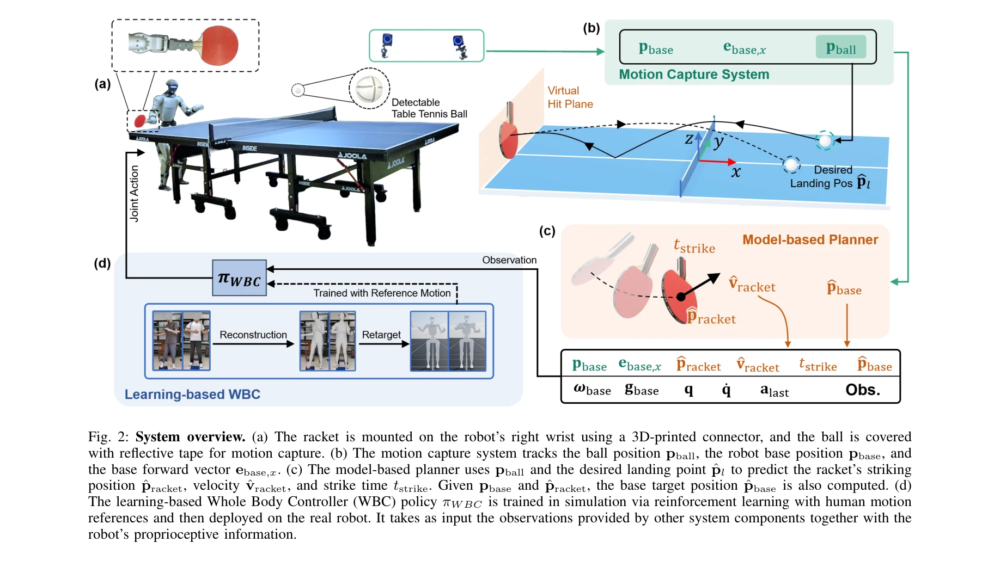
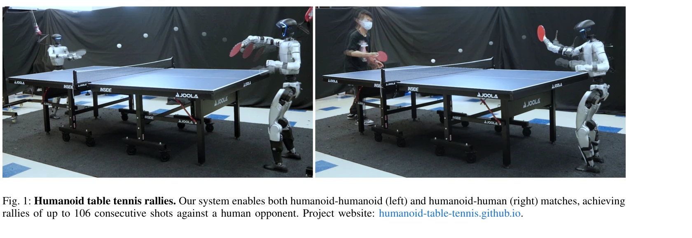

# HITTER: A HumanoId Table TEnnis Robot via Hierarchical Planning and Learning

> **저자**: Zhi Su, Bike Zhang, Nima Rahmanian, Yuman Gao, Qiayuan Liao, Caitlin Regan, Koushil Sreenath, S. Shankar Sastry | **날짜**: 2025-09-04 | **DOI**: [10.48550/arXiv.2508.21043](https://doi.org/10.48550/arXiv.2508.21043)

---

## Essence

*Fig. 2: System overview. (a) The racket is mounted on the robot’s right wrist using a 3D-printed connector, and the ball*

휴머노이드 로봇이 탁구를 하기 위한 계층적 프레임워크를 제시하며, model-based planner와 RL 기반 whole-body controller를 통합하여 sub-second 반응 시간 내에 초당 5 m/s 이상의 볼을 처리한다.

## Motivation

- **Known**: 휴머노이드 로봇은 보행 및 whole-body control에서 진전을 이루었으나, 빠른 동적 환경에서의 조작 작업이 제한적이다. 로봇 탁구는 고속 인식, 계획, 제어의 테스트베드로 활용되어 왔다.
- **Gap**: 기존 휴머노이드는 정적 환경에서의 제어에 집중했으며, 선행 연구는 제자리에서만 플레이하여 효과적인 타격 범위가 제한되었다. 민첩한 보행과 함께 인간다운 striking motion을 보이는 humanoid table tennis이 부재하다.
- **Why**: 탁구는 극도로 짧은 반응 시간, 전신 협력 제어, 연속 랠리에서의 균형 회복이 필요하므로 민첩하고 상호작용적인 로봇 행동을 실현하는 데 이상적인 테스트베드이다.
- **Approach**: 계층적 구조로 설계하여, 상위 계획 단계에서 model-based planner가 볼 궤적 예측 및 striking position/velocity/timing을 결정하고, 하위 제어 단계에서 RL 기반 WBC policy가 human motion references를 포함하여 human-like한 전신 동작을 생성한다.

## Achievement

*Fig. 1: Humanoid table tennis rallies. Our system enables both humanoid-humanoid (left) and humanoid-human (right) match*

- **계층적 프레임워크**: model-based planner와 RL 기반 whole-body controller를 통합하여 빠른 궤적 예측, 안정적인 인터페이스 제공, 효율적인 훈련을 달성
- **Human-like Striking Skills**: 팔의 협력적 동작과 다리의 민첩한 움직임을 결합하여 인간다운 전신 타격 능력 개발
- **실제 세계 검증**: 최대 106개의 연속 샷을 인간 상대로 달성하고, humanoid-humanoid 및 humanoid-human 랠리 모두 시연

## How

*Fig. 2: System overview. (a) The racket is mounted on the robot’s right wrist using a 3D-printed connector, and the ball*

- Motion capture 시스템(360 Hz, millimeter-level accuracy)으로 볼 위치 추적
- Least-squares fitting을 통해 ball velocity 추정 (31개 position measurements 사용)
- Hybrid dynamics model (aerodynamic drag + gravity)을 사용한 ball trajectory prediction
- Model-based planner에서 striking position, velocity, timing 계산
- RL을 통한 WBC policy 훈련 (human motion references 포함, simulation에서 실시)
- Unitree G1 humanoid의 29개 joint를 50 Hz로 제어 (PD controller로 토크 변환)
- 연속 strikes를 포함한 훈련으로 agile motions과 balance recovery 학습

## Originality

- General-purpose humanoid robot에서 agile locomotion을 포함한 table tennis play의 첫 시연
- Model-based planner와 RL-based whole-body controller의 새로운 hierarchical integration
- Minimum human motion references (2가지)만으로 natural movements를 유도하는 방법론
- Sub-second perception-action loop를 갖춘 fully autonomous humanoid interactive control

## Limitation & Further Study

- Motion capture system의 의존성: 실제 배포 시 onboard vision으로 대체 필요
- Ball trajectory prediction이 spin effect를 무시한다는 가정 (충분히 작은 spin만 처리 가능)
- 특정 하드웨어(Unitree G1, 9 OptiTrack cameras)에 의존적인 설계
- Opponent modeling 및 전략적 플레이 부재: 현재는 반응적 플레이만 가능
- 일반화성: 다른 동적 상호작용 작업(예: 배드민턴, 테니스)으로의 확장성 미검증
- 후속 연구: onboard perception 도입, spin 고려 확장, opponent intent 예측 통합, 더 다양한 striking techniques 학습

## Evaluation

- Novelty: 4/5
- Technical Soundness: 3/5
- Significance: 4/5
- Clarity: 4/5
- Overall: 4/5

**총평**: 본 논문은 humanoid table tennis를 통해 고속 동적 환경에서의 전신 제어 및 상호작용을 처음으로 성공적으로 시연하였으며, 계층적 planning-control 통합과 minimal human references를 통한 우아한 접근법이 인상적이다. 실제 세계 검증(106 연속 샷)은 방법론의 실용성을 강력히 입증한다.

## Related Papers

- 🔄 다른 접근: [[papers/2003_Humanoid_Whole-Body_Badminton_via_Multi-Stage_Reinforcement/review]] — 라켓 스포츠 제어를 HITTER는 탁구에, Humanoid Whole-Body Badminton은 배드민턴에 각각 특화하여 접근한다.
- 🏛 기반 연구: [[papers/2047_Learning_Athletic_Humanoid_Tennis_Skills_from_Imperfect_Huma/review]] — 불완전한 인간 데이터에서 테니스 스킬을 학습하는 방법론이 HITTER의 빠른 반응 기반 탁구 제어의 토대가 된다.
- 🔗 후속 연구: [[papers/1922_FALCON_Learning_Force-Adaptive_Humanoid_Loco-Manipulation/review]] — FALCON의 힘 적응 학습을 빠른 볼 처리가 필요한 탁구 상황으로 확장 적용한 HITTER의 발전된 형태다.
- 🔄 다른 접근: [[papers/1682_SMASH_Mastering_Scalable_Whole-Body_Skills_for_Humanoid_Ping/review]] — 탁구와 테니스 모두 라켓 스포츠이지만 에고센트릭 비전 vs 계층적 의사결정이라는 다른 접근법입니다.
- 🔗 후속 연구: [[papers/1648_RoboStriker_Hierarchical_Decision-Making_for_Autonomous_Huma/review]] — HITTER의 계층적 탁구 로봇 계획이 RoboStriker의 3단계 권투 프레임워크를 라켓 스포츠로 확장함
- 🔄 다른 접근: [[papers/1650_Robot_Drummer_Learning_Rhythmic_Skills_for_Humanoid_Drumming/review]] — 드럼 연주와 탁구라는 서로 다른 rhythmic skill을 다루는 접촉 기반 운동 제어 연구입니다.
- 🔗 후속 연구: [[papers/1757_Whole-body_Multi-contact_Motion_Control_for_Humanoid_Robots/review]] — 탁구 로봇의 계층적 계획과 제어 방식을 전신 동적 투척 작업에 적용할 수 있는 확장된 접근법입니다.
- 🔄 다른 접근: [[papers/1994_Humanoid_Goalkeeper_Learning_from_Position_Conditioned_Task-/review]] — 골키퍼와 탁구 로봇 모두 스포츠 특화 제어이지만 위치 조건부 vs 계층적 계획 접근법이 다르다.
- 🔗 후속 연구: [[papers/2003_Humanoid_Whole-Body_Badminton_via_Multi-Stage_Reinforcement/review]] — HITTER의 hierarchical planning for table tennis가 badminton의 multi-stage RL curriculum을 다른 라켓 스포츠로 확장한 연구이다.
- 🔄 다른 접근: [[papers/2046_Learning_Agile_Striker_Skills_for_Humanoid_Soccer_Robots_fro/review]] — 둘 다 휴머노이드 스포츠 기술이지만 Learning Agile Striker는 축구 킥킹, HITTER는 탁구 기술 중심
- 🏛 기반 연구: [[papers/2047_Learning_Athletic_Humanoid_Tennis_Skills_from_Imperfect_Huma/review]] — 계층적 계획을 통한 탁구 로봇 제어의 원리가 테니스 기술 학습에서의 고수준 정책 설계에 기본 틀을 제공한다.
- 🔄 다른 접근: [[papers/2053_Learning_Human-Like_Badminton_Skills_for_Humanoid_Robots/review]] — 휴머노이드 스포츠 기술에서 배드민턴과 탁구로 다른 종목에 적용된 유사한 계층적 학습
- 🔗 후속 연구: [[papers/2074_Learning_Vision-Driven_Reactive_Soccer_Skills_for_Humanoid_R/review]] — 시각 기반 반응형 축구가 계층적 플래닝을 통한 탁구로 확장되어 더 정밀한 반응 제어를 보여준다.
- 🏛 기반 연구: [[papers/2131_PACE_Physics_Augmentation_for_Coordinated_End-to-end_Reinfor/review]] — HITTER의 계층적 계획 기반 휴머노이드 탁구 로봇 기술이 PACE의 탁구 경기를 위한 end-to-end RL 프레임워크 개발에 기반을 제공한다.
