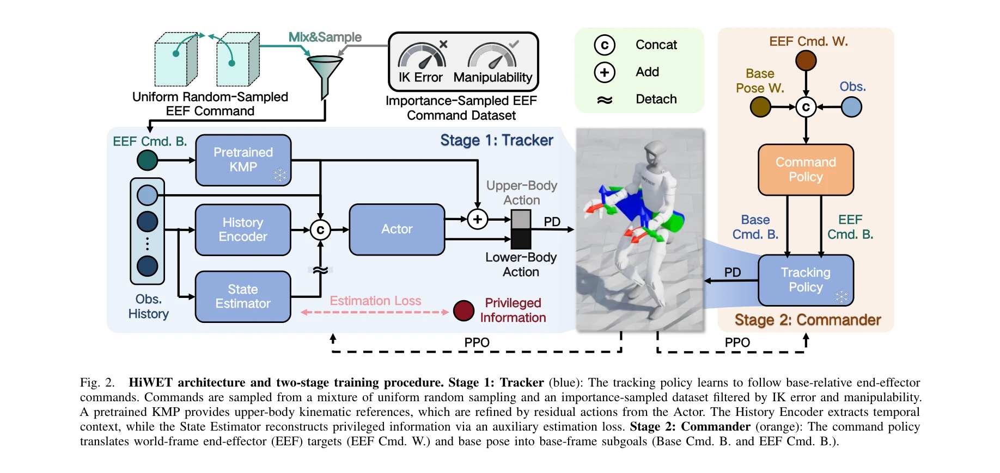
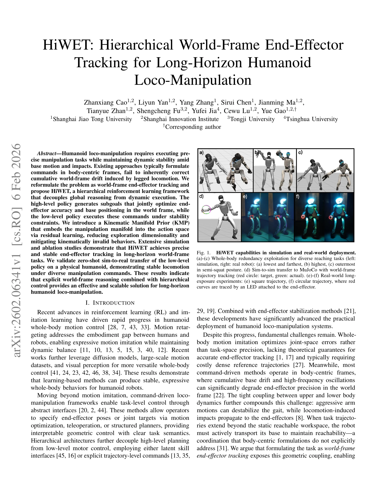

# HiWET: Hierarchical World-Frame End-Effector Tracking for Long-Horizon Humanoid Loco-Manipulation

> **저자**: Zhanxiang Cao, Liyun Yan, Yang Zhang, Sirui Chen, Jianming Ma, Tianyue Zhan, Shengcheng Fu, Yufei Jia, Cewu Lu, Yue Gao | **날짜**: 2026-02-06 | **DOI**: [10.48550/arXiv.2602.06341](https://doi.org/10.48550/arXiv.2602.06341)

---

## Essence

*Fig. 2.*

HiWET는 휴머노이드 로봇의 장기 조작 작업을 위해 세계 좌표계 기준 end-effector 추적을 명시적으로 수행하는 계층적 강화학습 프레임워크를 제안한다. Kinematic Manifold Prior를 통해 탐색 공간을 감소시키고 동역학적 안정성을 유지하면서 정밀한 추적을 달성한다.

## Motivation

- **Known**: 강화학습과 모방학습은 휴머노이드의 전신 동작 제어를 실현했고, 계층적 구조로 고수준 계획과 저수준 동작 제어를 분리하는 방식이 연구되어 왔다. 그러나 대부분의 기존 방법은 body-centric frame에서 명령을 공식화한다.
- **Gap**: 기존 body-centric 접근법은 다리 운동으로 인한 누적 world-frame drift를 보정하지 못하며, 상하체 동역학의 긴밀한 결합으로 인해 정밀한 end-effector 추적이 어렵다. 또한 task 궤적이 정적 도달 공간을 벗어날 때 베이스 이동을 명시적으로 조정하지 않는다.
- **Why**: 정밀한 조작 작업을 유지하면서 동적 안정성을 보장하는 것은 현실 휴머노이드 배포에 필수적이며, 명시적 world-frame 추적은 기하학적 결합을 노출하여 더 나은 제어를 가능하게 한다.
- **Approach**: HiWET는 고수준 정책이 세계 좌표계에서 subgoal(베이스 속도, 높이, end-effector 목표)을 생성하고 저수준 정책이 안정성 제약 하에서 이를 실행하는 계층적 구조를 채택한다. Kinematic Manifold Prior는 residual learning을 통해 운동학적으로 유효한 행동 공간을 제공한다.

## Achievement

*Fig. 1.*

- **계층적 world-frame 제어 스킴**: 상체 조작과 하체 로컬로모션을 명시적 공간 인터페이스로 조정하여 베이스 이동과 높이 조절을 통한 world-frame 일관성 달성
- **Kinematic Manifold Prior 통합**: residual action space 내에 고속 운동학 참조를 제공하여 조작 manifold에 정책을 고정하고 동적 적응성 보존
- **정밀한 추적 성능**: 시뮬레이션에서 12.4 mm의 world-frame 추적 오차 달성
- **실제 로봇 검증**: 물리 휴머노이드 플랫폼에서 zero-shot sim-to-real 전이 성공 및 다양한 사지 구성 하에서 안정적 로컬로모션 시연

## How

*Fig. 2.*

- Semi-Markov Decision Process(Semi-MDP)로 계층적 RL 문제 공식화하여 장기 조작 목표와 순간적 안정성 제약 조화
- 고수준 command policy는 K step마다 subgoal 업데이트, 저수준 tracking policy는 매 제어 스텝에서 고정된 고수준 명령에 조건부로 작용
- Kinematic Manifold Prior 사전학습으로 IK error와 manipulability에 의해 필터링된 중요도 샘플링 데이터셋과 균일 무작위 샘플링 혼합 사용
- History Encoder로 시간적 맥락 추출, State Estimator로 auxiliary estimation loss를 통해 특권 정보 복원
- 상체는 KMP 참조에 residual action으로 미세조정, 하체는 베이스 속도와 높이 명령으로 로컬로모션 제어

## Originality

- 기존 body-centric 관점에서 탈피하여 명시적 world-frame end-effector 추적을 휴머노이드 조작 문제의 중심으로 재정의
- Kinematic Manifold Prior를 residual learning과 결합하여 운동학적 유효성을 보장하면서 동역학적 학습 가능성 유지
- high-level policy가 베이스 위치, 높이, end-effector 목표를 통합으로 최적화하여 상하체 결합을 명시적으로 해결
- importance-sampled dataset 기반 명령 샘플링으로 도달 공간 및 안정성 제약 내 탐색 공간 제약

## Limitation & Further Study

- 시뮬레이션과 실제 환경의 gap은 State Estimator와 특권 정보 사용으로 부분적으로만 해결되며, 더 다양한 환경 조건에서 검증 필요
- Kinematic Manifold Prior의 사전학습 품질이 전체 성능에 의존하므로, 더 복잡한 조작 작업에 대한 확장성 미검증
- real-world 실험이 단일 휴머노이드 플랫폼에서만 수행되었으므로 다양한 로봇 형태에 대한 일반화 정도 불명확
- 후속 연구는 visual feedback 통합, 복잡한 다단계 조작 시나리오, 환경 상호작용 학습 등을 포함할 수 있음

## Evaluation

- Novelty: 4/5
- Technical Soundness: 4/5
- Significance: 4/5
- Clarity: 4/5
- Overall: 4/5

**총평**: HiWET는 world-frame 중심 재정의와 Kinematic Manifold Prior를 통해 휴머노이드 조작에서 정밀하고 안정적인 추적을 실현한 창의적 연구이다. 실제 로봇 검증과 12.4 mm의 추적 정확도로 실질적 기여를 입증하였으며, 계층적 설계와 명시적 공간 인터페이스는 장기 로컬로조작 문제의 효과적 해결 방안을 제시한다.
