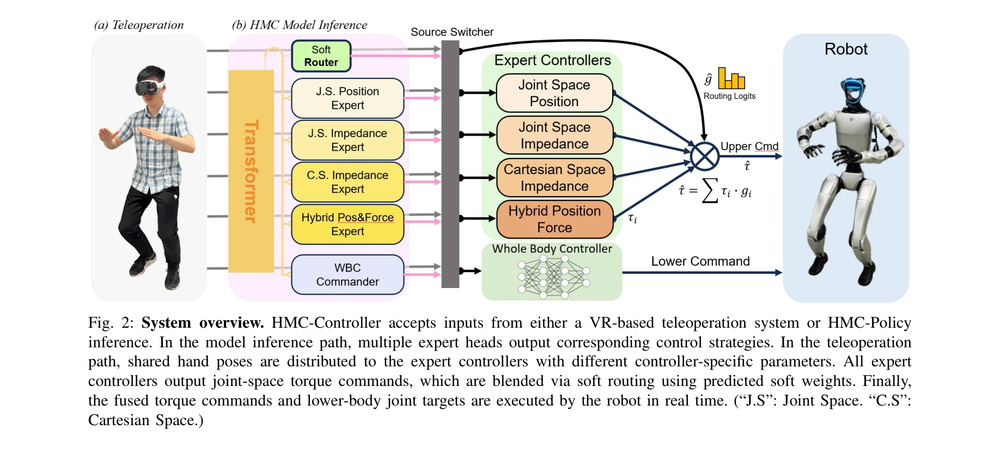
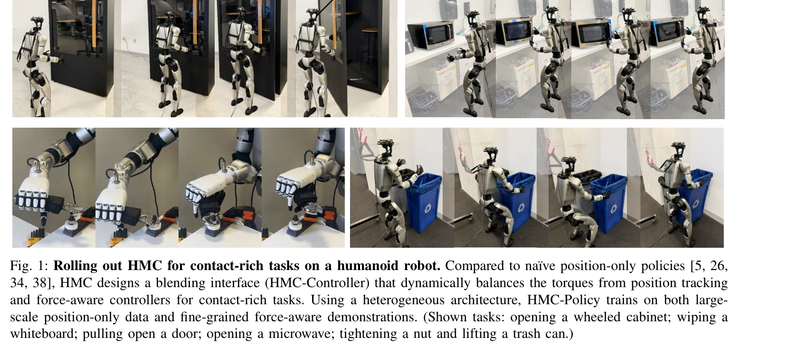

# HMC: Learning Heterogeneous Meta-Control for Contact-Rich Loco-Manipulation

> **저자**: Lai Wei, Xuanbin Peng, Ri-Zhao Qiu, Tianshu Huang, Xuxin Cheng, Xiaolong Wang | **날짜**: 2025-11-18 | **DOI**: [10.48550/arXiv.2511.14756](https://doi.org/10.48550/arXiv.2511.14756)

---

## Essence

*Fig. 2: System overview. HMC-Controller accepts inputs from either a VR-based teleoperation system or HMC-Policy*

로봇의 접촉이 많은 조작 작업을 위해 위치, 임피던스, 하이브리드 힘-위치 제어를 적응적으로 혼합하는 HMC(Heterogeneous Meta-Control) 프레임워크를 제안하며, mixture-of-experts 라우팅을 통해 대규모 위치 데이터와 미세한 힘 인식 시연으로부터 학습한다.

## Motivation

- **Known**: 기존 위치만 기반의 제어기는 접촉이 많은 작업에서 부정확하며, 전통적 임피던스 및 하이브리드 힘-위치 제어는 수동 튜닝이 필요하고 일반화가 어렵다.
- **Gap**: 다양한 제어 모달리티를 연속적으로 혼합하는 통합 인터페이스 부재, 위치 전용 데이터 불균형 문제, 제어기 간 급격한 전환으로 인한 토크 불연속성 해결 필요.
- **Why**: 로봇이 가정, 창고, 재난 현장 등 실제 환경에서 걷기와 조작을 동시에 수행해야 하는데, 접촉 역학을 무시한 제어기는 위험한 진동과 과도한 힘을 생성하기 때문이다.
- **Approach**: HMC-Controller를 통해 토크 공간에서 여러 제어 프로파일을 연속적으로 혼합하고, HMC-Policy가 soft mixture-of-experts 라우팅으로 여러 제어기의 예측을 가중합하는 이질적 아키텍처를 학습한다.

## Achievement

*Fig. 1: Rolling out HMC for contact-rich tasks on a humanoid robot. Compared to na¨ıve position-only policies [5, 26,*

- **HMC-Controller 인터페이스**: 위치, 임피던스, 하이브리드 힘-위치 제어기로부터의 토크 명령을 토크 공간에서 연속적으로 혼합하여 원격조종과 정책 배포 모두 지원
- **HMC-Policy 이질적 설계**: soft MoE 라우팅을 통해 대규모 위치 전용 시연과 미세한 힘 인식 시연을 통합 학습하며 전문가 붕괴 방지
- **실제 로봇 성능**: 테이블 닦기, 서랍 열기 등 접촉 많은 작업에서 기준선 대비 50% 이상 상대적 개선 달성

## How

*Fig. 2: System overview. HMC-Controller accepts inputs from either a VR-based teleoperation system or HMC-Policy*

- 세 가지 primitive 제어기 구현: 표준 PD 위치 제어기(식 1), joint-space 임피던스 제어기(식 2), Cartesian-space 임피던스 제어기
- soft routing 메커니즘으로 예측된 가중치를 사용하여 여러 전문가 제어기의 토크 출력을 선형 결합
- 사전학습-미세조정 패러다임: 공개 위치 전용 시연으로 사전학습 후 힘 인식 시연으로 미세조정
- VR 기반 원격조종 시스템과 정책 추론 경로 모두에서 동일한 HMC-Controller 인터페이스 사용
- 전체 몸 휴머노이드 제어기와 결합하여 상체 조작과 하체 이동성 동시 실현

## Originality

- 토크 공간에서의 연속적 제어 프로파일 혼합은 기존 이산적 제어기 전환 방식과 구별되며 안정성과 해석가능성 향상
- 혼합 데이터 소스(위치 전용 + 힘 인식)를 처리하는 이질적 정책 아키텍처는 기존 단일 제어 타입 의존성 극복
- soft MoE 라우팅의 적용으로 다중 제어 전문가 간 부드러운 전환과 실시간 피드백 기반 적응 실현

## Limitation & Further Study

- 평가가 단일 휴머노이드 로봇에 국한되어 다른 형태의 로코-조작 시스템에 대한 일반화 가능성 미불명
- force 센서 요구사항과 각 제어기별 calibration 복잡도에 대한 논의 부족
- soft routing 가중치의 동적 예측 메커니즘 학습에 필요한 데이터량 및 계산 비용에 대한 분석 부재
- 후속연구: 다양한 플랫폼으로 확장, force 센서 없는 접근법, 온라인 적응 능력 강화

## Evaluation

- Novelty: 4/5
- Technical Soundness: 4/5
- Significance: 4/5
- Clarity: 4/5
- Overall: 4/5

**총평**: HMC는 실제 접촉이 많은 조작 작업의 도전을 체계적으로 해결하는 실용적이고 혁신적인 프레임워크로, 통합된 제어 인터페이스와 이질적 정책 설계가 50% 이상의 성능 향상을 달성하며 로코-조작 분야에 의미 있는 기여를 제시한다.

## Related Papers

- 🔄 다른 접근: [[papers/1980_HiWET_Hierarchical_World-Frame_End-Effector_Tracking_for_Lon/review]] — HiWET의 kinematic-focused approach와 달리 HMC는 force/impedance control을 중심으로 한 접촉 조작 방식을 제안한다.
- 🔗 후속 연구: [[papers/1922_FALCON_Learning_Force-Adaptive_Humanoid_Loco-Manipulation/review]] — FALCON의 force-adaptive learning이 HMC의 heterogeneous meta-control에서 힘 인식 제어 부분을 강화할 수 있다.
- 🏛 기반 연구: [[papers/1849_Contact-Aided_Invariant_Extended_Kalman_Filtering_for_Robot/review]] — contact-aided invariant EKF의 접촉 상태 추정 기법이 HMC의 contact-rich manipulation을 위한 기초 이론을 제공한다.
- 🔄 다른 접근: [[papers/1700_TACT_Humanoid_Whole-body_Contact_Manipulation_through_Deep_I/review]] — 접촉 기반 조작을 HMC는 heterogeneous meta-control로, TACT는 깊은 RL 기반 접촉으로 접근한다.
- 🏛 기반 연구: [[papers/1923_FAME_Force-Adaptive_RL_for_Expanding_the_Manipulation_Envelo/review]] — FAME의 힘 적응 RL 기술이 HMC의 접촉이 많은 조작 작업에서의 적응적 제어 혼합의 기반이 된다.
- 🔗 후속 연구: [[papers/1984_HoRD_Robust_Humanoid_Control_via_History-Conditioned_Reinfor/review]] — HoRD의 강건한 제어를 접촉이 풍부한 조작 상황에서의 heterogeneous meta-control로 확장한 발전된 형태다.
- 🔄 다른 접근: [[papers/1980_HiWET_Hierarchical_World-Frame_End-Effector_Tracking_for_Lon/review]] — HMC의 heterogeneous meta-control과 HiWET의 hierarchical tracking은 모두 정밀한 조작을 위한 다른 계층적 제어 방식이다.
- 🏛 기반 연구: [[papers/2040_LapSurgie_Humanoid_Robots_Performing_Surgery_via_Teleoperate/review]] — LapSurgie의 원격 중심 운동 제약을 HMC의 heterogeneous meta-control이 접촉이 풍부한 환경에서 처리할 수 있는 이론적 기반을 제공한다.
- 🔗 후속 연구: [[papers/2054_Learning_Humanoid_Arm_Motion_via_Centroidal_Momentum_Regular/review]] — centroidal angular momentum 추적을 heterogeneous meta-control과 결합하여 더 정교한 접촉 기반 locomotion을 구현할 수 있다.
- 🔄 다른 접근: [[papers/2090_MASH_Cooperative-Heterogeneous_Multi-Agent_Reinforcement_Lea/review]] — 접촉이 풍부한 보행을 위한 이질적 메타 제어와 협력적 이질적 다중 에이전트 강화학습이라는 다른 접근법을 제시한다.
- 🏛 기반 연구: [[papers/2166_ULTRA_Unified_Multimodal_Control_for_Autonomous_Humanoid_Who/review]] — HMC의 heterogeneous meta-control 기법이 ULTRA의 unified multimodal controller에서 서로 다른 제어 모드를 통합하는 기반 방법론을 제공합니다.
